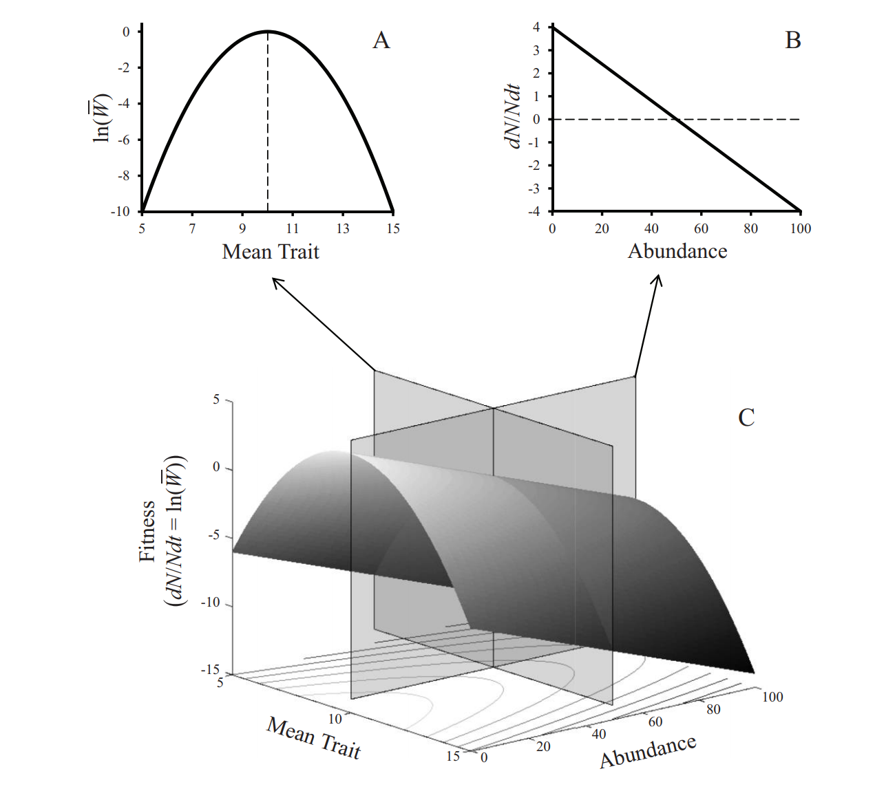
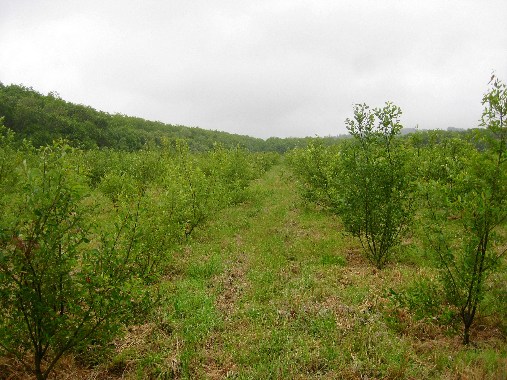

# Scaling From Genes to Ecosystems

Insert figure I've made before, thinking about how genes scale up to affect the structure of species-interaction networks. 

# Framework for Linking Ecosystems to Genes?

Image flipping network structure to affecting a species to visualize how network structure could contrain or facilitate phenotypic and genetic change 

At the same time, I think it's equally important to start thinking about how network structure feedsback to constrain or facilitate evolutionary change. This is what I want to spend my time discussing today


# Fitness Landscape Unifies Ecology & Evolution

```{r McPeek Fig 1, out.width = "400px"}

```

Discuss why I think is the unifying concept for ecology and evolutionary biology 

# Inferring the Fitness Landscape

$$w = z$$

Nice theory that links individual selection surfaces to the fitness landscape (Arnold 2003)

We can then use standard tools to estimate the local shape of the fitness landscape. e.g. Slope = Beta (same as selective surface); Curvature is equal to Gamm - Beta*Transpose(Beta)


# Willow Garden

```{r Garden pic, echo=FALSE, out.width = "400px"}

```

Common garden was located at Humboldt Bay National Wildlife Refuge in northern California, and it consisted of 26 genotypes that were sampled from the local willow population.


# Experimental Manipulation of Network Structure

Photos illustrating how I manipulated the food web and what the resulting community looks like.

# Measuring Gall Phenotypes

1. Gall Diameter (mm)
2. Clutch size (no. larva per gall)
3. Oviposition preference (no. larva per 100 shoots)

Include an image next to these to illustrate what each of these phenotypes mean. Use the image that has the arrows pointing to measurment of gall diameter and to individual larva

# Quantifying the Fitness Landscape


# Absolute Fitness

```{r Univariate Landscapes}
library(qwraps2)
library(cowplot)

lazyload_cache_dir("elsevier_test/elsevier_test_cache/latex")

# Get legend
RF_uni_legend <- get_legend(RF_uni_size)

# Make plots
RF_uni_plots <- plot_grid(RF_uni_size + theme(legend.position = "none",
                                              axis.text.x = element_text(size=10),
                                              axis.title.x = element_text(size=11)), 
                       RF_uni_clutch + theme(legend.position = "none", 
                                          axis.title.y = element_blank(), axis.text.y = element_blank(),
                                          axis.text.x = element_text(size=10),
                                          axis.title.x = element_text(size=11)),
                       RF_uni_pref + theme(legend.position = "none", 
                                        axis.title.y = element_blank(), axis.text.y = element_blank(),
                                        axis.text.x = element_text(size=10),
                                        axis.title.x = element_text(size=11)),
                       labels = "AUTO", ncol = 3, align='hv') 

RF_gradients <- ggdraw(RF_uni_plots) + draw_grob(RF_uni_legend, x = 0.8, y=0)
RF_gradients
#RF_uni_plots
```

First draw attention to the mean differences and then to the slopes (the different components)

Build up each of the figures


```{r}
library(qwraps2)
library(cowplot)
library(tidyverse)

lazyload_cache_dir("elsevier_test/elsevier_test_cache/latex")

uni_breaks <- c(0.1,0.5,1)

# Gall size 
AF_uni_size <- bind_rows(mutate(RF_treatment_gall_size$absolute_fitness, Food_Web = "Simple"), 
          mutate(RF_control_gall_size$absolute_fitness, Food_Web = "Complex")) %>%
  select(-sc.clutch_size, -sc.female_preference) %>%
  gather(ID, absolute_fitness, -sc.gall_size, -Food_Web) %>%
  mutate(ID_group = ifelse(ID == "average", "average", "replicate")) %>% 
  ggplot(., aes(x=sc.gall_size, y=absolute_fitness, group=interaction(ID,Food_Web), color=Food_Web, alpha=ID_group, size=ID_group)) +
  geom_line() +
  scale_alpha_manual(values=c(1,0.2), guide=FALSE) +
  scale_size_manual(values=c(1.5,0.25), guide=FALSE) +
  xlab("Gall diameter (SDs)") +
  ylab("Population mean fitness") +
  scale_color_manual(values = treatment_colors, name = "Food web") +
  scale_y_log10(breaks=uni_breaks, labels=uni_breaks) + annotation_logticks(sides = "l") +
  coord_cartesian(ylim=c(0.07,1))
#AF_uni_size
  #scale_y_continuous(breaks = AF_gradient_scale, limits = c(min(AF_gradient_scale), max(AF_gradient_scale)), trans = "log")

# Clutch size
AF_uni_clutch <- bind_rows(mutate(RF_treatment_clutch_size$absolute_fitness, Food_Web = "Simple"), 
          mutate(RF_control_clutch_size$absolute_fitness, Food_Web = "Complex")) %>%
  select(-sc.gall_size, -sc.female_preference) %>%
  gather(ID, absolute_fitness, -sc.clutch_size, -Food_Web) %>%
  mutate(ID_group = ifelse(ID == "average", "average", "replicate")) %>% 
  ggplot(., aes(x=sc.clutch_size, y=absolute_fitness, group=interaction(ID,Food_Web), color=Food_Web, alpha=ID_group, size=ID_group)) +
  geom_line() +
  scale_alpha_manual(values=c(1,0.2), guide=FALSE) +
  scale_size_manual(values=c(1.5,0.25), guide=FALSE) +
  xlab("Clutch size (SDs)") +
  ylab("Population mean fitness") +
  scale_color_manual(values = treatment_colors, name = "Food web") +
  scale_y_log10(breaks=uni_breaks, labels=uni_breaks) + annotation_logticks(sides = "l") +
  coord_cartesian(ylim=c(0.07,1))
  #scale_y_continuous(breaks = AF_gradient_scale, limits = c(min(AF_gradient_scale), max(AF_gradient_scale)), trans = "log")

# Female preference
AF_uni_pref <- bind_rows(mutate(RF_treatment_female_preference$absolute_fitness, Food_Web = "Simple"), 
          mutate(RF_control_female_preference$absolute_fitness, Food_Web = "Complex")) %>%
  select(-sc.gall_size, -sc.clutch_size) %>%
  gather(ID, absolute_fitness, -sc.female_preference, -Food_Web) %>%
  mutate(ID_group = ifelse(ID == "average", "average", "replicate")) %>% 
  ggplot(., aes(x=sc.female_preference, y=absolute_fitness, group=interaction(ID,Food_Web), color=Food_Web, alpha=ID_group, size=ID_group)) +
  geom_line() +
  scale_alpha_manual(values=c(1,0.2), guide=FALSE) +
  scale_size_manual(values=c(1.5,0.25), guide=FALSE) +
  xlab("Female preference (SDs)") +
  ylab("Population mean fitness") +
  scale_color_manual(values = treatment_colors, name = "Food web") +
  scale_y_log10(breaks=uni_breaks, labels=uni_breaks) + annotation_logticks(sides = "l") +
  coord_cartesian(ylim=c(0.07,1))
  #scale_y_continuous(breaks = AF_gradient_scale, limits = c(min(AF_gradient_scale), max(AF_gradient_scale)), trans = "log")

# Get legend
AF_uni_legend <- get_legend(AF_uni_size)

# Make plots
AF_uni_plots <- plot_grid(AF_uni_size + theme(legend.position = "none"), 
                       AF_uni_clutch + theme(legend.position = "none", 
                                          axis.title.y = element_blank(), axis.text.y = element_blank()),
                       AF_uni_pref + theme(legend.position = "none", 
                                        axis.title.y = element_blank(), axis.text.y = element_blank()),
                       labels = "AUTO", ncol = 3, align='hv')

#AF_gradients <- ggdraw(AF_uni_plots) + draw_grob(AF_uni_legend, x = 0.8, y=0)
#AF_gradients
AF_uni_plots
save_plot("FL_1D.pdf", AF_uni_plots, base_height = 6.5, base_width = 8)
```

```{r Multivariate Absolute Fitness Landscapes, echo=FALSE, message=FALSE, warning=FALSE}
library(viridis)

lazyload_cache_dir("elsevier_test/elsevier_test_cache/latex")

my_breaks <- c(0.2,0.4,0.6,0.8)

# Size x Preference
AF_plot_size.x.preference <- bind_rows(mutate(RF_treatment_size.x.preference$absolute_fitness, Food_Web = "Simple"), 
          mutate(RF_control_size.x.preference$absolute_fitness, Food_Web = "Complex")) %>%
  ggplot(., aes(x=sc.gall_size, y=sc.female_preference, fill=average)) +
  geom_raster() +
  facet_wrap(~Food_Web) +
  xlab("Gall diameter (SDs)") +
  ylab("Female preference (SDs)") +
  scale_fill_viridis(name = "Population\nmean fitness", trans="log", breaks = my_breaks, labels = my_breaks, limits = c(0.1,1)) # limits = c(AF_range$min, AF_range$max), 

# Size x Clutch
AF_plot_size.x.clutch <- bind_rows(mutate(RF_treatment_size.x.clutch$absolute_fitness, Food_Web = "Simple"), 
          mutate(RF_control_size.x.clutch$absolute_fitness, Food_Web = "Complex")) %>%
  ggplot(., aes(x=sc.gall_size, y=sc.clutch_size, fill=average)) +
  geom_raster() +
  facet_wrap(~Food_Web) +
  xlab("Gall diameter (SDs)") +
  ylab("Clutch size (SDs)") +
  scale_fill_viridis(name = "Population\nmean fitness", trans="log", breaks = my_breaks, labels = my_breaks, limits = c(0.1,1)) # limits = c(AF_range$min, AF_range$max), 

# Clutch x Preference
AF_plot_clutch.x.preference <- bind_rows(mutate(RF_treatment_clutch.x.preference$absolute_fitness, Food_Web = "Simple"), 
          mutate(RF_control_clutch.x.preference$absolute_fitness, Food_Web = "Complex")) %>%
  ggplot(., aes(x=sc.female_preference, y=sc.clutch_size, fill=average)) +
  geom_raster() +
  facet_wrap(~Food_Web) +
  xlab("Female preference (SDs)") +
  ylab("Clutch size (SDs)") +
  scale_fill_viridis(name = "Population\nmean fitness", trans="log", breaks = my_breaks, labels = my_breaks, limits = c(0.1,1)) # limits = c(AF_range$min, AF_range$max), 

# Get legend
AF_landscape_legend <- get_legend(AF_plot_size.x.preference)

# Format plots
AF_landscape_plots <- plot_grid(
  AF_plot_size.x.clutch + theme(legend.position = "none", axis.title.x = element_blank()),
  AF_plot_clutch.x.preference + theme(legend.position = "none", axis.title.y = element_blank()),
  AF_plot_size.x.preference + theme(legend.position = "none"), 
  nrow=2, align="hv", labels = "AUTO")
AF_landscape_2d <- ggdraw(AF_landscape_plots) + draw_grob(AF_landscape_legend, x = 0.7, y=-0.2)
AF_landscape_2d
#save_plot("AF_landscapes_2d.png", AF_landscape_2d, base_height=6, base_width = 8)
save_plot("FL_2D.pdf", AF_landscape_2d, base_height=6, base_width = 8)
```

# Relative Fitness

- Univariate landscapes

Now show the same univariate plots but with the relative fitness on the y-axis.

First put the absolute landscape next to relative fitness to show the link between the two, then show the rest of the landscapes.


# Multivariate Perspective


Here is a different representation of these univariate landscapes. 

Describe the axes for the figures.


# Conclusions

- Natural selection is stronger, yet less constrained in the complex food web.

# Open Questions

- 

# Note

in presentation for GRC - emphasize also that the opportunity for selection is X% higher in the complex vs. simple environment, although that may be an artifact of the study (excluding parasitoids reduced mean fitness, which is likely why selection on gall diameter is twice as much).