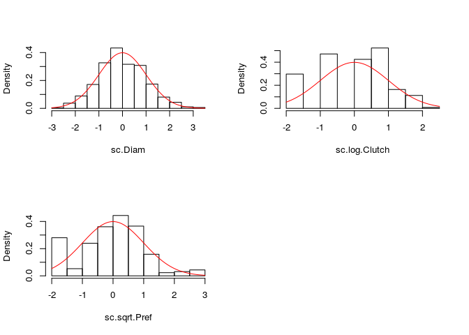
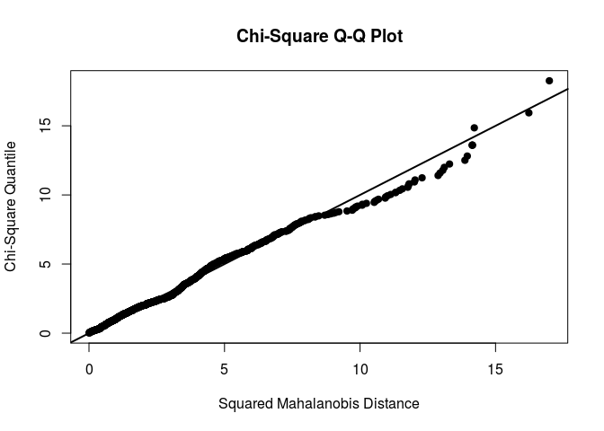
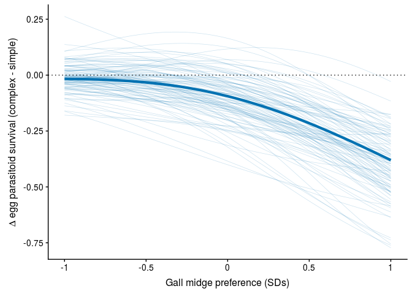
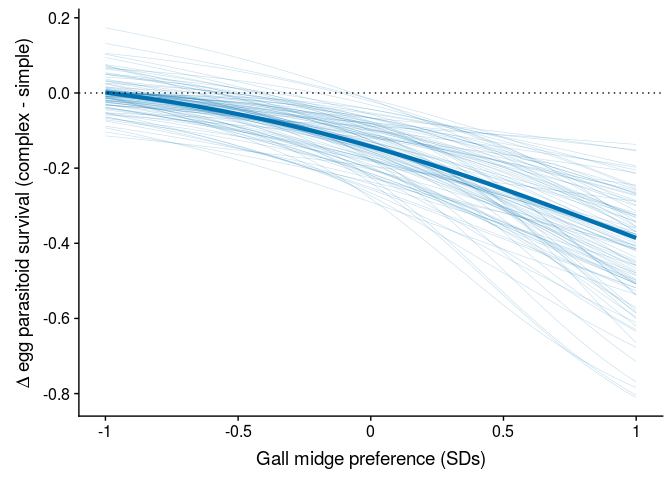

Reproduce analyses reported in: *Phenotypic evolution is more constrained in simpler food webs*
================
Matthew A. Barbour
2019-01-10

Evaluating assumption of multivariate normality
===============================================

We used graphical checks to evaluate whether our transformations of trait values resulted in a multivariate normal distribution. Figure S shows that our transformations resulted in approximately normal distributions for each phenotypic trait. Note also that in the multivariate quantile-quantile (Q-Q) plot, most points fall along the expected line (fig. S), suggesting that our transformations provide a reasonable approximation of a multivariate normal distribution.





Effect of food-web treatment on trait-fitness relationships and selection gradients
===================================================================================

We write the model in a way the independently estimates the effect of food-web treatment, each trait, and all two-way and three-way statistical interactions, on larval survival.

``` r
foodweb_model <- glmer(
  gall_survival ~ 
    -1 + Foodweb + 
    Foodweb:(sc.Diam + sc.log.Clutch + sc.sqrt.Pref) +
    Foodweb:(I(sc.Diam^2) + I(sc.log.Clutch^2) + I(sc.sqrt.Pref^2)) +
    Foodweb:(sc.Diam:sc.log.Clutch + sc.Diam:sc.sqrt.Pref + sc.log.Clutch:sc.sqrt.Pref) +
    (1|Genotype/Plant_Position/Gall_Number),
  data = gall_selection.df,
  family = binomial(link = logit), control=glmerControl(optimizer = "bobyqa"))
```

Note that the resulting estimates and confidence intervals are useful for determining whether trait-fitness relationships differ from zero, but not whether they differ between food-web treatments. For the later, we calculate the differences between each food-web treatment from the bootstrapped samples.

``` r
linear_foodweb_model <- glmer(
  gall_survival ~ 
    -1 + Foodweb + 
    Foodweb:(sc.Diam + sc.log.Clutch + sc.sqrt.Pref) +
    (1|Genotype/Plant_Position/Gall_Number),
  data = gall_selection.df,
  family = binomial(link = logit), control=glmerControl(optimizer = "bobyqa"))
```

To estimate biased selection on chamber diameter, we subset our data to only include multi-chambered galls where there was variability in larval survival. We then fit a reduced model to estimate the bias in the logistic regression coefficient of chamber diameter in each food web.

``` r
biased_foodweb_df <- gall_selection.df %>%
  group_by(Foodweb, Gall_Number) %>%
  mutate(mean_survival = mean(gall_survival)) %>%
  filter(mean_survival > 0, mean_survival < 1) %>%
  ungroup()

# using linear model, but I'm only interested in the chamber diameter coefficient
biased_foodweb_model <- glmer(
  gall_survival ~ -1 + Foodweb + 
    Foodweb:sc.Diam + 
    (1|Genotype/Plant_Position/Gall_Number),
  data = biased_foodweb_df,
  family = binomial(link = logit), control=glmerControl(optimizer = "bobyqa"))
```

    ## singular fit

``` r
biased_foodweb_confint <- tidy(biased_foodweb_model, conf.int=TRUE) %>% filter(group=="fixed")
```

    ## Warning in bind_rows_(x, .id): binding factor and character vector,
    ## coercing into character vector

    ## Warning in bind_rows_(x, .id): binding character and factor vector,
    ## coercing into character vector

``` r
knitr::kable(biased_foodweb_confint)
```

<table>
<thead>
<tr>
<th style="text-align:left;">
term
</th>
<th style="text-align:right;">
estimate
</th>
<th style="text-align:right;">
std.error
</th>
<th style="text-align:right;">
statistic
</th>
<th style="text-align:right;">
p.value
</th>
<th style="text-align:right;">
conf.low
</th>
<th style="text-align:right;">
conf.high
</th>
<th style="text-align:left;">
group
</th>
</tr>
</thead>
<tbody>
<tr>
<td style="text-align:left;">
FoodwebComplex
</td>
<td style="text-align:right;">
0.0261288
</td>
<td style="text-align:right;">
0.1596126
</td>
<td style="text-align:right;">
0.1637011
</td>
<td style="text-align:right;">
0.8699664
</td>
<td style="text-align:right;">
-0.2867063
</td>
<td style="text-align:right;">
0.3389638
</td>
<td style="text-align:left;">
fixed
</td>
</tr>
<tr>
<td style="text-align:left;">
FoodwebSimple
</td>
<td style="text-align:right;">
-0.1181035
</td>
<td style="text-align:right;">
0.2044004
</td>
<td style="text-align:right;">
-0.5778045
</td>
<td style="text-align:right;">
0.5633961
</td>
<td style="text-align:right;">
-0.5187209
</td>
<td style="text-align:right;">
0.2825139
</td>
<td style="text-align:left;">
fixed
</td>
</tr>
<tr>
<td style="text-align:left;">
FoodwebComplex:sc.Diam
</td>
<td style="text-align:right;">
0.3603278
</td>
<td style="text-align:right;">
0.1564728
</td>
<td style="text-align:right;">
2.3028133
</td>
<td style="text-align:right;">
0.0212893
</td>
<td style="text-align:right;">
0.0536466
</td>
<td style="text-align:right;">
0.6670089
</td>
<td style="text-align:left;">
fixed
</td>
</tr>
<tr>
<td style="text-align:left;">
FoodwebSimple:sc.Diam
</td>
<td style="text-align:right;">
0.4158534
</td>
<td style="text-align:right;">
0.2066780
</td>
<td style="text-align:right;">
2.0120841
</td>
<td style="text-align:right;">
0.0442111
</td>
<td style="text-align:right;">
0.0107721
</td>
<td style="text-align:right;">
0.8209348
</td>
<td style="text-align:left;">
fixed
</td>
</tr>
</tbody>
</table>
<table>
<thead>
<tr>
<th style="text-align:left;">
type
</th>
<th style="text-align:left;">
term
</th>
<th style="text-align:right;">
conf.high
</th>
<th style="text-align:right;">
conf.low
</th>
<th style="text-align:right;">
mean
</th>
<th style="text-align:left;">
P\_cutoff
</th>
<th style="text-align:left;">
coefficient\_type
</th>
</tr>
</thead>
<tbody>
<tr>
<td style="text-align:left;">
Complex
</td>
<td style="text-align:left;">
(Intercept)
</td>
<td style="text-align:right;">
0.5696306
</td>
<td style="text-align:right;">
0.2838122
</td>
<td style="text-align:right;">
0.4209107
</td>
<td style="text-align:left;">
-   </td>
    <td style="text-align:left;">
    Mean fitness
    </td>
    </tr>
    <tr>
    <td style="text-align:left;">
    Complex
    </td>
    <td style="text-align:left;">
    I(sc.Diam^2)
    </td>
    <td style="text-align:right;">
    0.5443559
    </td>
    <td style="text-align:right;">
    -0.0737076
    </td>
    <td style="text-align:right;">
    0.2277248
    </td>
    <td style="text-align:left;">
    </td>
    <td style="text-align:left;">
    Quadratic
    </td>
    </tr>
    <tr>
    <td style="text-align:left;">
    Complex
    </td>
    <td style="text-align:left;">
    I(sc.log.Clutch^2)
    </td>
    <td style="text-align:right;">
    0.2528636
    </td>
    <td style="text-align:right;">
    -0.4400013
    </td>
    <td style="text-align:right;">
    -0.0941367
    </td>
    <td style="text-align:left;">
    </td>
    <td style="text-align:left;">
    Quadratic
    </td>
    </tr>
    <tr>
    <td style="text-align:left;">
    Complex
    </td>
    <td style="text-align:left;">
    I(sc.sqrt.Pref^2)
    </td>
    <td style="text-align:right;">
    1.0705338
    </td>
    <td style="text-align:right;">
    0.1328319
    </td>
    <td style="text-align:right;">
    0.5688961
    </td>
    <td style="text-align:left;">
    -   </td>
        <td style="text-align:left;">
        Quadratic
        </td>
        </tr>
        <tr>
        <td style="text-align:left;">
        Complex
        </td>
        <td style="text-align:left;">
        sc.Diam
        </td>
        <td style="text-align:right;">
        1.6560559
        </td>
        <td style="text-align:right;">
        0.7360677
        </td>
        <td style="text-align:right;">
        1.1388581
        </td>
        <td style="text-align:left;">
        -   </td>
            <td style="text-align:left;">
            Linear
            </td>
            </tr>
            <tr>
            <td style="text-align:left;">
            Complex
            </td>
            <td style="text-align:left;">
            sc.Diam:sc.log.Clutch
            </td>
            <td style="text-align:right;">
            0.2450391
            </td>
            <td style="text-align:right;">
            -0.5640752
            </td>
            <td style="text-align:right;">
            -0.1471157
            </td>
            <td style="text-align:left;">
            </td>
            <td style="text-align:left;">
            Correlational
            </td>
            </tr>
            <tr>
            <td style="text-align:left;">
            Complex
            </td>
            <td style="text-align:left;">
            sc.Diam:sc.sqrt.Pref
            </td>
            <td style="text-align:right;">
            0.0175944
            </td>
            <td style="text-align:right;">
            -0.9867448
            </td>
            <td style="text-align:right;">
            -0.4472862
            </td>
            <td style="text-align:left;">
            </td>
            <td style="text-align:left;">
            Correlational
            </td>
            </tr>
            <tr>
            <td style="text-align:left;">
            Complex
            </td>
            <td style="text-align:left;">
            sc.log.Clutch
            </td>
            <td style="text-align:right;">
            0.5586820
            </td>
            <td style="text-align:right;">
            -0.1659172
            </td>
            <td style="text-align:right;">
            0.1994724
            </td>
            <td style="text-align:left;">
            </td>
            <td style="text-align:left;">
            Linear
            </td>
            </tr>
            <tr>
            <td style="text-align:left;">
            Complex
            </td>
            <td style="text-align:left;">
            sc.log.Clutch:sc.sqrt.Pref
            </td>
            <td style="text-align:right;">
            0.5960837
            </td>
            <td style="text-align:right;">
            -0.3347227
            </td>
            <td style="text-align:right;">
            0.1119993
            </td>
            <td style="text-align:left;">
            </td>
            <td style="text-align:left;">
            Correlational
            </td>
            </tr>
            <tr>
            <td style="text-align:left;">
            Complex
            </td>
            <td style="text-align:left;">
            sc.sqrt.Pref
            </td>
            <td style="text-align:right;">
            0.1817285
            </td>
            <td style="text-align:right;">
            -0.9827738
            </td>
            <td style="text-align:right;">
            -0.3998758
            </td>
            <td style="text-align:left;">
            </td>
            <td style="text-align:left;">
            Linear
            </td>
            </tr>
            <tr>
            <td style="text-align:left;">
            Diff
            </td>
            <td style="text-align:left;">
            (Intercept)
            </td>
            <td style="text-align:right;">
            0.4140386
            </td>
            <td style="text-align:right;">
            0.1216728
            </td>
            <td style="text-align:right;">
            0.2622188
            </td>
            <td style="text-align:left;">
            -   </td>
                <td style="text-align:left;">
                Mean fitness
                </td>
                </tr>
                <tr>
                <td style="text-align:left;">
                Diff
                </td>
                <td style="text-align:left;">
                I(sc.Diam^2)
                </td>
                <td style="text-align:right;">
                0.5038200
                </td>
                <td style="text-align:right;">
                -0.4106684
                </td>
                <td style="text-align:right;">
                0.0389891
                </td>
                <td style="text-align:left;">
                </td>
                <td style="text-align:left;">
                Quadratic
                </td>
                </tr>
                <tr>
                <td style="text-align:left;">
                Diff
                </td>
                <td style="text-align:left;">
                I(sc.log.Clutch^2)
                </td>
                <td style="text-align:right;">
                0.3223761
                </td>
                <td style="text-align:right;">
                -0.7367720
                </td>
                <td style="text-align:right;">
                -0.2015429
                </td>
                <td style="text-align:left;">
                </td>
                <td style="text-align:left;">
                Quadratic
                </td>
                </tr>
                <tr>
                <td style="text-align:left;">
                Diff
                </td>
                <td style="text-align:left;">
                I(sc.sqrt.Pref^2)
                </td>
                <td style="text-align:right;">
                0.0509753
                </td>
                <td style="text-align:right;">
                -1.1949530
                </td>
                <td style="text-align:right;">
                -0.5487636
                </td>
                <td style="text-align:left;">
                </td>
                <td style="text-align:left;">
                Quadratic
                </td>
                </tr>
                <tr>
                <td style="text-align:left;">
                Diff
                </td>
                <td style="text-align:left;">
                sc.Diam
                </td>
                <td style="text-align:right;">
                0.5582901
                </td>
                <td style="text-align:right;">
                -0.5955117
                </td>
                <td style="text-align:right;">
                -0.0476319
                </td>
                <td style="text-align:left;">
                </td>
                <td style="text-align:left;">
                Linear
                </td>
                </tr>
                <tr>
                <td style="text-align:left;">
                Diff
                </td>
                <td style="text-align:left;">
                sc.Diam:sc.log.Clutch
                </td>
                <td style="text-align:right;">
                0.3753796
                </td>
                <td style="text-align:right;">
                -0.8118669
                </td>
                <td style="text-align:right;">
                -0.2080145
                </td>
                <td style="text-align:left;">
                </td>
                <td style="text-align:left;">
                Correlational
                </td>
                </tr>
                <tr>
                <td style="text-align:left;">
                Diff
                </td>
                <td style="text-align:left;">
                sc.Diam:sc.sqrt.Pref
                </td>
                <td style="text-align:right;">
                1.0635162
                </td>
                <td style="text-align:right;">
                -0.2397526
                </td>
                <td style="text-align:right;">
                0.3744126
                </td>
                <td style="text-align:left;">
                </td>
                <td style="text-align:left;">
                Correlational
                </td>
                </tr>
                <tr>
                <td style="text-align:left;">
                Diff
                </td>
                <td style="text-align:left;">
                sc.log.Clutch
                </td>
                <td style="text-align:right;">
                -0.1206433
                </td>
                <td style="text-align:right;">
                -1.2919488
                </td>
                <td style="text-align:right;">
                -0.6792579
                </td>
                <td style="text-align:left;">
                -   </td>
                    <td style="text-align:left;">
                    Linear
                    </td>
                    </tr>
                    <tr>
                    <td style="text-align:left;">
                    Diff
                    </td>
                    <td style="text-align:left;">
                    sc.log.Clutch:sc.sqrt.Pref
                    </td>
                    <td style="text-align:right;">
                    0.4743120
                    </td>
                    <td style="text-align:right;">
                    -0.7196780
                    </td>
                    <td style="text-align:right;">
                    -0.1100853
                    </td>
                    <td style="text-align:left;">
                    </td>
                    <td style="text-align:left;">
                    Correlational
                    </td>
                    </tr>
                    <tr>
                    <td style="text-align:left;">
                    Diff
                    </td>
                    <td style="text-align:left;">
                    sc.sqrt.Pref
                    </td>
                    <td style="text-align:right;">
                    0.2540285
                    </td>
                    <td style="text-align:right;">
                    -1.1588403
                    </td>
                    <td style="text-align:right;">
                    -0.4417942
                    </td>
                    <td style="text-align:left;">
                    </td>
                    <td style="text-align:left;">
                    Linear
                    </td>
                    </tr>
                    <tr>
                    <td style="text-align:left;">
                    Simple
                    </td>
                    <td style="text-align:left;">
                    (Intercept)
                    </td>
                    <td style="text-align:right;">
                    0.8150188
                    </td>
                    <td style="text-align:right;">
                    0.5366067
                    </td>
                    <td style="text-align:right;">
                    0.6831295
                    </td>
                    <td style="text-align:left;">
                    -   </td>
                        <td style="text-align:left;">
                        Mean fitness
                        </td>
                        </tr>
                        <tr>
                        <td style="text-align:left;">
                        Simple
                        </td>
                        <td style="text-align:left;">
                        I(sc.Diam^2)
                        </td>
                        <td style="text-align:right;">
                        0.6389012
                        </td>
                        <td style="text-align:right;">
                        -0.0465036
                        </td>
                        <td style="text-align:right;">
                        0.2667139
                        </td>
                        <td style="text-align:left;">
                        </td>
                        <td style="text-align:left;">
                        Quadratic
                        </td>
                        </tr>
                        <tr>
                        <td style="text-align:left;">
                        Simple
                        </td>
                        <td style="text-align:left;">
                        I(sc.log.Clutch^2)
                        </td>
                        <td style="text-align:right;">
                        0.0870212
                        </td>
                        <td style="text-align:right;">
                        -0.7119635
                        </td>
                        <td style="text-align:right;">
                        -0.2956796
                        </td>
                        <td style="text-align:left;">
                        </td>
                        <td style="text-align:left;">
                        Quadratic
                        </td>
                        </tr>
                        <tr>
                        <td style="text-align:left;">
                        Simple
                        </td>
                        <td style="text-align:left;">
                        I(sc.sqrt.Pref^2)
                        </td>
                        <td style="text-align:right;">
                        0.4557429
                        </td>
                        <td style="text-align:right;">
                        -0.4334924
                        </td>
                        <td style="text-align:right;">
                        0.0201325
                        </td>
                        <td style="text-align:left;">
                        </td>
                        <td style="text-align:left;">
                        Quadratic
                        </td>
                        </tr>
                        <tr>
                        <td style="text-align:left;">
                        Simple
                        </td>
                        <td style="text-align:left;">
                        sc.Diam
                        </td>
                        <td style="text-align:right;">
                        1.6321236
                        </td>
                        <td style="text-align:right;">
                        0.6524203
                        </td>
                        <td style="text-align:right;">
                        1.0912261
                        </td>
                        <td style="text-align:left;">
                        -   </td>
                            <td style="text-align:left;">
                            Linear
                            </td>
                            </tr>
                            <tr>
                            <td style="text-align:left;">
                            Simple
                            </td>
                            <td style="text-align:left;">
                            sc.Diam:sc.log.Clutch
                            </td>
                            <td style="text-align:right;">
                            0.0616024
                            </td>
                            <td style="text-align:right;">
                            -0.8061147
                            </td>
                            <td style="text-align:right;">
                            -0.3551302
                            </td>
                            <td style="text-align:left;">
                            </td>
                            <td style="text-align:left;">
                            Correlational
                            </td>
                            </tr>
                            <tr>
                            <td style="text-align:left;">
                            Simple
                            </td>
                            <td style="text-align:left;">
                            sc.Diam:sc.sqrt.Pref
                            </td>
                            <td style="text-align:right;">
                            0.3233396
                            </td>
                            <td style="text-align:right;">
                            -0.5273875
                            </td>
                            <td style="text-align:right;">
                            -0.0728737
                            </td>
                            <td style="text-align:left;">
                            </td>
                            <td style="text-align:left;">
                            Correlational
                            </td>
                            </tr>
                            <tr>
                            <td style="text-align:left;">
                            Simple
                            </td>
                            <td style="text-align:left;">
                            sc.log.Clutch
                            </td>
                            <td style="text-align:right;">
                            -0.0778610
                            </td>
                            <td style="text-align:right;">
                            -0.9153293
                            </td>
                            <td style="text-align:right;">
                            -0.4797855
                            </td>
                            <td style="text-align:left;">
                            -   </td>
                                <td style="text-align:left;">
                                Linear
                                </td>
                                </tr>
                                <tr>
                                <td style="text-align:left;">
                                Simple
                                </td>
                                <td style="text-align:left;">
                                sc.log.Clutch:sc.sqrt.Pref
                                </td>
                                <td style="text-align:right;">
                                0.3956363
                                </td>
                                <td style="text-align:right;">
                                -0.3893373
                                </td>
                                <td style="text-align:right;">
                                0.0019140
                                </td>
                                <td style="text-align:left;">
                                </td>
                                <td style="text-align:left;">
                                Correlational
                                </td>
                                </tr>
                                <tr>
                                <td style="text-align:left;">
                                Simple
                                </td>
                                <td style="text-align:left;">
                                sc.sqrt.Pref
                                </td>
                                <td style="text-align:right;">
                                -0.3940586
                                </td>
                                <td style="text-align:right;">
                                -1.3609859
                                </td>
                                <td style="text-align:right;">
                                -0.8416700
                                </td>
                                <td style="text-align:left;">
                                -   </td>
                                    <td style="text-align:left;">
                                    Linear
                                    </td>
                                    </tr>
                                    </tbody>
                                    </table>


<table>
<thead>
<tr>
<th style="text-align:left;">
type
</th>
<th style="text-align:left;">
term
</th>
<th style="text-align:right;">
conf.high
</th>
<th style="text-align:right;">
conf.low
</th>
<th style="text-align:right;">
mean
</th>
<th style="text-align:left;">
P\_cutoff
</th>
<th style="text-align:left;">
gradient\_type
</th>
</tr>
</thead>
<tbody>
<tr>
<td style="text-align:left;">
Complex
</td>
<td style="text-align:left;">
I(sc.Diam^2)
</td>
<td style="text-align:right;">
0.3262491
</td>
<td style="text-align:right;">
-0.0441752
</td>
<td style="text-align:right;">
0.1364824
</td>
<td style="text-align:left;">
</td>
<td style="text-align:left;">
Quadratic
</td>
</tr>
<tr>
<td style="text-align:left;">
Complex
</td>
<td style="text-align:left;">
I(sc.log.Clutch^2)
</td>
<td style="text-align:right;">
0.1515488
</td>
<td style="text-align:right;">
-0.2637062
</td>
<td style="text-align:right;">
-0.0564190
</td>
<td style="text-align:left;">
</td>
<td style="text-align:left;">
Quadratic
</td>
</tr>
<tr>
<td style="text-align:left;">
Complex
</td>
<td style="text-align:left;">
I(sc.sqrt.Pref^2)
</td>
<td style="text-align:right;">
0.6416035
</td>
<td style="text-align:right;">
0.0796102
</td>
<td style="text-align:right;">
0.3409567
</td>
<td style="text-align:left;">
-   </td>
    <td style="text-align:left;">
    Quadratic
    </td>
    </tr>
    <tr>
    <td style="text-align:left;">
    Complex
    </td>
    <td style="text-align:left;">
    sc.Diam
    </td>
    <td style="text-align:right;">
    0.4962623
    </td>
    <td style="text-align:right;">
    0.2205739
    </td>
    <td style="text-align:right;">
    0.3412761
    </td>
    <td style="text-align:left;">
    -   </td>
        <td style="text-align:left;">
        Directional
        </td>
        </tr>
        <tr>
        <td style="text-align:left;">
        Complex
        </td>
        <td style="text-align:left;">
        sc.Diam:sc.log.Clutch
        </td>
        <td style="text-align:right;">
        0.0734297
        </td>
        <td style="text-align:right;">
        -0.1690337
        </td>
        <td style="text-align:right;">
        -0.0440855
        </td>
        <td style="text-align:left;">
        </td>
        <td style="text-align:left;">
        Correlational
        </td>
        </tr>
        <tr>
        <td style="text-align:left;">
        Complex
        </td>
        <td style="text-align:left;">
        sc.Diam:sc.sqrt.Pref
        </td>
        <td style="text-align:right;">
        0.0052724
        </td>
        <td style="text-align:right;">
        -0.2956931
        </td>
        <td style="text-align:right;">
        -0.1340361
        </td>
        <td style="text-align:left;">
        </td>
        <td style="text-align:left;">
        Correlational
        </td>
        </tr>
        <tr>
        <td style="text-align:left;">
        Complex
        </td>
        <td style="text-align:left;">
        sc.log.Clutch
        </td>
        <td style="text-align:right;">
        0.1674176
        </td>
        <td style="text-align:right;">
        -0.0497196
        </td>
        <td style="text-align:right;">
        0.0597749
        </td>
        <td style="text-align:left;">
        </td>
        <td style="text-align:left;">
        Directional
        </td>
        </tr>
        <tr>
        <td style="text-align:left;">
        Complex
        </td>
        <td style="text-align:left;">
        sc.log.Clutch:sc.sqrt.Pref
        </td>
        <td style="text-align:right;">
        0.1786255
        </td>
        <td style="text-align:right;">
        -0.1003047
        </td>
        <td style="text-align:right;">
        0.0335623
        </td>
        <td style="text-align:left;">
        </td>
        <td style="text-align:left;">
        Correlational
        </td>
        </tr>
        <tr>
        <td style="text-align:left;">
        Complex
        </td>
        <td style="text-align:left;">
        sc.sqrt.Pref
        </td>
        <td style="text-align:right;">
        0.0544577
        </td>
        <td style="text-align:right;">
        -0.2945031
        </td>
        <td style="text-align:right;">
        -0.1198289
        </td>
        <td style="text-align:left;">
        </td>
        <td style="text-align:left;">
        Directional
        </td>
        </tr>
        <tr>
        <td style="text-align:left;">
        Diff
        </td>
        <td style="text-align:left;">
        I(sc.Diam^2)
        </td>
        <td style="text-align:right;">
        0.1716326
        </td>
        <td style="text-align:right;">
        -0.2642344
        </td>
        <td style="text-align:right;">
        -0.0361535
        </td>
        <td style="text-align:left;">
        </td>
        <td style="text-align:left;">
        Quadratic
        </td>
        </tr>
        <tr>
        <td style="text-align:left;">
        Diff
        </td>
        <td style="text-align:left;">
        I(sc.log.Clutch^2)
        </td>
        <td style="text-align:right;">
        0.2114382
        </td>
        <td style="text-align:right;">
        -0.3099982
        </td>
        <td style="text-align:right;">
        -0.0548058
        </td>
        <td style="text-align:left;">
        </td>
        <td style="text-align:left;">
        Quadratic
        </td>
        </tr>
        <tr>
        <td style="text-align:left;">
        Diff
        </td>
        <td style="text-align:left;">
        I(sc.sqrt.Pref^2)
        </td>
        <td style="text-align:right;">
        -0.0366201
        </td>
        <td style="text-align:right;">
        -0.6777353
        </td>
        <td style="text-align:right;">
        -0.3333835
        </td>
        <td style="text-align:left;">
        -   </td>
            <td style="text-align:left;">
            Quadratic
            </td>
            </tr>
            <tr>
            <td style="text-align:left;">
            Diff
            </td>
            <td style="text-align:left;">
            sc.Diam
            </td>
            <td style="text-align:right;">
            0.0020697
            </td>
            <td style="text-align:right;">
            -0.2782757
            </td>
            <td style="text-align:right;">
            -0.1360347
            </td>
            <td style="text-align:left;">
            </td>
            <td style="text-align:left;">
            Directional
            </td>
            </tr>
            <tr>
            <td style="text-align:left;">
            Diff
            </td>
            <td style="text-align:left;">
            sc.Diam:sc.log.Clutch
            </td>
            <td style="text-align:right;">
            0.1168456
            </td>
            <td style="text-align:right;">
            -0.1723531
            </td>
            <td style="text-align:right;">
            -0.0227086
            </td>
            <td style="text-align:left;">
            </td>
            <td style="text-align:left;">
            Correlational
            </td>
            </tr>
            <tr>
            <td style="text-align:left;">
            Diff
            </td>
            <td style="text-align:left;">
            sc.Diam:sc.sqrt.Pref
            </td>
            <td style="text-align:right;">
            0.3003143
            </td>
            <td style="text-align:right;">
            -0.0451942
            </td>
            <td style="text-align:right;">
            0.1203298
            </td>
            <td style="text-align:left;">
            </td>
            <td style="text-align:left;">
            Correlational
            </td>
            </tr>
            <tr>
            <td style="text-align:left;">
            Diff
            </td>
            <td style="text-align:left;">
            sc.log.Clutch
            </td>
            <td style="text-align:right;">
            -0.0150646
            </td>
            <td style="text-align:right;">
            -0.3024632
            </td>
            <td style="text-align:right;">
            -0.1500146
            </td>
            <td style="text-align:left;">
            -   </td>
                <td style="text-align:left;">
                Directional
                </td>
                </tr>
                <tr>
                <td style="text-align:left;">
                Diff
                </td>
                <td style="text-align:left;">
                sc.log.Clutch:sc.sqrt.Pref
                </td>
                <td style="text-align:right;">
                0.1173903
                </td>
                <td style="text-align:right;">
                -0.1898311
                </td>
                <td style="text-align:right;">
                -0.0332023
                </td>
                <td style="text-align:left;">
                </td>
                <td style="text-align:left;">
                Correlational
                </td>
                </tr>
                <tr>
                <td style="text-align:left;">
                Diff
                </td>
                <td style="text-align:left;">
                sc.sqrt.Pref
                </td>
                <td style="text-align:right;">
                0.1389962
                </td>
                <td style="text-align:right;">
                -0.2224159
                </td>
                <td style="text-align:right;">
                -0.0384752
                </td>
                <td style="text-align:left;">
                </td>
                <td style="text-align:left;">
                Directional
                </td>
                </tr>
                <tr>
                <td style="text-align:left;">
                Simple
                </td>
                <td style="text-align:left;">
                I(sc.Diam^2)
                </td>
                <td style="text-align:right;">
                0.2403333
                </td>
                <td style="text-align:right;">
                -0.0174931
                </td>
                <td style="text-align:right;">
                0.1003289
                </td>
                <td style="text-align:left;">
                </td>
                <td style="text-align:left;">
                Quadratic
                </td>
                </tr>
                <tr>
                <td style="text-align:left;">
                Simple
                </td>
                <td style="text-align:left;">
                I(sc.log.Clutch^2)
                </td>
                <td style="text-align:right;">
                0.0327345
                </td>
                <td style="text-align:right;">
                -0.2678169
                </td>
                <td style="text-align:right;">
                -0.1112248
                </td>
                <td style="text-align:left;">
                </td>
                <td style="text-align:left;">
                Quadratic
                </td>
                </tr>
                <tr>
                <td style="text-align:left;">
                Simple
                </td>
                <td style="text-align:left;">
                I(sc.sqrt.Pref^2)
                </td>
                <td style="text-align:right;">
                0.1714353
                </td>
                <td style="text-align:right;">
                -0.1630654
                </td>
                <td style="text-align:right;">
                0.0075732
                </td>
                <td style="text-align:left;">
                </td>
                <td style="text-align:left;">
                Quadratic
                </td>
                </tr>
                <tr>
                <td style="text-align:left;">
                Simple
                </td>
                <td style="text-align:left;">
                sc.Diam
                </td>
                <td style="text-align:right;">
                0.3069753
                </td>
                <td style="text-align:right;">
                0.1227094
                </td>
                <td style="text-align:right;">
                0.2052415
                </td>
                <td style="text-align:left;">
                -   </td>
                    <td style="text-align:left;">
                    Directional
                    </td>
                    </tr>
                    <tr>
                    <td style="text-align:left;">
                    Simple
                    </td>
                    <td style="text-align:left;">
                    sc.Diam:sc.log.Clutch
                    </td>
                    <td style="text-align:right;">
                    0.0115864
                    </td>
                    <td style="text-align:right;">
                    -0.1516167
                    </td>
                    <td style="text-align:right;">
                    -0.0667941
                    </td>
                    <td style="text-align:left;">
                    </td>
                    <td style="text-align:left;">
                    Correlational
                    </td>
                    </tr>
                    <tr>
                    <td style="text-align:left;">
                    Simple
                    </td>
                    <td style="text-align:left;">
                    sc.Diam:sc.sqrt.Pref
                    </td>
                    <td style="text-align:right;">
                    0.0608148
                    </td>
                    <td style="text-align:right;">
                    -0.0991928
                    </td>
                    <td style="text-align:right;">
                    -0.0137063
                    </td>
                    <td style="text-align:left;">
                    </td>
                    <td style="text-align:left;">
                    Correlational
                    </td>
                    </tr>
                    <tr>
                    <td style="text-align:left;">
                    Simple
                    </td>
                    <td style="text-align:left;">
                    sc.log.Clutch
                    </td>
                    <td style="text-align:right;">
                    -0.0146444
                    </td>
                    <td style="text-align:right;">
                    -0.1721582
                    </td>
                    <td style="text-align:right;">
                    -0.0902397
                    </td>
                    <td style="text-align:left;">
                    -   </td>
                        <td style="text-align:left;">
                        Directional
                        </td>
                        </tr>
                        <tr>
                        <td style="text-align:left;">
                        Simple
                        </td>
                        <td style="text-align:left;">
                        sc.log.Clutch:sc.sqrt.Pref
                        </td>
                        <td style="text-align:right;">
                        0.0744126
                        </td>
                        <td style="text-align:right;">
                        -0.0732279
                        </td>
                        <td style="text-align:right;">
                        0.0003600
                        </td>
                        <td style="text-align:left;">
                        </td>
                        <td style="text-align:left;">
                        Correlational
                        </td>
                        </tr>
                        <tr>
                        <td style="text-align:left;">
                        Simple
                        </td>
                        <td style="text-align:left;">
                        sc.sqrt.Pref
                        </td>
                        <td style="text-align:right;">
                        -0.0741159
                        </td>
                        <td style="text-align:right;">
                        -0.2559788
                        </td>
                        <td style="text-align:right;">
                        -0.1583041
                        </td>
                        <td style="text-align:left;">
                        -   </td>
                            <td style="text-align:left;">
                            Directional
                            </td>
                            </tr>
                            </tbody>
                            </table>


Partitioning the contribution of egg and larval parasitoids to selection gradients
==================================================================================

Our simple food-web treatment allows us to estimate the unique contribution of egg parasitoids to selection on *Iteomyia* traits. To estimate the unique contribution of larval parasitoids, we subset our data so that our complex food-web treatment only contained attack by larval parasitoids (and gall survival). We then fit the same models as previously, including one to estimate bias.

``` r
# excludes cases of egg-parasitism from Complex food web
egglarval_df <- filter(gall_selection.df, Foodweb == "Simple" | Foodweb == "Complex" & platy < 1) 

egglarval_model <- update(foodweb_model, data=egglarval_df)

biased_egglarval_df <- egglarval_df %>%
  group_by(Foodweb, Gall_Number) %>%
  mutate(mean_survival = mean(gall_survival)) %>%
  filter(mean_survival > 0, mean_survival < 1) %>%
  ungroup()

biased_egglarval_model <- update(biased_foodweb_model, data=biased_egglarval_df)
```

    ## singular fit

``` r
linear_egglarval_model <- update(linear_foodweb_model, data=egglarval_df)
```

<table>
<thead>
<tr>
<th style="text-align:left;">
type
</th>
<th style="text-align:left;">
term
</th>
<th style="text-align:right;">
conf.high
</th>
<th style="text-align:right;">
conf.low
</th>
<th style="text-align:right;">
mean
</th>
<th style="text-align:left;">
P\_cutoff
</th>
<th style="text-align:left;">
coefficient\_type
</th>
</tr>
</thead>
<tbody>
<tr>
<td style="text-align:left;">
Complex
</td>
<td style="text-align:left;">
(Intercept)
</td>
<td style="text-align:right;">
0.8274690
</td>
<td style="text-align:right;">
0.4912631
</td>
<td style="text-align:right;">
0.6717828
</td>
<td style="text-align:left;">
-   </td>
    <td style="text-align:left;">
    Mean fitness
    </td>
    </tr>
    <tr>
    <td style="text-align:left;">
    Complex
    </td>
    <td style="text-align:left;">
    I(sc.Diam^2)
    </td>
    <td style="text-align:right;">
    0.5120938
    </td>
    <td style="text-align:right;">
    -0.1906248
    </td>
    <td style="text-align:right;">
    0.1474944
    </td>
    <td style="text-align:left;">
    </td>
    <td style="text-align:left;">
    Quadratic
    </td>
    </tr>
    <tr>
    <td style="text-align:left;">
    Complex
    </td>
    <td style="text-align:left;">
    I(sc.log.Clutch^2)
    </td>
    <td style="text-align:right;">
    0.3861985
    </td>
    <td style="text-align:right;">
    -0.3884572
    </td>
    <td style="text-align:right;">
    0.0139158
    </td>
    <td style="text-align:left;">
    </td>
    <td style="text-align:left;">
    Quadratic
    </td>
    </tr>
    <tr>
    <td style="text-align:left;">
    Complex
    </td>
    <td style="text-align:left;">
    I(sc.sqrt.Pref^2)
    </td>
    <td style="text-align:right;">
    1.1763974
    </td>
    <td style="text-align:right;">
    0.0022784
    </td>
    <td style="text-align:right;">
    0.4791984
    </td>
    <td style="text-align:left;">
    -   </td>
        <td style="text-align:left;">
        Quadratic
        </td>
        </tr>
        <tr>
        <td style="text-align:left;">
        Complex
        </td>
        <td style="text-align:left;">
        sc.Diam
        </td>
        <td style="text-align:right;">
        1.7567557
        </td>
        <td style="text-align:right;">
        0.6630213
        </td>
        <td style="text-align:right;">
        1.1495009
        </td>
        <td style="text-align:left;">
        -   </td>
            <td style="text-align:left;">
            Linear
            </td>
            </tr>
            <tr>
            <td style="text-align:left;">
            Complex
            </td>
            <td style="text-align:left;">
            sc.Diam:sc.log.Clutch
            </td>
            <td style="text-align:right;">
            0.5609465
            </td>
            <td style="text-align:right;">
            -0.3696231
            </td>
            <td style="text-align:right;">
            0.0901812
            </td>
            <td style="text-align:left;">
            </td>
            <td style="text-align:left;">
            Correlational
            </td>
            </tr>
            <tr>
            <td style="text-align:left;">
            Complex
            </td>
            <td style="text-align:left;">
            sc.Diam:sc.sqrt.Pref
            </td>
            <td style="text-align:right;">
            0.3396512
            </td>
            <td style="text-align:right;">
            -0.8803850
            </td>
            <td style="text-align:right;">
            -0.2647260
            </td>
            <td style="text-align:left;">
            </td>
            <td style="text-align:left;">
            Correlational
            </td>
            </tr>
            <tr>
            <td style="text-align:left;">
            Complex
            </td>
            <td style="text-align:left;">
            sc.log.Clutch
            </td>
            <td style="text-align:right;">
            1.2285384
            </td>
            <td style="text-align:right;">
            0.1502331
            </td>
            <td style="text-align:right;">
            0.6681662
            </td>
            <td style="text-align:left;">
            -   </td>
                <td style="text-align:left;">
                Linear
                </td>
                </tr>
                <tr>
                <td style="text-align:left;">
                Complex
                </td>
                <td style="text-align:left;">
                sc.log.Clutch:sc.sqrt.Pref
                </td>
                <td style="text-align:right;">
                0.3147149
                </td>
                <td style="text-align:right;">
                -0.7787803
                </td>
                <td style="text-align:right;">
                -0.2049182
                </td>
                <td style="text-align:left;">
                </td>
                <td style="text-align:left;">
                Correlational
                </td>
                </tr>
                <tr>
                <td style="text-align:left;">
                Complex
                </td>
                <td style="text-align:left;">
                sc.sqrt.Pref
                </td>
                <td style="text-align:right;">
                -0.1586822
                </td>
                <td style="text-align:right;">
                -1.7745438
                </td>
                <td style="text-align:right;">
                -0.9135072
                </td>
                <td style="text-align:left;">
                -   </td>
                    <td style="text-align:left;">
                    Linear
                    </td>
                    </tr>
                    <tr>
                    <td style="text-align:left;">
                    Diff
                    </td>
                    <td style="text-align:left;">
                    (Intercept)
                    </td>
                    <td style="text-align:right;">
                    0.2134146
                    </td>
                    <td style="text-align:right;">
                    -0.2101379
                    </td>
                    <td style="text-align:right;">
                    0.0121327
                    </td>
                    <td style="text-align:left;">
                    </td>
                    <td style="text-align:left;">
                    Mean fitness
                    </td>
                    </tr>
                    <tr>
                    <td style="text-align:left;">
                    Diff
                    </td>
                    <td style="text-align:left;">
                    I(sc.Diam^2)
                    </td>
                    <td style="text-align:right;">
                    0.5832378
                    </td>
                    <td style="text-align:right;">
                    -0.3431158
                    </td>
                    <td style="text-align:right;">
                    0.1094612
                    </td>
                    <td style="text-align:left;">
                    </td>
                    <td style="text-align:left;">
                    Quadratic
                    </td>
                    </tr>
                    <tr>
                    <td style="text-align:left;">
                    Diff
                    </td>
                    <td style="text-align:left;">
                    I(sc.log.Clutch^2)
                    </td>
                    <td style="text-align:right;">
                    0.2218524
                    </td>
                    <td style="text-align:right;">
                    -0.8385499
                    </td>
                    <td style="text-align:right;">
                    -0.3096619
                    </td>
                    <td style="text-align:left;">
                    </td>
                    <td style="text-align:left;">
                    Quadratic
                    </td>
                    </tr>
                    <tr>
                    <td style="text-align:left;">
                    Diff
                    </td>
                    <td style="text-align:left;">
                    I(sc.sqrt.Pref^2)
                    </td>
                    <td style="text-align:right;">
                    0.0792011
                    </td>
                    <td style="text-align:right;">
                    -1.3804900
                    </td>
                    <td style="text-align:right;">
                    -0.5517641
                    </td>
                    <td style="text-align:left;">
                    </td>
                    <td style="text-align:left;">
                    Quadratic
                    </td>
                    </tr>
                    <tr>
                    <td style="text-align:left;">
                    Diff
                    </td>
                    <td style="text-align:left;">
                    sc.Diam
                    </td>
                    <td style="text-align:right;">
                    0.5731177
                    </td>
                    <td style="text-align:right;">
                    -0.7997435
                    </td>
                    <td style="text-align:right;">
                    -0.0901496
                    </td>
                    <td style="text-align:left;">
                    </td>
                    <td style="text-align:left;">
                    Linear
                    </td>
                    </tr>
                    <tr>
                    <td style="text-align:left;">
                    Diff
                    </td>
                    <td style="text-align:left;">
                    sc.Diam:sc.log.Clutch
                    </td>
                    <td style="text-align:right;">
                    0.1200988
                    </td>
                    <td style="text-align:right;">
                    -1.0239096
                    </td>
                    <td style="text-align:right;">
                    -0.4488366
                    </td>
                    <td style="text-align:left;">
                    </td>
                    <td style="text-align:left;">
                    Correlational
                    </td>
                    </tr>
                    <tr>
                    <td style="text-align:left;">
                    Diff
                    </td>
                    <td style="text-align:left;">
                    sc.Diam:sc.sqrt.Pref
                    </td>
                    <td style="text-align:right;">
                    0.8405929
                    </td>
                    <td style="text-align:right;">
                    -0.5230496
                    </td>
                    <td style="text-align:right;">
                    0.1604761
                    </td>
                    <td style="text-align:left;">
                    </td>
                    <td style="text-align:left;">
                    Correlational
                    </td>
                    </tr>
                    <tr>
                    <td style="text-align:left;">
                    Diff
                    </td>
                    <td style="text-align:left;">
                    sc.log.Clutch
                    </td>
                    <td style="text-align:right;">
                    -0.7238280
                    </td>
                    <td style="text-align:right;">
                    -2.2700816
                    </td>
                    <td style="text-align:right;">
                    -1.4601615
                    </td>
                    <td style="text-align:left;">
                    -   </td>
                        <td style="text-align:left;">
                        Linear
                        </td>
                        </tr>
                        <tr>
                        <td style="text-align:left;">
                        Diff
                        </td>
                        <td style="text-align:left;">
                        sc.log.Clutch:sc.sqrt.Pref
                        </td>
                        <td style="text-align:right;">
                        0.9011785
                        </td>
                        <td style="text-align:right;">
                        -0.4142011
                        </td>
                        <td style="text-align:right;">
                        0.2427634
                        </td>
                        <td style="text-align:left;">
                        </td>
                        <td style="text-align:left;">
                        Correlational
                        </td>
                        </tr>
                        <tr>
                        <td style="text-align:left;">
                        Diff
                        </td>
                        <td style="text-align:left;">
                        sc.sqrt.Pref
                        </td>
                        <td style="text-align:right;">
                        0.9258927
                        </td>
                        <td style="text-align:right;">
                        -0.9423446
                        </td>
                        <td style="text-align:right;">
                        -0.0934941
                        </td>
                        <td style="text-align:left;">
                        </td>
                        <td style="text-align:left;">
                        Linear
                        </td>
                        </tr>
                        <tr>
                        <td style="text-align:left;">
                        Simple
                        </td>
                        <td style="text-align:left;">
                        (Intercept)
                        </td>
                        <td style="text-align:right;">
                        0.8423557
                        </td>
                        <td style="text-align:right;">
                        0.4746950
                        </td>
                        <td style="text-align:right;">
                        0.6839155
                        </td>
                        <td style="text-align:left;">
                        -   </td>
                            <td style="text-align:left;">
                            Mean fitness
                            </td>
                            </tr>
                            <tr>
                            <td style="text-align:left;">
                            Simple
                            </td>
                            <td style="text-align:left;">
                            I(sc.Diam^2)
                            </td>
                            <td style="text-align:right;">
                            0.5719583
                            </td>
                            <td style="text-align:right;">
                            -0.0346655
                            </td>
                            <td style="text-align:right;">
                            0.2569556
                            </td>
                            <td style="text-align:left;">
                            </td>
                            <td style="text-align:left;">
                            Quadratic
                            </td>
                            </tr>
                            <tr>
                            <td style="text-align:left;">
                            Simple
                            </td>
                            <td style="text-align:left;">
                            I(sc.log.Clutch^2)
                            </td>
                            <td style="text-align:right;">
                            0.0460590
                            </td>
                            <td style="text-align:right;">
                            -0.6601475
                            </td>
                            <td style="text-align:right;">
                            -0.2957461
                            </td>
                            <td style="text-align:left;">
                            </td>
                            <td style="text-align:left;">
                            Quadratic
                            </td>
                            </tr>
                            <tr>
                            <td style="text-align:left;">
                            Simple
                            </td>
                            <td style="text-align:left;">
                            I(sc.sqrt.Pref^2)
                            </td>
                            <td style="text-align:right;">
                            0.3569925
                            </td>
                            <td style="text-align:right;">
                            -0.4932899
                            </td>
                            <td style="text-align:right;">
                            -0.0725657
                            </td>
                            <td style="text-align:left;">
                            </td>
                            <td style="text-align:left;">
                            Quadratic
                            </td>
                            </tr>
                            <tr>
                            <td style="text-align:left;">
                            Simple
                            </td>
                            <td style="text-align:left;">
                            sc.Diam
                            </td>
                            <td style="text-align:right;">
                            1.6209885
                            </td>
                            <td style="text-align:right;">
                            0.6281108
                            </td>
                            <td style="text-align:right;">
                            1.0593513
                            </td>
                            <td style="text-align:left;">
                            -   </td>
                                <td style="text-align:left;">
                                Linear
                                </td>
                                </tr>
                                <tr>
                                <td style="text-align:left;">
                                Simple
                                </td>
                                <td style="text-align:left;">
                                sc.Diam:sc.log.Clutch
                                </td>
                                <td style="text-align:right;">
                                0.0483655
                                </td>
                                <td style="text-align:right;">
                                -0.7886266
                                </td>
                                <td style="text-align:right;">
                                -0.3586555
                                </td>
                                <td style="text-align:left;">
                                </td>
                                <td style="text-align:left;">
                                Correlational
                                </td>
                                </tr>
                                <tr>
                                <td style="text-align:left;">
                                Simple
                                </td>
                                <td style="text-align:left;">
                                sc.Diam:sc.sqrt.Pref
                                </td>
                                <td style="text-align:right;">
                                0.2841272
                                </td>
                                <td style="text-align:right;">
                                -0.5040655
                                </td>
                                <td style="text-align:right;">
                                -0.1042498
                                </td>
                                <td style="text-align:left;">
                                </td>
                                <td style="text-align:left;">
                                Correlational
                                </td>
                                </tr>
                                <tr>
                                <td style="text-align:left;">
                                Simple
                                </td>
                                <td style="text-align:left;">
                                sc.log.Clutch
                                </td>
                                <td style="text-align:right;">
                                -0.3429592
                                </td>
                                <td style="text-align:right;">
                                -1.3017173
                                </td>
                                <td style="text-align:right;">
                                -0.7919953
                                </td>
                                <td style="text-align:left;">
                                -   </td>
                                    <td style="text-align:left;">
                                    Linear
                                    </td>
                                    </tr>
                                    <tr>
                                    <td style="text-align:left;">
                                    Simple
                                    </td>
                                    <td style="text-align:left;">
                                    sc.log.Clutch:sc.sqrt.Pref
                                    </td>
                                    <td style="text-align:right;">
                                    0.3943111
                                    </td>
                                    <td style="text-align:right;">
                                    -0.2997912
                                    </td>
                                    <td style="text-align:right;">
                                    0.0378452
                                    </td>
                                    <td style="text-align:left;">
                                    </td>
                                    <td style="text-align:left;">
                                    Correlational
                                    </td>
                                    </tr>
                                    <tr>
                                    <td style="text-align:left;">
                                    Simple
                                    </td>
                                    <td style="text-align:left;">
                                    sc.sqrt.Pref
                                    </td>
                                    <td style="text-align:right;">
                                    -0.4406605
                                    </td>
                                    <td style="text-align:right;">
                                    -1.6013311
                                    </td>
                                    <td style="text-align:right;">
                                    -1.0070013
                                    </td>
                                    <td style="text-align:left;">
                                    -   </td>
                                        <td style="text-align:left;">
                                        Linear
                                        </td>
                                        </tr>
                                        </tbody>
                                        </table>


<table>
<thead>
<tr>
<th style="text-align:left;">
type
</th>
<th style="text-align:left;">
term
</th>
<th style="text-align:right;">
conf.high
</th>
<th style="text-align:right;">
conf.low
</th>
<th style="text-align:right;">
mean
</th>
<th style="text-align:left;">
P\_cutoff
</th>
<th style="text-align:left;">
gradient\_type
</th>
</tr>
</thead>
<tbody>
<tr>
<td style="text-align:left;">
Complex
</td>
<td style="text-align:left;">
I(sc.Diam^2)
</td>
<td style="text-align:right;">
0.1983445
</td>
<td style="text-align:right;">
-0.0738329
</td>
<td style="text-align:right;">
0.0571276
</td>
<td style="text-align:left;">
</td>
<td style="text-align:left;">
Quadratic
</td>
</tr>
<tr>
<td style="text-align:left;">
Complex
</td>
<td style="text-align:left;">
I(sc.log.Clutch^2)
</td>
<td style="text-align:right;">
0.1495827
</td>
<td style="text-align:right;">
-0.1504575
</td>
<td style="text-align:right;">
0.0053899
</td>
<td style="text-align:left;">
</td>
<td style="text-align:left;">
Quadratic
</td>
</tr>
<tr>
<td style="text-align:left;">
Complex
</td>
<td style="text-align:left;">
I(sc.sqrt.Pref^2)
</td>
<td style="text-align:right;">
0.4556431
</td>
<td style="text-align:right;">
0.0008825
</td>
<td style="text-align:right;">
0.1856035
</td>
<td style="text-align:left;">
-   </td>
    <td style="text-align:left;">
    Quadratic
    </td>
    </tr>
    <tr>
    <td style="text-align:left;">
    Complex
    </td>
    <td style="text-align:left;">
    sc.Diam
    </td>
    <td style="text-align:right;">
    0.3402139
    </td>
    <td style="text-align:right;">
    0.1284009
    </td>
    <td style="text-align:right;">
    0.2226127
    </td>
    <td style="text-align:left;">
    -   </td>
        <td style="text-align:left;">
        Directional
        </td>
        </tr>
        <tr>
        <td style="text-align:left;">
        Complex
        </td>
        <td style="text-align:left;">
        sc.Diam:sc.log.Clutch
        </td>
        <td style="text-align:right;">
        0.1086331
        </td>
        <td style="text-align:right;">
        -0.0715813
        </td>
        <td style="text-align:right;">
        0.0174645
        </td>
        <td style="text-align:left;">
        </td>
        <td style="text-align:left;">
        Correlational
        </td>
        </tr>
        <tr>
        <td style="text-align:left;">
        Complex
        </td>
        <td style="text-align:left;">
        sc.Diam:sc.sqrt.Pref
        </td>
        <td style="text-align:right;">
        0.0657770
        </td>
        <td style="text-align:right;">
        -0.1704957
        </td>
        <td style="text-align:right;">
        -0.0512669
        </td>
        <td style="text-align:left;">
        </td>
        <td style="text-align:left;">
        Correlational
        </td>
        </tr>
        <tr>
        <td style="text-align:left;">
        Complex
        </td>
        <td style="text-align:left;">
        sc.log.Clutch
        </td>
        <td style="text-align:right;">
        0.2379192
        </td>
        <td style="text-align:right;">
        0.0290942
        </td>
        <td style="text-align:right;">
        0.1293973
        </td>
        <td style="text-align:left;">
        -   </td>
            <td style="text-align:left;">
            Directional
            </td>
            </tr>
            <tr>
            <td style="text-align:left;">
            Complex
            </td>
            <td style="text-align:left;">
            sc.log.Clutch:sc.sqrt.Pref
            </td>
            <td style="text-align:right;">
            0.0609478
            </td>
            <td style="text-align:right;">
            -0.1508189
            </td>
            <td style="text-align:right;">
            -0.0396845
            </td>
            <td style="text-align:left;">
            </td>
            <td style="text-align:left;">
            Correlational
            </td>
            </tr>
            <tr>
            <td style="text-align:left;">
            Complex
            </td>
            <td style="text-align:left;">
            sc.sqrt.Pref
            </td>
            <td style="text-align:right;">
            -0.0307304
            </td>
            <td style="text-align:right;">
            -0.3436588
            </td>
            <td style="text-align:right;">
            -0.1769101
            </td>
            <td style="text-align:left;">
            -   </td>
                <td style="text-align:left;">
                Directional
                </td>
                </tr>
                <tr>
                <td style="text-align:left;">
                Diff
                </td>
                <td style="text-align:left;">
                I(sc.Diam^2)
                </td>
                <td style="text-align:right;">
                0.2286339
                </td>
                <td style="text-align:right;">
                -0.1325092
                </td>
                <td style="text-align:right;">
                0.0445433
                </td>
                <td style="text-align:left;">
                </td>
                <td style="text-align:left;">
                Quadratic
                </td>
                </tr>
                <tr>
                <td style="text-align:left;">
                Diff
                </td>
                <td style="text-align:left;">
                I(sc.log.Clutch^2)
                </td>
                <td style="text-align:right;">
                0.0857343
                </td>
                <td style="text-align:right;">
                -0.3299178
                </td>
                <td style="text-align:right;">
                -0.1224092
                </td>
                <td style="text-align:left;">
                </td>
                <td style="text-align:left;">
                Quadratic
                </td>
                </tr>
                <tr>
                <td style="text-align:left;">
                Diff
                </td>
                <td style="text-align:left;">
                I(sc.sqrt.Pref^2)
                </td>
                <td style="text-align:right;">
                0.0325973
                </td>
                <td style="text-align:right;">
                -0.5358755
                </td>
                <td style="text-align:right;">
                -0.2143159
                </td>
                <td style="text-align:left;">
                </td>
                <td style="text-align:left;">
                Quadratic
                </td>
                </tr>
                <tr>
                <td style="text-align:left;">
                Diff
                </td>
                <td style="text-align:left;">
                sc.Diam
                </td>
                <td style="text-align:right;">
                0.1172239
                </td>
                <td style="text-align:right;">
                -0.1508150
                </td>
                <td style="text-align:right;">
                -0.0130334
                </td>
                <td style="text-align:left;">
                </td>
                <td style="text-align:left;">
                Directional
                </td>
                </tr>
                <tr>
                <td style="text-align:left;">
                Diff
                </td>
                <td style="text-align:left;">
                sc.Diam:sc.log.Clutch
                </td>
                <td style="text-align:right;">
                0.0227974
                </td>
                <td style="text-align:right;">
                -0.2001213
                </td>
                <td style="text-align:right;">
                -0.0884200
                </td>
                <td style="text-align:left;">
                </td>
                <td style="text-align:left;">
                Correlational
                </td>
                </tr>
                <tr>
                <td style="text-align:left;">
                Diff
                </td>
                <td style="text-align:left;">
                sc.Diam:sc.sqrt.Pref
                </td>
                <td style="text-align:right;">
                0.1624613
                </td>
                <td style="text-align:right;">
                -0.1030121
                </td>
                <td style="text-align:right;">
                0.0306424
                </td>
                <td style="text-align:left;">
                </td>
                <td style="text-align:left;">
                Correlational
                </td>
                </tr>
                <tr>
                <td style="text-align:left;">
                Diff
                </td>
                <td style="text-align:left;">
                sc.log.Clutch
                </td>
                <td style="text-align:right;">
                -0.1415350
                </td>
                <td style="text-align:right;">
                -0.4447954
                </td>
                <td style="text-align:right;">
                -0.2860837
                </td>
                <td style="text-align:left;">
                -   </td>
                    <td style="text-align:left;">
                    Directional
                    </td>
                    </tr>
                    <tr>
                    <td style="text-align:left;">
                    Diff
                    </td>
                    <td style="text-align:left;">
                    sc.log.Clutch:sc.sqrt.Pref
                    </td>
                    <td style="text-align:right;">
                    0.1760352
                    </td>
                    <td style="text-align:right;">
                    -0.0809350
                    </td>
                    <td style="text-align:right;">
                    0.0471717
                    </td>
                    <td style="text-align:left;">
                    </td>
                    <td style="text-align:left;">
                    Correlational
                    </td>
                    </tr>
                    <tr>
                    <td style="text-align:left;">
                    Diff
                    </td>
                    <td style="text-align:left;">
                    sc.sqrt.Pref
                    </td>
                    <td style="text-align:right;">
                    0.1765136
                    </td>
                    <td style="text-align:right;">
                    -0.1879506
                    </td>
                    <td style="text-align:right;">
                    -0.0223125
                    </td>
                    <td style="text-align:left;">
                    </td>
                    <td style="text-align:left;">
                    Directional
                    </td>
                    </tr>
                    <tr>
                    <td style="text-align:left;">
                    Simple
                    </td>
                    <td style="text-align:left;">
                    I(sc.Diam^2)
                    </td>
                    <td style="text-align:right;">
                    0.2263096
                    </td>
                    <td style="text-align:right;">
                    -0.0137163
                    </td>
                    <td style="text-align:right;">
                    0.1016709
                    </td>
                    <td style="text-align:left;">
                    </td>
                    <td style="text-align:left;">
                    Quadratic
                    </td>
                    </tr>
                    <tr>
                    <td style="text-align:left;">
                    Simple
                    </td>
                    <td style="text-align:left;">
                    I(sc.log.Clutch^2)
                    </td>
                    <td style="text-align:right;">
                    0.0182244
                    </td>
                    <td style="text-align:right;">
                    -0.2612038
                    </td>
                    <td style="text-align:right;">
                    -0.1170193
                    </td>
                    <td style="text-align:left;">
                    </td>
                    <td style="text-align:left;">
                    Quadratic
                    </td>
                    </tr>
                    <tr>
                    <td style="text-align:left;">
                    Simple
                    </td>
                    <td style="text-align:left;">
                    I(sc.sqrt.Pref^2)
                    </td>
                    <td style="text-align:right;">
                    0.1412530
                    </td>
                    <td style="text-align:right;">
                    -0.1951825
                    </td>
                    <td style="text-align:right;">
                    -0.0287124
                    </td>
                    <td style="text-align:left;">
                    </td>
                    <td style="text-align:left;">
                    Quadratic
                    </td>
                    </tr>
                    <tr>
                    <td style="text-align:left;">
                    Simple
                    </td>
                    <td style="text-align:left;">
                    sc.Diam
                    </td>
                    <td style="text-align:right;">
                    0.3206923
                    </td>
                    <td style="text-align:right;">
                    0.1242638
                    </td>
                    <td style="text-align:right;">
                    0.2095794
                    </td>
                    <td style="text-align:left;">
                    -   </td>
                        <td style="text-align:left;">
                        Directional
                        </td>
                        </tr>
                        <tr>
                        <td style="text-align:left;">
                        Simple
                        </td>
                        <td style="text-align:left;">
                        sc.Diam:sc.log.Clutch
                        </td>
                        <td style="text-align:right;">
                        0.0095685
                        </td>
                        <td style="text-align:right;">
                        -0.1560199
                        </td>
                        <td style="text-align:right;">
                        -0.0709555
                        </td>
                        <td style="text-align:left;">
                        </td>
                        <td style="text-align:left;">
                        Correlational
                        </td>
                        </tr>
                        <tr>
                        <td style="text-align:left;">
                        Simple
                        </td>
                        <td style="text-align:left;">
                        sc.Diam:sc.sqrt.Pref
                        </td>
                        <td style="text-align:right;">
                        0.0562110
                        </td>
                        <td style="text-align:right;">
                        -0.0997231
                        </td>
                        <td style="text-align:right;">
                        -0.0206245
                        </td>
                        <td style="text-align:left;">
                        </td>
                        <td style="text-align:left;">
                        Correlational
                        </td>
                        </tr>
                        <tr>
                        <td style="text-align:left;">
                        Simple
                        </td>
                        <td style="text-align:left;">
                        sc.log.Clutch
                        </td>
                        <td style="text-align:right;">
                        -0.0678502
                        </td>
                        <td style="text-align:right;">
                        -0.2575285
                        </td>
                        <td style="text-align:right;">
                        -0.1566864
                        </td>
                        <td style="text-align:left;">
                        -   </td>
                            <td style="text-align:left;">
                            Directional
                            </td>
                            </tr>
                            <tr>
                            <td style="text-align:left;">
                            Simple
                            </td>
                            <td style="text-align:left;">
                            sc.log.Clutch:sc.sqrt.Pref
                            </td>
                            <td style="text-align:right;">
                            0.0780095
                            </td>
                            <td style="text-align:right;">
                            -0.0593099
                            </td>
                            <td style="text-align:right;">
                            0.0074872
                            </td>
                            <td style="text-align:left;">
                            </td>
                            <td style="text-align:left;">
                            Correlational
                            </td>
                            </tr>
                            <tr>
                            <td style="text-align:left;">
                            Simple
                            </td>
                            <td style="text-align:left;">
                            sc.sqrt.Pref
                            </td>
                            <td style="text-align:right;">
                            -0.0871792
                            </td>
                            <td style="text-align:right;">
                            -0.3168033
                            </td>
                            <td style="text-align:right;">
                            -0.1992226
                            </td>
                            <td style="text-align:left;">
                            -   </td>
                                <td style="text-align:left;">
                                Directional
                                </td>
                                </tr>
                                </tbody>
                                </table>


We combine our estimates of selection gradients for each food-web treatment as well as the contribution of larval parasitoids to selection in the complex food web.


Partitioning the components of selection gradients
==================================================

Selection gradients are influenced by both trait-fitness relationships and population mean fitness. Here, we partition selection gradients into these underlying components.


Estimating selection on the egg parasitoid *Platygaster*
========================================================

``` r
# convert "gall_survival" to egg parasitoid survival. Note that both Iteomyia pupa and larva parasitoids result in 0. We do not change the name of the response variable to make clear that we are using the same statistical models as for Iteomyia.
eggegg_df <- mutate(gall_selection.df, gall_survival = ifelse(egg_parasitoid==1,1,0))

eggegg_model <- update(foodweb_model, data=eggegg_df)
```

    ## singular fit

``` r
biased_eggegg_df <- eggegg_df %>%
  group_by(Foodweb, Gall_Number) %>%
  mutate(mean_survival = mean(gall_survival)) %>%
  filter(mean_survival > 0, mean_survival < 1) %>%
  ungroup()

biased_eggegg_model <- update(biased_foodweb_model, data=biased_eggegg_df)
```

    ## singular fit

``` r
linear_eggegg_model <- update(linear_foodweb_model, data=eggegg_df)
```

    ## singular fit

<table>
<thead>
<tr>
<th style="text-align:left;">
type
</th>
<th style="text-align:left;">
term
</th>
<th style="text-align:right;">
conf.high
</th>
<th style="text-align:right;">
conf.low
</th>
<th style="text-align:right;">
mean
</th>
<th style="text-align:left;">
P\_cutoff
</th>
<th style="text-align:left;">
coefficient\_type
</th>
</tr>
</thead>
<tbody>
<tr>
<td style="text-align:left;">
Complex
</td>
<td style="text-align:left;">
(Intercept)
</td>
<td style="text-align:right;">
0.3117253
</td>
<td style="text-align:right;">
0.0270385
</td>
<td style="text-align:right;">
0.1610392
</td>
<td style="text-align:left;">
-   </td>
    <td style="text-align:left;">
    Mean fitness
    </td>
    </tr>
    <tr>
    <td style="text-align:left;">
    Complex
    </td>
    <td style="text-align:left;">
    I(sc.Diam^2)
    </td>
    <td style="text-align:right;">
    0.1022857
    </td>
    <td style="text-align:right;">
    -0.6744087
    </td>
    <td style="text-align:right;">
    -0.2588257
    </td>
    <td style="text-align:left;">
    </td>
    <td style="text-align:left;">
    Quadratic
    </td>
    </tr>
    <tr>
    <td style="text-align:left;">
    Complex
    </td>
    <td style="text-align:left;">
    I(sc.log.Clutch^2)
    </td>
    <td style="text-align:right;">
    0.4703701
    </td>
    <td style="text-align:right;">
    -0.5120364
    </td>
    <td style="text-align:right;">
    -0.0193626
    </td>
    <td style="text-align:left;">
    </td>
    <td style="text-align:left;">
    Quadratic
    </td>
    </tr>
    <tr>
    <td style="text-align:left;">
    Complex
    </td>
    <td style="text-align:left;">
    I(sc.sqrt.Pref^2)
    </td>
    <td style="text-align:right;">
    -0.1292203
    </td>
    <td style="text-align:right;">
    -1.3170032
    </td>
    <td style="text-align:right;">
    -0.6270820
    </td>
    <td style="text-align:left;">
    -   </td>
        <td style="text-align:left;">
        Quadratic
        </td>
        </tr>
        <tr>
        <td style="text-align:left;">
        Complex
        </td>
        <td style="text-align:left;">
        sc.Diam
        </td>
        <td style="text-align:right;">
        -0.6699688
        </td>
        <td style="text-align:right;">
        -1.8279021
        </td>
        <td style="text-align:right;">
        -1.1943895
        </td>
        <td style="text-align:left;">
        -   </td>
            <td style="text-align:left;">
            Linear
            </td>
            </tr>
            <tr>
            <td style="text-align:left;">
            Complex
            </td>
            <td style="text-align:left;">
            sc.Diam:sc.log.Clutch
            </td>
            <td style="text-align:right;">
            0.8800564
            </td>
            <td style="text-align:right;">
            -0.2777027
            </td>
            <td style="text-align:right;">
            0.2773341
            </td>
            <td style="text-align:left;">
            </td>
            <td style="text-align:left;">
            Correlational
            </td>
            </tr>
            <tr>
            <td style="text-align:left;">
            Complex
            </td>
            <td style="text-align:left;">
            sc.Diam:sc.sqrt.Pref
            </td>
            <td style="text-align:right;">
            1.4202023
            </td>
            <td style="text-align:right;">
            0.0281585
            </td>
            <td style="text-align:right;">
            0.6357108
            </td>
            <td style="text-align:left;">
            -   </td>
                <td style="text-align:left;">
                Correlational
                </td>
                </tr>
                <tr>
                <td style="text-align:left;">
                Complex
                </td>
                <td style="text-align:left;">
                sc.log.Clutch
                </td>
                <td style="text-align:right;">
                1.6237386
                </td>
                <td style="text-align:right;">
                0.2001851
                </td>
                <td style="text-align:right;">
                0.8290291
                </td>
                <td style="text-align:left;">
                -   </td>
                    <td style="text-align:left;">
                    Linear
                    </td>
                    </tr>
                    <tr>
                    <td style="text-align:left;">
                    Complex
                    </td>
                    <td style="text-align:left;">
                    sc.log.Clutch:sc.sqrt.Pref
                    </td>
                    <td style="text-align:right;">
                    0.2401438
                    </td>
                    <td style="text-align:right;">
                    -1.1691502
                    </td>
                    <td style="text-align:right;">
                    -0.4330108
                    </td>
                    <td style="text-align:left;">
                    </td>
                    <td style="text-align:left;">
                    Correlational
                    </td>
                    </tr>
                    <tr>
                    <td style="text-align:left;">
                    Complex
                    </td>
                    <td style="text-align:left;">
                    sc.sqrt.Pref
                    </td>
                    <td style="text-align:right;">
                    0.9523894
                    </td>
                    <td style="text-align:right;">
                    -0.4280502
                    </td>
                    <td style="text-align:right;">
                    0.2550730
                    </td>
                    <td style="text-align:left;">
                    </td>
                    <td style="text-align:left;">
                    Linear
                    </td>
                    </tr>
                    <tr>
                    <td style="text-align:left;">
                    Diff
                    </td>
                    <td style="text-align:left;">
                    (Intercept)
                    </td>
                    <td style="text-align:right;">
                    0.3175908
                    </td>
                    <td style="text-align:right;">
                    -0.0921575
                    </td>
                    <td style="text-align:right;">
                    0.0981079
                    </td>
                    <td style="text-align:left;">
                    </td>
                    <td style="text-align:left;">
                    Mean fitness
                    </td>
                    </tr>
                    <tr>
                    <td style="text-align:left;">
                    Diff
                    </td>
                    <td style="text-align:left;">
                    I(sc.Diam^2)
                    </td>
                    <td style="text-align:right;">
                    0.6045402
                    </td>
                    <td style="text-align:right;">
                    -0.6140250
                    </td>
                    <td style="text-align:right;">
                    -0.0040232
                    </td>
                    <td style="text-align:left;">
                    </td>
                    <td style="text-align:left;">
                    Quadratic
                    </td>
                    </tr>
                    <tr>
                    <td style="text-align:left;">
                    Diff
                    </td>
                    <td style="text-align:left;">
                    I(sc.log.Clutch^2)
                    </td>
                    <td style="text-align:right;">
                    1.1149676
                    </td>
                    <td style="text-align:right;">
                    -0.3822343
                    </td>
                    <td style="text-align:right;">
                    0.3699377
                    </td>
                    <td style="text-align:left;">
                    </td>
                    <td style="text-align:left;">
                    Quadratic
                    </td>
                    </tr>
                    <tr>
                    <td style="text-align:left;">
                    Diff
                    </td>
                    <td style="text-align:left;">
                    I(sc.sqrt.Pref^2)
                    </td>
                    <td style="text-align:right;">
                    1.3809781
                    </td>
                    <td style="text-align:right;">
                    -0.1686666
                    </td>
                    <td style="text-align:right;">
                    0.5523060
                    </td>
                    <td style="text-align:left;">
                    </td>
                    <td style="text-align:left;">
                    Quadratic
                    </td>
                    </tr>
                    <tr>
                    <td style="text-align:left;">
                    Diff
                    </td>
                    <td style="text-align:left;">
                    sc.Diam
                    </td>
                    <td style="text-align:right;">
                    0.4284453
                    </td>
                    <td style="text-align:right;">
                    -1.2597328
                    </td>
                    <td style="text-align:right;">
                    -0.3530305
                    </td>
                    <td style="text-align:left;">
                    </td>
                    <td style="text-align:left;">
                    Linear
                    </td>
                    </tr>
                    <tr>
                    <td style="text-align:left;">
                    Diff
                    </td>
                    <td style="text-align:left;">
                    sc.Diam:sc.log.Clutch
                    </td>
                    <td style="text-align:right;">
                    0.8911135
                    </td>
                    <td style="text-align:right;">
                    -0.6328850
                    </td>
                    <td style="text-align:right;">
                    0.1041041
                    </td>
                    <td style="text-align:left;">
                    </td>
                    <td style="text-align:left;">
                    Correlational
                    </td>
                    </tr>
                    <tr>
                    <td style="text-align:left;">
                    Diff
                    </td>
                    <td style="text-align:left;">
                    sc.Diam:sc.sqrt.Pref
                    </td>
                    <td style="text-align:right;">
                    0.1605362
                    </td>
                    <td style="text-align:right;">
                    -1.6006536
                    </td>
                    <td style="text-align:right;">
                    -0.6391569
                    </td>
                    <td style="text-align:left;">
                    </td>
                    <td style="text-align:left;">
                    Correlational
                    </td>
                    </tr>
                    <tr>
                    <td style="text-align:left;">
                    Diff
                    </td>
                    <td style="text-align:left;">
                    sc.log.Clutch
                    </td>
                    <td style="text-align:right;">
                    1.0603374
                    </td>
                    <td style="text-align:right;">
                    -0.9112886
                    </td>
                    <td style="text-align:right;">
                    0.0904915
                    </td>
                    <td style="text-align:left;">
                    </td>
                    <td style="text-align:left;">
                    Linear
                    </td>
                    </tr>
                    <tr>
                    <td style="text-align:left;">
                    Diff
                    </td>
                    <td style="text-align:left;">
                    sc.log.Clutch:sc.sqrt.Pref
                    </td>
                    <td style="text-align:right;">
                    1.3932844
                    </td>
                    <td style="text-align:right;">
                    -0.4063153
                    </td>
                    <td style="text-align:right;">
                    0.4970622
                    </td>
                    <td style="text-align:left;">
                    </td>
                    <td style="text-align:left;">
                    Correlational
                    </td>
                    </tr>
                    <tr>
                    <td style="text-align:left;">
                    Diff
                    </td>
                    <td style="text-align:left;">
                    sc.sqrt.Pref
                    </td>
                    <td style="text-align:right;">
                    2.1850626
                    </td>
                    <td style="text-align:right;">
                    0.1258227
                    </td>
                    <td style="text-align:right;">
                    1.0315484
                    </td>
                    <td style="text-align:left;">
                    -   </td>
                        <td style="text-align:left;">
                        Linear
                        </td>
                        </tr>
                        <tr>
                        <td style="text-align:left;">
                        Simple
                        </td>
                        <td style="text-align:left;">
                        (Intercept)
                        </td>
                        <td style="text-align:right;">
                        0.4614159
                        </td>
                        <td style="text-align:right;">
                        0.0659067
                        </td>
                        <td style="text-align:right;">
                        0.2591470
                        </td>
                        <td style="text-align:left;">
                        -   </td>
                            <td style="text-align:left;">
                            Mean fitness
                            </td>
                            </tr>
                            <tr>
                            <td style="text-align:left;">
                            Simple
                            </td>
                            <td style="text-align:left;">
                            I(sc.Diam^2)
                            </td>
                            <td style="text-align:right;">
                            0.1963138
                            </td>
                            <td style="text-align:right;">
                            -0.7592540
                            </td>
                            <td style="text-align:right;">
                            -0.2628489
                            </td>
                            <td style="text-align:left;">
                            </td>
                            <td style="text-align:left;">
                            Quadratic
                            </td>
                            </tr>
                            <tr>
                            <td style="text-align:left;">
                            Simple
                            </td>
                            <td style="text-align:left;">
                            I(sc.log.Clutch^2)
                            </td>
                            <td style="text-align:right;">
                            0.9739918
                            </td>
                            <td style="text-align:right;">
                            -0.1923147
                            </td>
                            <td style="text-align:right;">
                            0.3505751
                            </td>
                            <td style="text-align:left;">
                            </td>
                            <td style="text-align:left;">
                            Quadratic
                            </td>
                            </tr>
                            <tr>
                            <td style="text-align:left;">
                            Simple
                            </td>
                            <td style="text-align:left;">
                            I(sc.sqrt.Pref^2)
                            </td>
                            <td style="text-align:right;">
                            0.4453232
                            </td>
                            <td style="text-align:right;">
                            -0.5986369
                            </td>
                            <td style="text-align:right;">
                            -0.0747760
                            </td>
                            <td style="text-align:left;">
                            </td>
                            <td style="text-align:left;">
                            Quadratic
                            </td>
                            </tr>
                            <tr>
                            <td style="text-align:left;">
                            Simple
                            </td>
                            <td style="text-align:left;">
                            sc.Diam
                            </td>
                            <td style="text-align:right;">
                            -0.8910441
                            </td>
                            <td style="text-align:right;">
                            -2.5778064
                            </td>
                            <td style="text-align:right;">
                            -1.5474200
                            </td>
                            <td style="text-align:left;">
                            -   </td>
                                <td style="text-align:left;">
                                Linear
                                </td>
                                </tr>
                                <tr>
                                <td style="text-align:left;">
                                Simple
                                </td>
                                <td style="text-align:left;">
                                sc.Diam:sc.log.Clutch
                                </td>
                                <td style="text-align:right;">
                                0.9477371
                                </td>
                                <td style="text-align:right;">
                                -0.1096132
                                </td>
                                <td style="text-align:right;">
                                0.3814382
                                </td>
                                <td style="text-align:left;">
                                </td>
                                <td style="text-align:left;">
                                Correlational
                                </td>
                                </tr>
                                <tr>
                                <td style="text-align:left;">
                                Simple
                                </td>
                                <td style="text-align:left;">
                                sc.Diam:sc.sqrt.Pref
                                </td>
                                <td style="text-align:right;">
                                0.5462916
                                </td>
                                <td style="text-align:right;">
                                -0.6320873
                                </td>
                                <td style="text-align:right;">
                                -0.0034461
                                </td>
                                <td style="text-align:left;">
                                </td>
                                <td style="text-align:left;">
                                Correlational
                                </td>
                                </tr>
                                <tr>
                                <td style="text-align:left;">
                                Simple
                                </td>
                                <td style="text-align:left;">
                                sc.log.Clutch
                                </td>
                                <td style="text-align:right;">
                                1.8249696
                                </td>
                                <td style="text-align:right;">
                                0.2051258
                                </td>
                                <td style="text-align:right;">
                                0.9195206
                                </td>
                                <td style="text-align:left;">
                                -   </td>
                                    <td style="text-align:left;">
                                    Linear
                                    </td>
                                    </tr>
                                    <tr>
                                    <td style="text-align:left;">
                                    Simple
                                    </td>
                                    <td style="text-align:left;">
                                    sc.log.Clutch:sc.sqrt.Pref
                                    </td>
                                    <td style="text-align:right;">
                                    0.6734644
                                    </td>
                                    <td style="text-align:right;">
                                    -0.4540530
                                    </td>
                                    <td style="text-align:right;">
                                    0.0640514
                                    </td>
                                    <td style="text-align:left;">
                                    </td>
                                    <td style="text-align:left;">
                                    Correlational
                                    </td>
                                    </tr>
                                    <tr>
                                    <td style="text-align:left;">
                                    Simple
                                    </td>
                                    <td style="text-align:left;">
                                    sc.sqrt.Pref
                                    </td>
                                    <td style="text-align:right;">
                                    2.2456898
                                    </td>
                                    <td style="text-align:right;">
                                    0.6570074
                                    </td>
                                    <td style="text-align:right;">
                                    1.2866213
                                    </td>
                                    <td style="text-align:left;">
                                    -   </td>
                                        <td style="text-align:left;">
                                        Linear
                                        </td>
                                        </tr>
                                        </tbody>
                                        </table>


<table>
<thead>
<tr>
<th style="text-align:left;">
type
</th>
<th style="text-align:left;">
term
</th>
<th style="text-align:right;">
conf.high
</th>
<th style="text-align:right;">
conf.low
</th>
<th style="text-align:right;">
mean
</th>
<th style="text-align:left;">
P\_cutoff
</th>
<th style="text-align:left;">
gradient\_type
</th>
</tr>
</thead>
<tbody>
<tr>
<td style="text-align:left;">
Complex
</td>
<td style="text-align:left;">
I(sc.Diam^2)
</td>
<td style="text-align:right;">
0.0791521
</td>
<td style="text-align:right;">
-0.5218801
</td>
<td style="text-align:right;">
-0.2002880
</td>
<td style="text-align:left;">
</td>
<td style="text-align:left;">
Quadratic
</td>
</tr>
<tr>
<td style="text-align:left;">
Complex
</td>
<td style="text-align:left;">
I(sc.log.Clutch^2)
</td>
<td style="text-align:right;">
0.3639882
</td>
<td style="text-align:right;">
-0.3962310
</td>
<td style="text-align:right;">
-0.0149834
</td>
<td style="text-align:left;">
</td>
<td style="text-align:left;">
Quadratic
</td>
</tr>
<tr>
<td style="text-align:left;">
Complex
</td>
<td style="text-align:left;">
I(sc.sqrt.Pref^2)
</td>
<td style="text-align:right;">
-0.0999950
</td>
<td style="text-align:right;">
-1.0191413
</td>
<td style="text-align:right;">
-0.4852571
</td>
<td style="text-align:left;">
-   </td>
    <td style="text-align:left;">
    Quadratic
    </td>
    </tr>
    <tr>
    <td style="text-align:left;">
    Complex
    </td>
    <td style="text-align:left;">
    sc.Diam
    </td>
    <td style="text-align:right;">
    -0.2592222
    </td>
    <td style="text-align:right;">
    -0.7072460
    </td>
    <td style="text-align:right;">
    -0.4621294
    </td>
    <td style="text-align:left;">
    -   </td>
        <td style="text-align:left;">
        Directional
        </td>
        </tr>
        <tr>
        <td style="text-align:left;">
        Complex
        </td>
        <td style="text-align:left;">
        sc.Diam:sc.log.Clutch
        </td>
        <td style="text-align:right;">
        0.3405086
        </td>
        <td style="text-align:right;">
        -0.1074479
        </td>
        <td style="text-align:right;">
        0.1073052
        </td>
        <td style="text-align:left;">
        </td>
        <td style="text-align:left;">
        Correlational
        </td>
        </tr>
        <tr>
        <td style="text-align:left;">
        Complex
        </td>
        <td style="text-align:left;">
        sc.Diam:sc.sqrt.Pref
        </td>
        <td style="text-align:right;">
        0.5495001
        </td>
        <td style="text-align:right;">
        0.0108950
        </td>
        <td style="text-align:right;">
        0.2459672
        </td>
        <td style="text-align:left;">
        -   </td>
            <td style="text-align:left;">
            Correlational
            </td>
            </tr>
            <tr>
            <td style="text-align:left;">
            Complex
            </td>
            <td style="text-align:left;">
            sc.log.Clutch
            </td>
            <td style="text-align:right;">
            0.6282517
            </td>
            <td style="text-align:right;">
            0.0774550
            </td>
            <td style="text-align:right;">
            0.3207653
            </td>
            <td style="text-align:left;">
            -   </td>
                <td style="text-align:left;">
                Directional
                </td>
                </tr>
                <tr>
                <td style="text-align:left;">
                Complex
                </td>
                <td style="text-align:left;">
                sc.log.Clutch:sc.sqrt.Pref
                </td>
                <td style="text-align:right;">
                0.0929157
                </td>
                <td style="text-align:right;">
                -0.4523638
                </td>
                <td style="text-align:right;">
                -0.1675392
                </td>
                <td style="text-align:left;">
                </td>
                <td style="text-align:left;">
                Correlational
                </td>
                </tr>
                <tr>
                <td style="text-align:left;">
                Complex
                </td>
                <td style="text-align:left;">
                sc.sqrt.Pref
                </td>
                <td style="text-align:right;">
                0.3684955
                </td>
                <td style="text-align:right;">
                -0.1656198
                </td>
                <td style="text-align:right;">
                0.0986920
                </td>
                <td style="text-align:left;">
                </td>
                <td style="text-align:left;">
                Directional
                </td>
                </tr>
                <tr>
                <td style="text-align:left;">
                Diff
                </td>
                <td style="text-align:left;">
                I(sc.Diam^2)
                </td>
                <td style="text-align:right;">
                0.4719470
                </td>
                <td style="text-align:right;">
                -0.3223176
                </td>
                <td style="text-align:right;">
                0.0564708
                </td>
                <td style="text-align:left;">
                </td>
                <td style="text-align:left;">
                Quadratic
                </td>
                </tr>
                <tr>
                <td style="text-align:left;">
                Diff
                </td>
                <td style="text-align:left;">
                I(sc.log.Clutch^2)
                </td>
                <td style="text-align:right;">
                0.6920512
                </td>
                <td style="text-align:right;">
                -0.2849783
                </td>
                <td style="text-align:right;">
                0.2067999
                </td>
                <td style="text-align:left;">
                </td>
                <td style="text-align:left;">
                Quadratic
                </td>
                </tr>
                <tr>
                <td style="text-align:left;">
                Diff
                </td>
                <td style="text-align:left;">
                I(sc.sqrt.Pref^2)
                </td>
                <td style="text-align:right;">
                1.0322002
                </td>
                <td style="text-align:right;">
                -0.0446309
                </td>
                <td style="text-align:right;">
                0.4443436
                </td>
                <td style="text-align:left;">
                </td>
                <td style="text-align:left;">
                Quadratic
                </td>
                </tr>
                <tr>
                <td style="text-align:left;">
                Diff
                </td>
                <td style="text-align:left;">
                sc.Diam
                </td>
                <td style="text-align:right;">
                0.3065021
                </td>
                <td style="text-align:right;">
                -0.2277024
                </td>
                <td style="text-align:right;">
                0.0387955
                </td>
                <td style="text-align:left;">
                </td>
                <td style="text-align:left;">
                Directional
                </td>
                </tr>
                <tr>
                <td style="text-align:left;">
                Diff
                </td>
                <td style="text-align:left;">
                sc.Diam:sc.log.Clutch
                </td>
                <td style="text-align:right;">
                0.2574238
                </td>
                <td style="text-align:right;">
                -0.2582398
                </td>
                <td style="text-align:right;">
                -0.0029537
                </td>
                <td style="text-align:left;">
                </td>
                <td style="text-align:left;">
                Correlational
                </td>
                </tr>
                <tr>
                <td style="text-align:left;">
                Diff
                </td>
                <td style="text-align:left;">
                sc.Diam:sc.sqrt.Pref
                </td>
                <td style="text-align:right;">
                0.0274632
                </td>
                <td style="text-align:right;">
                -0.5725557
                </td>
                <td style="text-align:right;">
                -0.2469100
                </td>
                <td style="text-align:left;">
                </td>
                <td style="text-align:left;">
                Correlational
                </td>
                </tr>
                <tr>
                <td style="text-align:left;">
                Diff
                </td>
                <td style="text-align:left;">
                sc.log.Clutch
                </td>
                <td style="text-align:right;">
                0.2499626
                </td>
                <td style="text-align:right;">
                -0.4066733
                </td>
                <td style="text-align:right;">
                -0.0692084
                </td>
                <td style="text-align:left;">
                </td>
                <td style="text-align:left;">
                Directional
                </td>
                </tr>
                <tr>
                <td style="text-align:left;">
                Diff
                </td>
                <td style="text-align:left;">
                sc.log.Clutch:sc.sqrt.Pref
                </td>
                <td style="text-align:right;">
                0.5006470
                </td>
                <td style="text-align:right;">
                -0.1249521
                </td>
                <td style="text-align:right;">
                0.1850620
                </td>
                <td style="text-align:left;">
                </td>
                <td style="text-align:left;">
                Correlational
                </td>
                </tr>
                <tr>
                <td style="text-align:left;">
                Diff
                </td>
                <td style="text-align:left;">
                sc.sqrt.Pref
                </td>
                <td style="text-align:right;">
                0.6207960
                </td>
                <td style="text-align:right;">
                -0.0575610
                </td>
                <td style="text-align:right;">
                0.2532941
                </td>
                <td style="text-align:left;">
                </td>
                <td style="text-align:left;">
                Directional
                </td>
                </tr>
                <tr>
                <td style="text-align:left;">
                Simple
                </td>
                <td style="text-align:left;">
                I(sc.Diam^2)
                </td>
                <td style="text-align:right;">
                0.1074127
                </td>
                <td style="text-align:right;">
                -0.4154243
                </td>
                <td style="text-align:right;">
                -0.1438173
                </td>
                <td style="text-align:left;">
                </td>
                <td style="text-align:left;">
                Quadratic
                </td>
                </tr>
                <tr>
                <td style="text-align:left;">
                Simple
                </td>
                <td style="text-align:left;">
                I(sc.log.Clutch^2)
                </td>
                <td style="text-align:right;">
                0.5329176
                </td>
                <td style="text-align:right;">
                -0.1052246
                </td>
                <td style="text-align:right;">
                0.1918165
                </td>
                <td style="text-align:left;">
                </td>
                <td style="text-align:left;">
                Quadratic
                </td>
                </tr>
                <tr>
                <td style="text-align:left;">
                Simple
                </td>
                <td style="text-align:left;">
                I(sc.sqrt.Pref^2)
                </td>
                <td style="text-align:right;">
                0.2436577
                </td>
                <td style="text-align:right;">
                -0.3275430
                </td>
                <td style="text-align:right;">
                -0.0409135
                </td>
                <td style="text-align:left;">
                </td>
                <td style="text-align:left;">
                Quadratic
                </td>
                </tr>
                <tr>
                <td style="text-align:left;">
                Simple
                </td>
                <td style="text-align:left;">
                sc.Diam
                </td>
                <td style="text-align:right;">
                -0.2437665
                </td>
                <td style="text-align:right;">
                -0.7052208
                </td>
                <td style="text-align:right;">
                -0.4233339
                </td>
                <td style="text-align:left;">
                -   </td>
                    <td style="text-align:left;">
                    Directional
                    </td>
                    </tr>
                    <tr>
                    <td style="text-align:left;">
                    Simple
                    </td>
                    <td style="text-align:left;">
                    sc.Diam:sc.log.Clutch
                    </td>
                    <td style="text-align:right;">
                    0.2592762
                    </td>
                    <td style="text-align:right;">
                    -0.0299873
                    </td>
                    <td style="text-align:right;">
                    0.1043516
                    </td>
                    <td style="text-align:left;">
                    </td>
                    <td style="text-align:left;">
                    Correlational
                    </td>
                    </tr>
                    <tr>
                    <td style="text-align:left;">
                    Simple
                    </td>
                    <td style="text-align:left;">
                    sc.Diam:sc.sqrt.Pref
                    </td>
                    <td style="text-align:right;">
                    0.1494512
                    </td>
                    <td style="text-align:right;">
                    -0.1729226
                    </td>
                    <td style="text-align:right;">
                    -0.0009428
                    </td>
                    <td style="text-align:left;">
                    </td>
                    <td style="text-align:left;">
                    Correlational
                    </td>
                    </tr>
                    <tr>
                    <td style="text-align:left;">
                    Simple
                    </td>
                    <td style="text-align:left;">
                    sc.log.Clutch
                    </td>
                    <td style="text-align:right;">
                    0.4992642
                    </td>
                    <td style="text-align:right;">
                    0.0561171
                    </td>
                    <td style="text-align:right;">
                    0.2515569
                    </td>
                    <td style="text-align:left;">
                    -   </td>
                        <td style="text-align:left;">
                        Directional
                        </td>
                        </tr>
                        <tr>
                        <td style="text-align:left;">
                        Simple
                        </td>
                        <td style="text-align:left;">
                        sc.log.Clutch:sc.sqrt.Pref
                        </td>
                        <td style="text-align:right;">
                        0.1842423
                        </td>
                        <td style="text-align:right;">
                        -0.1242171
                        </td>
                        <td style="text-align:right;">
                        0.0175228
                        </td>
                        <td style="text-align:left;">
                        </td>
                        <td style="text-align:left;">
                        Correlational
                        </td>
                        </tr>
                        <tr>
                        <td style="text-align:left;">
                        Simple
                        </td>
                        <td style="text-align:left;">
                        sc.sqrt.Pref
                        </td>
                        <td style="text-align:right;">
                        0.6143623
                        </td>
                        <td style="text-align:right;">
                        0.1797401
                        </td>
                        <td style="text-align:right;">
                        0.3519861
                        </td>
                        <td style="text-align:left;">
                        -   </td>
                            <td style="text-align:left;">
                            Directional
                            </td>
                            </tr>
                            </tbody>
                            </table>


Reproduce Figure 4 - Univariate adaptive landscape
==================================================

![Selection gradients acting on gall traits in complex vs. simple food webs. Each panel corresponds to a different gall trait: gall diameter (A); clutch size (B); and Oviposition preference (C). Solid lines represent the estimated gradients in complex (orange) and simple (blue) food webs. Transparent lines represent bootstrapped replicates (n=100) to show the uncertainty in estimated gradients. Note that only 100 bootstraps are displayed here, but that inferences are based on 1,000 bootstrapped samples.](reproduce_analyses_files/figure-markdown_github/Univariate-Fitness-Landscapes-1.png)





Multivariate fitness landscapes
===============================

Reproduce Figure 3 in main manuscript.


