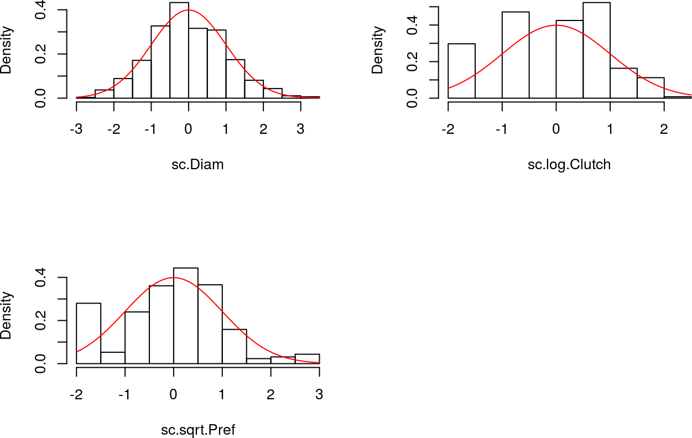
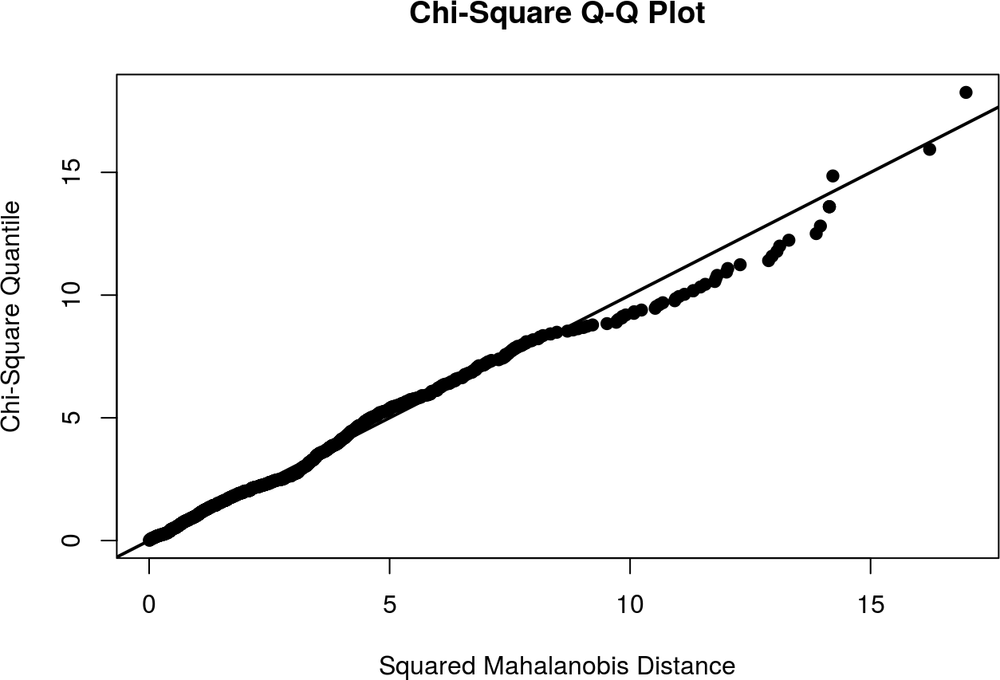
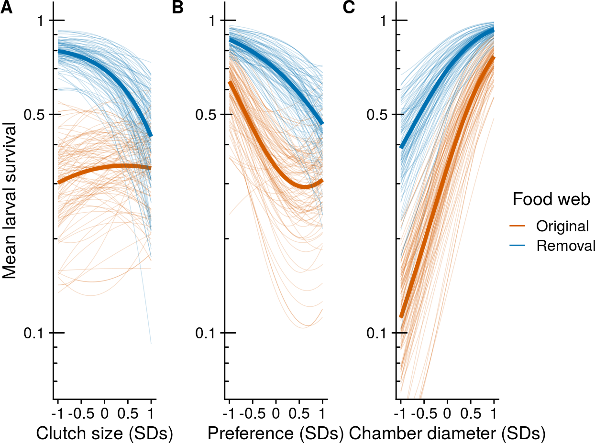
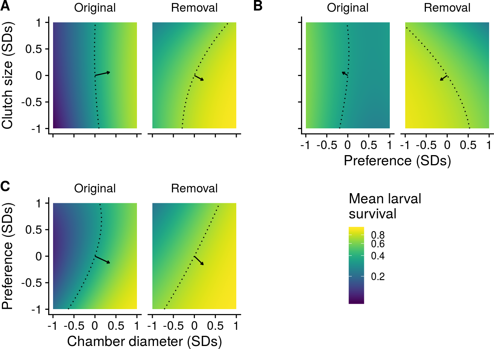
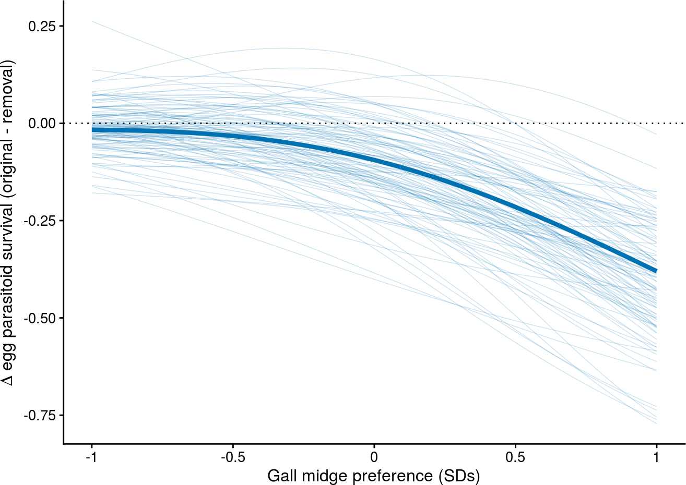

\ 

This document presents a detailed overview of the analyses presented in the main text. It highlights the essential R code used to conduct these analyses, but does not display code related to table and plot aesthetics. The underlying code for this document is provided in **reproduce_analyses.Rmd** and is available at https://github.com/mabarbour/complexity_selection. 

\ 


## Summary of dataset


Below is a summary of the raw trait data for the gall midge, *Iteomyia salicisverruca*. Gall chamber diameter (**Diam**) is measured in mm, clutch size (**Clutch**) is measured as the number of chambers per gall, and oviposition preference (**Pref**) is measured as the number of chambers per 100 shoots on the plant. Note that each chamber contains one individual larva.

<table>
<caption>Mean and SD of phenotypic traits.</caption>
 <thead>
  <tr>
   <th style="text-align:left;"> Trait </th>
   <th style="text-align:right;"> Mean </th>
   <th style="text-align:right;"> SD </th>
  </tr>
 </thead>
<tbody>
  <tr>
   <td style="text-align:left;"> Diam </td>
   <td style="text-align:right;"> 8.5 </td>
   <td style="text-align:right;"> 2.3 </td>
  </tr>
  <tr>
   <td style="text-align:left;"> Clutch </td>
   <td style="text-align:right;"> 3.4 </td>
   <td style="text-align:right;"> 2.0 </td>
  </tr>
  <tr>
   <td style="text-align:left;"> Pref </td>
   <td style="text-align:right;"> 20.2 </td>
   <td style="text-align:right;"> 18.8 </td>
  </tr>
</tbody>
</table>

Clutch size and oviposition preference were not normally distributed, so we log and square-root transformed these traits, respectively.

<table>
<caption>Mean and SD of transformed phenotypic traits.</caption>
 <thead>
  <tr>
   <th style="text-align:left;"> Trait </th>
   <th style="text-align:right;"> Mean </th>
   <th style="text-align:right;"> SD </th>
  </tr>
 </thead>
<tbody>
  <tr>
   <td style="text-align:left;"> log.Clutch </td>
   <td style="text-align:right;"> 1.1 </td>
   <td style="text-align:right;"> 0.6 </td>
  </tr>
  <tr>
   <td style="text-align:left;"> sqrt.Pref </td>
   <td style="text-align:right;"> 3.9 </td>
   <td style="text-align:right;"> 2.3 </td>
  </tr>
</tbody>
</table>

For our subsequent analyses, we scaled each phenotypic trait (mean = 0, SD = 1) so that estimates of selection surfaces and gradients were comparable between traits and with traits in other studies. Below, we show a random subset of the data used in our subsequent analyses.

<table>
<caption>Random sample of 10 data points used for our analyses.</caption>
 <thead>
  <tr>
   <th style="text-align:left;"> Foodweb </th>
   <th style="text-align:left;"> Genotype </th>
   <th style="text-align:left;"> Plant_Position </th>
   <th style="text-align:left;"> Gall_Number </th>
   <th style="text-align:left;"> Gall_ID </th>
   <th style="text-align:right;"> gall_survival </th>
   <th style="text-align:right;"> sc.Diam </th>
   <th style="text-align:right;"> sc.log.Clutch </th>
   <th style="text-align:right;"> sc.sqrt.Pref </th>
  </tr>
 </thead>
<tbody>
  <tr>
   <td style="text-align:left;"> Original </td>
   <td style="text-align:left;"> T </td>
   <td style="text-align:left;"> 489 </td>
   <td style="text-align:left;"> 3058 </td>
   <td style="text-align:left;"> 3058_c </td>
   <td style="text-align:right;"> 1 </td>
   <td style="text-align:right;"> 2.02 </td>
   <td style="text-align:right;"> 0.06 </td>
   <td style="text-align:right;"> 1.02 </td>
  </tr>
  <tr>
   <td style="text-align:left;"> Extinction </td>
   <td style="text-align:left;"> Z </td>
   <td style="text-align:left;"> 464 </td>
   <td style="text-align:left;"> 2897 </td>
   <td style="text-align:left;"> 2897_b </td>
   <td style="text-align:right;"> 1 </td>
   <td style="text-align:right;"> 0.63 </td>
   <td style="text-align:right;"> 0.54 </td>
   <td style="text-align:right;"> -1.72 </td>
  </tr>
  <tr>
   <td style="text-align:left;"> Original </td>
   <td style="text-align:left;"> X </td>
   <td style="text-align:left;"> 548 </td>
   <td style="text-align:left;"> 3055 </td>
   <td style="text-align:left;"> 3055_e </td>
   <td style="text-align:right;"> 0 </td>
   <td style="text-align:right;"> -1.21 </td>
   <td style="text-align:right;"> 1.21 </td>
   <td style="text-align:right;"> 0.11 </td>
  </tr>
  <tr>
   <td style="text-align:left;"> Extinction </td>
   <td style="text-align:left;"> L </td>
   <td style="text-align:left;"> 435 </td>
   <td style="text-align:left;"> 115 </td>
   <td style="text-align:left;"> 115_c </td>
   <td style="text-align:right;"> 0 </td>
   <td style="text-align:right;"> -0.85 </td>
   <td style="text-align:right;"> 0.06 </td>
   <td style="text-align:right;"> 1.05 </td>
  </tr>
  <tr>
   <td style="text-align:left;"> Extinction </td>
   <td style="text-align:left;"> L </td>
   <td style="text-align:left;"> 409 </td>
   <td style="text-align:left;"> 3640 </td>
   <td style="text-align:left;"> 3640_b </td>
   <td style="text-align:right;"> 1 </td>
   <td style="text-align:right;"> 1.23 </td>
   <td style="text-align:right;"> -0.61 </td>
   <td style="text-align:right;"> 0.15 </td>
  </tr>
  <tr>
   <td style="text-align:left;"> Original </td>
   <td style="text-align:left;"> X </td>
   <td style="text-align:left;"> 484 </td>
   <td style="text-align:left;"> 2594 </td>
   <td style="text-align:left;"> 2594_c </td>
   <td style="text-align:right;"> 1 </td>
   <td style="text-align:right;"> 1.14 </td>
   <td style="text-align:right;"> 0.91 </td>
   <td style="text-align:right;"> 0.80 </td>
  </tr>
  <tr>
   <td style="text-align:left;"> Original </td>
   <td style="text-align:left;"> T </td>
   <td style="text-align:left;"> 101 </td>
   <td style="text-align:left;"> 5037 </td>
   <td style="text-align:left;"> 5037_a </td>
   <td style="text-align:right;"> 0 </td>
   <td style="text-align:right;"> -0.40 </td>
   <td style="text-align:right;"> -0.61 </td>
   <td style="text-align:right;"> 0.19 </td>
  </tr>
  <tr>
   <td style="text-align:left;"> Extinction </td>
   <td style="text-align:left;"> W </td>
   <td style="text-align:left;"> 634 </td>
   <td style="text-align:left;"> 653 </td>
   <td style="text-align:left;"> 653_b </td>
   <td style="text-align:right;"> 1 </td>
   <td style="text-align:right;"> 1.33 </td>
   <td style="text-align:right;"> 1.21 </td>
   <td style="text-align:right;"> -1.72 </td>
  </tr>
  <tr>
   <td style="text-align:left;"> Original </td>
   <td style="text-align:left;"> T </td>
   <td style="text-align:left;"> 427 </td>
   <td style="text-align:left;"> 3580 </td>
   <td style="text-align:left;"> 3580_a </td>
   <td style="text-align:right;"> 0 </td>
   <td style="text-align:right;"> -1.10 </td>
   <td style="text-align:right;"> 0.54 </td>
   <td style="text-align:right;"> -0.09 </td>
  </tr>
  <tr>
   <td style="text-align:left;"> Extinction </td>
   <td style="text-align:left;"> W </td>
   <td style="text-align:left;"> 218 </td>
   <td style="text-align:left;"> 3340 </td>
   <td style="text-align:left;"> 3340_b </td>
   <td style="text-align:right;"> 1 </td>
   <td style="text-align:right;"> 0.15 </td>
   <td style="text-align:right;"> -0.61 </td>
   <td style="text-align:right;"> 1.04 </td>
  </tr>
</tbody>
</table>

- **Foodweb** = food-web treatment (Original or Extinction)
- **Genotype** = plant genotype ID (n = 8)
- **Plant_Position** = plant ID (n = 111)
- **Gall_Number** = multi-chambered gall ID (n = 613)
- **Gall_ID** = individual chamber ID (n = 1285)
- **gall_survival** = measure of larval fitness (0 = dead; 1 = survived to pupation)
- **sc.Diam** = scaled chamber diameter
- **sc.log.Clutch** = scaled logarithm of clutch size
- **sc.sqrt.Pref** = scaled square-root of oviposition preference

\  

## Multivariate normality of phenotypic traits

We used graphical checks to evaluate whether our transformations resulted in traits with a multivariate normal distribution. The histograms below show that our transformations resulted in approximately normal distributions for each phenotypic trait. 

<div class="figure">
<p class="caption">Histograms of each phenotypic trait after transformation. The red line illustrates a normal distribution.</p></div>

Note also that in the multivariate quantile-quantile (Q-Q) plot, most points fall along the expected line, suggesting that our transformations provide a reasonable approximation of a multivariate normal distribution. 

<div class="figure">
<p class="caption">Multivariate quantile-quantile (Q-Q) plot to assess deviations from multivariate normality (black line).</p></div>

\ 

## Selection surfaces for the gall midge: food-web treatments

We wrote the generalized linear mixed-effects model (GLMM) in a way that independently estimates the effect of food-web treatment, each trait, and all two-way and three-way statistical interactions, on larval survival. The resulting estimates and confidence intervals are useful for determining whether selection surfaces differ from zero, but not whether they differ between food-web treatments. In the main text, we discuss why we do not put much stock in differences in the magnitude of selection between food-web treatments (last paragraph of **Quantifying the Adaptive Landscape**), and therefore do not present these calculations. 


```r
foodweb_model <- glmer(
  gall_survival ~ 
    -1 + Foodweb + 
    Foodweb:(sc.Diam + sc.log.Clutch + sc.sqrt.Pref) +
    Foodweb:(I(sc.Diam^2) + I(sc.log.Clutch^2) + I(sc.sqrt.Pref^2)) +
    Foodweb:(sc.Diam:sc.log.Clutch + sc.Diam:sc.sqrt.Pref + sc.log.Clutch:sc.sqrt.Pref) +
    (1|Genotype/Plant_Position/Gall_Number),
  data = gall_selection.df,
  family = binomial(link = logit), 
  control=glmerControl(optimizer = "bobyqa"))
```

We then used parametric bootstrapping (n = 1000) to calculate 95% confidence intervals of selection surfaces.


```r
n_boots_analysis <- 1000

boot_foodweb_model <- bootMer(
  x = foodweb_model, 
  FUN = fixef, 
  nsim = n_boots_analysis, 
  parallel="multicore", ncpus=32, seed=34)
```

In order to reliably estimate linear relationships, we removed all higher-order terms from the model [(Stinchcombe et al. 2008)](https://onlinelibrary.wiley.com/doi/full/10.1111/j.1558-5646.2008.00449.x),


```r
linear_foodweb_model <- glmer(
  gall_survival ~ 
    -1 + Foodweb + 
    Foodweb:(sc.Diam + sc.log.Clutch + sc.sqrt.Pref) +
    (1|Genotype/Plant_Position/Gall_Number),
  data = gall_selection.df,
  family = binomial(link = logit), 
  control=glmerControl(optimizer = "bobyqa"))
```

and refit using parametric bootstrapping.


```r
boot_linear_foodweb_model <- bootMer(
  x = linear_foodweb_model, 
  FUN = fixef, 
  nsim = n_boots_analysis, 
  parallel="multicore", ncpus=32, seed=34)
```

Chamber diameter, but not the other phenotypes, could be influenced by parasitism itself rather than being under natural selection. To estimate this potential bias, we subset our data to only include multi-chambered galls where there was variability in larval survival. We then fit a reduced model to estimate the bias in selection surfaces of chamber diameter in each food-web treatment.


```r
# Subset data
biased_foodweb_df <- gall_selection.df %>%
  group_by(Foodweb, Gall_Number) %>%
  mutate(mean_survival = mean(gall_survival)) %>%
  filter(mean_survival > 0, mean_survival < 1) %>%
  ungroup()

# Fit linear model with only chamber diameter 
biased_foodweb_model <- glmer(
  gall_survival ~ -1 + Foodweb + 
    Foodweb:sc.Diam + 
    (1|Genotype/Plant_Position/Gall_Number),
  data = biased_foodweb_df,
  family = binomial(link = logit), control=glmerControl(optimizer = "bobyqa"))

# Accuracy of confidence intervals is not a priority here, so we just use the asymptotic estimates rather than parametric bootstrapping.
biased_foodweb_confint <- tidy(biased_foodweb_model, conf.int=TRUE) %>% filter(group=="fixed")
```


<table>
<caption>Estimates of bias in selection surface of chamber diameter in each food-web treatment.</caption>
 <thead>
  <tr>
   <th style="text-align:left;"> Term </th>
   <th style="text-align:right;"> Estimate </th>
   <th style="text-align:right;"> 2.5% </th>
   <th style="text-align:right;"> 97.5% </th>
  </tr>
 </thead>
<tbody>
  <tr>
   <td style="text-align:left;"> FoodwebExtinction:sc.Diam </td>
   <td style="text-align:right;"> 0.42 </td>
   <td style="text-align:right;"> 0.01 </td>
   <td style="text-align:right;"> 0.82 </td>
  </tr>
  <tr>
   <td style="text-align:left;"> FoodwebOriginal:sc.Diam </td>
   <td style="text-align:right;"> 0.36 </td>
   <td style="text-align:right;"> 0.05 </td>
   <td style="text-align:right;"> 0.67 </td>
  </tr>
</tbody>
</table>

We then gathered bootstrapped estimates from both models, only retaining nonlinear terms from the full model, 


```r
foodweb_bind <- bind_cols(
  as_tibble(boot_linear_foodweb_model$t),
  # only retain nonlinear coefficients from full model
  select(as_tibble(boot_foodweb_model$t), `FoodwebExtinction:I(sc.Diam^2)`:`FoodwebOriginal:sc.log.Clutch:sc.sqrt.Pref`) 
)
```

and subtracted the bias in chamber diameter to better approximate its selection surface. 


```r
foodweb_adj_Diam <- foodweb_bind %>%
  mutate(`FoodwebOriginal:sc.Diam` = `FoodwebOriginal:sc.Diam` - fixef(biased_foodweb_model)["FoodwebOriginal:sc.Diam"],
         `FoodwebExtinction:sc.Diam` = `FoodwebExtinction:sc.Diam` - fixef(biased_foodweb_model)["FoodwebExtinction:sc.Diam"])
```

We then summarize these bootstrapped estimates and 95% confidence intervals as a table.


<table>
<caption>Table of estimates for larval survival and selection surfaces in each food-web treatment.</caption>
 <thead>
  <tr>
   <th style="text-align:left;"> Term </th>
   <th style="text-align:left;"> Treatment </th>
   <th style="text-align:right;"> Estimate </th>
   <th style="text-align:right;"> 2.5% </th>
   <th style="text-align:right;"> 97.5% </th>
  </tr>
 </thead>
<tbody>
  <tr>
   <td style="text-align:left;"> sc.sqrt.Pref </td>
   <td style="text-align:left;"> Original </td>
   <td style="text-align:right;"> -0.42 </td>
   <td style="text-align:right;"> -0.98 </td>
   <td style="text-align:right;"> 0.15 </td>
  </tr>
  <tr>
   <td style="text-align:left;"> sc.sqrt.Pref </td>
   <td style="text-align:left;"> Extinction </td>
   <td style="text-align:right;"> -0.85 </td>
   <td style="text-align:right;"> -1.37 </td>
   <td style="text-align:right;"> -0.34 </td>
  </tr>
  <tr>
   <td style="text-align:left;"> sc.log.Clutch:sc.sqrt.Pref </td>
   <td style="text-align:left;"> Original </td>
   <td style="text-align:right;"> 0.09 </td>
   <td style="text-align:right;"> -0.34 </td>
   <td style="text-align:right;"> 0.59 </td>
  </tr>
  <tr>
   <td style="text-align:left;"> sc.log.Clutch:sc.sqrt.Pref </td>
   <td style="text-align:left;"> Extinction </td>
   <td style="text-align:right;"> 0.02 </td>
   <td style="text-align:right;"> -0.38 </td>
   <td style="text-align:right;"> 0.38 </td>
  </tr>
  <tr>
   <td style="text-align:left;"> sc.log.Clutch </td>
   <td style="text-align:left;"> Original </td>
   <td style="text-align:right;"> 0.20 </td>
   <td style="text-align:right;"> -0.17 </td>
   <td style="text-align:right;"> 0.57 </td>
  </tr>
  <tr>
   <td style="text-align:left;"> sc.log.Clutch </td>
   <td style="text-align:left;"> Extinction </td>
   <td style="text-align:right;"> -0.47 </td>
   <td style="text-align:right;"> -0.92 </td>
   <td style="text-align:right;"> -0.06 </td>
  </tr>
  <tr>
   <td style="text-align:left;"> sc.Diam:sc.sqrt.Pref </td>
   <td style="text-align:left;"> Original </td>
   <td style="text-align:right;"> -0.44 </td>
   <td style="text-align:right;"> -0.97 </td>
   <td style="text-align:right;"> 0.06 </td>
  </tr>
  <tr>
   <td style="text-align:left;"> sc.Diam:sc.sqrt.Pref </td>
   <td style="text-align:left;"> Extinction </td>
   <td style="text-align:right;"> -0.09 </td>
   <td style="text-align:right;"> -0.54 </td>
   <td style="text-align:right;"> 0.36 </td>
  </tr>
  <tr>
   <td style="text-align:left;"> sc.Diam:sc.log.Clutch </td>
   <td style="text-align:left;"> Original </td>
   <td style="text-align:right;"> -0.14 </td>
   <td style="text-align:right;"> -0.54 </td>
   <td style="text-align:right;"> 0.26 </td>
  </tr>
  <tr>
   <td style="text-align:left;"> sc.Diam:sc.log.Clutch </td>
   <td style="text-align:left;"> Extinction </td>
   <td style="text-align:right;"> -0.35 </td>
   <td style="text-align:right;"> -0.81 </td>
   <td style="text-align:right;"> 0.09 </td>
  </tr>
  <tr>
   <td style="text-align:left;"> sc.Diam </td>
   <td style="text-align:left;"> Original </td>
   <td style="text-align:right;"> 1.15 </td>
   <td style="text-align:right;"> 0.75 </td>
   <td style="text-align:right;"> 1.61 </td>
  </tr>
  <tr>
   <td style="text-align:left;"> sc.Diam </td>
   <td style="text-align:left;"> Extinction </td>
   <td style="text-align:right;"> 1.10 </td>
   <td style="text-align:right;"> 0.64 </td>
   <td style="text-align:right;"> 1.65 </td>
  </tr>
  <tr>
   <td style="text-align:left;"> I(sc.sqrt.Pref^2) </td>
   <td style="text-align:left;"> Original </td>
   <td style="text-align:right;"> 0.56 </td>
   <td style="text-align:right;"> 0.12 </td>
   <td style="text-align:right;"> 1.05 </td>
  </tr>
  <tr>
   <td style="text-align:left;"> I(sc.sqrt.Pref^2) </td>
   <td style="text-align:left;"> Extinction </td>
   <td style="text-align:right;"> 0.04 </td>
   <td style="text-align:right;"> -0.39 </td>
   <td style="text-align:right;"> 0.47 </td>
  </tr>
  <tr>
   <td style="text-align:left;"> I(sc.log.Clutch^2) </td>
   <td style="text-align:left;"> Original </td>
   <td style="text-align:right;"> -0.09 </td>
   <td style="text-align:right;"> -0.45 </td>
   <td style="text-align:right;"> 0.30 </td>
  </tr>
  <tr>
   <td style="text-align:left;"> I(sc.log.Clutch^2) </td>
   <td style="text-align:left;"> Extinction </td>
   <td style="text-align:right;"> -0.30 </td>
   <td style="text-align:right;"> -0.74 </td>
   <td style="text-align:right;"> 0.08 </td>
  </tr>
  <tr>
   <td style="text-align:left;"> I(sc.Diam^2) </td>
   <td style="text-align:left;"> Original </td>
   <td style="text-align:right;"> 0.22 </td>
   <td style="text-align:right;"> -0.11 </td>
   <td style="text-align:right;"> 0.55 </td>
  </tr>
  <tr>
   <td style="text-align:left;"> I(sc.Diam^2) </td>
   <td style="text-align:left;"> Extinction </td>
   <td style="text-align:right;"> 0.27 </td>
   <td style="text-align:right;"> -0.05 </td>
   <td style="text-align:right;"> 0.62 </td>
  </tr>
  <tr>
   <td style="text-align:left;"> (Intercept) </td>
   <td style="text-align:left;"> Original </td>
   <td style="text-align:right;"> 0.42 </td>
   <td style="text-align:right;"> 0.28 </td>
   <td style="text-align:right;"> 0.56 </td>
  </tr>
  <tr>
   <td style="text-align:left;"> (Intercept) </td>
   <td style="text-align:left;"> Extinction </td>
   <td style="text-align:right;"> 0.68 </td>
   <td style="text-align:right;"> 0.54 </td>
   <td style="text-align:right;"> 0.81 </td>
  </tr>
</tbody>
</table>


The table is good for details, but it is easier to see the results as a figure.

<div class="figure">
<p class="caption">Plot of larval survival and selection surfaces in each food-web treatment.</p></div>

\  

## Selection gradients for the gall midge: food-web treatments

Using the methods proposed by [Janzen and Stern (1998)](https://onlinelibrary.wiley.com/doi/10.1111/j.1558-5646.1998.tb02237.x), we used our estimates of mean fitness and selection surfaces to calculate selection gradients.


```r
# Estimate mean fitness and mean "brackets" for each food-web treatment (see Janzen and Stern 1998 equation 4 for details about "brackets")
foodweb_original_predict <- predict(foodweb_model, newdata=filter(gall_selection.df, Foodweb=="Original"), type="response")
foodweb_original_mean_brackets <- mean(foodweb_original_predict * (1 - foodweb_original_predict))
foodweb_original_mean_fitness <- mean(foodweb_original_predict)

foodweb_extinction_predict <- predict(foodweb_model, newdata=filter(gall_selection.df, Foodweb=="Extinction"), type="response")
foodweb_extinction_mean_brackets <- mean(foodweb_extinction_predict * (1 - foodweb_extinction_predict))
foodweb_extinction_mean_fitness <- mean(foodweb_extinction_predict)

foodweb_original_gradient <- function(x) foodweb_original_mean_brackets * x / foodweb_original_mean_fitness
foodweb_extinction_gradient <- function(x) foodweb_extinction_mean_brackets * x / foodweb_extinction_mean_fitness

foodweb_original_raw_gradients <- select(foodweb_adj_Diam, starts_with("FoodwebOriginal:")) %>%
  transmute_all(funs(foodweb_original_gradient))

foodweb_extinction_raw_gradients <- select(foodweb_adj_Diam, starts_with("FoodwebExtinction:")) %>%
  transmute_all(funs(foodweb_extinction_gradient))
```


We then reproduce the estimates of selection gradients and 95% confidence intervals reported in **Table 1** of the main text.

<table>
<caption>Table of standardized selection gradients acting on gall midges in each food-web treatment.</caption>
 <thead>
  <tr>
   <th style="text-align:left;"> Term </th>
   <th style="text-align:left;"> Treatment </th>
   <th style="text-align:right;"> Estimate </th>
   <th style="text-align:right;"> 2.5% </th>
   <th style="text-align:right;"> 97.5% </th>
  </tr>
 </thead>
<tbody>
  <tr>
   <td style="text-align:left;"> sc.sqrt.Pref </td>
   <td style="text-align:left;"> Original </td>
   <td style="text-align:right;"> -0.13 </td>
   <td style="text-align:right;"> -0.29 </td>
   <td style="text-align:right;"> 0.05 </td>
  </tr>
  <tr>
   <td style="text-align:left;"> sc.sqrt.Pref </td>
   <td style="text-align:left;"> Extinction </td>
   <td style="text-align:right;"> -0.16 </td>
   <td style="text-align:right;"> -0.26 </td>
   <td style="text-align:right;"> -0.06 </td>
  </tr>
  <tr>
   <td style="text-align:left;"> sc.log.Clutch:sc.sqrt.Pref </td>
   <td style="text-align:left;"> Original </td>
   <td style="text-align:right;"> 0.03 </td>
   <td style="text-align:right;"> -0.10 </td>
   <td style="text-align:right;"> 0.18 </td>
  </tr>
  <tr>
   <td style="text-align:left;"> sc.log.Clutch:sc.sqrt.Pref </td>
   <td style="text-align:left;"> Extinction </td>
   <td style="text-align:right;"> 0.00 </td>
   <td style="text-align:right;"> -0.07 </td>
   <td style="text-align:right;"> 0.07 </td>
  </tr>
  <tr>
   <td style="text-align:left;"> sc.log.Clutch </td>
   <td style="text-align:left;"> Original </td>
   <td style="text-align:right;"> 0.06 </td>
   <td style="text-align:right;"> -0.05 </td>
   <td style="text-align:right;"> 0.17 </td>
  </tr>
  <tr>
   <td style="text-align:left;"> sc.log.Clutch </td>
   <td style="text-align:left;"> Extinction </td>
   <td style="text-align:right;"> -0.09 </td>
   <td style="text-align:right;"> -0.17 </td>
   <td style="text-align:right;"> -0.01 </td>
  </tr>
  <tr>
   <td style="text-align:left;"> sc.Diam:sc.sqrt.Pref </td>
   <td style="text-align:left;"> Original </td>
   <td style="text-align:right;"> -0.13 </td>
   <td style="text-align:right;"> -0.29 </td>
   <td style="text-align:right;"> 0.02 </td>
  </tr>
  <tr>
   <td style="text-align:left;"> sc.Diam:sc.sqrt.Pref </td>
   <td style="text-align:left;"> Extinction </td>
   <td style="text-align:right;"> -0.02 </td>
   <td style="text-align:right;"> -0.10 </td>
   <td style="text-align:right;"> 0.07 </td>
  </tr>
  <tr>
   <td style="text-align:left;"> sc.Diam:sc.log.Clutch </td>
   <td style="text-align:left;"> Original </td>
   <td style="text-align:right;"> -0.04 </td>
   <td style="text-align:right;"> -0.16 </td>
   <td style="text-align:right;"> 0.08 </td>
  </tr>
  <tr>
   <td style="text-align:left;"> sc.Diam:sc.log.Clutch </td>
   <td style="text-align:left;"> Extinction </td>
   <td style="text-align:right;"> -0.07 </td>
   <td style="text-align:right;"> -0.15 </td>
   <td style="text-align:right;"> 0.02 </td>
  </tr>
  <tr>
   <td style="text-align:left;"> sc.Diam </td>
   <td style="text-align:left;"> Original </td>
   <td style="text-align:right;"> 0.34 </td>
   <td style="text-align:right;"> 0.22 </td>
   <td style="text-align:right;"> 0.48 </td>
  </tr>
  <tr>
   <td style="text-align:left;"> sc.Diam </td>
   <td style="text-align:left;"> Extinction </td>
   <td style="text-align:right;"> 0.21 </td>
   <td style="text-align:right;"> 0.12 </td>
   <td style="text-align:right;"> 0.31 </td>
  </tr>
  <tr>
   <td style="text-align:left;"> I(sc.sqrt.Pref^2) </td>
   <td style="text-align:left;"> Original </td>
   <td style="text-align:right;"> 0.34 </td>
   <td style="text-align:right;"> 0.07 </td>
   <td style="text-align:right;"> 0.63 </td>
  </tr>
  <tr>
   <td style="text-align:left;"> I(sc.sqrt.Pref^2) </td>
   <td style="text-align:left;"> Extinction </td>
   <td style="text-align:right;"> 0.02 </td>
   <td style="text-align:right;"> -0.15 </td>
   <td style="text-align:right;"> 0.18 </td>
  </tr>
  <tr>
   <td style="text-align:left;"> I(sc.log.Clutch^2) </td>
   <td style="text-align:left;"> Original </td>
   <td style="text-align:right;"> -0.05 </td>
   <td style="text-align:right;"> -0.27 </td>
   <td style="text-align:right;"> 0.18 </td>
  </tr>
  <tr>
   <td style="text-align:left;"> I(sc.log.Clutch^2) </td>
   <td style="text-align:left;"> Extinction </td>
   <td style="text-align:right;"> -0.11 </td>
   <td style="text-align:right;"> -0.28 </td>
   <td style="text-align:right;"> 0.03 </td>
  </tr>
  <tr>
   <td style="text-align:left;"> I(sc.Diam^2) </td>
   <td style="text-align:left;"> Original </td>
   <td style="text-align:right;"> 0.13 </td>
   <td style="text-align:right;"> -0.06 </td>
   <td style="text-align:right;"> 0.33 </td>
  </tr>
  <tr>
   <td style="text-align:left;"> I(sc.Diam^2) </td>
   <td style="text-align:left;"> Extinction </td>
   <td style="text-align:right;"> 0.10 </td>
   <td style="text-align:right;"> -0.02 </td>
   <td style="text-align:right;"> 0.23 </td>
  </tr>
</tbody>
</table>


As before, we can visualize the table output as a figure.

<div class="figure">
<p class="caption">Plot of standardized selection gradients acting on gall midges in each food-web treatment.</p></div>

\  

## Selection surface for the gall midge: egg vs. larval parasitoids

Our extinction food-web treatment allows us to estimate the unique contribution of egg parasitoids to selection on gall midge traits. To estimate the unique contribution of larval parasitoids, we subset our data so that our original food-web treatment only contained attack by larval parasitoids (and gall survival). We then fit the same models as previously, including one to estimate bias.


```r
# excludes cases of egg-parasitism from Original food web
egglarval_df <- gall_selection.df %>%
  filter(Foodweb == "Extinction" | Foodweb == "Original" & egg.ptoid < 1) 

# fit model with same structure as foodweb_model
egglarval_model <- update(foodweb_model, data=egglarval_df)

# subset data to estimate bias
biased_egglarval_df <- egglarval_df %>%
  group_by(Foodweb, Gall_Number) %>%
  mutate(mean_survival = mean(gall_survival)) %>%
  filter(mean_survival > 0, mean_survival < 1) %>%
  ungroup()

# fit model with same structure as biased_foodweb_model
biased_egglarval_model <- update(biased_foodweb_model, data=biased_egglarval_df)
```

We then used parametric bootstrapping to estimate confidence intervals from the full model.


```r
boot_egglarval_model <- bootMer(
  x = egglarval_model, 
  FUN = fixef, 
  nsim = n_boots_analysis, 
  parallel="multicore", ncpus=32, seed=34)
```

We also fit a reduced model to reliably estimate linear selection surfaces,


```r
linear_egglarval_model <- update(linear_foodweb_model, data = egglarval_df)
```

and used parametric bootstrapping to estimate those confidence intervals.


```r
boot_linear_egglarval_model <- bootMer(
  x = linear_egglarval_model, 
  FUN = fixef, 
  nsim = n_boots_analysis, 
  parallel="multicore", ncpus=32, seed=34)
```

We then combined estimates from the linear model with those nonlinear terms from the full model,


```r
egglarval_bind <- bind_cols(
  as_tibble(boot_linear_egglarval_model$t),
  # only retain nonlinear coefficients from full model
  select(as_tibble(boot_egglarval_model$t), `FoodwebExtinction:I(sc.Diam^2)`:`FoodwebOriginal:sc.log.Clutch:sc.sqrt.Pref`) 
)
```

and adjusted chamber diameter coefficients to reduce bias.


```r
egglarval_adj_Diam <- as_tibble(boot_egglarval_model$t) %>%
  mutate(`FoodwebOriginal:sc.Diam` = `FoodwebOriginal:sc.Diam` - fixef(biased_egglarval_model)["FoodwebOriginal:sc.Diam"],
         `FoodwebExtinction:sc.Diam` = `FoodwebExtinction:sc.Diam` - fixef(biased_egglarval_model)["FoodwebExtinction:sc.Diam"])
```

Below, we display the estimates and 95% confidence intervals of selection surfaces imposed by egg and larval parasitoids on gall midges as a table,


<table>
<caption>Table of gall survival and standardized selection surfaces imposed by egg and larval parasitoids.</caption>
 <thead>
  <tr>
   <th style="text-align:left;"> Term </th>
   <th style="text-align:left;"> Type </th>
   <th style="text-align:right;"> Estimate </th>
   <th style="text-align:right;"> 2.5% </th>
   <th style="text-align:right;"> 97.5% </th>
  </tr>
 </thead>
<tbody>
  <tr>
   <td style="text-align:left;"> sc.sqrt.Pref </td>
   <td style="text-align:left;"> Larval ptoid </td>
   <td style="text-align:right;"> -0.90 </td>
   <td style="text-align:right;"> -1.73 </td>
   <td style="text-align:right;"> -0.17 </td>
  </tr>
  <tr>
   <td style="text-align:left;"> sc.sqrt.Pref </td>
   <td style="text-align:left;"> Egg ptoid </td>
   <td style="text-align:right;"> -1.00 </td>
   <td style="text-align:right;"> -1.66 </td>
   <td style="text-align:right;"> -0.47 </td>
  </tr>
  <tr>
   <td style="text-align:left;"> sc.log.Clutch:sc.sqrt.Pref </td>
   <td style="text-align:left;"> Larval ptoid </td>
   <td style="text-align:right;"> -0.20 </td>
   <td style="text-align:right;"> -0.71 </td>
   <td style="text-align:right;"> 0.32 </td>
  </tr>
  <tr>
   <td style="text-align:left;"> sc.log.Clutch:sc.sqrt.Pref </td>
   <td style="text-align:left;"> Egg ptoid </td>
   <td style="text-align:right;"> 0.04 </td>
   <td style="text-align:right;"> -0.31 </td>
   <td style="text-align:right;"> 0.41 </td>
  </tr>
  <tr>
   <td style="text-align:left;"> sc.log.Clutch </td>
   <td style="text-align:left;"> Larval ptoid </td>
   <td style="text-align:right;"> 0.67 </td>
   <td style="text-align:right;"> 0.20 </td>
   <td style="text-align:right;"> 1.26 </td>
  </tr>
  <tr>
   <td style="text-align:left;"> sc.log.Clutch </td>
   <td style="text-align:left;"> Egg ptoid </td>
   <td style="text-align:right;"> -0.81 </td>
   <td style="text-align:right;"> -1.38 </td>
   <td style="text-align:right;"> -0.31 </td>
  </tr>
  <tr>
   <td style="text-align:left;"> sc.Diam:sc.sqrt.Pref </td>
   <td style="text-align:left;"> Larval ptoid </td>
   <td style="text-align:right;"> -0.28 </td>
   <td style="text-align:right;"> -0.92 </td>
   <td style="text-align:right;"> 0.33 </td>
  </tr>
  <tr>
   <td style="text-align:left;"> sc.Diam:sc.sqrt.Pref </td>
   <td style="text-align:left;"> Egg ptoid </td>
   <td style="text-align:right;"> -0.11 </td>
   <td style="text-align:right;"> -0.48 </td>
   <td style="text-align:right;"> 0.27 </td>
  </tr>
  <tr>
   <td style="text-align:left;"> sc.Diam:sc.log.Clutch </td>
   <td style="text-align:left;"> Larval ptoid </td>
   <td style="text-align:right;"> 0.10 </td>
   <td style="text-align:right;"> -0.34 </td>
   <td style="text-align:right;"> 0.55 </td>
  </tr>
  <tr>
   <td style="text-align:left;"> sc.Diam:sc.log.Clutch </td>
   <td style="text-align:left;"> Egg ptoid </td>
   <td style="text-align:right;"> -0.36 </td>
   <td style="text-align:right;"> -0.77 </td>
   <td style="text-align:right;"> 0.04 </td>
  </tr>
  <tr>
   <td style="text-align:left;"> sc.Diam </td>
   <td style="text-align:left;"> Larval ptoid </td>
   <td style="text-align:right;"> 1.17 </td>
   <td style="text-align:right;"> 0.67 </td>
   <td style="text-align:right;"> 1.85 </td>
  </tr>
  <tr>
   <td style="text-align:left;"> sc.Diam </td>
   <td style="text-align:left;"> Egg ptoid </td>
   <td style="text-align:right;"> 1.07 </td>
   <td style="text-align:right;"> 0.63 </td>
   <td style="text-align:right;"> 1.65 </td>
  </tr>
  <tr>
   <td style="text-align:left;"> I(sc.sqrt.Pref^2) </td>
   <td style="text-align:left;"> Larval ptoid </td>
   <td style="text-align:right;"> 0.47 </td>
   <td style="text-align:right;"> -0.04 </td>
   <td style="text-align:right;"> 1.07 </td>
  </tr>
  <tr>
   <td style="text-align:left;"> I(sc.sqrt.Pref^2) </td>
   <td style="text-align:left;"> Egg ptoid </td>
   <td style="text-align:right;"> -0.06 </td>
   <td style="text-align:right;"> -0.50 </td>
   <td style="text-align:right;"> 0.38 </td>
  </tr>
  <tr>
   <td style="text-align:left;"> I(sc.log.Clutch^2) </td>
   <td style="text-align:left;"> Larval ptoid </td>
   <td style="text-align:right;"> 0.01 </td>
   <td style="text-align:right;"> -0.36 </td>
   <td style="text-align:right;"> 0.38 </td>
  </tr>
  <tr>
   <td style="text-align:left;"> I(sc.log.Clutch^2) </td>
   <td style="text-align:left;"> Egg ptoid </td>
   <td style="text-align:right;"> -0.30 </td>
   <td style="text-align:right;"> -0.67 </td>
   <td style="text-align:right;"> 0.06 </td>
  </tr>
  <tr>
   <td style="text-align:left;"> I(sc.Diam^2) </td>
   <td style="text-align:left;"> Larval ptoid </td>
   <td style="text-align:right;"> 0.16 </td>
   <td style="text-align:right;"> -0.17 </td>
   <td style="text-align:right;"> 0.52 </td>
  </tr>
  <tr>
   <td style="text-align:left;"> I(sc.Diam^2) </td>
   <td style="text-align:left;"> Egg ptoid </td>
   <td style="text-align:right;"> 0.25 </td>
   <td style="text-align:right;"> -0.04 </td>
   <td style="text-align:right;"> 0.58 </td>
  </tr>
  <tr>
   <td style="text-align:left;"> (Intercept) </td>
   <td style="text-align:left;"> Larval ptoid </td>
   <td style="text-align:right;"> 0.68 </td>
   <td style="text-align:right;"> 0.51 </td>
   <td style="text-align:right;"> 0.83 </td>
  </tr>
  <tr>
   <td style="text-align:left;"> (Intercept) </td>
   <td style="text-align:left;"> Egg ptoid </td>
   <td style="text-align:right;"> 0.69 </td>
   <td style="text-align:right;"> 0.50 </td>
   <td style="text-align:right;"> 0.85 </td>
  </tr>
</tbody>
</table>


and in figure form.

<div class="figure">
<p class="caption">Plot of gall survival and standardized selection surfaces imposed by egg and larval parasitoids.</p></div>

\ 

## Selection gradients for the gall midge: egg vs. larval parasitoids

We again use the method of [Janzen and Stern (1998)](https://onlinelibrary.wiley.com/doi/10.1111/j.1558-5646.1998.tb02237.x) to calculate selection gradients from our estimates of larval survival and selection surfaces,


```r
# Estimate mean fitness and mean "brackets" for each food-web treatment (see Janzen and Stern 1998 equation 4 for details about "brackets")
egglarval_original_predict <- predict(egglarval_model, newdata=filter(egglarval_df, Foodweb=="Original"), type="response")
egglarval_original_mean_brackets <- mean(egglarval_original_predict * (1 - egglarval_original_predict))
egglarval_original_mean_fitness <- mean(egglarval_original_predict)

egglarval_extinction_predict <- predict(egglarval_model, newdata=filter(egglarval_df, Foodweb=="Extinction"), type="response")
egglarval_extinction_mean_brackets <- mean(egglarval_extinction_predict * (1 - egglarval_extinction_predict))
egglarval_extinction_mean_fitness <- mean(egglarval_extinction_predict)

egglarval_original_gradient <- function(x) egglarval_original_mean_brackets * x / egglarval_original_mean_fitness
egglarval_extinction_gradient <- function(x) egglarval_extinction_mean_brackets * x / egglarval_extinction_mean_fitness

egglarval_original_raw_gradients <- select(egglarval_adj_Diam, starts_with("FoodwebOriginal:")) %>%
  transmute_all(funs(egglarval_original_gradient))

egglarval_extinction_raw_gradients <- select(egglarval_adj_Diam, starts_with("FoodwebExtinction:")) %>%
  transmute_all(funs(egglarval_extinction_gradient))
```

and summarize our estimates and 95% confidence intervals as a table,


<table>
<caption>Table of selection gradients imposed by egg and larval parasitoids on gall midges.</caption>
 <thead>
  <tr>
   <th style="text-align:left;"> Term </th>
   <th style="text-align:left;"> Parasitoid </th>
   <th style="text-align:right;"> Estimate </th>
   <th style="text-align:right;"> 2.5% </th>
   <th style="text-align:right;"> 97.5% </th>
  </tr>
 </thead>
<tbody>
  <tr>
   <td style="text-align:left;"> sc.sqrt.Pref </td>
   <td style="text-align:left;"> Egg ptoid </td>
   <td style="text-align:right;"> -0.20 </td>
   <td style="text-align:right;"> -0.33 </td>
   <td style="text-align:right;"> -0.09 </td>
  </tr>
  <tr>
   <td style="text-align:left;"> sc.sqrt.Pref </td>
   <td style="text-align:left;"> Larval ptoid </td>
   <td style="text-align:right;"> -0.17 </td>
   <td style="text-align:right;"> -0.34 </td>
   <td style="text-align:right;"> -0.03 </td>
  </tr>
  <tr>
   <td style="text-align:left;"> sc.log.Clutch:sc.sqrt.Pref </td>
   <td style="text-align:left;"> Egg ptoid </td>
   <td style="text-align:right;"> 0.01 </td>
   <td style="text-align:right;"> -0.06 </td>
   <td style="text-align:right;"> 0.08 </td>
  </tr>
  <tr>
   <td style="text-align:left;"> sc.log.Clutch:sc.sqrt.Pref </td>
   <td style="text-align:left;"> Larval ptoid </td>
   <td style="text-align:right;"> -0.04 </td>
   <td style="text-align:right;"> -0.14 </td>
   <td style="text-align:right;"> 0.06 </td>
  </tr>
  <tr>
   <td style="text-align:left;"> sc.log.Clutch </td>
   <td style="text-align:left;"> Egg ptoid </td>
   <td style="text-align:right;"> -0.16 </td>
   <td style="text-align:right;"> -0.27 </td>
   <td style="text-align:right;"> -0.06 </td>
  </tr>
  <tr>
   <td style="text-align:left;"> sc.log.Clutch </td>
   <td style="text-align:left;"> Larval ptoid </td>
   <td style="text-align:right;"> 0.13 </td>
   <td style="text-align:right;"> 0.04 </td>
   <td style="text-align:right;"> 0.24 </td>
  </tr>
  <tr>
   <td style="text-align:left;"> sc.Diam:sc.sqrt.Pref </td>
   <td style="text-align:left;"> Egg ptoid </td>
   <td style="text-align:right;"> -0.02 </td>
   <td style="text-align:right;"> -0.10 </td>
   <td style="text-align:right;"> 0.05 </td>
  </tr>
  <tr>
   <td style="text-align:left;"> sc.Diam:sc.sqrt.Pref </td>
   <td style="text-align:left;"> Larval ptoid </td>
   <td style="text-align:right;"> -0.05 </td>
   <td style="text-align:right;"> -0.18 </td>
   <td style="text-align:right;"> 0.06 </td>
  </tr>
  <tr>
   <td style="text-align:left;"> sc.Diam:sc.log.Clutch </td>
   <td style="text-align:left;"> Egg ptoid </td>
   <td style="text-align:right;"> -0.07 </td>
   <td style="text-align:right;"> -0.15 </td>
   <td style="text-align:right;"> 0.01 </td>
  </tr>
  <tr>
   <td style="text-align:left;"> sc.Diam:sc.log.Clutch </td>
   <td style="text-align:left;"> Larval ptoid </td>
   <td style="text-align:right;"> 0.02 </td>
   <td style="text-align:right;"> -0.07 </td>
   <td style="text-align:right;"> 0.11 </td>
  </tr>
  <tr>
   <td style="text-align:left;"> sc.Diam </td>
   <td style="text-align:left;"> Egg ptoid </td>
   <td style="text-align:right;"> 0.21 </td>
   <td style="text-align:right;"> 0.13 </td>
   <td style="text-align:right;"> 0.33 </td>
  </tr>
  <tr>
   <td style="text-align:left;"> sc.Diam </td>
   <td style="text-align:left;"> Larval ptoid </td>
   <td style="text-align:right;"> 0.23 </td>
   <td style="text-align:right;"> 0.13 </td>
   <td style="text-align:right;"> 0.36 </td>
  </tr>
  <tr>
   <td style="text-align:left;"> I(sc.sqrt.Pref^2) </td>
   <td style="text-align:left;"> Egg ptoid </td>
   <td style="text-align:right;"> -0.02 </td>
   <td style="text-align:right;"> -0.20 </td>
   <td style="text-align:right;"> 0.15 </td>
  </tr>
  <tr>
   <td style="text-align:left;"> I(sc.sqrt.Pref^2) </td>
   <td style="text-align:left;"> Larval ptoid </td>
   <td style="text-align:right;"> 0.18 </td>
   <td style="text-align:right;"> -0.02 </td>
   <td style="text-align:right;"> 0.42 </td>
  </tr>
  <tr>
   <td style="text-align:left;"> I(sc.log.Clutch^2) </td>
   <td style="text-align:left;"> Egg ptoid </td>
   <td style="text-align:right;"> -0.12 </td>
   <td style="text-align:right;"> -0.26 </td>
   <td style="text-align:right;"> 0.02 </td>
  </tr>
  <tr>
   <td style="text-align:left;"> I(sc.log.Clutch^2) </td>
   <td style="text-align:left;"> Larval ptoid </td>
   <td style="text-align:right;"> 0.01 </td>
   <td style="text-align:right;"> -0.14 </td>
   <td style="text-align:right;"> 0.15 </td>
  </tr>
  <tr>
   <td style="text-align:left;"> I(sc.Diam^2) </td>
   <td style="text-align:left;"> Egg ptoid </td>
   <td style="text-align:right;"> 0.10 </td>
   <td style="text-align:right;"> -0.01 </td>
   <td style="text-align:right;"> 0.23 </td>
  </tr>
  <tr>
   <td style="text-align:left;"> I(sc.Diam^2) </td>
   <td style="text-align:left;"> Larval ptoid </td>
   <td style="text-align:right;"> 0.06 </td>
   <td style="text-align:right;"> -0.07 </td>
   <td style="text-align:right;"> 0.20 </td>
  </tr>
</tbody>
</table>


and as a figure.

<div class="figure">
<p class="caption">Plot of selection gradients imposed by egg and larval parasitoids on gall midges.</p></div>


## Reproduce Figure 2 in main text

We used the full model to generate predicted estimates of mean larval survival for changes in the mean trait value of the population. I restrict these predictions to +/- 1 SD because we can only reliably estimate the shape of the adaptive landscape near the mean phenotype of the population [(Arnold et al., 2001)](https://link.springer.com/article/10.1023/A:1013373907708). Other trait values are held constant at the mean phenotype (i.e. trait = 0). We then performed 100 bootstraps to illustrate the uncertainty in our estimates.


```r
n_boots_plots <- 100

## Gall diameter
newdata_Diam <- bind_rows(
  expand.grid(Foodweb = "Original", sc.Diam = seq(-1,1,length.out=1000), sc.log.Clutch = 0, sc.sqrt.Pref = 0),
  expand.grid(Foodweb = "Extinction", sc.Diam = seq(-1,1,length.out=1000), sc.log.Clutch = 0, sc.sqrt.Pref = 0))

RF_Diam <- bootstrap_fitness(
  logistic_model = foodweb_model, 
  newdata = newdata_Diam,
  bootstraps=n_boots_plots)
```


```r
## Clutch size
newdata_Clutch <- bind_rows(
  expand.grid(Foodweb = "Original", sc.Diam = 0, sc.log.Clutch = seq(-1,1,length.out=1000), sc.sqrt.Pref = 0),
  expand.grid(Foodweb = "Extinction", sc.Diam = 0, sc.log.Clutch = seq(-1,1,length.out=1000), sc.sqrt.Pref = 0))

RF_Clutch <- bootstrap_fitness(
  logistic_model = foodweb_model,
  newdata = newdata_Clutch,
  bootstraps=n_boots_plots)
```


```r
## Oviposition preference
newdata_Pref <- bind_rows(
  expand.grid(Foodweb = "Original", sc.Diam = 0, sc.log.Clutch = 0, sc.sqrt.Pref = seq(-1,1,length.out=1000)),
  expand.grid(Foodweb = "Extinction", sc.Diam = 0, sc.log.Clutch = 0, sc.sqrt.Pref = seq(-1,1,length.out=1000)))

RF_Pref <- bootstrap_fitness(
  logistic_model = foodweb_model, 
  newdata = newdata_Pref,
  bootstraps=n_boots_plots)
```

We then gathered these predictions to plot the adaptive landscape of gall midge traits in each food-web treatment. Note that we plot mean larval survival on a log-scale to reflect the mathematical definition of the adaptive landscape.


<div class="figure">
<p class="caption">Adaptive landscapes of gall midge phenotypes in the original food web and with the extinction of larval parasitoids.</p></div>


## Reproduce Figure 3 in main text

As before, we use the full model to generate predicted estimates of mean larval survival, but do so now for different phenotypic combinations. 


```r
## Clutch size x Oviposition preference
newdata_Clutch.Pref <- bind_rows(
  expand.grid(Foodweb = "Original", sc.Diam = 0, sc.log.Clutch = seq(-1,1,length.out=1000), sc.sqrt.Pref = seq(-1,1,length.out=1000)),
  expand.grid(Foodweb = "Extinction", sc.Diam = 0, sc.log.Clutch = seq(-1,1,length.out=1000), sc.sqrt.Pref = seq(-1,1,length.out=1000)))

RF_Clutch.Pref <- bootstrap_fitness(
  logistic_model = foodweb_model, 
  newdata = newdata_Clutch.Pref,
  bootstraps=NULL)
```


```r
## Gall diameter x Clutch size
newdata_Diam.Clutch <- bind_rows(
  expand.grid(Foodweb = "Original", sc.Diam = seq(-1,1,length.out=1000), sc.log.Clutch = seq(-1,1,length.out=1000), sc.sqrt.Pref = 0),
  expand.grid(Foodweb = "Extinction", sc.Diam = seq(-1,1,length.out=1000), sc.log.Clutch = seq(-1,1,length.out=1000), sc.sqrt.Pref=0))

RF_Diam.Clutch <- bootstrap_fitness(
  logistic_model = foodweb_model, 
  newdata = newdata_Diam.Clutch,
  bootstraps=NULL)
```


```r
## Gall diameter by oviposition preference
newdata_Diam.Pref <- bind_rows(
  expand.grid(Foodweb = "Original", sc.Diam = seq(-1,1,length.out=1000), sc.log.Clutch = 0, sc.sqrt.Pref = seq(-1,1,length.out=1000)),
  expand.grid(Foodweb = "Extinction", sc.Diam = seq(-1,1,length.out=1000), sc.log.Clutch = 0, sc.sqrt.Pref = seq(-1,1,length.out=1000)))

RF_Diam.Pref <- bootstrap_fitness(
  logistic_model = foodweb_model, 
  newdata = newdata_Diam.Pref,
  bootstraps=NULL)
```

And gather these predictions to plot two-dimensional views of the adaptive landscape for each combination of phenotypic traits in each food-web treatment.


<div class="figure">
<p class="caption">Two dimensional view of adaptive landscapes of gall midge phenotypes in the original food web and with the extinction of larval parasitoids. Dotted lines denote fitness for the mean phenotype. Arrows represent the vector of directional selection gradients acting on each phenotype.</p></div>

## Slope and curvature of the adaptive landscape of gall traits

Below is the code used to get estimates for the slope ($\beta$) and curvature ($\gamma-\beta\beta^\text{T}$) of the adaptive landscape in each food-web treatment. If 95% confidence intervals of selection gradients overlap zero, then they were set to zero; otherwise, we retain the estimate. 

For the original food web, we create the matrix of $\beta$s,


```r
# Get direction selection gradients from original food web
original_betas_df <- tidy_foodweb_grads %>%
  filter(type=="Original", gradient_type=="Directional") %>%
  select(term, gradient=mean, low=conf.low, high=conf.high)

# Relabel each term 
original_betas_df$term <- factor(
  original_betas_df$term, 
  levels=c("sc.Diam","sc.log.Clutch","sc.sqrt.Pref"), 
  labels=c("Diam","Clutch","Pref"), order=TRUE)

rownames(original_betas_df) <- original_betas_df$term

# Create empty matrix
original_betas <- matrix(nrow = 3, 
                         ncol = 1, 
                         dimnames = list(c("Diam","Clutch","Pref"), c("")))

# Populate the empty matrix with ifelse() statements
# If the 95% CI does not overlap zero, 
# then the "low" multiplied by the "high" interval is always greater than zero.
# If that's true, then I retain the estimate.
# If it's false, then I set the estimate to zero.
original_betas["Diam",] <- ifelse(
  original_betas_df["Diam","low"]*original_betas_df["Diam","high"] > 0, 
  original_betas_df["Diam","gradient"], 0)

original_betas["Clutch",] <- ifelse(
  original_betas_df["Clutch","low"]*original_betas_df["Clutch","high"] > 0, 
  original_betas_df["Clutch","gradient"], 0)

original_betas["Pref",] <- ifelse(
  original_betas_df["Pref","low"]*original_betas_df["Pref","high"] > 0,
  original_betas_df["Pref","gradient"], 0)

original_betas <- round(original_betas, 2)
```

and the matrix of $\gamma$s.


```r
# Get nonlinear selection gradients from original food web
original_gammas_df <- tidy_foodweb_grads %>%
  filter(type=="Original", gradient_type %in% c("Quadratic","Correlational")) %>%
  select(term, gradient=mean, low=conf.low, high=conf.high)

# Relabel each term
original_gammas_df$term <- factor(
  original_gammas_df$term, 
  levels=c("I(sc.Diam^2)","I(sc.log.Clutch^2)","I(sc.sqrt.Pref^2)",
           "sc.Diam:sc.log.Clutch","sc.Diam:sc.sqrt.Pref","sc.log.Clutch:sc.sqrt.Pref"), 
  labels=c("Diam^2","Clutch^2","Pref^2","Diam:Clutch","Diam:Pref","Clutch:Pref"), order=TRUE)

rownames(original_gammas_df) <- original_gammas_df$term

# Create empty matrix  
original_gammas <- matrix(nrow = 3, 
                          ncol = 3, 
                          dimnames = list(c("Diam","Clutch","Pref"), c("Diam","Clutch","Pref")))

# Populate the empty matrix with ifelse() statements 
# to determine if 95% CI overlaps with zero or not (see previous logic)
original_gammas["Diam","Diam"] <- ifelse(
  original_gammas_df["Diam^2","low"]*original_gammas_df["Diam^2","high"] > 0,
  original_gammas_df["Diam^2","gradient"], 0)

original_gammas["Clutch","Clutch"] <- ifelse(
  original_gammas_df["Clutch^2","low"]*original_gammas_df["Clutch^2","high"] > 0, 
  original_gammas_df["Clutch^2","gradient"], 0)

original_gammas["Pref","Pref"] <- ifelse(
  original_gammas_df["Pref^2","low"]*original_gammas_df["Pref^2","high"] > 0, 
  original_gammas_df["Pref^2","gradient"], 0)

original_gammas["Diam","Clutch"] <- ifelse(
  original_gammas_df["Diam:Clutch","low"]*original_gammas_df["Diam:Clutch","high"] > 0,
  original_gammas_df["Diam:Clutch","gradient"], 0)

original_gammas["Clutch","Diam"] <- original_gammas["Diam","Clutch"]

original_gammas["Diam","Pref"] <- ifelse(
  original_gammas_df["Diam:Pref","low"]*original_gammas_df["Diam:Pref","high"] > 0,
  original_gammas_df["Diam:Pref","gradient"], 0)

original_gammas["Pref","Diam"] <- original_gammas["Diam","Pref"]

original_gammas["Clutch","Pref"] <- ifelse(
  original_gammas_df["Clutch:Pref","low"]*original_gammas_df["Clutch:Pref","high"] > 0,
  original_gammas_df["Clutch:Pref","gradient"], 0)

original_gammas["Pref","Clutch"] <- original_gammas["Clutch","Pref"]

original_gammas <- round(original_gammas, 2)
```

Likewise for the extinction web, we create the matrix of $\beta$s,


```r
# Get direction selection gradients from extinction food web
extinction_betas_df <- tidy_foodweb_grads %>%
  filter(type=="Extinction", gradient_type=="Directional") %>%
  select(term, gradient=mean, low=conf.low, high=conf.high)

# Relabel each term 
extinction_betas_df$term <- factor(
  extinction_betas_df$term, 
  levels=c("sc.Diam","sc.log.Clutch","sc.sqrt.Pref"), 
  labels=c("Diam","Clutch","Pref"), order=TRUE)

rownames(extinction_betas_df) <- extinction_betas_df$term

# Create empty matrix
extinction_betas <- matrix(nrow = 3, 
                           ncol = 1, 
                           dimnames = list(c("Diam","Clutch","Pref"), c("")))

# Populate the empty matrix with ifelse() statements 
# to determine if 95% CI overlaps with zero or not (see previous logic)
extinction_betas["Diam",] <- ifelse(
  extinction_betas_df["Diam","low"]*extinction_betas_df["Diam","high"] > 0,
  extinction_betas_df["Diam","gradient"], 0)

extinction_betas["Clutch",] <- ifelse(
  extinction_betas_df["Clutch","low"]*extinction_betas_df["Clutch","high"] > 0,
  extinction_betas_df["Clutch","gradient"], 0)

extinction_betas["Pref",] <- ifelse(
  extinction_betas_df["Pref","low"]*extinction_betas_df["Pref","high"] > 0,
  extinction_betas_df["Pref","gradient"], 0)

extinction_betas <- round(extinction_betas, 2)
```

and $\gamma$s.


```r
# Get nonlinear selection gradients from extinction food web
extinction_gammas_df <- tidy_foodweb_grads %>%
  filter(type=="Extinction", gradient_type %in% c("Quadratic","Correlational")) %>%
  select(term, gradient=mean, low=conf.low, high=conf.high)

# Relabel each term
extinction_gammas_df$term <- factor(
  extinction_gammas_df$term, 
  levels=c("I(sc.Diam^2)","I(sc.log.Clutch^2)","I(sc.sqrt.Pref^2)",
           "sc.Diam:sc.log.Clutch","sc.Diam:sc.sqrt.Pref","sc.log.Clutch:sc.sqrt.Pref"),
  labels=c("Diam^2","Clutch^2","Pref^2","Diam:Clutch","Diam:Pref","Clutch:Pref"), order=TRUE)

rownames(extinction_gammas_df) <- extinction_gammas_df$term

# Create empty matrix
extinction_gammas <- matrix(nrow = 3, 
                            ncol = 3, 
                            dimnames = list(c("Diam","Clutch","Pref"), c("Diam","Clutch","Pref")))

# Populate the empty matrix with ifelse() statements 
# to determine if 95% CI overlaps with zero or not (see previous logic)
extinction_gammas["Diam","Diam"] <- ifelse(
  extinction_gammas_df["Diam^2","low"]*extinction_gammas_df["Diam^2","high"] > 0,
  extinction_gammas_df["Diam^2","gradient"], 0)

extinction_gammas["Clutch","Clutch"] <- ifelse(
  extinction_gammas_df["Clutch^2","low"]*extinction_gammas_df["Clutch^2","high"] > 0,
  extinction_gammas_df["Clutch^2","gradient"], 0)

extinction_gammas["Pref","Pref"] <- ifelse(
  extinction_gammas_df["Pref^2","low"]*extinction_gammas_df["Pref^2","high"] > 0,
  extinction_gammas_df["Pref^2","gradient"], 0)

extinction_gammas["Diam","Clutch"] <- ifelse(
  extinction_gammas_df["Diam:Clutch","low"]*extinction_gammas_df["Diam:Clutch","high"] > 0,
  extinction_gammas_df["Diam:Clutch","gradient"], 0)

extinction_gammas["Clutch","Diam"] <- extinction_gammas["Diam","Clutch"]

extinction_gammas["Diam","Pref"] <- ifelse(
  extinction_gammas_df["Diam:Pref","low"]*extinction_gammas_df["Diam:Pref","high"] > 0,
  extinction_gammas_df["Diam:Pref","gradient"], 0)

extinction_gammas["Pref","Diam"] <- extinction_gammas["Diam","Pref"]

extinction_gammas["Clutch","Pref"] <- ifelse(
  extinction_gammas_df["Clutch:Pref","low"]*extinction_gammas_df["Clutch:Pref","high"] > 0,
  extinction_gammas_df["Clutch:Pref","gradient"], 0)

extinction_gammas["Pref","Clutch"] <- extinction_gammas["Clutch","Pref"]

extinction_gammas <- round(extinction_gammas, 2)
```

After all of this, we can easily calculate the curvature matrix ($\gamma-\beta\beta^\text{T}$) in each food-web treatment.


```r
original_curvature <- original_gammas - original_betas %*% t(original_betas)

extinction_curvature <- extinction_gammas - extinction_betas %*% t(extinction_betas)
```

I then used these estimates to populate the curvature matrices presented in the **Results** of the main text, but also reproduce them here:

$$\textbf{C} = \begin{pmatrix} \text{C}_{\text{Diam:Diam}}&& \\ \text{C}_{\text{Clutch:Diam}} & \text{C}_{\text{Clutch:Clutch}} & \\ \text{C}_{\text{Pref:Diam}} & \text{C}_{\text{Pref:Clutch}} & \text{C}_{\text{Pref:Pref}} \end{pmatrix}$$

$$\textbf{C}_{\text{Original}} = \begin{pmatrix} 
-0.12 &  &  \\  
0 & 0 &  \\  
0 & 0 & 0.34 \end{pmatrix}$$

$$\textbf{C}_{\text{Extinction}} = \begin{pmatrix} 
-0.04 &  &  \\  
0.02 & -0.01 &  \\  
0.03 & -0.01 & -0.03 \end{pmatrix}$$

\ 

## Selection surfaces for the egg parasitoid

We fit the same models as before, except presence/absence of an egg parasitoid is the response variable. Importantly, we can only estimate selection by calculating the difference in probability of observing egg parasitoids between food-web treatments. We do this by calculating the difference in bootstrapped estimates between treatments after fitting our models.


```r
# convert "gall_survival" to egg parasitoid survival. Note that both Iteomyia pupa and larva parasitoids result in 0. We do not change the name of the response variable to make clear that we are using the same statistical models as for Iteomyia.
eggegg_df <- gall_selection.df %>%
  mutate(gall_survival = ifelse(egg.ptoid == 1, 1, 0))

# fit trait-fitness relationship using the same model structure
eggegg_model <- update(foodweb_model, data=eggegg_df)

# subset data for quantifying biased selection on chamber diameter
biased_eggegg_df <- eggegg_df %>%
  group_by(Foodweb, Gall_Number) %>%
  mutate(mean_survival = mean(gall_survival)) %>%
  filter(mean_survival > 0, mean_survival < 1) %>%
  ungroup()

# quantify bias
biased_eggegg_model <- update(biased_foodweb_model, data=biased_eggegg_df)
```

We used parametric bootstrapping to calculate 95% confidence intervals of selection surfaces.


```r
boot_eggegg_model <- bootMer(
  x = eggegg_model, 
  FUN = fixef, 
  nsim = n_boots_analysis, 
  parallel="multicore", ncpus=32, seed=34)
```

As before, we removed all higher-order terms to estimate linear relationships,


```r
linear_eggegg_model <- update(linear_foodweb_model, data=eggegg_df)
```

and refit using parametric bootstrapping.


```r
boot_linear_eggegg_model <- bootMer(
  x = linear_eggegg_model, 
  FUN = fixef, 
  nsim = n_boots_analysis, 
  parallel="multicore", ncpus=32, seed=34)
```

We then gather bootstrapped estimates from the full (nonlinear terms only) and reduced models, 


```r
eggegg_bind <- bind_cols(
  as_tibble(boot_linear_eggegg_model$t),
  # only retain nonlinear coefficients from full model
  select(as_tibble(boot_eggegg_model$t), `FoodwebExtinction:I(sc.Diam^2)`:`FoodwebOriginal:sc.log.Clutch:sc.sqrt.Pref`) 
)
```

and adjusted for biased coefficients in chamber diameter.


```r
eggegg_adj_Diam <- as_tibble(boot_eggegg_model$t) %>%
  mutate(`FoodwebOriginal:sc.Diam` = `FoodwebOriginal:sc.Diam` - fixef(biased_eggegg_model)["FoodwebOriginal:sc.Diam"],
         `FoodwebExtinction:sc.Diam` = `FoodwebExtinction:sc.Diam` - fixef(biased_eggegg_model)["FoodwebExtinction:sc.Diam"])
```

Finally, we calculate the differences between food-web treatments in order to estimate selection imposed by larval parasitoids. 


```r
eggegg_alphas <- eggegg_adj_Diam %>%
  # logit transform to make intercept interpretable as a probability of survival
  mutate(`FoodwebExtinction:(Intercept)` = inverse_logit(FoodwebExtinction),
         `FoodwebOriginal:(Intercept)` = inverse_logit(FoodwebOriginal)) %>% 
  select(-FoodwebExtinction, -FoodwebOriginal) %>% # translated into (Intercept) terms
  # calculate differences
  mutate(`FoodwebDiff:(Intercept)` = `FoodwebOriginal:(Intercept)` - `FoodwebExtinction:(Intercept)`,
         `FoodwebDiff:sc.Diam` = `FoodwebOriginal:sc.Diam` - `FoodwebExtinction:sc.Diam`,
         `FoodwebDiff:sc.log.Clutch` = `FoodwebOriginal:sc.log.Clutch` - `FoodwebExtinction:sc.log.Clutch`,
         `FoodwebDiff:sc.sqrt.Pref` = `FoodwebOriginal:sc.sqrt.Pref` - `FoodwebExtinction:sc.sqrt.Pref`,
         `FoodwebDiff:I(sc.Diam^2)` = `FoodwebOriginal:I(sc.Diam^2)` - `FoodwebExtinction:I(sc.Diam^2)`,
         `FoodwebDiff:I(sc.log.Clutch^2)` = `FoodwebOriginal:I(sc.log.Clutch^2)` - `FoodwebExtinction:I(sc.log.Clutch^2)`,
         `FoodwebDiff:I(sc.sqrt.Pref^2)` = `FoodwebOriginal:I(sc.sqrt.Pref^2)` - `FoodwebExtinction:I(sc.sqrt.Pref^2)`,
         `FoodwebDiff:sc.Diam:sc.log.Clutch` = `FoodwebOriginal:sc.Diam:sc.log.Clutch` - `FoodwebExtinction:sc.Diam:sc.log.Clutch`,
         `FoodwebDiff:sc.Diam:sc.sqrt.Pref` = `FoodwebOriginal:sc.Diam:sc.sqrt.Pref` - `FoodwebExtinction:sc.Diam:sc.sqrt.Pref`,
         `FoodwebDiff:sc.log.Clutch:sc.sqrt.Pref` = `FoodwebOriginal:sc.log.Clutch:sc.sqrt.Pref` - `FoodwebExtinction:sc.log.Clutch:sc.sqrt.Pref`) %>%
  summarise_all(funs(mean, conf.high, conf.low))
```


Below, we display the estimates and 95% confidence intervals in selection surfaces for egg parasitoids as a table,


<table>
<caption>Table of standardized selection surfaces acting on egg parasitoids (*Platygaster* sp.).</caption>
 <thead>
  <tr>
   <th style="text-align:left;"> Term </th>
   <th style="text-align:right;"> Original - Extinction </th>
   <th style="text-align:right;"> 2.5% </th>
   <th style="text-align:right;"> 97.5% </th>
  </tr>
 </thead>
<tbody>
  <tr>
   <td style="text-align:left;"> (Intercept) </td>
   <td style="text-align:right;"> -0.10 </td>
   <td style="text-align:right;"> -0.32 </td>
   <td style="text-align:right;"> 0.09 </td>
  </tr>
  <tr>
   <td style="text-align:left;"> I(sc.Diam^2) </td>
   <td style="text-align:right;"> 0.01 </td>
   <td style="text-align:right;"> -0.54 </td>
   <td style="text-align:right;"> 0.60 </td>
  </tr>
  <tr>
   <td style="text-align:left;"> I(sc.log.Clutch^2) </td>
   <td style="text-align:right;"> -0.37 </td>
   <td style="text-align:right;"> -1.11 </td>
   <td style="text-align:right;"> 0.36 </td>
  </tr>
  <tr>
   <td style="text-align:left;"> I(sc.sqrt.Pref^2) </td>
   <td style="text-align:right;"> -0.57 </td>
   <td style="text-align:right;"> -1.42 </td>
   <td style="text-align:right;"> 0.08 </td>
  </tr>
  <tr>
   <td style="text-align:left;"> sc.Diam </td>
   <td style="text-align:right;"> 0.38 </td>
   <td style="text-align:right;"> -0.42 </td>
   <td style="text-align:right;"> 1.31 </td>
  </tr>
  <tr>
   <td style="text-align:left;"> sc.Diam:sc.log.Clutch </td>
   <td style="text-align:right;"> -0.11 </td>
   <td style="text-align:right;"> -1.00 </td>
   <td style="text-align:right;"> 0.70 </td>
  </tr>
  <tr>
   <td style="text-align:left;"> sc.Diam:sc.sqrt.Pref </td>
   <td style="text-align:right;"> 0.65 </td>
   <td style="text-align:right;"> -0.20 </td>
   <td style="text-align:right;"> 1.68 </td>
  </tr>
  <tr>
   <td style="text-align:left;"> sc.log.Clutch </td>
   <td style="text-align:right;"> -0.09 </td>
   <td style="text-align:right;"> -1.11 </td>
   <td style="text-align:right;"> 0.82 </td>
  </tr>
  <tr>
   <td style="text-align:left;"> sc.log.Clutch:sc.sqrt.Pref </td>
   <td style="text-align:right;"> -0.49 </td>
   <td style="text-align:right;"> -1.45 </td>
   <td style="text-align:right;"> 0.39 </td>
  </tr>
  <tr>
   <td style="text-align:left;"> sc.sqrt.Pref </td>
   <td style="text-align:right;"> -1.03 </td>
   <td style="text-align:right;"> -2.31 </td>
   <td style="text-align:right;"> -0.04 </td>
  </tr>
</tbody>
</table>

and in figure form.

<div class="figure">
<p class="caption">Plot of selection surfaces acting on egg parasitoids.</p></div>

\  

## Selection gradients for the egg parasitoid


```r
# Estimate mean fitness and mean "brackets" for each food-web treatment (see Janzen and Stern 1998 equation 4 for details about "brackets")
eggegg_original_predict <- predict(eggegg_model, newdata=filter(eggegg_df, Foodweb=="Original"), type="response")
eggegg_original_mean_brackets <- mean(eggegg_original_predict * (1 - eggegg_original_predict))
eggegg_original_mean_fitness <- mean(eggegg_original_predict)

eggegg_extinction_predict <- predict(eggegg_model, newdata=filter(eggegg_df, Foodweb=="Extinction"), type="response")
eggegg_extinction_mean_brackets <- mean(eggegg_extinction_predict * (1 - eggegg_extinction_predict))
eggegg_extinction_mean_fitness <- mean(eggegg_extinction_predict)

eggegg_original_gradient <- function(x) eggegg_original_mean_brackets * x / eggegg_original_mean_fitness
eggegg_extinction_gradient <- function(x) eggegg_extinction_mean_brackets * x / eggegg_extinction_mean_fitness

eggegg_original_raw_gradients <- select(eggegg_adj_Diam, starts_with("FoodwebOriginal:")) %>%
  transmute_all(funs(eggegg_original_gradient))

eggegg_extinction_raw_gradients <- select(eggegg_adj_Diam, starts_with("FoodwebExtinction:")) %>%
  transmute_all(funs(eggegg_extinction_gradient))
```

Calculate differences between food-web treatments, then estimate means and confidence intervals


```r
eggegg_grads <- bind_cols(eggegg_original_raw_gradients, eggegg_extinction_raw_gradients) %>%
  mutate(`FoodwebDiff:sc.Diam` = `FoodwebOriginal:sc.Diam` - `FoodwebExtinction:sc.Diam`,
         `FoodwebDiff:sc.log.Clutch` = `FoodwebOriginal:sc.log.Clutch` - `FoodwebExtinction:sc.log.Clutch`,
         `FoodwebDiff:sc.sqrt.Pref` = `FoodwebOriginal:sc.sqrt.Pref` - `FoodwebExtinction:sc.sqrt.Pref`,
         `FoodwebDiff:I(sc.Diam^2)` = `FoodwebOriginal:I(sc.Diam^2)` - `FoodwebExtinction:I(sc.Diam^2)`,
         `FoodwebDiff:I(sc.log.Clutch^2)` = `FoodwebOriginal:I(sc.log.Clutch^2)` - `FoodwebExtinction:I(sc.log.Clutch^2)`,
         `FoodwebDiff:I(sc.sqrt.Pref^2)` = `FoodwebOriginal:I(sc.sqrt.Pref^2)` - `FoodwebExtinction:I(sc.sqrt.Pref^2)`,
         `FoodwebDiff:sc.Diam:sc.log.Clutch` = `FoodwebOriginal:sc.Diam:sc.log.Clutch` - `FoodwebExtinction:sc.Diam:sc.log.Clutch`,
         `FoodwebDiff:sc.Diam:sc.sqrt.Pref` = `FoodwebOriginal:sc.Diam:sc.sqrt.Pref` - `FoodwebExtinction:sc.Diam:sc.sqrt.Pref`,
         `FoodwebDiff:sc.log.Clutch:sc.sqrt.Pref` = `FoodwebOriginal:sc.log.Clutch:sc.sqrt.Pref` - `FoodwebExtinction:sc.log.Clutch:sc.sqrt.Pref`) %>%
  summarise_all(funs(mean, conf.high, conf.low))
```

Below, we display estimates of standardized selection gradients (and 95% confidence intervals) imposed by larval parasitoids on egg parasitoids as a table, 


<table>
<caption>Table of standardized selection gradients acting on egg parasitoids (*Platygaster* sp.).</caption>
 <thead>
  <tr>
   <th style="text-align:left;"> Term </th>
   <th style="text-align:right;"> Original - Extinction </th>
   <th style="text-align:right;"> 2.5% </th>
   <th style="text-align:right;"> 97.5% </th>
  </tr>
 </thead>
<tbody>
  <tr>
   <td style="text-align:left;"> I(sc.Diam^2) </td>
   <td style="text-align:right;"> -0.05 </td>
   <td style="text-align:right;"> -0.43 </td>
   <td style="text-align:right;"> 0.33 </td>
  </tr>
  <tr>
   <td style="text-align:left;"> I(sc.log.Clutch^2) </td>
   <td style="text-align:right;"> -0.21 </td>
   <td style="text-align:right;"> -0.68 </td>
   <td style="text-align:right;"> 0.26 </td>
  </tr>
  <tr>
   <td style="text-align:left;"> I(sc.sqrt.Pref^2) </td>
   <td style="text-align:right;"> -0.46 </td>
   <td style="text-align:right;"> -1.07 </td>
   <td style="text-align:right;"> -0.02 </td>
  </tr>
  <tr>
   <td style="text-align:left;"> sc.Diam </td>
   <td style="text-align:right;"> -0.03 </td>
   <td style="text-align:right;"> -0.30 </td>
   <td style="text-align:right;"> 0.25 </td>
  </tr>
  <tr>
   <td style="text-align:left;"> sc.Diam:sc.log.Clutch </td>
   <td style="text-align:right;"> 0.00 </td>
   <td style="text-align:right;"> -0.29 </td>
   <td style="text-align:right;"> 0.27 </td>
  </tr>
  <tr>
   <td style="text-align:left;"> sc.Diam:sc.sqrt.Pref </td>
   <td style="text-align:right;"> 0.25 </td>
   <td style="text-align:right;"> -0.04 </td>
   <td style="text-align:right;"> 0.60 </td>
  </tr>
  <tr>
   <td style="text-align:left;"> sc.log.Clutch </td>
   <td style="text-align:right;"> 0.07 </td>
   <td style="text-align:right;"> -0.26 </td>
   <td style="text-align:right;"> 0.39 </td>
  </tr>
  <tr>
   <td style="text-align:left;"> sc.log.Clutch:sc.sqrt.Pref </td>
   <td style="text-align:right;"> -0.18 </td>
   <td style="text-align:right;"> -0.52 </td>
   <td style="text-align:right;"> 0.12 </td>
  </tr>
  <tr>
   <td style="text-align:left;"> sc.sqrt.Pref </td>
   <td style="text-align:right;"> -0.25 </td>
   <td style="text-align:right;"> -0.64 </td>
   <td style="text-align:right;"> 0.09 </td>
  </tr>
</tbody>
</table>

and in figure form.

<div class="figure">
<p class="caption">Plot of standardized selection gradients acting on egg parasitoids.</p></div>

## Reproduce Figure 4 in main text

Using a similar approach as for gall midge traits, we plot the difference in the probability of observing egg parasitoids (original - extinction) as a function of gall midge (now egg parasitoid) traits. Gall midge preference was the only phenotype of egg parasitoids that appeared to be under selection, so we only calculate this relationship,


```r
## Oviposition preference
eggegg_RF_Pref <- bootstrap_fitness(
  logistic_model = eggegg_model, 
  newdata = newdata_Pref,
  bootstraps=n_boots_plots) 
```

and plot it.

<div class="figure">
<p class="caption">Selection imposed by larval parasitoids on egg parasitoids (*Platygaster* sp.).</p></div>
