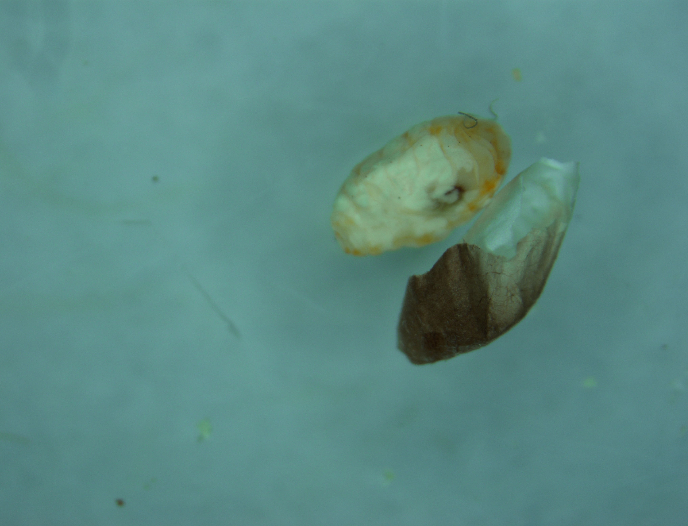
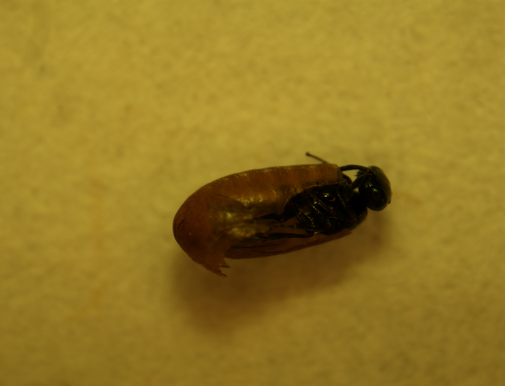
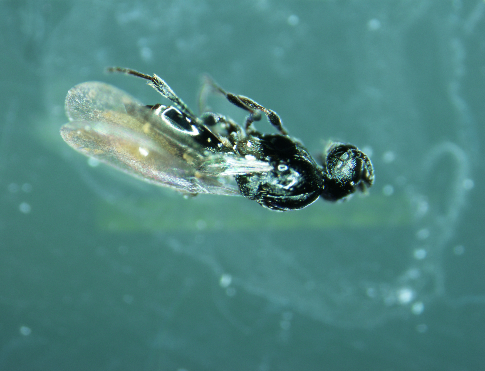
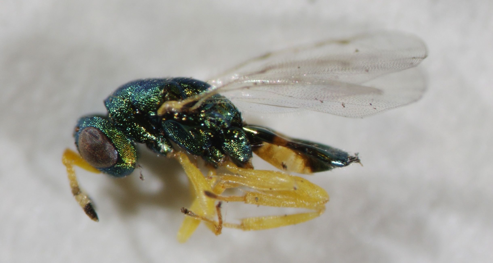
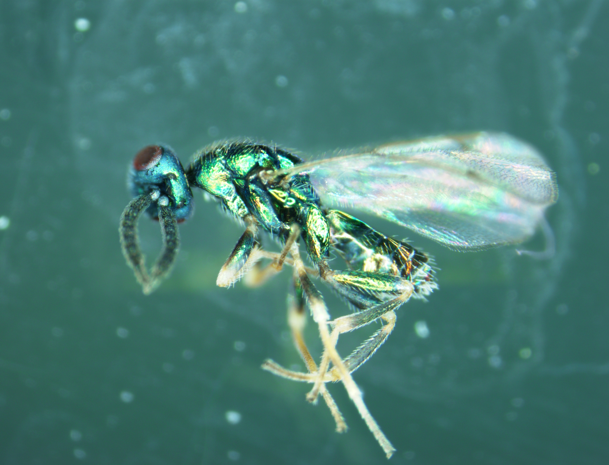

# Guide to insect community associated with *Iteomyia salicisverruca* (Order: Diptera, Family: Cecidomyiidae) galls on *Salix hookeriana*

## Gall content Categories
- **pupa** (Fig. 1): species - *Iteomyia saliciverruca*; description - white, papery cocoon, ~ 2 mm in length. White/orangish larva typically found inside, although it may have been liquified due to fungus colonization during storage.
- **platy** (Fig. 2,3): likely species - *Platygaster* sp. (Order: Hymenoptera, Superfamily: Platygastroidea); description - transpartent, brown cocoon, ~ 1.5 mm in length. Brown cocoon is distinctive from "pupa" in that it is has a more formed structure. Pure black parasitoid typically found inside, although it may have liquified from fungal contamination.
- **hairy larva** (Fig. 4): *not Iteomyia larva*, therefore possible ectoparasitoid (*need to confirm*). description - yellowish with clear body segmentation, also distinct but sparsely distributed hairs.
- **none-none**: no apparent larva or cocoon found within gall. Possibly died early in developmet when larva are very small due to plant quality or some other unknown cause. 
- **brown mush**: found brown mush inside. Possibly the remains of an underdeveloped *Iteomyia* larva, but don't know if this was caused by my collection protocol.
- **exit-none-ecto**: exit hole found at tip of gall point, but nothing inside gall. Should find an ectoparasitoid in the vial used to rear the gall. Only classify as "exit-none-ecto" if the ectoparasitoid species cannot be confidently linked to the gall due to the presence of multiple ectoparasitoids in the vial.
- **exit-none-mesopolobus** (Fig. 5): exit hole found at tip of gall point, but nothing inside gall. Found the ectoparasitoid *Mesopolobus* sp. (Order: Hymenoptera, Family: Pteromalidae). Description - metallic green, antenna are yellow with dark 'tips', yellow band on abdomen, all yellow legs, characteristic wing veination of wasps in the family Pteromalidae. This description likely describes the male of *Mesopolobus* sp.
- **exit-none-pteromalid2** (Fig. 6): exit hole found at tip of gall point, but nothing inside gall. Found the ectoparasitoid Pteromalid sp. 2 (Order: Hymenoptera, Family: Pteromalidae). Description - metallic green, antenna are yellow at base and darkened past the 'elbow', abdomen noticeably larger than the wasp currently classified as *Mesopolobus* sp., all yellow legs, characteristic wing veination of wasps in the family Pteromalidae. This description likely describes the female of *Mesopolobus* sp.
- **exit-none-torymid-male** (Fig. 7): exit hole found at tip of gall point, but nothing inside gall. Found a male of the ectoparasitoid *Torymus* sp. (Order: Hymenoptera, Family: Torymidae). Description - metallic green, antenna are dark throughout, lacking distinct ovipositor of female, upper part of legs are metallic green, characteristic wing veination of wasps in the family Torymidae (stubby stigma vein). 
- **exit-none-torymid-female** (Fig. 8): exit hole found at tip of gall point, but nothing inside gall. Found a female of the ectoparasitoid *Torymus* sp. (Order: Hymenoptera, Family: Torymidae). Description - metallic green, distinct ovipositor extending out behind abdomen, characteristic wing veination of wasps in the family Torymidae (stubby stigma vein). 

