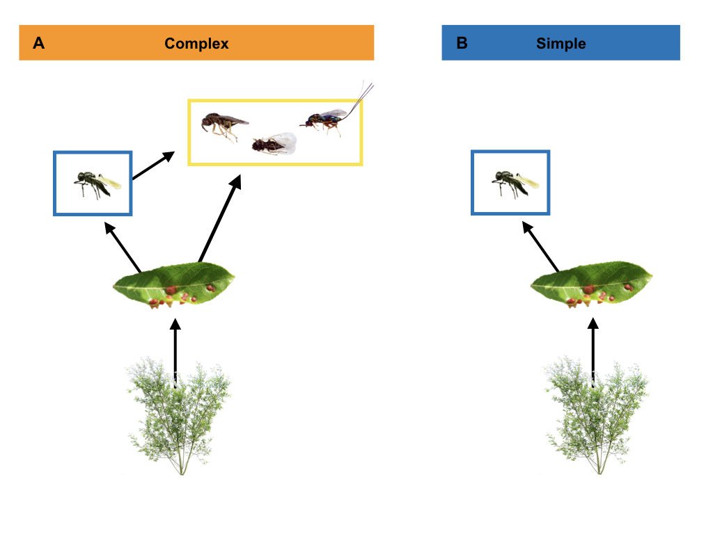

```{r setup ms, include=FALSE}
## Rerun supp mat ----
knitr::knit("analyses/reproduce_analyses.Rmd") # try changing to knitr::render() and see if it'll also produce the .html document.

## Get sample size info
no_larvae <- dim(distinct(gall_selection.df, Gall_Number, Gall_ID))[1]
no_galls <- dim(distinct(gall_selection.df, Gall_Number))[1]
no_plants <- dim(distinct(gall_selection.df, Plant_Position))[1]
no_genotypes <- dim(distinct(gall_selection.df, Genotype))[1]
```

<!-- Begin title page formatting -->

\noindent 1. University of British Columbia, Department of Zoology, Vancouver, BC V6T 1Z4, Canada;

\noindent 2. University of Zurich, Department of Evolutionary Biology and Environmental Studies, Winterthurerstrasse 190, 8057 Zurich, Switzerland;

\noindent 3. University of Guelph, Department of Integrative Biology, Guelph, ON N1G 2W1, Canada;

\noindent 4. Humboldt State University, Department of Biological Sciences, Arcata, CA 95521, USA.

$^\ast$ Corresponding author; e-mail: matthew.barbour@ieu.uzh.ch

\bigskip

*Manuscript elements*: Figure 1, figure 2, figure 3, figure 4. All figures should be printed in color.

\bigskip

*Keywords*: fitness landscape, host-parasitoid, natural selection, G-matrix, community context, ecological networks.

\bigskip

*Manuscript type*: Article. <!-- Or e-article, note, e-note, natural history miscellany, e-natural history miscellany, comment, reply, invited symposium, or countdown to 150.-->

\bigskip

\footnotesize Prepared using an *Am. Nat.* inspired \LaTeX{} template for Rmarkdown. \normalsize

<!-- End title page formatting -->

\linenumbers{}
\modulolinenumbers[3]

\newpage

# Abstract

Global change is simplifying the structure of ecological networks; however, we are currently in a poor position to predict how these simplified communities will affect the evolutionary potential of remaining populations. Theory on adaptive landscapes provides a framework for predicting how selection constrains phenotypic evolution, but often treat the community context of evolving populations as a ``black box''. <!--In contrast, ecological networks provide an explicit representation of the community context, yet often ignore the role of natural selection.-->Here, we integrate ecological networks and adaptive landscapes to examine how changes in food-web complexity shape evolutionary constraints. We conducted a field experiment that manipulated the diversity of insect parasitoids (food-web complexity) that were able to impose selection on an insect herbivore. We then measured herbivore survival as a function of three key phenotypic traits. We found that more traits were under selection in simpler vs. more complex food webs. The adaptive landscape was more neutral in complex food webs because different parasitoid species impose different selection pressures, minimizing relative fitness differences among phenotypes. Our results suggest that phenotypic evolution becomes more constrained in simplified food webs. This indicates that the simplification of ecological communities may constrain the adaptive potential of remaining populations to future environmental change.  


\newpage

# Introduction

The adaptive landscape provides a powerful framework for understanding how natural selection has shaped the evolution of biodiversity ---from genes, to phenotypes, to species [@Wright1931; @Simpson1944; @Arnold2001]. More than a metaphor, the adaptive landscape links quantitative genetic and phenotypic variation to evolution by natural selection [@Lande1979; @Arnold1984applications; @Arnold1984theory]. Ecological interactions often play a key role in shaping adaptive landscapes, as evidenced by the role of antagonistic [@Schluter2000; @Abrams2000] and mutualistic [@Bronstein2006] interactions in driving evolutionary change.<!--, often play a key role in shaping the adaptive landscape and phenotypic evolution in multiple traits [; ;]. For example, competition for shared prey in threespine stickleback has driven their adaptive divergence into ecotypes with specialized body and gill morphologies [@Schluter2000, other papers]. Similarly, the elongated, red corollas of many flowering species have evolved in response to the efficient pollination of hummingbirds [cite].--> Although there is clear evidence that pairwise interactions can shape the adaptive landscape, we also know that most species interact with multiple species in a community context [@Darwin1859]. Understanding how the adaptive landscape is shaped by community context represents a major frontier for evolutionary ecologists [@McPeek2017; @terHorst2018]. Resolution on this front is urgently needed though, given the rapid impacts of climate change on ecological communities [@Scheffers2016].   

Ecological networks, such as a food web describing who eats whom, provide an explicit representation of the community context. These networks describe the interdependency of populations within an ecological community, providing an effective framework for predicting how the strength and organization of ecological interactions (network structure) affect population and community dynamics [@Bascompte2014; @McCann2012]. Nevertheless, these networks often lack quantitative information on how ecological interactions influence selection on phenotypic traits. Thus, it remains unclear how network structure shapes adaptive landscapes of interacting populations. This represents a major barrier in our current ability to predict how changes in community context will affect phenotypic evolution. 

Here, we integrate ecological networks and adaptive landscapes to understand how community context constrains evolutionary change [@Arnold1992]. Different aspects of evolutionary constraints can be inferred by quantifying the slope and curvature of the adaptive landscape. For example, the slope is determined by directional selection gradients acting on each phenotypic trait and influences the trajectory of evolutionary change [@Lande1979;@Arnold1992]. Evolutionary trajectories become more constrained with an increase in the number of traits under selection, as this diminishes the number of optimal solutions [@Arnold2003]. The curvature of the adaptive landscape can also constrain evolution through its indirect effect on genetic constraints [@Arnold1992; @Hansen2008]. Genetic constraints are largely governed by a population's **G**-matrix ---the additive genetic variances and covariances between traits [@Hansen2008]. In general, genetic constraints will increase with the number of traits under directional or stabilizing selection, as this will decrease the additive genetic variance in those traits [@Hansen2008]. Genetic constraints may also increase with the number of trait combinations under correlational selection, as this type of selection decreases the evolutionary independence of traits [@Hansen2008]. If we want to predict how community context constrains evolutionary change, we must understand how ecological networks shape the adaptive landscape.

To examine the effect of network structure on adaptive landscapes, we conducted a field experiment that manipulated the complexity of trophic interactions (hereafter food-web complexity) associated with an abundant insect herbivore (*Iteomyia salicisverruca*; Family Cecidomyiidae)(fig. \ref{fig:Conceptual}). The larvae of this herbivore induce tooth-shaped galls when they feed on the developing leaves of willow trees [*Salix* sp., @Russo2006]. These galls protect larva from attack by generalist predators (e.g. ants, spiders), but they suffer high mortaltiy from egg and larval parasitoids [@Barbour2016]. We manipulated food-web complexity by either excluding the guild of larval parasitoids (simple food web) or allowing both egg and larval parasitoids to impose selection on gall midge traits (complex food web; fig. \ref{fig:Conceptual}). Food-web complexity may influence the adaptive landscape in a number of ways. For example, if each parasitoid imposes directional selection on a different trait, then more complex food webs may constrain evolution by increasing the number of traits under selection. Alternatively, if parasitoids impose selection on different values of a trait, then their selective effects would cancel each other out in more complex food webs. To examine these different possibilities (among others), we applied modern statistical methods to quantify the effect of food-web complexity on the slope and curvature of the gall midge's adaptive landscape. Taken together, our study gives insight to how local extinctions, and concomitant decreases in food-web complexity, may constrain the evolution of interacting populations.

<!--
Here, we integrate ecological networks and the adaptive landscape to understand how changes in network structure affect the dynamics of natural selection. In particular, we are interested in how network structure constrains or enables phenotypic evolution [@Arnold1992]. We can gain insight to the selective constraints imposed by network structure by examining its effect on the slope and curvature of the adaptive landscape. To illustrate this, let us examine the adaptive landscape of two hypothetical traits, $z_i$ and $z_j$. The slope of the adaptive landscape is described by a column vector of directional selection gradients acting on these traits (cite):

$$\text{Slope} = \beta = \begin{pmatrix} \beta_{z_i} \\ \beta_{z_j} \end{pmatrix} $$

If each phenotypic trait experiences directional selection ($\beta_{z_i},\beta_{z_j}\neq0$), then this implies that there is an optimal phenotype (adaptive peak) and thus strong constraints on the trajectory of evolution. In contrast, if selection is absent on a trait (say $\beta_{z_i}=0$), then there may be multiple peaks (a line across all possible $z_i$ in this example) where fitness is equivalent and thus weaker selective constraints [@Arnold1992]. The curvature of the adaptive landscape may also constrain phenotypic evolution through its indirect effect on genetic constraints [@Arnold1992]. Genetic constraints on phenotypic evolution are largely governed by a population's **G**-matrix ---the additive genetic variances and covariances between traits [@Hansen2008]. For our hypothetical example, the **G**-matrix takes the form:

$$\text{G} = \begin{pmatrix} V_{z_i:z_i} & \\ V_{z_i:z_j} & V_{z_j:z_j} \end{pmatrix} $$

where $V_{z_i:z_i}$ is the additive genetic variance in $z_i$ and $V_{z_i:z_j}$ is the additive genetic covariance between $z_i$ and $z_j$. Changes in the **G**-matrix within a generation are governed by the following equation [cite]: 

$$\Delta \text{G}=\text{G}(\gamma-\beta \beta^{\text{T}})\text{G}$$
where $\gamma$ corresponds to the matrix of quadratic ($\gamma_{z_i:z_i}$) and correlational ($\gamma_{z_i:z_j}$) selection gradients. The terms in parentheses in the above equation describe the curvature (C) of the adaptive landscape, or the effects of nonlinear selection. To make explicit how landscape curvature affects the **G**-matrix, we rewrite the curvature matrix as: 

$$\text{C}= \begin{pmatrix} \gamma_{z_i:z_i} & \\ \gamma_{z_i:z_j} & \gamma_{z_j:z_j} \end{pmatrix} - \begin{pmatrix} \beta_{z_i}\beta_{z_i} & \\ \beta_{z_i}\beta_{z_j} & \beta_{z_j}\beta_{z_j} \end{pmatrix} $$
$$\text{C} = \begin{pmatrix} C_{z_i:z_i} & \\ C_{z_i:z_j} & C_{z_j:z_j} \end{pmatrix}$$
The diagonal terms of this curvature matrix describe how selection changes the additive genetic variance of traits ($V_{z_i:z_i}$). If selection acts to decrease the additive genetic variance, which is common when there is no disruptive selection ($\gamma_{z_i:z_i}>0$), then this will constrain the trait's evolutionary response to future selection [@Hansen2008]. The off-diagonal terms of the curvature matrix are also important as they describe the change in additive genetic covariances between traits. Nonzero values along the off-diagonal indicate that selection favors trait integration, which may result in stronger genetic constraints [@Hansen2008].

To examine how network structure shapes the adaptive landscape, we conducted a field experiment that manipulated the complexity of a food web associated with an abundant leaf-galling midge (*Iteomyia salicisverruca*; Family Cecidomyiidae)(fig. \ref{fig:Conceptual}). The larvae of this herbivore induce tooth-shaped galls when they feed on the developing leaves of willow trees [*Salix* sp., @Russo2006]. These galls protect larva from attack by generalist predators (e.g. ants, spiders), but they suffer a high degree of mortaltiy from four parasitoid wasps. To manipulate food-web complexity, we experimentally excluded the diversity of parasitoids that were able to impose selection on gall midge larvae (fig. \ref{fig:Conceptual}). 

Food-web complexity may shape the adaptive landscape, and thus selective constraints, in a number of ways. For example, if each consumer imposes directional selection on a different trait, then more complex food webs may increase the number of traits under selection, thereby increasing selective constraints. Alternatively, if consumers impose selection on different values of a trait, then their selective effects may cancel each other in more complex food webs, which would alleviate selective constraints. Food-web complexity may also indirectly affect genetic constraints. For example, if each consumer imposes selection on a different rare phenotype (i.e. each end of a trait distribution), then there would be stabilizing selection for an optimal phenotype, which would increase genetic constraints. Alternatively, if consumers are adapted to attacking the population's mean phenotype, then the relative fitness of rarer phenotypes would increase (disruptive selection), which would decrease genetic constraints. To tease apart these diverse possibilities, we applied modern statistical methods to quantify the effect of food-web complexity on the slope and curvature of the gall midge's adaptive landscape. Taken together, our study gives insight to how local extinctions, and concomitant decreases in food-web complexity, shape the adaptive landscape of interconnected populations.
-->

<!-- Old last paragraph
Here, we integrate ecological networks and the adaptive landscape to understand how changes in network structure affect the dynamics of natural selection. We conducted a field experiment that manipulated the diversity of insect parasitoids that were able to impose selection on an abundant leaf-galling midge (*Iteomyia salicisverruca*; Family Cecidomyiidae)(fig. \ref{fig:Conceptual}). The larvae of this herbivore induce tooth-shaped galls when they feed on the developing leaves of willow trees [*Salix* sp., @Russo2006]. Since these galls provide protection from generalist predators (e.g. ants, spiders), our experiment provides an effective manipulation of the diversity of trophic interactions, or food-web complexity, that this insect herbivore experiences. We then applied modern statistical methods to test how food-web complexity shapes the slope and curvature of the herbivore's adaptive landscape. Taken together, our study gives insight to how local extinctions, and concomitant decreases in food-web complexity, shape the adaptive landscape of interconnected populations.
-->

<!-- Useful paragraph explaining the effect of increased mortality on strength of selection
Also, unless consumers are equivalent, then we may generally expect lower average survival in complex food webs, which would increase the strength of selection. The logic behind this is made clear if we rewrite the selection gradient, which is typically expressed as the covariance between relative fitness ($w$) and phenotype ($z_i$), $\beta_{z_i}=\textrm{cov}(w,z_i)$, as a function of both absolute fitness ($W$) and mean fitness ($\bar W$), $\beta_{z_i}=\textrm{cov}(W,z_i)/ \bar W$ [@Hunter2018]. This alternative expression makes clear that lower survival, and thus mean fitness, increases the strength of selection. Note that if consumers are equivalent in their selective effects (i.e. functionally redundant), then we would not expect any effect of food-web complexity on the adaptive landscape.
-->

# Methods

## Study Site

We conducted our study within a four-year old common garden experiment of coastal willow (*Salix hookeriana*) located at Humboldt Bay National Wildlife Refuge (HBNWR) (40 40'53"N, 124 12'4"W) near Loleta, California, USA. This common garden consists of 26 different willow genotypes that were collected from a single population of willows growing around Humboldt Bay. Stem cuttings of each genotype (25 replicates per genotypes) were planted in a completely randomized design in two hectares of a former cattle pasture at HBNWR. Willows at our study site begin flowering in February and reach their peak growth in early August. During this study, willows had reached 5 - 9m in height. Further details on the genotyping and planting of the common garden are available in @Barbour2015.  

## Manipulating Food-web Complexity

We setup our food-web manipulation across 128 plants soon after galls began developing on willows in early June of 2013. These 128 plants came from eight different plant genotypes that spanned the range of trait variation observed in this willow population [@Barbour2015]. For the complex food-web treatment (eight replicates per genotype), we used flagging tape to mark 14 galled leaves per plant (~30 larvae), allowing the full suite of egg and larval parasitoids to impose selection. Marking galls with flagging tape ensured that we compared control and treatment galls with similar phenology when we collected galls later in the season. For the simple food-web treatment, we enclosed 14 galled leaves with 10x15cm organza bags (ULINE, Pleasant Prairie, WI, USA) to exclude three parasitoid species that attack during larval development. This treatment did not exclude the egg parasitoid *Platygaster* sp., which attacks prior to gall initiation [larva initiate gall development in Cecidomyiid midges: @Gagne1989]. In late August, we collected marked and bagged galls from each plant, placed them into 30 mL vials and kept them in the lab for 4 months at room temperature. We then opened galls under a dissecting scope and determined whether larvae survived to pupation (our measure of fitness) or were parasitized. Since we were interested in selection imposed by parasitoids, we excluded unknown sources of mortality.<!--restricted our data to larvae that either survived to pupation or were parasitized by an egg or larval parasitoid.--> For the food-web treatment that excluded larval parasitoids (simple food web), we further restricted our data by removing any incidental instances of parasitism by a larval parasitoid. This represented less than 3\% of the observations in this food-web treatment and allowed us to focus our inferences of selection on those imposed by the egg parasitoid. Our final dataset contains survival estimates for `r no_larvae` larvae from `r no_galls` galls and `r no_plants` plants.

## Measuring Phenotypic Traits

We collected data on three different traits that we expected to influence larval survival based on our previous work [@Barbour2016] and others work with gall midges [@Weis1983; @Heath2018]. First, we measured gall diameter as the size of each gall chamber to the nearest 0.01 mm at its maximum diameter (perpendicular to the direction of plant tissue growth). Our previous work has shown that larger galls are associated with higher survival [@Barbour2016]. Second, we measured clutch size by counting the number of chambers in each gall [@Weis1983; @Heath2018]. All larvae collected from the same multi-chambered gall were scored with the same clutch size. Third, we measured oviposition (egg laying) preference as the density of larvae observed on a plant in an independent survey. We did this randomly sampling five branches per tree and counting the number of individual gall chambers (number of larvae). We then converted these counts to a measure of larval density per 100 shoots by counting the number of shoots on the last branch we sampled. All larvae collected from the same plant were scored with the same oviposition preference. Measuring larval densities on plants in the field is a common method for measuring oviposition preference [@Gripenberg2010]; however, caution must be taken in inferring 'preference' as larval densities can be influenced by processes other than preference [@Singer1986]. Fortunately, a couple of features of our study system suggest that larval densities may be a good proxy for oviposition preference. For example, since our data comes from a randomized placement of plant genotypes in a common garden, there is no consistent bias in which plant genotypes females are exposed to while searching for oviposition sites. Also, egg predation is a minor source of mortality for galling insects in general [@Hawkins1997]; therefore, we do not expect any prior egg predation to bias our estimates of observed larval densities. 

## Quantifying the Adaptive Landscape

Our analyses consisted of three parts. First, we used generalized linear mixed models (GLMM) to quantify selection surfaces \textemdash linear and nonlinear relationships between absolute fitness ($W$) and phenotypic traits ($z_i$) of individuals \textemdash in each food-web treatment. Second, we translated selection surfaces into the scale of relative fitness ($w$) in order to calculate selection gradients. Third, we used our estimates of selection gradients to characterize the slope and curvature of the adaptive landscape. Note that inferring adaptive landscapes from selection surfaces assumes that trait distributions are multivariate normal [@Lande1983]. To approximate this assumption, we log-transformed clutch size and square-root transformed oviposition preference. We then scaled all phenotypic traits (mean=0 and SD=1) in order to calculate standardized selection gradients that were comparable across traits and with other studies of natural selection.

**Selection surface**: Since larval survival was our measure of absolute fitness, we used a GLMM that assumed a binomial error distribution (and logit-link function). To approximate the selection surface, we modelled larval survival as a function of food-web treatment as well as linear ($\alpha_{z_i}$), quadratic ($\alpha_{z_i:z_i}$), and linear interactions ($\alpha_{z_i:z_j}$) between each trait. We also allowed these trait-fitness relationships ($\alpha$) to vary between food-web treatments. Note that to obtain valid estimates of linear trait-fitness relationships, we removed nonlinear terms prior to estimating linear relationships [@Lande1983]. Other approaches have been advocated for approximating selection surfaces [@Schluter1988]; however, our approach enables us to calculate selection gradients, and thus is more appropriate for approximating the adaptive landscape [@Arnold2003]. To account for the nonindependence of clutch size (measured at gall level) and oviposition preference (measured at plant level) as well as any independent effects of willow genotype on larval survival, we modelled gall ID nested within plant ID nested within genotype ID as random effects. Although statistical models with random effects are not common in analyses of natural selection, we think this is a mistake since modelling random effects can mitigate biased estimates of selection due to environmental covariances between traits and fitness [@Rausher1992]. Since our end goal was to characterize the relationship between mean trait values and mean fitness (adaptive landscape), we assumed the mean value of our random effects (i.e. setting them to zero) when calculating trait-fitness relationships. We then used parametric bootstrapping (1,000 replicates) to estimate the effect of food-web treatment on larval survival as well as trait-fitness relationships in each food-web treatment. To determine whether trait-fitness relationships differed between food-web treatments, we calculated the difference in bootstrapped replicates between treatments.   

**Selection gradients**: We used the method of @Janzen1998 to translate trait-fitness relationships ($\alpha$) into the scale of relative fitness in order to calculate directional ($\beta_{z_i}$), quadratic ($\gamma_{z_i:z_i}$), and correlational ($\gamma_{z_i:z_j}$) selection gradients. Briefly, this method calculates the average gradient of selection surfaces by multiplying the average of $W(z)[1-W(z)]$ by each regression coefficient (e.g. $\alpha_{z_i}$, $\alpha_{z_i:z_i}$, or $\alpha_{z_i:z_j}$). We then divided this average gradient by mean fitness ($\bar W$) to put it on the scale of relative fitness, and thus interpretable as a selection gradient. We estimated selection gradients separately for each food-web treatment. Note that we doubled all quadratic terms prior to calculating selection gradients to put them on the same scale as estimates of directional and correlational selection [@Stinchcombe2008].

**Adaptive landscape**: We took advantage of existing theory that translates estimates of selection gradients to the adaptive landscape [@Phillips1989; @Arnold2003]. The shape of the adaptive landscape can be described by both its slope and curvature, each of which describe different aspects of constraints on phenotypic evolution. Specifically, the slope corresponds to the column vector of directional selection gradients, which in our study corresponds to:

<!-- need to make beta a bold symbol, may need to add a package -->

$$\text{Slope} = \beta = \begin{pmatrix} \beta_{\text{Diam}} \\ \beta_{\text{Clutch}} \\ \beta_{\text{Pref}} \end{pmatrix} $$
This slope describes the selective constraints acting on the trajectory of phenotypic evolution, which is governed by the 'Lande equation', $\Delta \bar z=\text{G}\beta$ [@Lande1979]. Quantitative predictions of evolutionary trajectories requires knowledge of a population's **G**-matrix; however, we can gain qualitative insight to evolutionary constraints by counting the number of phenotypic traits under directional selection [selective constraints, @Arnold1992].

The curvature (**C**) of the adaptive landscape is a matrix that is determined by directional, quadratic, and correlational selection gradients, such that \boldmath$\text{C}=\gamma - \beta \beta^\text{T}$, or more explicitly:

$$\textbf{C} = \begin{pmatrix} \gamma_{\text{Diam:Diam}}&& \\ \gamma_{\text{Clutch:Diam}}&\gamma_{\text{Clutch:Clutch}}& \\ \gamma_{\text{Pref:Diam}} & \gamma_{\text{Pref:Clutch}} &\gamma_{\text{Pref:Pref}} \end{pmatrix} - \begin{pmatrix} \beta_{\text{Diam}}\beta_{\text{Diam}}&& \\ \beta_{\text{Clutch}}\beta_{\text{Diam}}&\beta_{\text{Clutch}}\beta_{\text{Clutch}}& \\ \beta_{\text{Pref}}\beta_{\text{Diam}} & \beta_{\text{Pref}}\beta_{\text{Clutch}} &\beta_{\text{Pref}}\beta_{\text{Pref}} \end{pmatrix}$$
$$\textbf{C} = \begin{pmatrix} C_{\text{Diam:Diam}}&& \\ C_{\text{Clutch:Diam}} & C_{\text{Clutch:Clutch}} & \\ C_{\text{Pref:Diam}} & C_{\text{Pref:Clutch}} & C_{\text{Pref:Pref}} \end{pmatrix}$$

Note that we ommitted the upper triangle of each matrix for clarity since it is simply the reflection of the lower triangle. This curvature matrix describes the indirect effects of selection on genetic constraints within a generation ($\Delta \text{G}=\text{G}(\gamma -\beta \beta^{\text{T}})\text{G}$). For example, the sign of diagonal terms of the curvature matrix dictate whether selection will increase (+), decrease (-), or cause no change (0) in the additive genetic variance of a trait. Similarly, any nonzero covariance terms (off-diagonal) are indicative of selection for trait integration (less trait independence). Therefore, we can infer the indirect effects of selection on genetic constraints by counting the number of negative signs along the diagonal (decrease in additive genetic variance) and the number of nonzero terms along the off-diagonal (trait integration) of the curvature matrix. 

## Adjusting for biased measurements of selection

Rather than imposing selection, parasitoids may themselves influence the expression of herbivore traits which could bias measurements of selection. In our system, it was plausible that parasitoids may influence chamber diameter by altering larval feeding behavior or killing larvae before they complete their development. To estimate this potential bias, we subset our data to only include galls where there was variation in larval survival within the same gall (i.e. 1 > mean survival > 0). If we assume that larvae within each gall should have similar chamber diameters because they come from the same clutch and experience the same local environment (an assumption our data supports: gall ID explains 54% of the variance in chamber diameter), then the relationship between chamber diameter and larval survival in this data subset represents the effect of parasitism on trait expression (i.e. bias). We used a GLMM with the same structure as described above except that we only modelled a linear relationship between chamber diameter and larval survival ($\alpha_{\text{Diam}}$). We detected a positive bias in both food-web treatments (complex $\alpha_{\text{Diam}}$=
`r round(fixef(biased_foodweb_model)["FoodwebComplex:sc.Diam"],2)` 
[`r round(filter(biased_foodweb_confint, term=="FoodwebComplex:sc.Diam")$conf.low,2)`,
`r round(filter(biased_foodweb_confint, term=="FoodwebComplex:sc.Diam")$conf.high,2)`]; simple $\alpha_{\text{Diam}}$=
`r round(fixef(biased_foodweb_model)["FoodwebSimple:sc.Diam"],2)` 
[`r round(filter(biased_foodweb_confint, term=="FoodwebSimple:sc.Diam")$conf.low,2)`,
`r round(filter(biased_foodweb_confint, term=="FoodwebSimple:sc.Diam")$conf.high,2)`]), indicating that unadjusted relationships would overestimate the strength of selection on chamber diameter. To account for this bias, we substracted our mean estimates of bias from our estimates with the full dataset prior to calculating chamber diameter's trait-fitness relationship and directional selection gradient.

## Measuring selection on the extended phenotype of egg parasitoids 

Once parasitized, the gall phenotype becomes the extended phenotype of the egg parasitoid. This extended phenotype may influence the egg parasitoid's survival in the face of larval parasitoids, and thus experiences selection. Our food-web manipulation allows us to measure selection imposed by larval parasitoids on the extended phenotype of egg parasitoids. Using the same models as described above, we substituted egg parasitism as our response variable to quantify trait-fitness relationships and selection gradients acting on the egg parasitoid. Note that we cannot test the effect of food-web complexity on the egg parasitoid's adaptive landscape ---we can only estimate the selection imposed by larval parasitoids. This comparison is still useful though in determining the extent to which the community context may have indirect evolutionary effects by altering selection on multiple interacting populations.

All analyses and visualizations were conducted in R [@R2018]. Unless otherwise noted, we report mean estimates of trait-fitness relationships and selection gradients with 95% confidence intervals in brackets. Note that for visualizing the adaptive landscape we restrict trait axes to $\pm 1$ SD of the mean trait value. This emphasizes the fact that we can only reliably estimate the shape of the adaptive landscape near the mean phenotype of the population [@Arnold2001]. We also plot mean larval survival on a natural log scale to accurately reflect the shape of the adaptive landscape [@Arnold2003].

# Results

## Food-web complexity reduces selective constraints 

\indent We found that more gall midge traits experienced directional selection in the simple (3 of 3) vs. complex food webs (1 of 3)(table \ref{Table:Gradients}). For example, we observed directional selection for smaller clutch sizes in the simple food web, but there was no evidence of selection acting on this trait in the complex food web (table \ref{Table:Gradients}; fig. \ref{fig:UV_Landscape}C). This absence of selection appeared to be a result of conflicting selection pressures imposed by each guild of parasitoids (fig. \ref{fig:UV_Landscape}C). Specifically, when we subset our data to focus on differences between parasitoid guilds, we found that larval parasitoids actually impose directional selection for larger clutch sizes ($\beta_{\text{Clutch}}$=
`r round(filter(tidy_egglarval_grads, type=="Complex", term=="sc.log.Clutch")$mean,2)` 
[`r round(filter(tidy_egglarval_grads, type=="Complex", term=="sc.log.Clutch")$conf.low,2)`,
`r round(filter(tidy_egglarval_grads, type=="Complex", term=="sc.log.Clutch")$conf.high,2)`]). In the simple food web, we also observed clear evidence of directional selection for midges to avoid ovipositing on plants with high densities of conspecifics (table \ref{Table:Gradients}; fig. \ref{fig:UV_Landscape}B); however, this relationship was weaker in complex food webs (table \ref{Table:Gradients}). This was likely a result of larval parasitoids imposing greater mortality on egg parasitoids at high gall midge densities (see Selection on the extended phenotype of egg parasitoids section), and thus a less than additive effect on gall midges. Chamber diameter experienced positive directional selection in both food-web treatments, but selection was `r round(((filter(tidy_foodweb_grads, type=="Complex", term=="sc.Diam")$mean - filter(tidy_foodweb_grads, type=="Simple", term=="sc.Diam")$mean) / filter(tidy_foodweb_grads, type=="Simple", term=="sc.Diam")$mean) * 100, 0)`% higher in complex food webs (table \ref{Table:Gradients}; fig. \ref{fig:UV_Landscape}). This was not due to any difference between egg and larval parasitoids (fig. \ref{fig:UV_Landscape}), but was due to the lower average survival in complex food webs (contrast `r round(filter(tidy_foodweb_alphas, type=="Diff", term=="(Intercept)")$mean*-1, 2)`
[`r round(filter(tidy_foodweb_alphas, type=="Diff", term=="(Intercept)")$conf.low*-1, 2)`,
`r round(filter(tidy_foodweb_alphas, type=="Diff", term=="(Intercept)")$conf.high*-1, 2)`]). 

## Food-web complexity reduces genetic constraints

\indent The curvature of the adaptive landscape indirectly affects genetic constraints and is influenced by directional, quadratic, and correlational selection gradients. Our food-web treatment did not alter correlational selection for any combination of traits (table \ref{Table:Gradients}). Similarly, our food-web treatment did not influence quadratic selection on either chamber diameter or clutch size (table \ref{Table:Gradients}; fig. \ref{fig:UV_Landscape}A,C). In contrast, our food-web treatment did alter quadratic selection acting on oviposition preference (table \ref{Table:Gradients}). The negative relationship between oviposition preference and larval survival dampened at high densities in complex, but not simple food webs (fig. \ref{fig:UV_Landscape}). This dampened relationship was partly due to a trend for nonlinear selection imposed by larval parasitoids ($\gamma_{\text{Pref:Pref}}$=
`r round(filter(tidy_egglarval_grads, type=="Complex", term=="I(sc.sqrt.Pref^2)")$mean,2)` 
[`r round(filter(tidy_egglarval_grads, type=="Complex", term=="I(sc.sqrt.Pref^2)")$conf.low,2)`,
`r round(filter(tidy_egglarval_grads, type=="Complex", term=="I(sc.sqrt.Pref^2)")$conf.high,2)`]), but was also magnified by the lower average survival in complex food webs.

To estimate the net effect of food-web complexity on the curvature ($C$) of the adaptive landscape, we only retained nonzero selection gradients (i.e. 95\% CI did not overlap zero) prior to calculating the curvature ($\gamma - \beta \beta^\text{T}$) in each food-web treatment. We found that the curvatures of the adaptive landscape exhibited the following structures:

$$\textbf{C} = \begin{pmatrix} C_{\text{Diam:Diam}}&& \\ C_{\text{Clutch:Diam}} & C_{\text{Clutch:Clutch}} & \\ C_{\text{Pref:Diam}} & C_{\text{Pref:Clutch}} & C_{\text{Pref:Pref}} \end{pmatrix}$$

$$\textbf{C}_{\text{Complex}} = \begin{pmatrix} 
`r round(complex_curvature["Diam","Diam"],2)` &  &  \\  
`r round(complex_curvature["Clutch","Diam"],2)` & `r round(complex_curvature["Clutch","Clutch"],2)` &  \\  
`r round(complex_curvature["Pref","Diam"],2)` & `r round(complex_curvature["Pref","Clutch"],2)` & `r round(complex_curvature["Pref","Pref"],2)` \end{pmatrix}$$

$$\textbf{C}_{\text{Simple}} = \begin{pmatrix} 
`r round(simple_curvature["Diam","Diam"],2)` &  &  \\  
`r round(simple_curvature["Clutch","Diam"],2)` & `r round(simple_curvature["Clutch","Clutch"],2)` &  \\  
`r round(simple_curvature["Pref","Diam"],2)` & `r round(simple_curvature["Pref","Clutch"],2)` & `r round(simple_curvature["Pref","Pref"],2)` \end{pmatrix}$$

The structure of these matrices indicate that there are more selective constraints imposed on the gall midge in the simple (6 of 6) vs. complex (1 of 6) food web. Simple food webs acted to decrease genetic variance for all three phenotypic traits (negative diagonal terms), whereas only one trait (chamber diameter) experienced a decrease in additive genetic variance in the complex food web. For genetic covariances, the simple food web favored integration among all three phenotypic traits (nonzero off-diagonal terms), and thus constraints along all three axes of covariance (fig. \ref{fig:MV_Landscape}). In contrast, there was no strong evidence of trait integration in the complex food web (fig. \ref{fig:MV_Landscape}).

## Selection on the extended phenotype of egg parasitoids

Gall midge preference influenced the probability of observing egg parasitoids in complex vs. simple food webs (contrast $\alpha_{\text{Pref}}$=
`r round(filter(tidy_eggegg_alphas, type=="Diff", term=="sc.sqrt.Pref")$mean,2)` 
[`r round(filter(tidy_eggegg_alphas, type=="Diff", term=="sc.sqrt.Pref")$conf.low,2)`,
`r round(filter(tidy_eggegg_alphas, type=="Diff", term=="sc.sqrt.Pref")$conf.high,2)`]
). Specifically, larval parasitoids decreased the probability of observing egg parasitoids at high gall midge densities (fig. \ref{fig:EggPtoid_Selection}). Note however that this trait-fitness relationship did not translate into a significant difference in selection (contrast $\beta_{\text{Pref}}$=
`r round(filter(tidy_eggegg_grads, type=="Diff", term=="sc.sqrt.Pref")$mean,2)` 
[`r round(filter(tidy_eggegg_grads, type=="Diff", term=="sc.sqrt.Pref")$conf.low,2)`,
`r round(filter(tidy_eggegg_grads, type=="Diff", term=="sc.sqrt.Pref")$conf.high,2)`]
). This was likely because there was a tendency (albeit not statistically signficant) for a lower probability of egg-parasitoid survival in complex vs. simple food webs 
(contrast=`r round(filter(tidy_eggegg_alphas, type=="Diff", term=="(Intercept)")$mean,2)` [
`r round(filter(tidy_eggegg_alphas, type=="Diff", term=="(Intercept)")$conf.low,2)`,
`r round(filter(tidy_eggegg_alphas, type=="Diff", term=="(Intercept)")$conf.high,2)`]), which masks this trait-fitness relationship. We also observed two other interesting trends, although neither significantly differed between treatments. Specifically, there was a tendency for the impact of larval parasitoids to increase nonlinearly at higher gall midge densities (fig. \ref{fig:EggPtoid_Selection}; complex $\alpha_{\text{Pref:Pref}}$=
`r round(filter(tidy_eggegg_grads, type=="Complex", term=="I(sc.sqrt.Pref^2)")$mean,2)` 
[`r round(filter(tidy_eggegg_grads, type=="Complex", term=="I(sc.sqrt.Pref^2)")$conf.low,2)`,
`r round(filter(tidy_eggegg_grads, type=="Complex", term=="I(sc.sqrt.Pref^2)")$conf.high,2)`]; but contrast $\alpha_{\text{Pref:Pref}}$=
`r round(filter(tidy_eggegg_grads, type=="Diff", term=="I(sc.sqrt.Pref^2)")$mean,2)` 
[`r round(filter(tidy_eggegg_grads, type=="Diff", term=="I(sc.sqrt.Pref^2)")$conf.low,2)`,
`r round(filter(tidy_eggegg_grads, type=="Diff", term=="I(sc.sqrt.Pref^2)")$conf.high,2)`]). There was also a tendency for egg parasitoids to obtain a refuge in large gall chambers at high gall midge densities (complex $\alpha_{\text{Pref:Diam}}$=
`r round(filter(tidy_eggegg_grads, type=="Complex", term=="sc.Diam:sc.sqrt.Pref")$mean,2)` 
[`r round(filter(tidy_eggegg_grads, type=="Complex", term=="sc.Diam:sc.sqrt.Pref")$conf.low,2)`,
`r round(filter(tidy_eggegg_grads, type=="Complex", term=="sc.Diam:sc.sqrt.Pref")$conf.high,2)`]; but contrast $\alpha_{\text{Pref:Diam}}$=
`r round(filter(tidy_eggegg_grads, type=="Diff", term=="sc.Diam:sc.sqrt.Pref")$mean,2)` 
[`r round(filter(tidy_eggegg_grads, type=="Diff", term=="sc.Diam:sc.sqrt.Pref")$conf.low,2)`,
`r round(filter(tidy_eggegg_grads, type=="Diff", term=="sc.Diam:sc.sqrt.Pref")$conf.high,2)`]).

<!--
(contrast $\gamma_{\text{Pref:Pref}}$=
`r round(filter(tidy_eggegg_grads, type=="Diff", term=="I(sc.sqrt.Pref^2)")$mean,2)` 
[`r round(filter(tidy_eggegg_grads, type=="Diff", term=="I(sc.sqrt.Pref^2)")$conf.low,2)`,
`r round(filter(tidy_eggegg_grads, type=="Diff", term=="I(sc.sqrt.Pref^2)")$conf.high,2)`]).
This indicates that larval parasitoids impose nonlinear selection on this extended phenotype of the egg parasitoid (fig. \ref{fig:EggPtoid_Selection}). Larval parasitoids also dampened the linear relationship between probability of observing egg parasitoids and gall midge preference , but this did not translate into an effect on directional selection 
(contrast $\beta_{\text{Pref}}$=
`r round(filter(tidy_eggegg_grads, type=="Diff", term=="sc.sqrt.Pref")$mean,2)` 
[`r round(filter(tidy_eggegg_grads, type=="Diff", term=="sc.sqrt.Pref")$conf.low,2)`,
`r round(filter(tidy_eggegg_grads, type=="Diff", term=="sc.sqrt.Pref")$conf.high,2)`]). This was likely because there was a tendency (albeit not statistically signficant) for a higher probability of egg-parasitoid survival in the simple vs. complex food webs 
(contrast=`r round(filter(tidy_eggegg_alphas, type=="Diff", term=="(Intercept)")$mean,2)` [
`r round(filter(tidy_eggegg_alphas, type=="Diff", term=="(Intercept)")$conf.low,2)`,
`r round(filter(tidy_eggegg_alphas, type=="Diff", term=="(Intercept)")$conf.high,2)`]). Larval parasitoids did not alter directional, quadratic, or correlational selection on any other extended phenotypes of egg parasitoids (see Supplementary Material).
--> 


<!--
## Slope of the adaptive landscape

\indent We found that food-web complexity altered the slope of the adaptive landscape ($\beta$) in two key ways. First, there were fewer traits under directional selection in the complex (2 of 3) vs. simple food webs (3 of 3)(table \ref{Table:Gradients}). For example, in both simple and complex food webs there was directional selection for larger chamber diameters and for adult females to avoid ovipositing on trees with high densities of conspecifics (table \ref{Table:Gradients}; fig. \ref{fig:UV_Landscape}). In the simple food web, we also observed directional selection for smaller clutch sizes, but there was no evidence of selection acting on this trait in the complex food web (table \ref{Table:Gradients}; fig. \ref{fig:UV_Landscape}). This absence of selection appeared to be a result of conflicting selection pressures imposed by each guild of parasitoids (fig. \ref{fig:UV_Landscape}). Specifically, when we subset our data to focus on differences between parasitoid guilds, we found that larval parasitoids actually impose directional selection for larger clutch sizes ($\beta_{\text{Clutch}}$=
`r round(filter(tidy_egglarval_grads, type=="Complex", term=="sc.log.Clutch")$mean,2)` 
[`r round(filter(tidy_egglarval_grads, type=="Complex", term=="sc.log.Clutch")$conf.low,2)`,
`r round(filter(tidy_egglarval_grads, type=="Complex", term=="sc.log.Clutch")$conf.high,2)`]). 

The second key effect of food-web complexity was to increase the strength of selection acting on chamber diameter. Directional selection on chamber diameter was 
`r round(((filter(tidy_foodweb_grads, type=="Complex", term=="sc.Diam")$mean - filter(tidy_foodweb_grads, type=="Simple", term=="sc.Diam")$mean) / filter(tidy_foodweb_grads, type=="Simple", term=="sc.Diam")$mean * 100),0)`% higher in complex vs. simple food webs (table \ref{Table:Gradients}; fig. \ref{fig:UV_Landscape}). This result was not due to any difference in the relationship between larval survival and chamber diameter (table \ref{Table:Coefs}), but was due to the fact that the average probability of larval survival decreased from
`r round(filter(tidy_foodweb_alphas, type=="Simple", term=="(Intercept)")$mean,2)` in the simple food web to
`r round(filter(tidy_foodweb_alphas, type=="Complex", term=="(Intercept)")$mean,2)` in the more complex one (contrast=
`r round(filter(tidy_foodweb_alphas, type=="Diff", term=="(Intercept)")$mean,2)*-1` 
[`r round(filter(tidy_foodweb_alphas, type=="Diff", term=="(Intercept)")$conf.low,2)*-1`,
`r round(filter(tidy_foodweb_alphas, type=="Diff", term=="(Intercept)")$conf.high,2)*-1`]). Note that although the selection gradient is typically expressed as the covariance between relative fitness ($w$) and phenotype ($z_i$), $\beta_{z_i}=\textrm{cov}(w,z_i)$, it can be rewritten as a function of both absolute fitness ($W$) and mean fitness ($\bar W$), $\beta_{z_i}=\textrm{cov}(W,z_i)/ \bar W$. This alternative expression makes clear that lower survival, and thus mean fitness, will always increase the strength of selection.
-->
<!-- survival result written in terms of percent decrease `r #round(((filter(tidy_foodweb_alphas, type=="Complex", term=="(Intercept)")$mean - filter(tidy_foodweb_alphas, type=="Simple", term=="(Intercept)")$mean) / filter(tidy_foodweb_alphas, type=="Simple", term=="(Intercept)")$mean * 100),0)*-1 # multiply by -1 to match written description`% lower in complex vs. simple food webs -->
<!--
## Curvature of the adaptive landscape

Unlike the slope, the curvature of the adaptive landscape is influenced by directional, quadratic, and correlational selection gradients. Our food-web treatment did not alter correlational selection for any combination of traits, although there was evidence that correlational selection on chamber diameter and oviposition preference differed from zero in the complex food web (table \ref{Table:Gradients}; fig. \ref{fig:MV_Landscape}). Similarly, our food-web treatment did not influence quadratic selection on chamber diameter or clutch size and there was no strong evidence that these selection gradients differed from zero (table \ref{Table:Gradients}; fig. \ref{fig:UV_Landscape}). In contrast, our food-web treatment did alter quadratic selection acting on oviposition preference (table \ref{Table:Gradients}). Specifically, the negative relationship between oviposition preference and larval survival dampened at high densities in complex, but not simple food webs (fig. \ref{fig:UV_Landscape}). This dampened relationship was partly due to differences in selection imposed by larval parasitoids (contrast $\gamma_{\text{Pref:Pref}}$=
`r round(filter(tidy_egglarval_grads, type=="Diff", term=="I(sc.sqrt.Pref^2)")$mean,2)` 
[`r round(filter(tidy_egglarval_grads, type=="Diff", term=="I(sc.sqrt.Pref^2)")$conf.low,2)`,
`r round(filter(tidy_egglarval_grads, type=="Diff", term=="I(sc.sqrt.Pref^2)")$conf.high,2)`]), but was also magnified by the lower average survival in complex food webs.

To estimate the net effect of food-web complexity on the curvature ($C$) of the adaptive landscape, we only retained nonzero selection gradients (i.e. 95\% CI did not overlap zero) before subtracting the matrix of directional selection gradients ($\beta \beta^\text{T}$) from the matrix of quadratic and correlational selection gradients ($\gamma$). We found that the curvatures of the adaptive landscape exhibited the following structures:

$$\textbf{C} = \begin{pmatrix} C_{\text{Diam:Diam}}&& \\ C_{\text{Clutch:Diam}} & C_{\text{Clutch:Clutch}} & \\ C_{\text{Pref:Diam}} & C_{\text{Pref:Clutch}} & C_{\text{Pref:Pref}} \end{pmatrix}$$

$$\textbf{C}_{\text{Complex}} = \begin{pmatrix} 
`r round(complex_curvature["Diam","Diam"],2)` &  &  \\  
`r round(complex_curvature["Clutch","Diam"],2)` & `r round(complex_curvature["Clutch","Clutch"],2)` &  \\  
`r round(complex_curvature["Pref","Diam"],2)` & `r round(complex_curvature["Pref","Clutch"],2)` & `r round(complex_curvature["Pref","Pref"],2)` \end{pmatrix}$$

$$\textbf{C}_{\text{Simple}} = \begin{pmatrix} 
`r round(simple_curvature["Diam","Diam"],2)` &  &  \\  
`r round(simple_curvature["Clutch","Diam"],2)` & `r round(simple_curvature["Clutch","Clutch"],2)` &  \\  
`r round(simple_curvature["Pref","Diam"],2)` & `r round(simple_curvature["Pref","Clutch"],2)` & `r round(simple_curvature["Pref","Pref"],2)` \end{pmatrix}$$

The structure of these matrices indicate that there are more selective constraints imposed on the gall midge in the simple (6 of 6) vs. complex (2 of 6) food web. Simple food webs acted to decrease genetic variance for all three phenotypic traits (negative diagonal terms), whereas only one trait (chamber diameter) experienced a decrease in additive genetic variance in the complex food web. For genetic covariances, the simple food web favored integration among all three phenotypic traits (nonzero off-diagonal terms), and thus constraints along all three axes of covariance (fig. \ref{fig:MV_Landscape}). In contrast, the complex food web only constrained genetic covariance by favoring integration between chamber diameter and oviposition preference (fig. \ref{fig:MV_Landscape}).

## Indirect selection acting on egg parasitoids

Larval parasitoids altered nonlinear selection acting on the egg parasitoid's extended phenotype of midge preference (contrast $\gamma_{\text{Pref:Pref}}$=
`r round(filter(tidy_eggegg_grads, type=="Diff", term=="I(sc.sqrt.Pref^2)")$mean,2)` 
[`r round(filter(tidy_eggegg_grads, type=="Diff", term=="I(sc.sqrt.Pref^2)")$conf.low,2)`,
`r round(filter(tidy_eggegg_grads, type=="Diff", term=="I(sc.sqrt.Pref^2)")$conf.high,2)`]). This nonlinear selection was a result of a reduced probability of observing egg parasitoids at high midge densities in complex food webs (fig. \ref{fig:EggPtoid_Selection}). Larval parasitoids also dampened the linear relationship between egg parasitoids and the extended phenotype of midge preference (contrast $\alpha_{\text{Pref}}$=
`r round(filter(tidy_eggegg_alphas, type=="Diff", term=="sc.sqrt.Pref")$mean,2)` 
[`r round(filter(tidy_eggegg_alphas, type=="Diff", term=="sc.sqrt.Pref")$conf.low,2)`,
`r round(filter(tidy_eggegg_alphas, type=="Diff", term=="sc.sqrt.Pref")$conf.high,2)`]
), but this did not translate into an effect on directional selection 
(contrast $\beta_{\text{Pref}}$=
`r round(filter(tidy_eggegg_grads, type=="Diff", term=="sc.sqrt.Pref")$mean,2)` 
[`r round(filter(tidy_eggegg_grads, type=="Diff", term=="sc.sqrt.Pref")$conf.low,2)`,
`r round(filter(tidy_eggegg_grads, type=="Diff", term=="sc.sqrt.Pref")$conf.high,2)`]). This was likely because there was a tendency (albeit not statistically signficant) for a higher probability of egg-parasitoid survival in the simple vs. complex food webs 
(contrast=`r round(filter(tidy_eggegg_alphas, type=="Diff", term=="(Intercept)")$mean,2)` [
`r round(filter(tidy_eggegg_alphas, type=="Diff", term=="(Intercept)")$conf.low,2)`,
`r round(filter(tidy_eggegg_alphas, type=="Diff", term=="(Intercept)")$conf.high,2)`]). Larval parasitoids did not alter directional, quadratic, or correlational selection on any other extended phenotypes (see Supplementary Material).
-->

# Discussion

\begin{enumerate}

 \item Summary of key results
    \begin{enumerate}
    \item Gall midges experience more selective and constraints in simple food webs.
    \end{enumerate}
 
 \item Natural history and comparison to other studies of natural selection in galling insects.
    \begin{enumerate}
    \item \textbf{Important Studies for Comparison}: @Abrahamson1997; @Weis1983; @Heath2018; Start, Weis, and Gilbert In Press Am. Nat; @Start2016; @Start2018urbanization; Peter Price's work; Timothy Craig's work; Cheryl Briggs work.
    \item \textbf{Topics to discuss}: Persistent pattern in selection for larger galls; Contrasting effects of egg and larval parasitoids on clutch size; Nonlinear selection at high gall densities is likely reflective of the poorer searching ability of larval vs. egg parasitoids (and thus it saturates more quickly).  
    \end{enumerate}
    
 \item Selective constraints:
    \begin{enumerate}
    \item \textbf{Key Result}: More traits under directional selection in simple (3 of 3) vs. complex (1 of 3) food webs. Need to be wary of interpreting no selection on oviposition preference in complex food webs though. Even if there is selection on oviposition preference, this does not change our qualitative result.
    \item \textbf{Implications}: The trajectory of phenotypic evolution is less constrained in complex vs. simple food webs. In other words, there are more potential adaptive peaks in complex food webs. 
    \end{enumerate}
    
 \item Indirect effects of selection on genetic constraints: 
    \begin{enumerate}
    \item \textbf{Key Result}: More traits experience a decrease in additive genetic variance and more trait combinations experience selection for trait integration in simple food webs. 
    \item \textbf{Implications}: The structure of the G-matrix is under less influence of selection in complex vs. simple food webs. Thus the trajectory of phenotypic evolution may be dictated more by genetic rather than selective constraints. This is in line with empirical evidence (from complex natural systems) that evolution tends to proceed along genetic lines of least resistance [@Schluter1996].
    \end{enumerate}
    
 \item Indirect evolutionary effects:
    \begin{enumerate}
    \item \textbf{Key Result}: Evidence of selection on the extended phenotype of egg parasitoids.
    \item \textbf{Implications}: Hints at a dynamic adaptive landscape and potential indirect evolutionary effects in complex food webs.
    \end{enumerate}
    
 \item Caveats: 
    \begin{enumerate} 
    \item \textbf{Key Caveat}: Experimental artifact of lower larval survival in complex food-web treatment.
    \item \textbf{Implications}: Artificially increased the magnitude of selection in complex food webs. Note however, that this does not qualitatively change any of our results. In fact, we are actually underestimating the constraints imposed by our simple food-web treatment. This is because the egg parasitoids would be released from their intraguild predator, and thus could increase in abundance over future generations and impose stronger selection on gall midges. 
    \end{enumerate}

\item Conclusions

\end{enumerate}

# Acknowledgements

# References

<div id="refs"></div> <!-- this code inserts references wherever you want rather than at the end of the document -->

\newpage 

# Tables

\begin{table}[h]
\caption{Standardized selection gradients acting on gall midges in complex vs. simple food webs.}
\label{Table:Gradients}
\centering
\begin{tabular}{lccc}
\\ 
\hline
\textbf{Selection gradient} & \textbf{Complex} & \textbf{Simple} & \textbf{Contrast}  \\ 
\hline
$\beta_{\text{Diam}}$ & 
\textbf{
`r round(filter(tidy_foodweb_grads, type=="Complex", term=="sc.Diam")$mean,2)` [
`r round(filter(tidy_foodweb_grads, type=="Complex", term=="sc.Diam")$conf.low,2)`,
`r round(filter(tidy_foodweb_grads, type=="Complex", term=="sc.Diam")$conf.high,2)`] }& 
\textbf{
`r round(filter(tidy_foodweb_grads, type=="Simple", term=="sc.Diam")$mean,2)` [
`r round(filter(tidy_foodweb_grads, type=="Simple", term=="sc.Diam")$conf.low,2)`,
`r round(filter(tidy_foodweb_grads, type=="Simple", term=="sc.Diam")$conf.high,2)`] }& 

`r round(filter(tidy_foodweb_grads, type=="Diff", term=="sc.Diam")$mean,2)` [
`r round(filter(tidy_foodweb_grads, type=="Diff", term=="sc.Diam")$conf.low,2)`,
`r round(filter(tidy_foodweb_grads, type=="Diff", term=="sc.Diam")$conf.high,2)`] \\

$\beta_{\text{Clutch}}$ & 
`r round(filter(tidy_foodweb_grads, type=="Complex", term=="sc.log.Clutch")$mean,2)` [
`r round(filter(tidy_foodweb_grads, type=="Complex", term=="sc.log.Clutch")$conf.low,2)`,
`r round(filter(tidy_foodweb_grads, type=="Complex", term=="sc.log.Clutch")$conf.high,2)`] & 
\textbf{
`r round(filter(tidy_foodweb_grads, type=="Simple", term=="sc.log.Clutch")$mean,2)` [
`r round(filter(tidy_foodweb_grads, type=="Simple", term=="sc.log.Clutch")$conf.low,2)`,
`r round(filter(tidy_foodweb_grads, type=="Simple", term=="sc.log.Clutch")$conf.high,2)`] }& 
\textbf{
`r round(filter(tidy_foodweb_grads, type=="Diff", term=="sc.log.Clutch")$mean,2)` [
`r round(filter(tidy_foodweb_grads, type=="Diff", term=="sc.log.Clutch")$conf.low,2)`,
`r round(filter(tidy_foodweb_grads, type=="Diff", term=="sc.log.Clutch")$conf.high,2)`] }\\

$\beta_{\text{Pref}}$ &
`r round(filter(tidy_foodweb_grads, type=="Complex", term=="sc.sqrt.Pref")$mean,2)` [
`r round(filter(tidy_foodweb_grads, type=="Complex", term=="sc.sqrt.Pref")$conf.low,2)`,
`r round(filter(tidy_foodweb_grads, type=="Complex", term=="sc.sqrt.Pref")$conf.high,2)`] & 
\textbf{
`r round(filter(tidy_foodweb_grads, type=="Simple", term=="sc.sqrt.Pref")$mean,2)` [
`r round(filter(tidy_foodweb_grads, type=="Simple", term=="sc.sqrt.Pref")$conf.low,2)`,
`r round(filter(tidy_foodweb_grads, type=="Simple", term=="sc.sqrt.Pref")$conf.high,2)`] }& 

`r round(filter(tidy_foodweb_grads, type=="Diff", term=="sc.sqrt.Pref")$mean,2)` [
`r round(filter(tidy_foodweb_grads, type=="Diff", term=="sc.sqrt.Pref")$conf.low,2)`,
`r round(filter(tidy_foodweb_grads, type=="Diff", term=="sc.sqrt.Pref")$conf.high,2)`] \\

$\gamma_{\text{Diam,Diam}}$ &
`r round(filter(tidy_foodweb_grads, type=="Complex", term=="I(sc.Diam^2)")$mean,2)` [
`r round(filter(tidy_foodweb_grads, type=="Complex", term=="I(sc.Diam^2)")$conf.low,2)`,
`r round(filter(tidy_foodweb_grads, type=="Complex", term=="I(sc.Diam^2)")$conf.high,2)`] & 

`r round(filter(tidy_foodweb_grads, type=="Simple", term=="I(sc.Diam^2)")$mean,2)` [
`r round(filter(tidy_foodweb_grads, type=="Simple", term=="I(sc.Diam^2)")$conf.low,2)`,
`r round(filter(tidy_foodweb_grads, type=="Simple", term=="I(sc.Diam^2)")$conf.high,2)`] & 

`r round(filter(tidy_foodweb_grads, type=="Diff", term=="I(sc.Diam^2)")$mean,2)` [
`r round(filter(tidy_foodweb_grads, type=="Diff", term=="I(sc.Diam^2)")$conf.low,2)`,
`r round(filter(tidy_foodweb_grads, type=="Diff", term=="I(sc.Diam^2)")$conf.high,2)`] \\

$\gamma_{\text{Clutch,Clutch}}$ & 
`r round(filter(tidy_foodweb_grads, type=="Complex", term=="I(sc.log.Clutch^2)")$mean,2)` [
`r round(filter(tidy_foodweb_grads, type=="Complex", term=="I(sc.log.Clutch^2)")$conf.low,2)`,
`r round(filter(tidy_foodweb_grads, type=="Complex", term=="I(sc.log.Clutch^2)")$conf.high,2)`] & 

`r round(filter(tidy_foodweb_grads, type=="Simple", term=="I(sc.log.Clutch^2)")$mean,2)` [
`r round(filter(tidy_foodweb_grads, type=="Simple", term=="I(sc.log.Clutch^2)")$conf.low,2)`,
`r round(filter(tidy_foodweb_grads, type=="Simple", term=="I(sc.log.Clutch^2)")$conf.high,2)`] & 

`r round(filter(tidy_foodweb_grads, type=="Diff", term=="I(sc.log.Clutch^2)")$mean,2)` [
`r round(filter(tidy_foodweb_grads, type=="Diff", term=="I(sc.log.Clutch^2)")$conf.low,2)`,
`r round(filter(tidy_foodweb_grads, type=="Diff", term=="I(sc.log.Clutch^2)")$conf.high,2)`] \\

$\gamma_{\text{Pref,Pref}}$ & 
\textbf{
`r round(filter(tidy_foodweb_grads, type=="Complex", term=="I(sc.sqrt.Pref^2)")$mean,2)` [
`r round(filter(tidy_foodweb_grads, type=="Complex", term=="I(sc.sqrt.Pref^2)")$conf.low,2)`,
`r round(filter(tidy_foodweb_grads, type=="Complex", term=="I(sc.sqrt.Pref^2)")$conf.high,2)`] }& 

`r round(filter(tidy_foodweb_grads, type=="Simple", term=="I(sc.sqrt.Pref^2)")$mean,2)` [
`r round(filter(tidy_foodweb_grads, type=="Simple", term=="I(sc.sqrt.Pref^2)")$conf.low,2)`,
`r round(filter(tidy_foodweb_grads, type=="Simple", term=="I(sc.sqrt.Pref^2)")$conf.high,2)`] & 
\textbf{
`r round(filter(tidy_foodweb_grads, type=="Diff", term=="I(sc.sqrt.Pref^2)")$mean,2)` [
`r round(filter(tidy_foodweb_grads, type=="Diff", term=="I(sc.sqrt.Pref^2)")$conf.low,2)`,
`r round(filter(tidy_foodweb_grads, type=="Diff", term=="I(sc.sqrt.Pref^2)")$conf.high,2)`] }\\

$\gamma_{\text{Diam,Clutch}}$ & 
`r round(filter(tidy_foodweb_grads, type=="Complex", term=="sc.Diam:sc.log.Clutch")$mean,2)` [
`r round(filter(tidy_foodweb_grads, type=="Complex", term=="sc.Diam:sc.log.Clutch")$conf.low,2)`,
`r round(filter(tidy_foodweb_grads, type=="Complex", term=="sc.Diam:sc.log.Clutch")$conf.high,2)`] & 

`r round(filter(tidy_foodweb_grads, type=="Simple", term=="sc.Diam:sc.log.Clutch")$mean,2)` [
`r round(filter(tidy_foodweb_grads, type=="Simple", term=="sc.Diam:sc.log.Clutch")$conf.low,2)`,
`r round(filter(tidy_foodweb_grads, type=="Simple", term=="sc.Diam:sc.log.Clutch")$conf.high,2)`] & 

`r round(filter(tidy_foodweb_grads, type=="Diff", term=="sc.Diam:sc.log.Clutch")$mean,2)` [
`r round(filter(tidy_foodweb_grads, type=="Diff", term=="sc.Diam:sc.log.Clutch")$conf.low,2)`,
`r round(filter(tidy_foodweb_grads, type=="Diff", term=="sc.Diam:sc.log.Clutch")$conf.high,2)`] \\

$\gamma_{\text{Diam,Pref}}$ & 
`r round(filter(tidy_foodweb_grads, type=="Complex", term=="sc.Diam:sc.sqrt.Pref")$mean,2)` [
`r round(filter(tidy_foodweb_grads, type=="Complex", term=="sc.Diam:sc.sqrt.Pref")$conf.low,2)`,
`r round(filter(tidy_foodweb_grads, type=="Complex", term=="sc.Diam:sc.sqrt.Pref")$conf.high,2)`] & 

`r round(filter(tidy_foodweb_grads, type=="Simple", term=="sc.Diam:sc.sqrt.Pref")$mean,2)` [
`r round(filter(tidy_foodweb_grads, type=="Simple", term=="sc.Diam:sc.sqrt.Pref")$conf.low,2)`,
`r round(filter(tidy_foodweb_grads, type=="Simple", term=="sc.Diam:sc.sqrt.Pref")$conf.high,2)`] & 

`r round(filter(tidy_foodweb_grads, type=="Diff", term=="sc.Diam:sc.sqrt.Pref")$mean,2)` [
`r round(filter(tidy_foodweb_grads, type=="Diff", term=="sc.Diam:sc.sqrt.Pref")$conf.low,2)`,
`r round(filter(tidy_foodweb_grads, type=="Diff", term=="sc.Diam:sc.sqrt.Pref")$conf.high,2)`] \\

$\gamma_{\text{Clutch,Pref}}$ & 
`r round(filter(tidy_foodweb_grads, type=="Complex", term=="sc.log.Clutch:sc.sqrt.Pref")$mean,2)` [
`r round(filter(tidy_foodweb_grads, type=="Complex", term=="sc.log.Clutch:sc.sqrt.Pref")$conf.low,2)`,
`r round(filter(tidy_foodweb_grads, type=="Complex", term=="sc.log.Clutch:sc.sqrt.Pref")$conf.high,2)`] & 

`r round(filter(tidy_foodweb_grads, type=="Simple", term=="sc.log.Clutch:sc.sqrt.Pref")$mean,2)` [
`r round(filter(tidy_foodweb_grads, type=="Simple", term=="sc.log.Clutch:sc.sqrt.Pref")$conf.low,2)`,
`r round(filter(tidy_foodweb_grads, type=="Simple", term=="sc.log.Clutch:sc.sqrt.Pref")$conf.high,2)`] & 

`r round(filter(tidy_foodweb_grads, type=="Diff", term=="sc.log.Clutch:sc.sqrt.Pref")$mean,2)` [
`r round(filter(tidy_foodweb_grads, type=="Diff", term=="sc.log.Clutch:sc.sqrt.Pref")$conf.low,2)`,
`r round(filter(tidy_foodweb_grads, type=="Diff", term=="sc.log.Clutch:sc.sqrt.Pref")$conf.high,2)`] \\ 
\hline
\end{tabular}
\bigskip{}
\\
{\footnotesize Note: Values in brackets represent 95\% confidence intervals. Bold values indicate that the 95\% CI does not overlap zero. $\beta_{\text{Diam}}$ has been adjusted for bias.}
\end{table}

\newpage 

\begin{table}[h]
\caption{Relationship between absolute fitness (larval survival) and phenotypic traits of gall midges in complex vs. simple food webs.}
\label{Table:Coefs}
\centering
\begin{tabular}{lccc}
\\ 
\hline
\textbf{Coefficient} & \textbf{Complex} & \textbf{Simple} & \textbf{Contrast}  \\ 
\hline
$\alpha_{\text{Diam}}$ & 
\textbf{
`r round(filter(tidy_foodweb_alphas, type=="Complex", term=="sc.Diam")$mean,2)` [
`r round(filter(tidy_foodweb_alphas, type=="Complex", term=="sc.Diam")$conf.low,2)`,
`r round(filter(tidy_foodweb_alphas, type=="Complex", term=="sc.Diam")$conf.high,2)`] }& 
\textbf{
`r round(filter(tidy_foodweb_alphas, type=="Simple", term=="sc.Diam")$mean,2)` [
`r round(filter(tidy_foodweb_alphas, type=="Simple", term=="sc.Diam")$conf.low,2)`,
`r round(filter(tidy_foodweb_alphas, type=="Simple", term=="sc.Diam")$conf.high,2)`] }& 

`r round(filter(tidy_foodweb_alphas, type=="Diff", term=="sc.Diam")$mean,2)` [
`r round(filter(tidy_foodweb_alphas, type=="Diff", term=="sc.Diam")$conf.low,2)`,
`r round(filter(tidy_foodweb_alphas, type=="Diff", term=="sc.Diam")$conf.high,2)`] \\

$\alpha_{\text{Clutch}}$ & 
`r round(filter(tidy_foodweb_alphas, type=="Complex", term=="sc.log.Clutch")$mean,2)` [
`r round(filter(tidy_foodweb_alphas, type=="Complex", term=="sc.log.Clutch")$conf.low,2)`,
`r round(filter(tidy_foodweb_alphas, type=="Complex", term=="sc.log.Clutch")$conf.high,2)`] & 
\textbf{
`r round(filter(tidy_foodweb_alphas, type=="Simple", term=="sc.log.Clutch")$mean,2)` [
`r round(filter(tidy_foodweb_alphas, type=="Simple", term=="sc.log.Clutch")$conf.low,2)`,
`r round(filter(tidy_foodweb_alphas, type=="Simple", term=="sc.log.Clutch")$conf.high,2)`] }& 
\textbf{
`r round(filter(tidy_foodweb_alphas, type=="Diff", term=="sc.log.Clutch")$mean,2)` [
`r round(filter(tidy_foodweb_alphas, type=="Diff", term=="sc.log.Clutch")$conf.low,2)`,
`r round(filter(tidy_foodweb_alphas, type=="Diff", term=="sc.log.Clutch")$conf.high,2)`] }\\

$\alpha_{\text{Pref}}$ &
`r round(filter(tidy_foodweb_alphas, type=="Complex", term=="sc.sqrt.Pref")$mean,2)` [
`r round(filter(tidy_foodweb_alphas, type=="Complex", term=="sc.sqrt.Pref")$conf.low,2)`,
`r round(filter(tidy_foodweb_alphas, type=="Complex", term=="sc.sqrt.Pref")$conf.high,2)`] & 
\textbf{
`r round(filter(tidy_foodweb_alphas, type=="Simple", term=="sc.sqrt.Pref")$mean,2)` [
`r round(filter(tidy_foodweb_alphas, type=="Simple", term=="sc.sqrt.Pref")$conf.low,2)`,
`r round(filter(tidy_foodweb_alphas, type=="Simple", term=="sc.sqrt.Pref")$conf.high,2)`] }& 

`r round(filter(tidy_foodweb_alphas, type=="Diff", term=="sc.sqrt.Pref")$mean,2)` [
`r round(filter(tidy_foodweb_alphas, type=="Diff", term=="sc.sqrt.Pref")$conf.low,2)`,
`r round(filter(tidy_foodweb_alphas, type=="Diff", term=="sc.sqrt.Pref")$conf.high,2)`] \\

$\alpha_{\text{Diam,Diam}}$ &
`r round(filter(tidy_foodweb_alphas, type=="Complex", term=="I(sc.Diam^2)")$mean,2)` [
`r round(filter(tidy_foodweb_alphas, type=="Complex", term=="I(sc.Diam^2)")$conf.low,2)`,
`r round(filter(tidy_foodweb_alphas, type=="Complex", term=="I(sc.Diam^2)")$conf.high,2)`] & 

`r round(filter(tidy_foodweb_alphas, type=="Simple", term=="I(sc.Diam^2)")$mean,2)` [
`r round(filter(tidy_foodweb_alphas, type=="Simple", term=="I(sc.Diam^2)")$conf.low,2)`,
`r round(filter(tidy_foodweb_alphas, type=="Simple", term=="I(sc.Diam^2)")$conf.high,2)`] & 

`r round(filter(tidy_foodweb_alphas, type=="Diff", term=="I(sc.Diam^2)")$mean,2)` [
`r round(filter(tidy_foodweb_alphas, type=="Diff", term=="I(sc.Diam^2)")$conf.low,2)`,
`r round(filter(tidy_foodweb_alphas, type=="Diff", term=="I(sc.Diam^2)")$conf.high,2)`] \\

$\alpha_{\text{Clutch,Clutch}}$ & 
`r round(filter(tidy_foodweb_alphas, type=="Complex", term=="I(sc.log.Clutch^2)")$mean,2)` [
`r round(filter(tidy_foodweb_alphas, type=="Complex", term=="I(sc.log.Clutch^2)")$conf.low,2)`,
`r round(filter(tidy_foodweb_alphas, type=="Complex", term=="I(sc.log.Clutch^2)")$conf.high,2)`] & 

`r round(filter(tidy_foodweb_alphas, type=="Simple", term=="I(sc.log.Clutch^2)")$mean,2)` [
`r round(filter(tidy_foodweb_alphas, type=="Simple", term=="I(sc.log.Clutch^2)")$conf.low,2)`,
`r round(filter(tidy_foodweb_alphas, type=="Simple", term=="I(sc.log.Clutch^2)")$conf.high,2)`] & 

`r round(filter(tidy_foodweb_alphas, type=="Diff", term=="I(sc.log.Clutch^2)")$mean,2)` [
`r round(filter(tidy_foodweb_alphas, type=="Diff", term=="I(sc.log.Clutch^2)")$conf.low,2)`,
`r round(filter(tidy_foodweb_alphas, type=="Diff", term=="I(sc.log.Clutch^2)")$conf.high,2)`] \\

$\alpha_{\text{Pref,Pref}}$ & 
\textbf{
`r round(filter(tidy_foodweb_alphas, type=="Complex", term=="I(sc.sqrt.Pref^2)")$mean,2)` [
`r round(filter(tidy_foodweb_alphas, type=="Complex", term=="I(sc.sqrt.Pref^2)")$conf.low,2)`,
`r round(filter(tidy_foodweb_alphas, type=="Complex", term=="I(sc.sqrt.Pref^2)")$conf.high,2)`] }& 

`r round(filter(tidy_foodweb_alphas, type=="Simple", term=="I(sc.sqrt.Pref^2)")$mean,2)` [
`r round(filter(tidy_foodweb_alphas, type=="Simple", term=="I(sc.sqrt.Pref^2)")$conf.low,2)`,
`r round(filter(tidy_foodweb_alphas, type=="Simple", term=="I(sc.sqrt.Pref^2)")$conf.high,2)`] & 

`r round(filter(tidy_foodweb_alphas, type=="Diff", term=="I(sc.sqrt.Pref^2)")$mean,2)` [
`r round(filter(tidy_foodweb_alphas, type=="Diff", term=="I(sc.sqrt.Pref^2)")$conf.low,2)`,
`r round(filter(tidy_foodweb_alphas, type=="Diff", term=="I(sc.sqrt.Pref^2)")$conf.high,2)`] \\

$\alpha_{\text{Diam,Clutch}}$ & 
`r round(filter(tidy_foodweb_alphas, type=="Complex", term=="sc.Diam:sc.log.Clutch")$mean,2)` [
`r round(filter(tidy_foodweb_alphas, type=="Complex", term=="sc.Diam:sc.log.Clutch")$conf.low,2)`,
`r round(filter(tidy_foodweb_alphas, type=="Complex", term=="sc.Diam:sc.log.Clutch")$conf.high,2)`] & 

`r round(filter(tidy_foodweb_alphas, type=="Simple", term=="sc.Diam:sc.log.Clutch")$mean,2)` [
`r round(filter(tidy_foodweb_alphas, type=="Simple", term=="sc.Diam:sc.log.Clutch")$conf.low,2)`,
`r round(filter(tidy_foodweb_alphas, type=="Simple", term=="sc.Diam:sc.log.Clutch")$conf.high,2)`] & 

`r round(filter(tidy_foodweb_alphas, type=="Diff", term=="sc.Diam:sc.log.Clutch")$mean,2)` [
`r round(filter(tidy_foodweb_alphas, type=="Diff", term=="sc.Diam:sc.log.Clutch")$conf.low,2)`,
`r round(filter(tidy_foodweb_alphas, type=="Diff", term=="sc.Diam:sc.log.Clutch")$conf.high,2)`] \\

$\alpha_{\text{Diam,Pref}}$ & 
`r round(filter(tidy_foodweb_alphas, type=="Complex", term=="sc.Diam:sc.sqrt.Pref")$mean,2)` [
`r round(filter(tidy_foodweb_alphas, type=="Complex", term=="sc.Diam:sc.sqrt.Pref")$conf.low,2)`,
`r round(filter(tidy_foodweb_alphas, type=="Complex", term=="sc.Diam:sc.sqrt.Pref")$conf.high,2)`] & 

`r round(filter(tidy_foodweb_alphas, type=="Simple", term=="sc.Diam:sc.sqrt.Pref")$mean,2)` [
`r round(filter(tidy_foodweb_alphas, type=="Simple", term=="sc.Diam:sc.sqrt.Pref")$conf.low,2)`,
`r round(filter(tidy_foodweb_alphas, type=="Simple", term=="sc.Diam:sc.sqrt.Pref")$conf.high,2)`] & 

`r round(filter(tidy_foodweb_alphas, type=="Diff", term=="sc.Diam:sc.sqrt.Pref")$mean,2)` [
`r round(filter(tidy_foodweb_alphas, type=="Diff", term=="sc.Diam:sc.sqrt.Pref")$conf.low,2)`,
`r round(filter(tidy_foodweb_alphas, type=="Diff", term=="sc.Diam:sc.sqrt.Pref")$conf.high,2)`] \\

$\alpha_{\text{Clutch,Pref}}$ & 
`r round(filter(tidy_foodweb_alphas, type=="Complex", term=="sc.log.Clutch:sc.sqrt.Pref")$mean,2)` [
`r round(filter(tidy_foodweb_alphas, type=="Complex", term=="sc.log.Clutch:sc.sqrt.Pref")$conf.low,2)`,
`r round(filter(tidy_foodweb_alphas, type=="Complex", term=="sc.log.Clutch:sc.sqrt.Pref")$conf.high,2)`] & 

`r round(filter(tidy_foodweb_alphas, type=="Simple", term=="sc.log.Clutch:sc.sqrt.Pref")$mean,2)` [
`r round(filter(tidy_foodweb_alphas, type=="Simple", term=="sc.log.Clutch:sc.sqrt.Pref")$conf.low,2)`,
`r round(filter(tidy_foodweb_alphas, type=="Simple", term=="sc.log.Clutch:sc.sqrt.Pref")$conf.high,2)`] & 

`r round(filter(tidy_foodweb_alphas, type=="Diff", term=="sc.log.Clutch:sc.sqrt.Pref")$mean,2)` [
`r round(filter(tidy_foodweb_alphas, type=="Diff", term=="sc.log.Clutch:sc.sqrt.Pref")$conf.low,2)`,
`r round(filter(tidy_foodweb_alphas, type=="Diff", term=="sc.log.Clutch:sc.sqrt.Pref")$conf.high,2)`] \\ 
\hline
\end{tabular}
\bigskip{}
\\
{\footnotesize Note: Values in brackets represent 95\% confidence intervals. Bold values indicate that the 95\% CI does not overlap zero. $\alpha_{\text{Diam}}$ has been adjusted for bias.}
\end{table}

\newpage 

# Figure Legends

**Figure \ref{fig:Conceptual}**: Experimental manipulation of food-web complexity associated with a leaf-galling midge (*Iteomyia salicisverruca*) feeding on the willow *Salix hookeriana*. In the complex food-web treatment (A), we allowed the full suite of egg (blue rectangle) and larval (yellow rectangle) parasitoids to impose selection. In the simple food-web treatment (B), we used mesh bags to exclude the guild of larval parasitoids, only allowing the egg parasitoid (*Platygaster* sp.) to impose selection. Black arrows denote the flow of energy in this network of trophic interactions. Larval parasitoids include the following species (from left to right): *Mesopolobus* sp. (Family: Pteromalidae); *Tetrastichus* sp. (Family: Eulophidae); and *Torymus* sp. (Family: Torymidae).

**Figure \ref{fig:UV_Landscape}**: Adaptive landscape of gall midge phenotypes in complex vs. simple food webs. Each panel corresponds to a different phenotypic trait: chamber diameter (A); oviposition preference (B); and clutch size (C). Solid lines represent selection experienced in complex (orange) and simple (blue) food webs. Transparent lines represent bootstrapped replicates to show the uncertainty in selection. For clarity, we only display 100 bootstraps even though inferences are based on 1,000 replicates. Solid yellow lines represent selection imposed by larval parasitoids in the complex food web. Note that mean larval survival is plotted on a natural log scale to accurately reflect the adaptive landscape.

**Figure \ref{fig:MV_Landscape}**: Two dimensional view of adaptive landscapes of gall midge phenotypes in complex vs. simple food webs. Each panel corresponds to a different combination of phenotypic traits: clutch size and chamber diameter (A); clutch size and oviposition preference (B); oviposition preference and chamber diameter (C). Selection favors trait integration for each combination of traits in simple food webs, whereas there is no strong evidence for trait integration in complex food webs. Note that mean larval survival is plotted on a natural log scale to accurately reflect the adaptive landscape.

**Figure \ref{fig:EggPtoid_Selection}**: Selection imposed by larval parasitoids on the extended phenotype of egg parasitoids (*Platygaster* sp.). The solid line represents the average difference in the probability of observing the egg parasitoid in complex vs. simple food webs as a function of gall midge oviposition preference. Transparent lines represent bootstrapped replicates to show the uncertainty in selection. For clarity, we only display 100 bootstraps even though inferences are based on 1,000 replicates. The decrease in the probability of observing egg parasitoids at high gall-midge densities indicates the increasing impact of larval parasitoids. 

```{r Conceptual, echo=FALSE, fig.cap="\\label{fig:Conceptual}Experimental manipulation of food-web complexity associated with a leaf-galling midge (*Iteomyia salicisverruca*) feeding on the willow *Salix hookeriana*. In the complex food-web treatment (A), we allowed the full suite of egg (blue rectangle) and larval (yellow rectangle) parasitoids to impose selection. In the simple food-web treatment (B), we used mesh bags to exclude the guild of larval parasitoids, only allowing the egg parasitoid (*Platygaster* sp.) to impose selection. Black arrows denote the flow of energy in this network of trophic interactions. Larval parasitoids include the following species (from left to right): *Mesopolobus* sp. (Family: Pteromalidae); *Tetrastichus* sp. (Family: Eulophidae); and *Torymus* sp. (Family: Torymidae)."}

```

```{r UV_Landscape, echo=FALSE, fig.cap="\\label{fig:UV_Landscape}"}
knitr::include_graphics("analyses/UV_landscapes.pdf")
```

```{r MV_Landscape, echo=FALSE, fig.cap="\\label{fig:MV_Landscape}Two dimensional view of adaptive landscapes of gall midge phenotypes in complex vs. simple food webs. Each panel corresponds to a different combination of phenotypic traits: clutch size and chamber diameter (A); clutch size and oviposition preference (B); oviposition preference and chamber diameter (C). Selection favors trait integration for each combination of traits in simple food webs, whereas there is no strong evidence for trait integration in complex food webs. Note that mean larval survival is plotted on a natural log scale to accurately reflect the adaptive landscape."}
knitr::include_graphics("analyses/MV_landscapes.pdf")
```

```{r EggPtoid_Selection, echo=FALSE, fig.cap="\\label{fig:EggPtoid_Selection}Selection imposed by larval parasitoids on the extended phenotype of egg parasitoids (*Platygaster* sp.). The solid line represents the average difference in the probability of observing the egg parasitoid in complex vs. simple food webs as a function of gall midge oviposition preference. Transparent lines represent bootstrapped replicates to show the uncertainty in selection. For clarity, we only display 100 bootstraps even though inferences are based on 1,000 replicates. The decrease in the probability of observing egg parasitoids at high gall-midge densities indicate that larval parasitoids impose nonlinear selection on the extended phenotype of egg parasitoids."}
knitr::include_graphics("analyses/selection_on_Platygaster.pdf")
```
