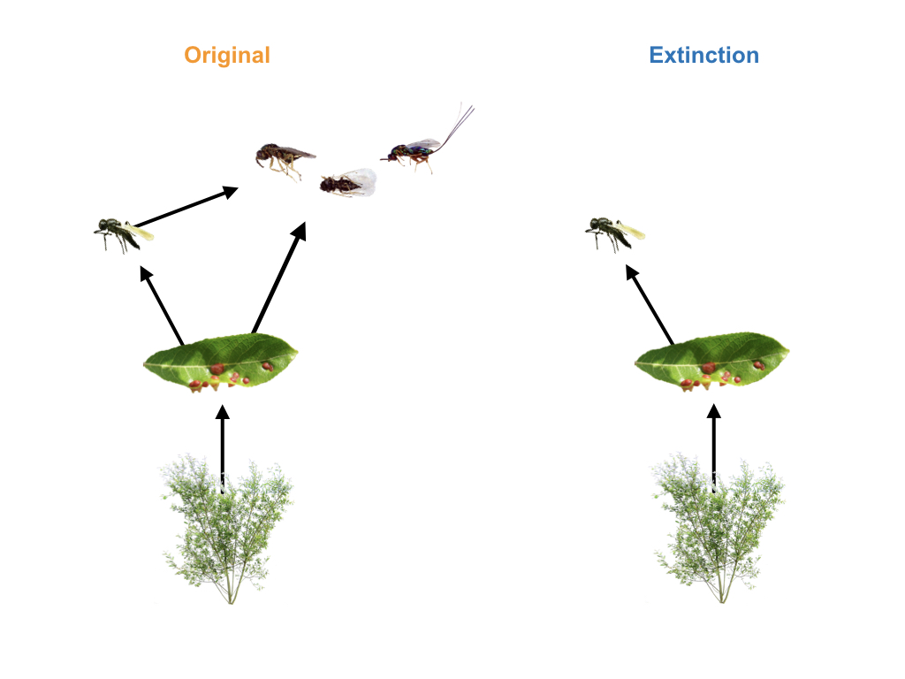

---
# Decided to manually format the title page because I had greater control. Note that you should use put this info in the YAML header for compatability across document formats (e.g. html)
#title: Phenotypic evolution is more constrained in simpler food webs
#author: 
#- Matthew A. Barbour$^{1,2,\ast}$ 
#- Christopher J. Greyson-Gaito$^{2,3}$ 
#- Arezoo Sootodeh$^{2}$ 
#- Brendan Locke$^{4}$ 
#- Jordi Bascompte$^{1}$ 
# for compatability across document formats use 'date' for affiliations, as recommended by https://github.com/rstudio/bookdown/issues/348, with | to create new sections.
#date: | 
#    | 1. Affiliation
output:
  pdf_document:
    keep_tex: true
    toc: false
    number_sections: false
    df_print: paged
    fig_caption: true
    citation_package: natbib
    #template: Rmd_AmNat_MS_template.tex
    includes:  
      in_header: Am-Nat-preamble-latex.tex
bibliography: references
biblio-style: amnat
fontsize: 11pt
fontfamily: mathpazo
documentclass: article
linkcolor: black
urlcolor: black
citecolor: black
---

```{r setup ms, include=FALSE}
## Reproduce analyses ----
#knitr::knit("analyses/reproduce_analyses.Rmd") 
rmarkdown::render("analyses/reproduce_analyses.Rmd", clean = FALSE)

## Get sample size info
no_larvae <- dim(distinct(gall_selection.df, Gall_Number, Gall_ID))[1]
no_galls <- dim(distinct(gall_selection.df, Gall_Number))[1]
no_plants <- dim(distinct(gall_selection.df, Plant_Position))[1]
no_genotypes <- dim(distinct(gall_selection.df, Genotype))[1]
```

<!-- Begin title page formatting -->

\vspace*{0.1cm} 
\begin{center} \LARGE Consumer extinctions constrain phenotypic evolution in the resulting food web \end{center}

\bigskip

<!-- Remove author info for double-blind peer review; Keep for bioRxiv submission --> 
\begin{center} \large Matthew A. Barbour$^{1,2,\ast}$, Christopher J. Greyson-Gaito$^{2,3}$, Arezoo Sootodeh$^{2}$, Brendan Locke$^{4}$, Jordi Bascompte$^{1}$ \normalsize \end{center}

\bigskip

\noindent 1. University of Zurich, Department of Evolutionary Biology and Environmental Studies, Zurich, 8057 ZH, Switzerland;

\noindent 2. University of British Columbia, Department of Zoology, Vancouver, BC V6T 1Z4, Canada; 

\noindent 3. University of Guelph, Department of Integrative Biology, Guelph, ON N1G 2W1, Canada;

\noindent 4. Humboldt State University, Department of Biological Sciences, Arcata, CA 95521, USA.

$^\ast$ Corresponding author; e-mail: matthew.barbour@ieu.uzh.ch

\bigskip
<!---->
*Manuscript elements*: table 1, table 2, figure 1, figure 2, figure 3, figure 4. All figures should be printed in color.

\bigskip

*Keywords*: adaptive landscape, ecological networks, eco-evolutionary dynamics, natural selection, host-parasitoid; complexity.

\bigskip

*Number of words*: `r wordcountaddin::word_count("manuscript.Rmd")`

\bigskip

*Manuscript type*: Article. <!-- Or e-article, note, e-note, natural history miscellany, e-natural history miscellany, comment, reply, invited symposium, or countdown to 150.-->

\bigskip

\footnotesize Prepared using an *Am. Nat.* inspired \LaTeX{} template for Rmarkdown. \normalsize

<!-- End title page formatting -->

\linenumbers{}
\modulolinenumbers[3]

\newpage

# Abstract

Global change is altering the structure of ecological networks; however, we are currently in a poor position to predict how these altered communities will affect the evolutionary potential of remaining populations. Theory on adaptive landscapes provides a framework for predicting how selection constrains phenotypic evolution, but often treats the community context of evolving populations as a ``black box''. Here, we integrate ecological networks and adaptive landscapes to examine how changes in food-web structure shape evolutionary constraints. We conducted a field experiment that simulated the extinction of a guild of larval parasitoids that were able to impose selection on an insect herbivore. We then measured herbivore survival as a function of three key phenotypic traits. We found that the number of traits under selection increased with the extinction of larval parasitoids. In contrast, the adaptive landscape was more neutral in the original food web because different parasitoid guilds impose different selection pressures, minimizing relative fitness differences among phenotypes. Our results suggest that the loss of trophic interactions due to consumer extinctions can impose greater constraints on phenotypic evolution. This indicates that the simplification of ecological communities may constrain the adaptive potential of remaining populations to future environmental change.  


\newpage

<!-- > "What escapes the eye, however, is a much more insidious kind of extinction: the extinction of ecological interactions." @Janzen1974 -->

# Introduction

The adaptive landscape provides a powerful framework for understanding how natural selection has shaped the evolution of biodiversity ---from genes to phenotypes to species [@Wright1931; @Simpson1944; @Arnold2001]. More than a metaphor, the adaptive landscape links quantitative genetic and phenotypic variation to evolution by natural selection [@Lande1979; @Arnold1984applications; @Arnold1984theory]. Ecological interactions often play a key role in shaping adaptive landscapes, as evidenced by the role of antagonistic [@Schluter2000; @Abrams2000] and mutualistic [@Bronstein2006] interactions in driving evolutionary change. Although there is clear evidence that pairwise interactions can shape the adaptive landscape, we still have a poor understanding of how the adaptive landscape is shaped by the community context [@McPeek2017; @terHorst2018]. Resolution on how the community context shapes phenotypic evolution is urgently needed though, given the rapid impacts of climate change on ecological communities [@Scheffers2016].   

Ecological networks, such as food webs describing who-eats-whom in ecological communities, provide an explicit representation of the community context [@Bascompte2014; @McCann2012]. Here, we integrate ecological networks and adaptive landscapes to understand how the community context constrains evolutionary change [@Arnold1992]. Different aspects of evolutionary constraints can be inferred by quantifying the slope and curvature of the adaptive landscape. For example, the slope is determined by directional selection gradients acting on each phenotypic trait and influences the trajectory of evolutionary change [@Lande1979;@Arnold1992]. Selective constraints on evolution increase with the number of traits under directional selection, as this diminishes the number of optimal solutions [@Arnold2003]. The curvature of the adaptive landscape can also constrain evolution through its indirect effect on genetic constraints [@Arnold1992; @Hansen2008]. Genetic constraints are largely governed by a population's **G**-matrix ---the additive genetic variances and covariances between traits [@Hansen2008]. In general, genetic constraints will increase with the number of traits under directional or stabilizing selection, as this will decrease the additive genetic variance in those traits [@Hansen2008]. Genetic constraints may also increase with the number of trait combinations under correlational selection, as this type of selection decreases the evolutionary independence of traits [@Hansen2008]. If we want to predict how the community context constrains evolutionary change, we must understand how ecological networks shape the adaptive landscape.

Global change is altering the structure of ecological networks<!--communities-->, which may influence evolutionary constraints in a number of ways. For example, in a <!--multitrophic community or -->food web, if different consumers impose directional selection on different traits of a shared resource, then a more diverse consumer community may constrain evolution by increasing the number of traits under selection. Alternatively, if consumers impose selection on different values of a trait, then their selective effects would cancel each other out in more diverse communities. To examine these different possibilities, we conducted a field experiment that simulated the extinction of a consumer guild associated with an abundant insect herbivore (*Iteomyia salicisverruca*, Family Cecidomyiidae; fig. \ref{fig:Conceptual}). The larvae of this herbivore induce tooth-shaped galls when they feed on the developing leaves of willow trees [*Salix* sp., @Russo2006]. These galls protect larva from attack by generalist predators (e.g. ants, spiders), but they suffer high mortality from egg and larval parasitoids [@Barbour2016]. We manipulated food-web structure by either excluding or allowing the guild of larval parasitoids to impose selection on gall midge and egg parasitoid traits (fig. \ref{fig:Conceptual}). We then applied modern statistical methods to quantify how changes in food-web structure altered the slope and curvature of the adaptive landscape of the gall midge and egg parasitoid. Taken together, our study gives insight to how local extinctions may constrain the evolution of interacting populations.

```{r Conceptual, echo=FALSE, fig.pos="H", fig.cap="\\label{fig:Conceptual}Experimental manipulation of food-web structure associated with a leaf-galling midge (*Iteomyia salicisverruca*) feeding on the willow *Salix hookeriana*. Black arrows denote the flow of energy in this network of trophic interactions. In the original food web, we allowed the full suite of egg and larval parasitoids to impose selection. To simulate consumer extinction, we used mesh bags to exclude the guild of larval parasitoids, only allowing the egg parasitoid (*Platygaster* sp.) to impose selection. Larval parasitoids include the following species (from left to right): *Mesopolobus* sp. (Family: Pteromalidae); *Tetrastichus* sp. (Family: Eulophidae); and *Torymus* sp. (Family: Torymidae)."}

```

# Methods

## Study Site

We conducted our study within a four-year old common garden experiment of coastal willow (*Salix hookeriana*) located at Humboldt Bay National Wildlife Refuge (HBNWR) (40 40'53"N, 124 12'4"W) near Loleta, California, USA. This common garden consists of 26 different willow genotypes that were collected from a single population of willows growing around Humboldt Bay. Stem cuttings of each genotype (25 replicates per genotype) were planted in a completely randomized design in two hectares of a former cattle pasture at HBNWR. Willows at our study site begin flowering in February and reach their peak growth in early August. During this study, willows had reached 5 - 9m in height. Further details on the genotyping and planting of the common garden are available in @Barbour2015.  

## Manipulating Food-web Structure

We setup our food-web manipulation across 128 plants soon after galls began developing on willows in early June of 2013. These 128 plants came from eight different plant genotypes that spanned the range of trait variation observed in this willow population [@Barbour2015]. For the original food web (eight replicates per genotype), we used flagging tape to mark 14 galled leaves per plant (~30 larvae), allowing the full suite of egg and larval parasitoids to impose selection. Marking galls with flagging tape ensured that all galls had similar phenology when we collected galls later in the season. To simulate consumer extinctions, we enclosed 14 galled leaves with 10x15cm organza bags (ULINE, Pleasant Prairie, WI, USA) to exclude three parasitoid species that attack during larval development. This treatment did not exclude the egg parasitoid *Platygaster* sp., which attacks prior to gall initiation [larva initiate gall development in Cecidomyiid midges: @Gagne1989].
In late August, we collected marked and bagged galls from each plant, placed them into 30 mL vials and kept them in the lab for 4 months at room temperature. We then opened galls under a dissecting scope and determined whether larvae survived to pupation (our measure of fitness) or were parasitized. We did not include other sources of mortality, such as early larval death, as they could influence the expression of the gall phenotype and confound estimates of selection. <!--Since we were interested in selection imposed by parasitoids, we excluded other sources of mortality (`r round((mean(full_df$early.larval.death) + mean(full_df$unknown_mortality)), 2)*100`% mortality from other sources). Another reason why we excluded other sources of mortality, such as early larval death, is that they can influence the expression of the gall phenotype and confound estimates of selection.--> For the food-web treatment that excluded larval parasitoids, we further restricted our data by removing any incidental instances of parasitism by a larval parasitoid. This represented less than 3\% of the observations in this food-web treatment and allowed us to focus our inferences of selection on those imposed by the egg parasitoid. Our final dataset contains survival estimates for `r no_larvae` larvae from `r no_galls` galls and `r no_plants` plants.

## Measuring Phenotypic Traits

We collected data on three different traits that we expected to influence larval survival based on previous work in this system [@Barbour2016] and other work with gall midges [@Weis1983; @Heath2018]. First, we measured gall diameter as the size of each gall chamber to the nearest 0.01 mm at its maximum diameter (perpendicular to the direction of plant tissue growth). Previous work in this system has shown that larger galls are associated with higher survival [@Barbour2016]. Second, we measured clutch size by counting the number of chambers in each gall [@Weis1983; @Heath2018]. All larvae collected from the same multi-chambered gall were scored with the same clutch size. Third, we measured oviposition preference as the density of larvae observed on a plant in an independent survey. We did this by randomly sampling five branches per tree and counting the number of individual gall chambers (number of larvae). We then converted these counts to a measure of larval density per 100 shoots by counting the number of shoots on the last branch we sampled. All larvae collected from the same plant were scored with the same oviposition preference. Measuring larval densities on plants in the field is a common method for measuring oviposition preference [@Gripenberg2010]; however, caution must be taken in inferring 'preference' as larval densities can be influenced by processes other than preference [@Singer1986]. Fortunately, a couple features of our study system suggest that larval densities may be a good proxy for oviposition preference. For example, since our data comes from a randomized placement of plant genotypes in a common garden, there is no consistent bias in which plant genotypes females are exposed to while searching for oviposition sites. Also, egg predation is a minor source of mortality for galling insects in general [@Hawkins1997]; therefore, we do not expect any prior egg predation to bias our estimates of observed larval densities. 

## Quantifying the Adaptive Landscape

Inferring adaptive landscapes assumes that trait distributions are multivariate normal [@Lande1983]. 
To approximate this assumption, we log-transformed clutch size and square-root transformed oviposition preference. We then scaled all phenotypic traits (mean=0 and SD=1) prior to our analyses (detailed below) to ensure that our estimates of selection were comparable across traits and with other studies. 

Our analysis consisted of three parts. First, we used generalized linear mixed models (GLMM) to quantify selection surfaces \textemdash linear and nonlinear relationships between absolute fitness ($W$) and standardized phenotypic traits ($i$) of individuals \textemdash in each food-web treatment. Second, we translated selection surfaces into the scale of relative fitness ($w$) in order to calculate standardized selection gradients. Third, we used our estimates of selection gradients to characterize the slope and curvature of the adaptive landscape, which we used to measure evolutionary constraints. 

**Selection surfaces**: Since larval survival was our measure of absolute fitness, we used a GLMM that assumed a binomial error distribution (and logit-link function). To approximate the selection surface, we modelled larval survival as a function of food-web treatment as well as linear ($\alpha_i$), quadratic ($\alpha_{ii}$), and linear interactions ($\alpha_{ij}$) between each trait. We also allowed these selection surfaces ($\alpha$) to vary between food-web treatments. Note that to obtain valid estimates of linear selection surfaces, we removed nonlinear terms prior to estimating linear relationships [@Lande1983]. Other approaches have been advocated for approximating selection surfaces [@Schluter1988]; however, our approach enables us to calculate selection gradients, and thus is more appropriate for approximating the adaptive landscape [@Arnold2003]. To account for the nonindependence of clutch size (measured at gall level) and oviposition preference (measured at plant level) as well as any independent effects of willow genotype on larval survival, we modelled gall ID nested within plant ID nested within genotype ID as random effects. Although statistical models with random effects are not common in analyses of natural selection, we think that modelling random effects can mitigate biased estimates of selection due to environmental covariances between traits and fitness [@Rausher1992]. Since our end goal was to characterize the relationship between mean trait values and mean fitness (adaptive landscape), we assumed the mean value of our random effects (i.e., setting them to zero) when calculating selection surfaces. We then used parametric bootstrapping (1,000 replicates) to estimate the effect of food-web treatment on larval survival as well as selection surfaces in each food-web treatment. <!--To determine whether trait-fitness relationships differed between food-web treatments, we calculated the difference in bootstrapped replicates between treatments.-->   

**Selection gradients**: Selection gradients cannot be estimated directly from GLMMs of selection surfaces because the response is in terms of absolute fitness and the coefficients are on a nonlinear scale. For example, the coefficients in the above model measure the change in the logarithm of the odds of surviving (i.e., $\text{ln}\{W(z)/[1-W(z)]\}$) associated with 1 SD change in a trait with all other traits held fixed at their mean. Therefore, we used the method developed by @Janzen1998 to translate selection surfaces from the above model into the scale of relative fitness in order to calculate directional ($\beta_i$), quadratic ($\gamma_{ii}$), and correlational ($\gamma_{ij}$) selection gradients. Briefly, this method calculates the average gradient of selection surfaces by multiplying the average of $W(z)[1-W(z)]$ by each regression coefficient (e.g. $\alpha_i$, $\alpha_{ii}$, or $\alpha_{ij}$). We then divided this average gradient by the mean fitness ($\bar W$) to put it on the scale of relative fitness, and thus interpretable as a selection gradient. We estimated selection gradients separately for each food-web treatment. Note that we doubled all quadratic terms prior to calculating selection gradients to put them on the same scale as estimates of directional and correlational selection [@Stinchcombe2008].

**Evolutionary constraints**: We measured evolutionary constraints by inspecting the slope and curvature of the adaptive landscape. The number of selective constraints is determined by the slope of the adaptive landscape, which in our study corresponds to:

$$\textbf{Slope} = \begin{pmatrix} \beta_{\text{Diam}} \\ \beta_{\text{Clutch}} \\ \beta_{\text{Pref}} \end{pmatrix} $$
where each $\beta_i$ corresponds to the directional selection gradient acting on each trait. By comparing the number of directional selection gradients that show clear evidence of contributing to the slope (i.e., 95%  CI does not overlap zero) in our food-web treatments, we can infer the effect of food-web structure on selective constraints. 

The indirect effects of selection on the G-matrix ($\Delta\text{G}=\text{G}(\gamma - \beta \beta^\text{T})\text{G}$) is governed by the curvature of the adaptive landscape ($\text{C}=\gamma - \beta \beta^\text{T}$), which in our study corresponds to:

$$\textbf{Curvature} = \begin{pmatrix} \gamma_{\text{Diam:Diam}}&& \\ \gamma_{\text{Clutch:Diam}}&\gamma_{\text{Clutch:Clutch}}& \\ \gamma_{\text{Pref:Diam}} & \gamma_{\text{Pref:Clutch}} &\gamma_{\text{Pref:Pref}} \end{pmatrix} - \begin{pmatrix} \beta_{\text{Diam}}\beta_{\text{Diam}}&& \\ \beta_{\text{Clutch}}\beta_{\text{Diam}}&\beta_{\text{Clutch}}\beta_{\text{Clutch}}& \\ \beta_{\text{Pref}}\beta_{\text{Diam}} & \beta_{\text{Pref}}\beta_{\text{Clutch}} &\beta_{\text{Pref}}\beta_{\text{Pref}} \end{pmatrix}$$

where each $\gamma_{ii}$ (diagonal) corresponds to the quadratic selection gradient acting on a trait, and each $\gamma_{ij}$ (off-diagonal) corresponds to the correlational selection gradient acting on a particular trait combination. Note that we ommitted the upper triangle of each matrix for clarity since it is simply the reflection of the lower triangle. Subtracting these two matrices results in the curvature matrix of the adaptive landscape:

$$\textbf{Curvature} = \begin{pmatrix} \text{C}_{\text{Diam:Diam}}&& \\ \text{C}_{\text{Clutch:Diam}} & \text{C}_{\text{Clutch:Clutch}} & \\ \text{C}_{\text{Pref:Diam}} & \text{C}_{\text{Pref:Clutch}} & \text{C}_{\text{Pref:Pref}} \end{pmatrix}$$
where each $\text{C}_{ii}$ (diagonal) represents the effect of selection on the additive genetic variance in a trait, and each $\text{C}_{ij}$ (off-diagonal) represents the effect of selection on the additive genetic covariance between a particular trait combination. In other words, the sign of diagonal terms of the curvature matrix dictate whether selection will increase (+), decrease (-), or cause no change (0) in the additive genetic variance of a trait. Similarly, any nonzero covariance terms (off-diagonal) are indicative of selection for trait integration (i.e., less independence). Therefore, we can infer the number of genetic constraints by summing the number of negative signs along the diagonal (decrease in additive genetic variance) and the number of nonzero terms along the off-diagonal (trait integration) of the curvature matrix. For these analyses, we retained estimates for selection gradients that showed clear evidence of being different from zero (i.e., 95% CI did not overlap zero) and set other gradients to zero, prior to calculating the curvature matrix in each food-web treatment. This provides a conservative estimate of the factors contributing to the curvature of the adaptive landscape.

Note that our metrics of selective and genetic constraints do not put much stock in differences in the magnitude of selection between food-web treatments. This is because there is a high likelihood that we are underestimating the magnitude of selection in our treatment that excludes larval parasitoids. We expect this because larval parasitoids not only impose mortality on gall midges, but egg parasitoids as well (fig. \ref{fig:Conceptual}). Therefore, our short-term removal of larval parasitoids has not allowed for an increase in egg parasitoid abundance after being released from intraguild predation. An increase in the abundance of egg parasitoids would decrease mean survival of gall midges, thus increasing the variance in relative fitness of midges, and consequently the magnitude of selection estimates. A recent paper by @Hunter2018 highlights this pervasive effect of survival on the magnitude of selection estimates.<!--Therefore, we expect the magnitude of selection reflects a transient dynamic that would change over time.--> This is why we use more qualitative metrics of evolutionary constraints (i.e., selective constraints = number of traits under directional selection; genetic constraints = number of decreasing variances + nonzero covariances).

## Adjusting for biased measurements of selection

Rather than imposing selection, parasitoids may influence the expression of herbivore traits which could bias measurements of selection. In our system, it was plausible that parasitoids may influence chamber diameter by altering larval feeding behavior or killing larvae before they complete their development. To estimate this potential bias, we subset our data to only include galls where there was variation in larval survival within the same gall (i.e. 1 > mean survival > 0). If we assume that larvae within each gall should have similar chamber diameters because they come from the same clutch and experience the same local environment (an assumption our data supports: gall ID explains 54% of the variance in chamber diameter), then the relationship between chamber diameter and larval survival in this data subset represents the effect of parasitism on trait expression (i.e. bias). We used a GLMM with the same structure as described above except that we modeled only a linear relationship between chamber diameter and larval survival ($\alpha_{\text{Diam}}$). We detected a positive bias in both food-web treatments (original $\alpha_{\text{Diam}}$=
`r round(fixef(biased_foodweb_model)["FoodwebComplex:sc.Diam"],2)` 
[`r round(filter(biased_foodweb_confint, term=="FoodwebComplex:sc.Diam")$conf.low,2)`,
`r round(filter(biased_foodweb_confint, term=="FoodwebComplex:sc.Diam")$conf.high,2)`]; extinction $\alpha_{\text{Diam}}$=
`r round(fixef(biased_foodweb_model)["FoodwebSimple:sc.Diam"],2)` 
[`r round(filter(biased_foodweb_confint, term=="FoodwebSimple:sc.Diam")$conf.low,2)`,
`r round(filter(biased_foodweb_confint, term=="FoodwebSimple:sc.Diam")$conf.high,2)`]), indicating that unadjusted relationships would overestimate the strength of selection on chamber diameter. To account for this bias, we substracted our mean estimates of bias from our estimates with the full dataset prior to calculating chamber diameter's selection surface and directional selection gradient.

## Measuring selection on egg parasitoids 

Once parasitized, the gall phenotype becomes the phenotype of the egg parasitoid. This phenotype may influence the egg parasitoid's survival in the face of larval parasitoids, and thus experiences selection. Our food-web manipulation allows us to measure selection imposed by larval parasitoids on the phenotype of egg parasitoids. Using the same models as described above, we substituted egg parasitism as our response variable to quantify selection surfaces and selection gradients acting on the egg parasitoid. Note that we cannot test the effect of food-web structure on the egg parasitoid's adaptive landscape ---we can only estimate selection imposed by larval parasitoids. This comparison is still useful though in determining the extent to which the community context may have indirect evolutionary effects by altering selection on multiple interacting populations.

All analyses and visualizations were conducted in R [@R2018]. Unless otherwise noted, we report mean estimates of selection surfaces and selection gradients with 95% confidence intervals in brackets. Note that for visualizing the adaptive landscape we restrict trait axes to $\pm 1$ SD of the mean trait value. This emphasizes the fact that we can only reliably estimate the shape of the adaptive landscape near the mean phenotype of the population [@Arnold2001]. We also plot mean larval survival on a natural log scale to accurately reflect the mathematical definition of the adaptive landscape [@Arnold2003]. All data and code to reproduce the reported results are publicly available on GitHub <!--(https://github.com/mabarbour/complexity_selection)-->and have been archived on Zenodo (links are available from the journal office)<!--(https://zenodo.org/badge/latestdoi/108833263)-->.

# Results 

## Consumer extinctions increase selective constraints 

\indent We found that the extinction of larval parasitoids increased the number of gall midge traits under directional selection (3 of 3) relative to the original food web (1 of 3)(table \ref{Table:Gradients}). For example, we observed directional selection for smaller clutch sizes when we excluded larval parasitoids, but there was no evidence of selection acting on this trait in the original food web (table \ref{Table:Gradients}; fig. \ref{fig:UV_Landscape}C). This absence of selection appeared to be a result of conflicting selection pressures imposed by each guild of parasitoids. Specifically, when we subset our data to focus on differences between parasitoid guilds, we found that larval parasitoids actually impose directional selection for larger clutch sizes ($\beta_{\text{Clutch}}$=
`r round(filter(tidy_egglarval_grads, type=="Complex", term=="sc.log.Clutch")$mean,2)` 
[`r round(filter(tidy_egglarval_grads, type=="Complex", term=="sc.log.Clutch")$conf.low,2)`,
`r round(filter(tidy_egglarval_grads, type=="Complex", term=="sc.log.Clutch")$conf.high,2)`]). We also observed clear evidence of directional selection for midges to avoid ovipositing on plants with high densities of conspecifics when we excluded larval parasitoids (table \ref{Table:Gradients}; fig. \ref{fig:UV_Landscape}B); however, there was no clear relationship in the original food web (table \ref{Table:Gradients}). This was likely a result of larval parasitoids imposing greater mortality on egg parasitoids at high gall midge densities (see Selection on egg parasitoids section), and thus a less than additive effect on gall midges. Chamber diameter experienced positive directional selection in both food-web treatments (fig. \ref{fig:UV_Landscape}A). Although the magnitude of selection on chamber diameter was relatively higher in the original food web (table \ref{Table:Gradients}), this was not due to any difference in the relationship between chamber diameter and survival (selection surfaces: original $\alpha_{\text{Diam}}$=
`r round(filter(tidy_foodweb_alphas, type=="Complex", term=="sc.Diam")$mean,2)` 
[`r round(filter(tidy_foodweb_alphas, type=="Complex", term=="sc.Diam")$conf.low,2)`,
`r round(filter(tidy_foodweb_alphas, type=="Complex", term=="sc.Diam")$conf.high,2)`]; extinction $\alpha_{\text{Diam}}$=
`r round(filter(tidy_foodweb_alphas, type=="Simple", term=="sc.Diam")$mean,2)` 
[`r round(filter(tidy_foodweb_alphas, type=="Simple", term=="sc.Diam")$conf.low,2)`,
`r round(filter(tidy_foodweb_alphas, type=="Simple", term=="sc.Diam")$conf.high,2)`]), but was simply a consequence of the (expected) lower survival in the original food web (original $\bar W$=
`r round(filter(tidy_foodweb_alphas, type=="Complex", term=="(Intercept)")$mean,2)` 
[`r round(filter(tidy_foodweb_alphas, type=="Complex", term=="(Intercept)")$conf.low,2)`,
`r round(filter(tidy_foodweb_alphas, type=="Complex", term=="(Intercept)")$conf.high,2)`]; extinction $\bar W$=
`r round(filter(tidy_foodweb_alphas, type=="Simple", term=="(Intercept)")$mean,2)` 
[`r round(filter(tidy_foodweb_alphas, type=="Simple", term=="(Intercept)")$conf.low,2)`,
`r round(filter(tidy_foodweb_alphas, type=="Simple", term=="(Intercept)")$conf.high,2)`]).<!-- but selection was `r round(((filter(tidy_foodweb_grads, type=="Complex", term=="sc.Diam")$mean - filter(tidy_foodweb_grads, type=="Simple", term=="sc.Diam")$mean) / filter(tidy_foodweb_grads, type=="Simple", term=="sc.Diam")$mean) * 100, 0)`% higher in complex food webs (table \ref{Table:Gradients}; fig. \ref{fig:UV_Landscape}). This was not due to any difference between egg and larval parasitoids ($\beta_{\text{Diam}}$ contrast = 
`r round(-1*filter(tidy_egglarval_grads, type=="Diff", term=="sc.Diam")$mean,2)` [
`r round(-1*filter(tidy_egglarval_grads, type=="Diff", term=="sc.Diam")$conf.low,2)`,
`r round(-1*filter(tidy_egglarval_grads, type=="Diff", term=="sc.Diam")$conf.high,2)`]), but was due to the lower average survival in complex food webs ($\bar W$ contrast `r round(-1*filter(tidy_foodweb_alphas, type=="Diff", term=="(Intercept)")$mean, 2)`
[`r round(-1*filter(tidy_foodweb_alphas, type=="Diff", term=="(Intercept)")$conf.low, 2)`,
`r round(-1*filter(tidy_foodweb_alphas, type=="Diff", term=="(Intercept)")$conf.high, 2)`]).--> 

\bigskip

\begin{table}[h]
\caption{Standardized selection gradients acting on gall midges in the original food web and with the extinction of larval parasitoids.}
\label{Table:Gradients}
\centering
\begin{tabular}{lcc} %c
\\ 
\hline
\textbf{Selection gradient} & \textbf{Original} & \textbf{Extinction}   \\ %& \textbf{Contrast}
\hline
$\beta_{\text{Diam}}$ & 
\textbf{
`r round(filter(tidy_foodweb_grads, type=="Complex", term=="sc.Diam")$mean,2)` [
`r round(filter(tidy_foodweb_grads, type=="Complex", term=="sc.Diam")$conf.low,2)`,
`r round(filter(tidy_foodweb_grads, type=="Complex", term=="sc.Diam")$conf.high,2)`] }& 
\textbf{
`r round(filter(tidy_foodweb_grads, type=="Simple", term=="sc.Diam")$mean,2)` [
`r round(filter(tidy_foodweb_grads, type=="Simple", term=="sc.Diam")$conf.low,2)`,
`r round(filter(tidy_foodweb_grads, type=="Simple", term=="sc.Diam")$conf.high,2)`] }\\%& 
%\textbf{
%`r round(-1*filter(tidy_foodweb_grads, type=="Diff", term=="sc.Diam")$mean,2)` [
%`r round(-1*filter(tidy_foodweb_grads, type=="Diff", term=="sc.Diam")$conf.low,2)`,
%`r round(-1*filter(tidy_foodweb_grads, type=="Diff", term=="sc.Diam")$conf.high,2)`] }\\

$\beta_{\text{Clutch}}$ & 
`r round(filter(tidy_foodweb_grads, type=="Complex", term=="sc.log.Clutch")$mean,2)` [
`r round(filter(tidy_foodweb_grads, type=="Complex", term=="sc.log.Clutch")$conf.low,2)`,
`r round(filter(tidy_foodweb_grads, type=="Complex", term=="sc.log.Clutch")$conf.high,2)`] & 
\textbf{
`r round(filter(tidy_foodweb_grads, type=="Simple", term=="sc.log.Clutch")$mean,2)` [
`r round(filter(tidy_foodweb_grads, type=="Simple", term=="sc.log.Clutch")$conf.low,2)`,
`r round(filter(tidy_foodweb_grads, type=="Simple", term=="sc.log.Clutch")$conf.high,2)`] }\\%& 
%\textbf{
%`r round(-1*filter(tidy_foodweb_grads, type=="Diff", term=="sc.log.Clutch")$mean,2)` [
%`r round(-1*filter(tidy_foodweb_grads, type=="Diff", term=="sc.log.Clutch")$conf.low,2)`,
%`r round(-1*filter(tidy_foodweb_grads, type=="Diff", term=="sc.log.Clutch")$conf.high,2)`] }\\

$\beta_{\text{Pref}}$ &
`r round(filter(tidy_foodweb_grads, type=="Complex", term=="sc.sqrt.Pref")$mean,2)` [
`r round(filter(tidy_foodweb_grads, type=="Complex", term=="sc.sqrt.Pref")$conf.low,2)`,
`r round(filter(tidy_foodweb_grads, type=="Complex", term=="sc.sqrt.Pref")$conf.high,2)`] & 
\textbf{
`r round(filter(tidy_foodweb_grads, type=="Simple", term=="sc.sqrt.Pref")$mean,2)` [
`r round(filter(tidy_foodweb_grads, type=="Simple", term=="sc.sqrt.Pref")$conf.low,2)`,
`r round(filter(tidy_foodweb_grads, type=="Simple", term=="sc.sqrt.Pref")$conf.high,2)`] }\\%& 

%`r round(-1*filter(tidy_foodweb_grads, type=="Diff", term=="sc.sqrt.Pref")$mean,2)` [
%`r round(-1*filter(tidy_foodweb_grads, type=="Diff", term=="sc.sqrt.Pref")$conf.low,2)`,
%`r round(-1*filter(tidy_foodweb_grads, type=="Diff", term=="sc.sqrt.Pref")$conf.high,2)`] \\

$\gamma_{\text{Diam:Diam}}$ &
`r round(filter(tidy_foodweb_grads, type=="Complex", term=="I(sc.Diam^2)")$mean,2)` [
`r round(filter(tidy_foodweb_grads, type=="Complex", term=="I(sc.Diam^2)")$conf.low,2)`,
`r round(filter(tidy_foodweb_grads, type=="Complex", term=="I(sc.Diam^2)")$conf.high,2)`] & 

`r round(filter(tidy_foodweb_grads, type=="Simple", term=="I(sc.Diam^2)")$mean,2)` [
`r round(filter(tidy_foodweb_grads, type=="Simple", term=="I(sc.Diam^2)")$conf.low,2)`,
`r round(filter(tidy_foodweb_grads, type=="Simple", term=="I(sc.Diam^2)")$conf.high,2)`] \\%& 

%`r round(-1*filter(tidy_foodweb_grads, type=="Diff", term=="I(sc.Diam^2)")$mean,2)` [
%`r round(-1*filter(tidy_foodweb_grads, type=="Diff", term=="I(sc.Diam^2)")$conf.low,2)`,
%`r round(-1*filter(tidy_foodweb_grads, type=="Diff", term=="I(sc.Diam^2)")$conf.high,2)`] \\

$\gamma_{\text{Clutch:Clutch}}$ & 
`r round(filter(tidy_foodweb_grads, type=="Complex", term=="I(sc.log.Clutch^2)")$mean,2)` [
`r round(filter(tidy_foodweb_grads, type=="Complex", term=="I(sc.log.Clutch^2)")$conf.low,2)`,
`r round(filter(tidy_foodweb_grads, type=="Complex", term=="I(sc.log.Clutch^2)")$conf.high,2)`] & 

`r round(filter(tidy_foodweb_grads, type=="Simple", term=="I(sc.log.Clutch^2)")$mean,2)` [
`r round(filter(tidy_foodweb_grads, type=="Simple", term=="I(sc.log.Clutch^2)")$conf.low,2)`,
`r round(filter(tidy_foodweb_grads, type=="Simple", term=="I(sc.log.Clutch^2)")$conf.high,2)`] \\%& 

%`r round(-1*filter(tidy_foodweb_grads, type=="Diff", term=="I(sc.log.Clutch^2)")$mean,2)` [
%`r round(-1*filter(tidy_foodweb_grads, type=="Diff", term=="I(sc.log.Clutch^2)")$conf.low,2)`,
%`r round(-1*filter(tidy_foodweb_grads, type=="Diff", term=="I(sc.log.Clutch^2)")$conf.high,2)`] \\

$\gamma_{\text{Pref:Pref}}$ & 
\textbf{
`r round(filter(tidy_foodweb_grads, type=="Complex", term=="I(sc.sqrt.Pref^2)")$mean,2)` [
`r round(filter(tidy_foodweb_grads, type=="Complex", term=="I(sc.sqrt.Pref^2)")$conf.low,2)`,
`r round(filter(tidy_foodweb_grads, type=="Complex", term=="I(sc.sqrt.Pref^2)")$conf.high,2)`] }& 

`r round(filter(tidy_foodweb_grads, type=="Simple", term=="I(sc.sqrt.Pref^2)")$mean,2)` [
`r round(filter(tidy_foodweb_grads, type=="Simple", term=="I(sc.sqrt.Pref^2)")$conf.low,2)`,
`r round(filter(tidy_foodweb_grads, type=="Simple", term=="I(sc.sqrt.Pref^2)")$conf.high,2)`] \\%& 
%\textbf{
%`r round(-1*filter(tidy_foodweb_grads, type=="Diff", term=="I(sc.sqrt.Pref^2)")$mean,2)` [
%`r round(-1*filter(tidy_foodweb_grads, type=="Diff", term=="I(sc.sqrt.Pref^2)")$conf.low,2)`,
%`r round(-1*filter(tidy_foodweb_grads, type=="Diff", term=="I(sc.sqrt.Pref^2)")$conf.high,2)`] }\\

$\gamma_{\text{Diam:Clutch}}$ & 
`r round(filter(tidy_foodweb_grads, type=="Complex", term=="sc.Diam:sc.log.Clutch")$mean,2)` [
`r round(filter(tidy_foodweb_grads, type=="Complex", term=="sc.Diam:sc.log.Clutch")$conf.low,2)`,
`r round(filter(tidy_foodweb_grads, type=="Complex", term=="sc.Diam:sc.log.Clutch")$conf.high,2)`] & 

`r round(filter(tidy_foodweb_grads, type=="Simple", term=="sc.Diam:sc.log.Clutch")$mean,2)` [
`r round(filter(tidy_foodweb_grads, type=="Simple", term=="sc.Diam:sc.log.Clutch")$conf.low,2)`,
`r round(filter(tidy_foodweb_grads, type=="Simple", term=="sc.Diam:sc.log.Clutch")$conf.high,2)`] \\%& 

%`r round(-1*filter(tidy_foodweb_grads, type=="Diff", term=="sc.Diam:sc.log.Clutch")$mean,2)` [
%`r round(-1*filter(tidy_foodweb_grads, type=="Diff", term=="sc.Diam:sc.log.Clutch")$conf.low,2)`,
%`r round(-1*filter(tidy_foodweb_grads, type=="Diff", term=="sc.Diam:sc.log.Clutch")$conf.high,2)`] \\

$\gamma_{\text{Diam:Pref}}$ & 
`r round(filter(tidy_foodweb_grads, type=="Complex", term=="sc.Diam:sc.sqrt.Pref")$mean,2)` [
`r round(filter(tidy_foodweb_grads, type=="Complex", term=="sc.Diam:sc.sqrt.Pref")$conf.low,2)`,
`r round(filter(tidy_foodweb_grads, type=="Complex", term=="sc.Diam:sc.sqrt.Pref")$conf.high,2)`] & 

`r round(filter(tidy_foodweb_grads, type=="Simple", term=="sc.Diam:sc.sqrt.Pref")$mean,2)` [
`r round(filter(tidy_foodweb_grads, type=="Simple", term=="sc.Diam:sc.sqrt.Pref")$conf.low,2)`,
`r round(filter(tidy_foodweb_grads, type=="Simple", term=="sc.Diam:sc.sqrt.Pref")$conf.high,2)`] \\%& 

%`r round(-1*filter(tidy_foodweb_grads, type=="Diff", term=="sc.Diam:sc.sqrt.Pref")$mean,2)` [
%`r round(-1*filter(tidy_foodweb_grads, type=="Diff", term=="sc.Diam:sc.sqrt.Pref")$conf.low,2)`,
%`r round(-1*filter(tidy_foodweb_grads, type=="Diff", term=="sc.Diam:sc.sqrt.Pref")$conf.high,2)`] \\

$\gamma_{\text{Clutch:Pref}}$ & 
`r round(filter(tidy_foodweb_grads, type=="Complex", term=="sc.log.Clutch:sc.sqrt.Pref")$mean,2)` [
`r round(filter(tidy_foodweb_grads, type=="Complex", term=="sc.log.Clutch:sc.sqrt.Pref")$conf.low,2)`,
`r round(filter(tidy_foodweb_grads, type=="Complex", term=="sc.log.Clutch:sc.sqrt.Pref")$conf.high,2)`] & 

`r round(filter(tidy_foodweb_grads, type=="Simple", term=="sc.log.Clutch:sc.sqrt.Pref")$mean,2)` [
`r round(filter(tidy_foodweb_grads, type=="Simple", term=="sc.log.Clutch:sc.sqrt.Pref")$conf.low,2)`,
`r round(filter(tidy_foodweb_grads, type=="Simple", term=="sc.log.Clutch:sc.sqrt.Pref")$conf.high,2)`] \\%& 

%`r round(-1*filter(tidy_foodweb_grads, type=="Diff", term=="sc.log.Clutch:sc.sqrt.Pref")$mean,2)` [
%`r round(-1*filter(tidy_foodweb_grads, type=="Diff", term=="sc.log.Clutch:sc.sqrt.Pref")$conf.low,2)`,
%`r round(-1*filter(tidy_foodweb_grads, type=="Diff", term=="sc.log.Clutch:sc.sqrt.Pref")$conf.high,2)`] \\ 
\hline
\end{tabular}
\bigskip{}
\\
{\footnotesize Note: Values in brackets represent 95\% confidence intervals. Bold values indicate that the 95\% CI does not overlap zero. $\beta_{\text{Diam}}$ has been adjusted for bias.}
\end{table}

## Consumer extinctions increase genetic constraints

\indent The curvature of the adaptive landscape indirectly affects genetic constraints and is influenced by directional, quadratic, and correlational selection gradients. There was no clear evidence of correlational selection for any combination of traits in either food-web treatment (table \ref{Table:Gradients}). Similarly, there was no clear evidence of quadratic selection on chamber diameter or clutch size in either food-web treatment (table \ref{Table:Gradients}; fig. \ref{fig:UV_Landscape}A,C). In contrast, our food-web treatment did alter quadratic selection acting on oviposition preference (table \ref{Table:Gradients}). The negative relationship between oviposition preference and larval survival dampened at high densities in the original food web, but not with the exclusion of larval parasitoids (fig. \ref{fig:UV_Landscape}B). This dampened relationship was partly due to a trend for nonlinear selection imposed by larval parasitoids ($\gamma_{\text{Pref:Pref}}$=
`r round(filter(tidy_egglarval_grads, type=="Complex", term=="I(sc.sqrt.Pref^2)")$mean,2)` 
[`r round(filter(tidy_egglarval_grads, type=="Complex", term=="I(sc.sqrt.Pref^2)")$conf.low,2)`,
`r round(filter(tidy_egglarval_grads, type=="Complex", term=="I(sc.sqrt.Pref^2)")$conf.high,2)`]), but was also magnified by the lower average survival in complex food webs.

```{r UV_Landscape, echo=FALSE, fig.pos="H", fig.cap="\\label{fig:UV_Landscape}Adaptive landscape of gall midge phenotypes in the original food web and with the extinction of larval parasitoids. Each panel corresponds to a different phenotypic trait: chamber diameter (A); oviposition preference (B); and clutch size (C). Bold lines represent selection experienced in the original food web (orange) and with consumer extinctions (blue). Thin lines represent bootstrapped replicates to show the uncertainty in selection. For clarity, we only display 100 bootstraps even though inferences are based on 1,000 replicates. Note that mean larval survival is plotted on a natural log scale to reflect the mathematical defintion of the adaptive landscape."}
knitr::include_graphics("analyses/UV_landscapes.pdf")
```


Using our estimates of directional ($\beta_i$), quadratic ($\gamma_{ii}$), and correlation selection ($\gamma_{ij}$), we calculated the curvature ($\text{C}=\gamma - \beta \beta^\text{T}$) of the adaptive landscape in each food-web treatment. In our study, this corresponds to:

$$\textbf{Curvature} = \begin{pmatrix} \gamma_{\text{Diam:Diam}}&& \\ \gamma_{\text{Clutch:Diam}}&\gamma_{\text{Clutch:Clutch}}& \\ \gamma_{\text{Pref:Diam}} & \gamma_{\text{Pref:Clutch}} &\gamma_{\text{Pref:Pref}} \end{pmatrix} - \begin{pmatrix} \beta_{\text{Diam}}\beta_{\text{Diam}}&& \\ \beta_{\text{Clutch}}\beta_{\text{Diam}}&\beta_{\text{Clutch}}\beta_{\text{Clutch}}& \\ \beta_{\text{Pref}}\beta_{\text{Diam}} & \beta_{\text{Pref}}\beta_{\text{Clutch}} &\beta_{\text{Pref}}\beta_{\text{Pref}} \end{pmatrix}$$

$$\textbf{Curvature} = \begin{pmatrix} \text{C}_{\text{Diam:Diam}}&& \\ \text{C}_{\text{Clutch:Diam}} & \text{C}_{\text{Clutch:Clutch}} & \\ \text{C}_{\text{Pref:Diam}} & \text{C}_{\text{Pref:Clutch}} & \text{C}_{\text{Pref:Pref}} \end{pmatrix}$$
\bigskip

where each $\text{C}_{ii}$ (diagonal) represents the effect of selection on the additive genetic variance in a trait, and each $\text{C}_{ij}$ (off-diagonal) represents the effect of selection on the additive genetic covariance between a particular trait combination. In order to obtain a conservative estimate of the factors contributing to the curvature, we only used estimates of selection that clearly differed from zero (bold values in table \ref{Table:Gradients}), otherwise we set estimates of selection to zero (non-bold values in table \ref{Table:Gradients}) prior to our calculation. We found that the curvatures of the adaptive landscape exhibited the following structures:

$$\textbf{Curvature}_{\text{Original}} = \begin{pmatrix} 
`r round(complex_gammas["Diam","Diam"],2)` &  &  \\  
`r round(complex_gammas["Clutch","Diam"],2)` & `r round(complex_gammas["Clutch","Clutch"],2)` &  \\  
`r round(complex_gammas["Pref","Diam"],2)` & `r round(complex_gammas["Pref","Clutch"],2)` & `r round(complex_gammas["Pref","Pref"],2)` \end{pmatrix} - \begin{pmatrix} 
`r round(complex_betas["Diam",],2)`\cdot`r round(complex_betas["Diam",],2)` &  &  \\  
`r round(complex_betas["Clutch",],2)`\cdot`r round(complex_betas["Diam",],2)` & `r round(complex_betas["Clutch",],2)`\cdot`r round(complex_betas["Clutch",],2)` &  \\  
`r round(complex_betas["Pref",],2)`\cdot`r round(complex_betas["Diam",],2)` & `r round(complex_betas["Pref",],2)`\cdot`r round(complex_betas["Clutch",],2)` & `r round(complex_betas["Pref",],2)`\cdot`r round(complex_betas["Pref",],2)` \end{pmatrix}$$

$$\textbf{Curvature}_{\text{Original}} = \begin{pmatrix} 
`r round(complex_curvature["Diam","Diam"],2)` &  &  \\  
`r round(complex_curvature["Clutch","Diam"],2)` & `r round(complex_curvature["Clutch","Clutch"],2)` &  \\  
`r round(complex_curvature["Pref","Diam"],2)` & `r round(complex_curvature["Pref","Clutch"],2)` & `r round(complex_curvature["Pref","Pref"],2)` \end{pmatrix}$$

$$\textbf{Curvature}_{\text{Extinction}} = \begin{pmatrix} 
`r round(simple_gammas["Diam","Diam"],2)` &  &  \\  
`r round(simple_gammas["Clutch","Diam"],2)` & `r round(simple_gammas["Clutch","Clutch"],2)` &  \\  
`r round(simple_gammas["Pref","Diam"],2)` & `r round(simple_gammas["Pref","Clutch"],2)` & `r round(simple_gammas["Pref","Pref"],2)` \end{pmatrix} - \begin{pmatrix} 
`r round(simple_betas["Diam",],2)`\cdot`r round(simple_betas["Diam",],2)` &  &  \\  
`r round(simple_betas["Clutch",],2)`\cdot`r round(simple_betas["Diam",],2)` & `r round(simple_betas["Clutch",],2)`\cdot`r round(simple_betas["Clutch",],2)` &  \\  
`r round(simple_betas["Pref",],2)`\cdot`r round(simple_betas["Diam",],2)` & `r round(simple_betas["Pref",],2)`\cdot`r round(simple_betas["Clutch",],2)` & `r round(simple_betas["Pref",],2)`\cdot`r round(simple_betas["Pref",],2)` \end{pmatrix}$$

$$\textbf{Curvature}_{\text{Extinction}} = \begin{pmatrix} 
`r round(simple_curvature["Diam","Diam"],2)` &  &  \\  
`r round(simple_curvature["Clutch","Diam"],2)` & `r round(simple_curvature["Clutch","Clutch"],2)` &  \\  
`r round(simple_curvature["Pref","Diam"],2)` & `r round(simple_curvature["Pref","Clutch"],2)` & `r round(simple_curvature["Pref","Pref"],2)` \end{pmatrix}$$

Remember that we can infer the indirect effects of selection on genetic constraints by summing the number of negative signs along the diagonal (decrease in additive genetic variance) and the number of nonzero terms along the off-diagonal (trait integration) of the curvature matrix. The structure of these matrices indicates that the extinction of larval parasitoids increased the number of genetic constraints on gall midges (6 of 6) relative to the original food web (1 of 6). For example, directional selection resulting from the exclusion of larval parasitoids acted to decrease genetic variance for all three phenotypic traits (negative diagonal terms), whereas only one trait (chamber diameter) experienced a decrease in additive genetic variance in the original food web. For genetic covariances, the combined effects of directional selection resulting from consumer extinctions favored integration among all three phenotypic traits (nonzero off-diagonal terms), and thus constraints along all three axes of covariance (fig. \ref{fig:MV_Landscape}). In contrast, the absence of directional selection in clutch size and oviposition preference did not promote trait integration along any axis in the original food web (fig. \ref{fig:MV_Landscape}).


```{r MV_Landscape, echo=FALSE, fig.pos="H", fig.cap="\\label{fig:MV_Landscape}Two dimensional view of adaptive landscapes of gall midge phenotypes in the original food web and with the extinction of larval parasitoids. Each panel corresponds to a different combination of phenotypic traits: clutch size and chamber diameter (A); clutch size and oviposition preference (B); oviposition preference and chamber diameter (C). Arrows represent mean estimates of directional selection gradients, while contours represent predicted larval survival of the mean phenotype in each food-web treatment. Notice that arrows point more toward a corner of the adaptive landscape for each combination of traits with the extinction of larval parasitoids compared to the original food web. This indicates that consumer extinctions more strongly favored trait integration (covariance). Note that mean larval survival is plotted on a natural log scale to reflect the mathematical definition of the adaptive landscape."}
knitr::include_graphics("analyses/MV_landscapes.pdf")
```

## Selection on egg parasitoids

The exctinction of larval parasitoids only altered the relationship between gall midge preference and the probability of observing egg parasitoids (table \ref{Table:ExtendedGradients}). Specifically, the impact of larval parasitoids increased nonlinearly with higher gall midge densities (fig. \ref{fig:EggPtoid_Selection}).  

\bigskip

\begin{table}[h]
\caption{Standardized selection gradients acting on egg parasitoids (\textit{Platygaster} sp.)}
\label{Table:ExtendedGradients}
\centering
\begin{tabular}{lc}
\\ 
\hline
\textbf{Selection gradient} & \textbf{Contrast = Original - Extinction}  \\ 
\hline
$\beta_{\text{Diam}}$ & 

`r round(-1*filter(tidy_eggegg_grads, type=="Diff", term=="sc.Diam")$mean,2)` [
`r round(-1*filter(tidy_eggegg_grads, type=="Diff", term=="sc.Diam")$conf.low,2)`,
`r round(-1*filter(tidy_eggegg_grads, type=="Diff", term=="sc.Diam")$conf.high,2)`] \\

$\beta_{\text{Clutch}}$ & 

`r round(-1*filter(tidy_eggegg_grads, type=="Diff", term=="sc.log.Clutch")$mean,2)` [
`r round(-1*filter(tidy_eggegg_grads, type=="Diff", term=="sc.log.Clutch")$conf.low,2)`,
`r round(-1*filter(tidy_eggegg_grads, type=="Diff", term=="sc.log.Clutch")$conf.high,2)`] \\

$\beta_{\text{Pref}}$ &

`r round(-1*filter(tidy_eggegg_grads, type=="Diff", term=="sc.sqrt.Pref")$mean,2)` [
`r round(-1*filter(tidy_eggegg_grads, type=="Diff", term=="sc.sqrt.Pref")$conf.low,2)`,
`r round(-1*filter(tidy_eggegg_grads, type=="Diff", term=="sc.sqrt.Pref")$conf.high,2)`] \\

$\gamma_{\text{Diam:Diam}}$ &

`r round(-1*filter(tidy_eggegg_grads, type=="Diff", term=="I(sc.Diam^2)")$mean,2)` [
`r round(-1*filter(tidy_eggegg_grads, type=="Diff", term=="I(sc.Diam^2)")$conf.low,2)`,
`r round(-1*filter(tidy_eggegg_grads, type=="Diff", term=="I(sc.Diam^2)")$conf.high,2)`] \\

$\gamma_{\text{Clutch:Clutch}}$ & 

`r round(-1*filter(tidy_eggegg_grads, type=="Diff", term=="I(sc.log.Clutch^2)")$mean,2)` [
`r round(-1*filter(tidy_eggegg_grads, type=="Diff", term=="I(sc.log.Clutch^2)")$conf.low,2)`,
`r round(-1*filter(tidy_eggegg_grads, type=="Diff", term=="I(sc.log.Clutch^2)")$conf.high,2)`] \\

$\gamma_{\text{Pref:Pref}}$ & 

\textbf{
`r round(-1*filter(tidy_eggegg_grads, type=="Diff", term=="I(sc.sqrt.Pref^2)")$mean,2)` [
`r round(-1*filter(tidy_eggegg_grads, type=="Diff", term=="I(sc.sqrt.Pref^2)")$conf.low,2)`,
`r round(-1*filter(tidy_eggegg_grads, type=="Diff", term=="I(sc.sqrt.Pref^2)")$conf.high,2)`] }\\

$\gamma_{\text{Diam:Clutch}}$ & 

`r round(-1*filter(tidy_eggegg_grads, type=="Diff", term=="sc.Diam:sc.log.Clutch")$mean,2)` [
`r round(-1*filter(tidy_eggegg_grads, type=="Diff", term=="sc.Diam:sc.log.Clutch")$conf.low,2)`,
`r round(-1*filter(tidy_eggegg_grads, type=="Diff", term=="sc.Diam:sc.log.Clutch")$conf.high,2)`] \\

$\gamma_{\text{Diam:Pref}}$ & 

`r round(-1*filter(tidy_eggegg_grads, type=="Diff", term=="sc.Diam:sc.sqrt.Pref")$mean,2)` [
`r round(-1*filter(tidy_eggegg_grads, type=="Diff", term=="sc.Diam:sc.sqrt.Pref")$conf.low,2)`,
`r round(-1*filter(tidy_eggegg_grads, type=="Diff", term=="sc.Diam:sc.sqrt.Pref")$conf.high,2)`] \\

$\gamma_{\text{Clutch:Pref}}$ & 

`r round(-1*filter(tidy_eggegg_grads, type=="Diff", term=="sc.log.Clutch:sc.sqrt.Pref")$mean,2)` [
`r round(-1*filter(tidy_eggegg_grads, type=="Diff", term=="sc.log.Clutch:sc.sqrt.Pref")$conf.low,2)`,
`r round(-1*filter(tidy_eggegg_grads, type=="Diff", term=="sc.log.Clutch:sc.sqrt.Pref")$conf.high,2)`] \\ 
\hline
\end{tabular}
\bigskip{}
\\
{\footnotesize Note: Values in brackets represent 95\% confidence intervals. Bold values indicate that the 95\% CI does not overlap zero. $\beta_{\text{Diam}}$ has been adjusted for bias.}
\end{table}


```{r EggPtoid_Selection, echo=FALSE, fig.pos="H", fig.cap="\\label{fig:EggPtoid_Selection}Selection imposed by larval parasitoids on egg parasitoids (*Platygaster* sp.). The bold line represents the average difference in the probability of observing the egg parasitoid (original - extinction of larval parastioids) as a function of gall midge oviposition preference. Thin lines represent bootstrapped replicates to show the uncertainty in selection. For clarity, we only display 100 bootstraps even though inferences are based on 1,000 replicates. The decrease in the probability of observing egg parasitoids at high gall-midge densities indicate that larval parasitoids impose nonlinear selection on egg parasitoids."}
knitr::include_graphics("analyses/selection_on_Platygaster.pdf")
```


# Discussion

<!--Summary-->
We found that the extinction of larval parasitoids constrained phenotypic evolution in gall midges in two key ways. First, more traits contributed to the slope of the adaptive landscape in the absence of larval parasitoids, suggesting greater constraints on the trajectory of phenotypic evolution. Second, excluding larval parasitoids indirectly increased the number of genetic constraints, which could act to constrain the gall midge's adaptive potential in the face of novel selection pressures. Our experiment also revealed evidence of indirect selection pressures, suggesting that the loss of consumers may have complex effects on the trajectories of phenotypic evolution. Taken together, our study provides experimental evidence from the field that consumer extinctions may constrain the adaptive potential of remaining populations.

<!--Selective constraints-->
All three phenotypic traits we examined experienced directional selection when we excluded larval parasitoids, indicating that there is an optimal phenotype that maximizes larval survival (i.e. large chamber diameter, small clutch size, and avoidance of conspecifics). In contrast, we did not observe clear evidence of selective constraints on clutch size and oviposition preference in the original food web. This suggests that there are many optimal phenotypes (adaptive peaks), or in this case, a flat adaptive landscape where there are no fitness consequences for phenotypic change in these traits. 
<!-- need to see if I can salvage this, because as the editor points out, it is not exactly true.-->
This also implies that as selective constraints dampen in more complex food webs, then the trajectory of evolution becomes more determined by how genetic constraints interact with other evolutionary processes (e.g. genetic drift, gene flow, and mutation).<!-- This is made clear if we inspect the 'Lande equation', $\Delta z = \text{G} \beta$, where G corresponds to the population's G-matrix. As the components of $\beta$ go to zero, then $\Delta z$ is more influenced by the G-matrix. [Removing because this statement is simply not true]--> 
Interestingly, this aligns with @Schluter1996's hypothesis that phenotypic evolution often follows 'genetic lines of least resistance'. @Schluter1996 found support for this hypothesis from data on natural populations of several vertebrate species, including threespine sticklebacks, a few species of songbirds, and mice from the genus *Peromyscus*. All of these species occupy intermediate trophic levels and are likely embedded in complex food webs, which is consistent with our suggestion that genetic constraints may have a stronger influence in more complex food webs. 

<!--Indirect effects of selective constraints-->
We also found evidence for more genetic constraints when we excluded larval parasitoids due to indirect effects of selection on the population's G-matrix. The ability of a population to adapt to novel selection pressures (evolvability) is largely governed by the structure of its G-matrix [@Hansen2008]. When selection favors genetic covariance between traits (positive or negative), this results in less autonomy of evolutionary responses to changing environments. Similarly, decreases in genetic variance constrain potential for the trait itself to evolve. Together, this suggests that consumer extinctions may decrease the evolutionary potential of populations by indirectly selecting for decreases in genetic variance in multiple traits and favoring trait integration. Current theory often assumes genetic variances and covariances remain constant over time rather than dynamically changing with the community context [@McPeek2017; @Guimaraes2017]. Our empirical results highlight the need to explore the evolutionary consequences of not only direct effects of selection, but indirect effects on genetic constraints that are shaped by the community context.

<!-- Generality of results -->
The generality of our results likely depends on the relative abundance and functional differences between consumers in a community. For example, if consumers do not differ from each other, then we do not expect changes in food-web structure to modify evolutionary constraints. Also, many consumers may be at too low of abundances to impose selection on their resources. Rank abundance curves [@Preston1948] and the disproportionate number of weak interactions in diverse communities [@Paine1992] support this notion. When consumers are abundant though, the effect of food-web structure will depend on whether different species impose conflicting selection pressures or select for distinct traits. For example, parisitoids and birds impose conflicting selection pressures on the size of galls induced by the fly *Eurosta solidaginis* [@Weis1985; @Abrahamson1997]. Recent studies in this system have shown that decreases in the relative abundance of birds, due to either small patch sizes [@Start2016] or proximity to urban areas [@Start2018] causes a shift from neutral to directional selection on gall size. On the other hand, different consumers may impose selection on different traits, favoring trait integration and increasing genetic constraints. Examples of this include strong genetic covariances in plant resistance to different insect herbivores [@Maddox1990; @Wise2007; @Wise2013], although there are also examples where these covariances are weak [@Roche1997; @Barbour2015], or vary from year-to-year [@Johnson2007]. We suggest that gaining predictive insight to the evolutionary consequences of food-web disassembly requires an understanding of the mechanisms governing the assembly of trophic interactions. <!--We suggest that gaining predictive insight to the effects of food-web disassembly requires an understanding of the mechanisms governing the assembly of trophic interactions.-->

<!--Indirect evolutionary effects-->
Our results suggest that the loss of consumers may not only directly affect connected species, but also result in indirect evolutionary effects. In our study, this indirect effect arises from egg parasitoids being released from intraguild predation when we excluded larval parasitoids. This release occurs more on trees with high larval densities, which could intensify selection on gall midge oviposition preference. A growing number of experiments over the past two decades have demonstrated the presence and potential importance of indirect evolutionary effects that emerge in a community context [@Pilson1996; @Juenger1998; @Stinchcombe2001; @Lankau2007; @Walsh2008; @Walsh2010; @terHorst2010; @Sahli2011; @Lau2012; @terHorst2015; @Schiestl2018; @Start2019]. If indirect evolutionary effects are common [@Walsh2013], then predicting evolutionary trajectories resulting from consumer extinctions will require evolutionary studies to explicitly account for the ecological networks that species are embedded in. 

<!-- Community context shaping adaptation to environmental change --> 
There is a growing number of theoretical studies on adaptation to directional environmental change that incorporate species interactions [e.g. @deMazancourt2008; @Johansson2008; @Norberg2012; @Osmond2017PredatorsHelpPrey]. This work has given insight to the mechanisms by which pairwise interactions modify the adaptive potential of species. Our study hints at a novel mechanism, whereby more complex food webs flatten the adaptive landscape, thus facilitating future adaptation by allowing genetic and phenotypic variation to persist. This mechanism only emerges once we move beyond pairwise interactions to consider selection on multiple traits in a community context. However, a study on competition has highlighted that we may expect the opposite effect of species diversity in competitive communities [@deMazancourt2008]. This negative effect of species diversity on adaptation occurs because there is a greater chance that the optimal phenotype is already occupied by a competitor in a more diverse community. More work is needed to examine how the distribution of different interaction types affects adaptation to environmental change in species-rich communities. 

<!-- Caveats -->
Our study has some limitations to consider when relating our findings to the effects of consumer extinctions on evolutionary constraints more generally. First, we removed other sources of mortality prior to our analyses. While this was necessary to avoid confounding estimates of selection with effects on phenotypic expression, we may be overestimating the effects of selection due to parasitoids. Second, our metrics of evolutionary constraints do not account for variation in the magnitude of selection pressures. While quantitative metrics are possible [@Hansen2008], we felt they were not appropriate to apply here as our experimental removal of larval parasitoids results in a transient dynamic in the strength (but not direction) of selection. Such transient dynamics may be common in short-term experimental studies of natural selection, but they can be detected by using natural history information and dissecting the sources of selection (e.g. quantifying selection surfaces and treatment effects on mean fitness) as we did here. 

<!-- Conclusions -->
Our study gives insight to how consumer extinctions alter evolutionary constraints on remaining populations. In particular, it hints at a potential insidious effect of local extinctions that compromises the robustness of remaining populations to future environmental change. Our work also highlights some key challenges for predicting phenotypic evolution in the face of global change. First, the simplification of ecological communities may actually reduce the predictability of phenotypic evolution, because knowledge is required of both selective and genetic constraints, rather than potentially just genetic constraints in more complex systems. Second, many theoretical models of eco-evolutionary dynamics focus on phenotypic change in a single trait, yet our results highlight that the number of traits under selection may change with the community context. Importantly, we found that different species/guilds imposed different selection pressures. Knowing these hidden selection pressures is critical for prediction, because the trajectory of evolution will depend on the nature of change in the community context. We expect that a continued integration of adaptive landscapes and ecological networks will enhance our ability to predict the evolutionary consequences of changes in ecological communities. 

<!-- Remove for double-blind peer review process
# Acknowledgements

We thank the staff of Humboldt Bay National Wildlife Refuge (U.S. Fish and Wildlife Service) for facilitating experimental logistics. For assistance with fieldwork, we thank Ruthie Espanol and Andrew MacDonald. For funding support, we thank the University of British Columbia (James Robert Thompson Fellowship and Four-Year Fellowship to M.A. Barbour), NSERC (Discovery grant to Greg Crutsinger), and the Swiss National Science Foundation (grant 31003A_160671 to J. Bascompte). 
-->
<!-- TABLE NOT REFERENCED IN RESULTS

\begin{table}[h]
\caption{Relationship between absolute fitness (larval survival) and phenotypic traits of gall midges in complex vs. simple food webs.}
\label{Table:Coefs}
\centering
\begin{tabular}{lccc}
\\ 
\hline
\textbf{Coefficient} & \textbf{Complex} & \textbf{Simple} & \textbf{Contrast}  \\ 
\hline
$\alpha_{\text{Diam}}$ & 
\textbf{
`r round(filter(tidy_foodweb_alphas, type=="Complex", term=="sc.Diam")$mean,2)` [
`r round(filter(tidy_foodweb_alphas, type=="Complex", term=="sc.Diam")$conf.low,2)`,
`r round(filter(tidy_foodweb_alphas, type=="Complex", term=="sc.Diam")$conf.high,2)`] }& 
\textbf{
`r round(filter(tidy_foodweb_alphas, type=="Simple", term=="sc.Diam")$mean,2)` [
`r round(filter(tidy_foodweb_alphas, type=="Simple", term=="sc.Diam")$conf.low,2)`,
`r round(filter(tidy_foodweb_alphas, type=="Simple", term=="sc.Diam")$conf.high,2)`] }& 

`r round(filter(tidy_foodweb_alphas, type=="Diff", term=="sc.Diam")$mean,2)` [
`r round(filter(tidy_foodweb_alphas, type=="Diff", term=="sc.Diam")$conf.low,2)`,
`r round(filter(tidy_foodweb_alphas, type=="Diff", term=="sc.Diam")$conf.high,2)`] \\

$\alpha_{\text{Clutch}}$ & 
`r round(filter(tidy_foodweb_alphas, type=="Complex", term=="sc.log.Clutch")$mean,2)` [
`r round(filter(tidy_foodweb_alphas, type=="Complex", term=="sc.log.Clutch")$conf.low,2)`,
`r round(filter(tidy_foodweb_alphas, type=="Complex", term=="sc.log.Clutch")$conf.high,2)`] & 
\textbf{
`r round(filter(tidy_foodweb_alphas, type=="Simple", term=="sc.log.Clutch")$mean,2)` [
`r round(filter(tidy_foodweb_alphas, type=="Simple", term=="sc.log.Clutch")$conf.low,2)`,
`r round(filter(tidy_foodweb_alphas, type=="Simple", term=="sc.log.Clutch")$conf.high,2)`] }& 
\textbf{
`r round(filter(tidy_foodweb_alphas, type=="Diff", term=="sc.log.Clutch")$mean,2)` [
`r round(filter(tidy_foodweb_alphas, type=="Diff", term=="sc.log.Clutch")$conf.low,2)`,
`r round(filter(tidy_foodweb_alphas, type=="Diff", term=="sc.log.Clutch")$conf.high,2)`] }\\

$\alpha_{\text{Pref}}$ &
`r round(filter(tidy_foodweb_alphas, type=="Complex", term=="sc.sqrt.Pref")$mean,2)` [
`r round(filter(tidy_foodweb_alphas, type=="Complex", term=="sc.sqrt.Pref")$conf.low,2)`,
`r round(filter(tidy_foodweb_alphas, type=="Complex", term=="sc.sqrt.Pref")$conf.high,2)`] & 
\textbf{
`r round(filter(tidy_foodweb_alphas, type=="Simple", term=="sc.sqrt.Pref")$mean,2)` [
`r round(filter(tidy_foodweb_alphas, type=="Simple", term=="sc.sqrt.Pref")$conf.low,2)`,
`r round(filter(tidy_foodweb_alphas, type=="Simple", term=="sc.sqrt.Pref")$conf.high,2)`] }& 

`r round(filter(tidy_foodweb_alphas, type=="Diff", term=="sc.sqrt.Pref")$mean,2)` [
`r round(filter(tidy_foodweb_alphas, type=="Diff", term=="sc.sqrt.Pref")$conf.low,2)`,
`r round(filter(tidy_foodweb_alphas, type=="Diff", term=="sc.sqrt.Pref")$conf.high,2)`] \\

$\alpha_{\text{Diam,Diam}}$ &
`r round(filter(tidy_foodweb_alphas, type=="Complex", term=="I(sc.Diam^2)")$mean,2)` [
`r round(filter(tidy_foodweb_alphas, type=="Complex", term=="I(sc.Diam^2)")$conf.low,2)`,
`r round(filter(tidy_foodweb_alphas, type=="Complex", term=="I(sc.Diam^2)")$conf.high,2)`] & 

`r round(filter(tidy_foodweb_alphas, type=="Simple", term=="I(sc.Diam^2)")$mean,2)` [
`r round(filter(tidy_foodweb_alphas, type=="Simple", term=="I(sc.Diam^2)")$conf.low,2)`,
`r round(filter(tidy_foodweb_alphas, type=="Simple", term=="I(sc.Diam^2)")$conf.high,2)`] & 

`r round(filter(tidy_foodweb_alphas, type=="Diff", term=="I(sc.Diam^2)")$mean,2)` [
`r round(filter(tidy_foodweb_alphas, type=="Diff", term=="I(sc.Diam^2)")$conf.low,2)`,
`r round(filter(tidy_foodweb_alphas, type=="Diff", term=="I(sc.Diam^2)")$conf.high,2)`] \\

$\alpha_{\text{Clutch,Clutch}}$ & 
`r round(filter(tidy_foodweb_alphas, type=="Complex", term=="I(sc.log.Clutch^2)")$mean,2)` [
`r round(filter(tidy_foodweb_alphas, type=="Complex", term=="I(sc.log.Clutch^2)")$conf.low,2)`,
`r round(filter(tidy_foodweb_alphas, type=="Complex", term=="I(sc.log.Clutch^2)")$conf.high,2)`] & 

`r round(filter(tidy_foodweb_alphas, type=="Simple", term=="I(sc.log.Clutch^2)")$mean,2)` [
`r round(filter(tidy_foodweb_alphas, type=="Simple", term=="I(sc.log.Clutch^2)")$conf.low,2)`,
`r round(filter(tidy_foodweb_alphas, type=="Simple", term=="I(sc.log.Clutch^2)")$conf.high,2)`] & 

`r round(filter(tidy_foodweb_alphas, type=="Diff", term=="I(sc.log.Clutch^2)")$mean,2)` [
`r round(filter(tidy_foodweb_alphas, type=="Diff", term=="I(sc.log.Clutch^2)")$conf.low,2)`,
`r round(filter(tidy_foodweb_alphas, type=="Diff", term=="I(sc.log.Clutch^2)")$conf.high,2)`] \\

$\alpha_{\text{Pref,Pref}}$ & 
\textbf{
`r round(filter(tidy_foodweb_alphas, type=="Complex", term=="I(sc.sqrt.Pref^2)")$mean,2)` [
`r round(filter(tidy_foodweb_alphas, type=="Complex", term=="I(sc.sqrt.Pref^2)")$conf.low,2)`,
`r round(filter(tidy_foodweb_alphas, type=="Complex", term=="I(sc.sqrt.Pref^2)")$conf.high,2)`] }& 

`r round(filter(tidy_foodweb_alphas, type=="Simple", term=="I(sc.sqrt.Pref^2)")$mean,2)` [
`r round(filter(tidy_foodweb_alphas, type=="Simple", term=="I(sc.sqrt.Pref^2)")$conf.low,2)`,
`r round(filter(tidy_foodweb_alphas, type=="Simple", term=="I(sc.sqrt.Pref^2)")$conf.high,2)`] & 

`r round(filter(tidy_foodweb_alphas, type=="Diff", term=="I(sc.sqrt.Pref^2)")$mean,2)` [
`r round(filter(tidy_foodweb_alphas, type=="Diff", term=="I(sc.sqrt.Pref^2)")$conf.low,2)`,
`r round(filter(tidy_foodweb_alphas, type=="Diff", term=="I(sc.sqrt.Pref^2)")$conf.high,2)`] \\

$\alpha_{\text{Diam,Clutch}}$ & 
`r round(filter(tidy_foodweb_alphas, type=="Complex", term=="sc.Diam:sc.log.Clutch")$mean,2)` [
`r round(filter(tidy_foodweb_alphas, type=="Complex", term=="sc.Diam:sc.log.Clutch")$conf.low,2)`,
`r round(filter(tidy_foodweb_alphas, type=="Complex", term=="sc.Diam:sc.log.Clutch")$conf.high,2)`] & 

`r round(filter(tidy_foodweb_alphas, type=="Simple", term=="sc.Diam:sc.log.Clutch")$mean,2)` [
`r round(filter(tidy_foodweb_alphas, type=="Simple", term=="sc.Diam:sc.log.Clutch")$conf.low,2)`,
`r round(filter(tidy_foodweb_alphas, type=="Simple", term=="sc.Diam:sc.log.Clutch")$conf.high,2)`] & 

`r round(filter(tidy_foodweb_alphas, type=="Diff", term=="sc.Diam:sc.log.Clutch")$mean,2)` [
`r round(filter(tidy_foodweb_alphas, type=="Diff", term=="sc.Diam:sc.log.Clutch")$conf.low,2)`,
`r round(filter(tidy_foodweb_alphas, type=="Diff", term=="sc.Diam:sc.log.Clutch")$conf.high,2)`] \\

$\alpha_{\text{Diam,Pref}}$ & 
`r round(filter(tidy_foodweb_alphas, type=="Complex", term=="sc.Diam:sc.sqrt.Pref")$mean,2)` [
`r round(filter(tidy_foodweb_alphas, type=="Complex", term=="sc.Diam:sc.sqrt.Pref")$conf.low,2)`,
`r round(filter(tidy_foodweb_alphas, type=="Complex", term=="sc.Diam:sc.sqrt.Pref")$conf.high,2)`] & 

`r round(filter(tidy_foodweb_alphas, type=="Simple", term=="sc.Diam:sc.sqrt.Pref")$mean,2)` [
`r round(filter(tidy_foodweb_alphas, type=="Simple", term=="sc.Diam:sc.sqrt.Pref")$conf.low,2)`,
`r round(filter(tidy_foodweb_alphas, type=="Simple", term=="sc.Diam:sc.sqrt.Pref")$conf.high,2)`] & 

`r round(filter(tidy_foodweb_alphas, type=="Diff", term=="sc.Diam:sc.sqrt.Pref")$mean,2)` [
`r round(filter(tidy_foodweb_alphas, type=="Diff", term=="sc.Diam:sc.sqrt.Pref")$conf.low,2)`,
`r round(filter(tidy_foodweb_alphas, type=="Diff", term=="sc.Diam:sc.sqrt.Pref")$conf.high,2)`] \\

$\alpha_{\text{Clutch,Pref}}$ & 
`r round(filter(tidy_foodweb_alphas, type=="Complex", term=="sc.log.Clutch:sc.sqrt.Pref")$mean,2)` [
`r round(filter(tidy_foodweb_alphas, type=="Complex", term=="sc.log.Clutch:sc.sqrt.Pref")$conf.low,2)`,
`r round(filter(tidy_foodweb_alphas, type=="Complex", term=="sc.log.Clutch:sc.sqrt.Pref")$conf.high,2)`] & 

`r round(filter(tidy_foodweb_alphas, type=="Simple", term=="sc.log.Clutch:sc.sqrt.Pref")$mean,2)` [
`r round(filter(tidy_foodweb_alphas, type=="Simple", term=="sc.log.Clutch:sc.sqrt.Pref")$conf.low,2)`,
`r round(filter(tidy_foodweb_alphas, type=="Simple", term=="sc.log.Clutch:sc.sqrt.Pref")$conf.high,2)`] & 

`r round(filter(tidy_foodweb_alphas, type=="Diff", term=="sc.log.Clutch:sc.sqrt.Pref")$mean,2)` [
`r round(filter(tidy_foodweb_alphas, type=="Diff", term=="sc.log.Clutch:sc.sqrt.Pref")$conf.low,2)`,
`r round(filter(tidy_foodweb_alphas, type=="Diff", term=="sc.log.Clutch:sc.sqrt.Pref")$conf.high,2)`] \\ 
\hline
\end{tabular}
\bigskip{}
\\
{\footnotesize Note: Values in brackets represent 95\% confidence intervals. Bold values indicate that the 95\% CI does not overlap zero. $\alpha_{\text{Diam}}$ has been adjusted for bias.}
\end{table}
-->