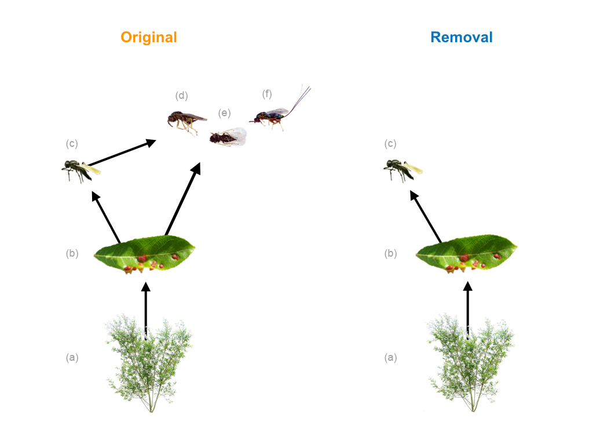

---
output:
  pdf_document:
    keep_tex: true
    toc: false
    number_sections: false
    df_print: paged
    fig_caption: true
    citation_package: natbib
    includes:  
      in_header: Am-Nat-preamble-latex.tex
bibliography: references
biblio-style: amnat
fontsize: 11pt
fontfamily: mathpazo
documentclass: article
linkcolor: black
urlcolor: black
citecolor: black
---

```{r setup ms, include=FALSE}
## Reproduce analyses ----
rmarkdown::render("../analyses/reproduce_analyses.Rmd", clean = FALSE)

## Get sample size info
no_larvae <- dim(distinct(gall_selection.df, Gall_Number, Gall_ID))[1]
no_galls <- dim(distinct(gall_selection.df, Gall_Number))[1]
no_plants <- dim(distinct(gall_selection.df, Plant_Position))[1]
no_genotypes <- dim(distinct(gall_selection.df, Genotype))[1]
```

<!-- Begin title page formatting -->

\vspace*{0.1cm} 
\begin{center} \LARGE Loss of consumers constrains phenotypic evolution in the resulting food web \end{center}

\bigskip

\begin{center} \large Matthew A. Barbour$^{1,2,\ast}$, Christopher J. Greyson-Gaito$^{2,3}$, Arezoo Sootodeh$^{2}$, Brendan Locke$^{4}$, Jordi Bascompte$^{1}$ \normalsize \end{center}

\bigskip

\noindent 1. University of Zurich, Department of Evolutionary Biology and Environmental Studies, Zurich, 8057 ZH, Switzerland;

\noindent 2. University of British Columbia, Department of Zoology, Vancouver, BC V6T 1Z4, Canada; 

\noindent 3. University of Guelph, Department of Integrative Biology, Guelph, ON N1G 2W1, Canada;

\noindent 4. Humboldt State University, Department of Biological Sciences, Arcata, CA 95521, USA.

$^\ast$ Corresponding author; e-mail: matthew.barbour@ieu.uzh.ch

\bigskip

*Short Running Title*: Consumer loss constrains phenotypic evolution

\bigskip

*Keywords*: fitness landscape, adaptive landscape, ecological networks, eco-evolutionary dynamics, natural selection, host-parasitoid, community context, extinction.

\bigskip

*Abstract Word Count*: 256

\bigskip

*Total Word Count*: `r wordcountaddin::word_count("manuscript_clean.Rmd") - 552` <!-- subtract estimate of Abstract, Impact, Acknowledgements, Author Contributions, Data Accessibility, and their associated headers -->

\bigskip

*Manuscript type*: Letter.

\bigskip

<!-- End title page formatting -->

\linenumbers{}
\modulolinenumbers[3]

\newpage

# Abstract

The loss of biodiversity is altering the structure of ecological networks; however, we are currently in a poor position to predict how these altered communities will affect the evolutionary potential of remaining populations. Theory on fitness landscapes provides a framework for predicting how selection alters the trajectory and evolutionary potential of populations, but often treats the network of interacting populations as a ``black box''. Here, we integrate ecological networks and fitness landscapes to examine how changes in food-web structure shape phenotypic evolution. We conducted a field experiment that removed a guild of larval parasitoids that imposed direct and indirect selection pressures on an insect herbivore. We then measured herbivore survival as a function of three key phenotypic traits to estimate directional, quadratic, and correlational selection gradients in each treatment. We used these selection gradients to characterize the slope and curvature of the fitness landscape to understand the direct and indirect effects of consumer loss on phenotypic evolution. We found that the number of traits under directional selection increased with the removal of larval parasitoids, indicating evolution was more constrained toward a specific combination of traits. Similarly, we found that the removal of larval parasitoids altered the curvature of the fitness landscape in such a way that tended to decrease the evolvability of the traits we measured in the next generation. Our results suggest that the loss of trophic interactions can impose greater constraints on phenotypic evolution. This indicates that the simplification of ecological communities may constrain the adaptive potential of remaining populations to future environmental change.  

\newpage

# Impact Summary

<!-- Authors should provide an approximately 300 word summary, explaining why the article makes an important contribution to Evolutionary Biology. It should be accessible to a wide audience, e.g. journalists, non-expert public interested in evolution, school science teachers. -->

The loss of biodiversity is rewiring the web of life; however, it is uncertain how this will affect the ability of remaining populations to evolve and adapt to future environments. To gain insight to these effects, we conducted a field experiment that either maintained a natural community of predators or removed all but one of the predators that was able to impose selection on a common prey. We found that the loss of predators acted to constrain prey evolution toward a particular combination of traits. Moreover, we found that the loss of predators could make it more difficult for prey to adapt to uncertain future environments. Taken together, our results suggest that the simplification of the web of life may constrain the adaptive potential of remaining populations. 

\newpage

# Introduction

The fitness landscape provides a powerful framework for understanding how natural selection has shaped the evolution of biodiversity ---from genes to phenotypes to species [@Wright1931; @Simpson1944; @Arnold2001]. More than a metaphor, the fitness landscape links quantitative genetic and phenotypic variation in multiple traits to evolution by natural selection [@Lande1979; @Arnold1984applications; @Arnold1984theory]. Ecological interactions often play a key role in shaping natural selection, as evidenced by the role of antagonistic and mutualistic interactions in driving evolutionary change [@Schluter2000; @Abrams2000; @Bronstein2006]. Although there is clear evidence that species interactions can shape the fitness landscape, we still have a poor understanding of how the fitness landscape is shaped by a community of interacting species [@McPeek2017; @terHorst2018; @Hui2018]. Resolution on how change in ecological communities shape phenotypic evolution is urgently needed though, given the rapid losses of biodiversity we are observing in the Anthropocene [@Scheffers2016].   

Ecological networks, such as food webs describing who-eats-whom, provide an explicit representation of the direct and indirect effects that emerge in a community of interacting species [@Bascompte2014; @McCann2012]. Here, we integrate ecological networks and fitness landscapes to understand how selection imposed by ecological communities alter the trajectory and evolutionary potential of interacting populations [@Hui2018]. The effects of natural selection on multiple phenotypic traits can be inferred by quantifying the slope and curvature of the fitness landscape [@Arnold1992]. The slope is determined by the strength of directional selection acting on each trait, which influences the trajectory of evolution [@Lande1979; @Arnold1992]. This fact is made clear by the 'Lande equation', $\Delta\bar z = \text{G}\beta$, where $\Delta \bar z$ is a column vector of the average change in each trait between generations, \text{G} is the additive genetic (co)variance matrix for these traits (i.e. G-matrix), and $\beta$ is a column vector of directional selection gradients acting on each trait (i.e. slope). Grant and Grant [-@Grant1995] used the slope of the fitness landscape for multiple traits related to body and beak size in Darwin's finches to accurately predict the effects of drought on the evolutionary trajectory of these traits. The curvature of the fitness landscape is governed by the strength of stabilizing, disruptive, and correlational selection acting on each trait, which can alter the evolutionary potential of a population through its effect on the G-matrix [@Hansen2008]. For example, stabilizing selection acts to erode genetic variance in a trait, which can impose a constraint on the ability of this trait to respond to future selection [@Hansen2008]. In contrast, disruptive selection toward extreme trait values acts to increase genetic variance in a trait, thus increasing the capacity for future adaptation [@Bolnick2008]. Correlational selection alters the genetic covariance between traits, which may facilitate or hinder future adaptation depending on the pattern of selection on those traits and the structure of the G-matrix [@Brodie1992]. If we want to predict how ecological communities shape phenotypic evolution, we must understand how ecological networks shape the fitness landscape of interacting populations.

The loss of biodiversity is altering the structure of ecological networks [@Landi2018ComplexityStability], which may influence the slope and curvature of the fitness landscape in a number of ways. For example, consider how changes in consumer diversity in a food web may alter the slope of the fitness landscape for a shared resource. If different consumers impose directional selection on different traits of the resource, then a more diverse consumer community would increase the number of traits under selection, which may constrain the trajectory of evolution toward a specific phenotype. Alternatively, if consumers impose selection on different values of a trait, then their selective effects would cancel each other out in more diverse communities, which would allow for a greater diversity of phenotypes to persist. Now consider the effects of consumer diversity on the curvature of the fitness landscape. If consumers impose selection on different ends of a resource's trait distribution, then a more diverse consumer community may impose stabilizing selection, which would decrease genetic variance in this trait. In contrast, additional consumers may impose disruptive selection if their cumulative effect decreases the relative fitness of a resource's average trait value, which would increase the genetic variance in this trait.

To examine these different possibilities, we conducted a field experiment that removed a consumer guild that parasitizes an abundant insect herbivore (*Iteomyia salicisverruca*, Family Cecidomyiidae; fig. \ref{fig:Conceptual}). The larvae of this herbivore induce tooth-shaped galls when they feed on the developing leaves of willow trees [*Salix* sp., @Russo2006]. These galls protect larva from attack by generalist predators (e.g. ants, spiders), but they suffer high mortality from egg and larval parasitoids [@Barbour2016]. We manipulated food-web structure by either removing larval parasitoids (removal food web) or allowing both egg and larval parasitoids to impose selection on gall midge traits (original food web, fig. \ref{fig:Conceptual}). <!-- Omit due to Reviewer #1 comment: The relative abundance of these larval parasitoids is much lower than the egg parasitoid [@Barbour2016], and thus represents a plausible extinction scenario for this system. <!--While this manipulation simulates an extreme co-extinction event, the likelihood of such co-extinction events is increasing in the Anthropocene. -->Larval parasitoids also impose indirect effects on gall midge fitness through intraguild predation on the egg parasitoid (fig. \ref{fig:Conceptual}). We applied modern statistical methods to quantify how changes in food-web structure altered the slope and curvature of the gall midge's fitness landscape. Taken together, our study gives insight to how the loss of biodiversity may alter both the trajectory and evolutionary potential of interacting populations.

```{r Conceptual, echo=FALSE, fig.pos="h", fig.cap="\\label{fig:Conceptual}Experimental manipulation of food-web structure associated with a leaf-galling midge (b, *Iteomyia salicisverruca*) feeding on the willow *Salix hookeriana* (a). Black arrows denote the flow of energy in this network of trophic interactions. In the original food web, we allowed the full suite of egg and larval parasitoids to impose selection. In the removal food web, we used mesh bags to exclude the guild of larval parasitoids, only allowing the egg parasitoid (c, *Platygaster* sp.) to impose selection. Note that larval parasitoids also impose indirect effects on gall midge fitness through intraguild predation on the egg parasitoid. Larval parasitoids include the following species: *Mesopolobus* sp. (d, Family: Pteromalidae); *Tetrastichus* sp. (e, Family: Eulophidae); and *Torymus* sp. (f, Family: Torymidae)."}

```

# Methods

## Study Site

We conducted our study within a four-year old common garden experiment of coastal willow (*Salix hookeriana*) located at Humboldt Bay National Wildlife Refuge (HBNWR) (40 40'53"N, 124 12'4"W) near Loleta, California, USA. This common garden consists of 26 different willow genotypes that were collected from a single population of willows growing around Humboldt Bay. Stem cuttings of each genotype (25 replicates per genotype) were planted in a completely randomized design in two hectares of a former cattle pasture at HBNWR. Willows at our study site begin flowering in February and reach their peak growth in early August. During this study, willows had reached 5 - 9m in height. Further details on the genotyping and planting of the common garden are available in @Barbour2015.  

## Manipulating Food-web Structure

We setup our food-web manipulation across 128 plants soon after galls began developing on willows in early June of 2013. These 128 plants came from 8 different plant genotypes that spanned the range of trait variation observed in this willow population [@Barbour2015]. For the original food web (eight replicates per genotype), we used flagging tape to mark 14 galled leaves per plant (~30 larvae), allowing the full suite of egg and larval parasitoids to impose selection. Marking galls with flagging tape ensured that we compared galls with similar phenology in both treatments when we collected galls later in the season. For the removal food web, we enclosed 14 galled leaves with 10x15cm organza bags (ULINE, Pleasant Prairie, WI, USA) to exclude three parasitoid species that attack during larval development. This treatment did not exclude the egg parasitoid *Platygaster* sp., which attacks prior to gall initiation [larva initiate gall development in Cecidomyiid midges: @Gagne1989]. It was not possible to reciprocally manipulate parasitoid attack (i.e. exclude egg parasitoid, but allow larval parasitoids), because it was not possible to identify midge oviposition sites prior to gall formation. In late August, we collected marked and bagged galls from each plant, placed them into 30 mL vials and kept them in the lab for 4 months at room temperature. We then opened galls under a dissecting scope and determined whether larvae survived to pupation (our measure of fitness) or died due to parasitism. We further distinguished whether mortality was caused by an egg or larval parasitoid. Early larval death was another important source of mortality (`r round(mean(full_df$early.larval.death), 2)*100`%), but we excluded these cases from our analysis. We did this because early larval death can stunt gall growth, which would confound estimates of selection due to parasitism on one of the phenotypes we measured (chamber diameter; details given in next section). For the food-web treatment that excluded larval parasitoids, we further restricted our data by removing any incidental instances of parasitism by a larval parasitoid. This represented less than 3\% of the observations in this food-web treatment and allowed us to focus our inferences of selection on those imposed by the egg parasitoid. Our final dataset contains survival estimates for `r no_larvae` larvae from `r no_galls` galls and `r no_plants` plants.

## Measuring Phenotypic Traits

We collected data on three different traits that we expected to influence larval survival based on previous work in this system [@Barbour2016] and other work with gall midges [@Weis1983; @Heath2018]. First, we measured gall diameter as the size of each gall chamber to the nearest 0.01 mm at its maximum diameter (perpendicular to the direction of plant tissue growth). Previous work in this system has shown that larger galls are associated with higher survival [@Barbour2016]. Second, we measured clutch size by counting the number of chambers in each gall [@Weis1983; @Heath2018]. All larvae collected from the same multi-chambered gall were scored with the same clutch size. Third, we measured oviposition preference for individual plants as the density of larvae observed on a plant in an independent survey. We did this by randomly sampling five branches per tree and counting the number of individual gall chambers (number of larvae). We then converted these counts to a measure of larval density per 100 shoots by counting the number of shoots on the last branch we sampled. All larvae collected from the same plant were scored with the same oviposition preference. Measuring larval densities on plants in the field is a common method for measuring oviposition preference [@Gripenberg2010]; however, caution must be taken in inferring 'preference' as larval densities can be influenced by processes other than preference [@Singer1986]. Fortunately, two features of our study system suggest that larval densities may be a good proxy for oviposition preference. First, since our data comes from a randomized placement of plant genotypes in a common garden, females midges have equal exposure to many possible plant genotypes when choosing an oviposition site. Second, egg predation is a minor source of mortality for galling insects in general [@Hawkins1997]; therefore, we do not expect any prior egg predation to bias our estimates of observed larval densities. 

## Quantifying the Fitness Landscape

Inferring the fitness landscape assumes that trait distributions are multivariate normal [@Lande1983]. 
To approximate this assumption, we log-transformed clutch size and square-root transformed oviposition preference. Chamber diameter already had a normal distribution so we did not transform it. We then scaled all phenotypic traits (mean=0 and SD=1) across treatments prior to our analyses (detailed below) to ensure that our estimates of selection were comparable across traits and with other studies. 

Our analysis consisted of four parts. First, we used generalized linear mixed models (GLMM) to quantify selection surfaces \textemdash linear and nonlinear relationships between absolute fitness ($W$) and standardized phenotypic traits ($i$) of individuals \textemdash in each food-web treatment. Second, we scaled selection surfaces relative to mean fitness ($\bar W$) in order to calculate standardized selection gradients. Third, we used our estimates of directional selection gradients to characterize the slope of the fitness landscape, which we used to quantify the effects of food-web structure on the trajectory of evolution. Finally, we estimated the curvature of the fitness landscape and used a simulation to explore its effects on the adaptive potential of the gall midge population in the next generation.

**Selection surfaces**: Since larval survival was our measure of absolute fitness, we used a GLMM that assumed a binomial error distribution (and logit-link function). To approximate the selection surface, we modelled larval survival as a function of food-web treatment as well as linear ($\alpha_i$), quadratic ($\alpha_{ii}$), and statistical interactions ($\alpha_{ij}$) between each trait. <!--Removed at Reviewer #1's suggestion because it is redundant: We also allowed these selection surfaces ($\alpha$) to vary between food-web treatments.-->Note that to obtain valid estimates of linear selection surfaces, we removed nonlinear terms prior to estimating linear relationships [@Lande1983]. Other approaches have been advocated for approximating selection surfaces [@Schluter1988]; however, our approach enables us to calculate selection gradients, and thus is more appropriate for approximating the fitness landscape [@Arnold2003]. To account for the nonindependence of clutch size (measured at gall level) and oviposition preference (measured at plant level) as well as any independent effects of willow genotype on larval survival, we modelled gall identity nested within plant identity nested within genotype identity as random effects. Although statistical models with random effects are not common in analyses of natural selection, we think that modelling random effects can mitigate biased estimates of selection due to environmental covariances between traits and fitness [@Rausher1992]. Since our end goal was to characterize the relationship between mean trait values and mean fitness (fitness landscape), we assumed the mean value of our random effects (i.e. setting them to zero) when calculating selection surfaces. We then used parametric bootstrapping (1,000 replicates) to estimate the effect of food-web treatment on larval survival as well as selection surfaces in each food-web treatment. To determine whether trait-fitness relationships differed between food-web treatments, we calculated the difference in bootstrapped replicates between treatments.  

**Selection gradients**: Selection gradients cannot be estimated directly from GLMMs of selection surfaces because the response is in terms of absolute fitness and the coefficients are on a nonlinear scale. For example, the coefficients in the previously described binomial model measure the change in the log-odds of survival <!--(i.e. $\text{ln}\{W(z)/[1-W(z)]\}$)-->associated with 1 SD change in a trait with all other traits held fixed at their mean. Therefore, we used the method developed by @Janzen1998 to translate selection surfaces from the above model into the scale of relative fitness in order to calculate directional ($\beta_i$), quadratic ($\gamma_{ii}$), and correlational ($\gamma_{ij}$) selection gradients. Briefly, this method calculates the average gradient of selection surfaces by multiplying the average of $W(z)[1-W(z)]$ by each regression coefficient (e.g. $\alpha_i$, $\alpha_{ii}$, or $\alpha_{ij}$). We then divided this average gradient by the mean fitness ($\bar W$) to put it on the scale of relative fitness ($w=W/\bar W$), and thus interpretable as a selection gradient. We estimated selection gradients separately for each food-web treatment. We also determined whether selection gradients differed between food-web treatments by calculating the difference in bootstrapped replicates between treatments. Note that we doubled all quadratic terms prior to calculating selection gradients to put them on the same scale as estimates of directional and correlational selection [@Stinchcombe2008]. 

**Evolutionary trajectory**: The effect of selection on the trajectory of evolution is determined by the slope of the fitness landscape, which in our study corresponds to:

$$\textbf{Slope} = \begin{pmatrix} \beta_{\text{Diam}} \\ \beta_{\text{Clutch}} \\ \beta_{\text{Pref}} \end{pmatrix} $$
where each $\beta_i$ corresponds to the directional selection gradient acting on each trait. By comparing which directional selection gradients show clear evidence of contributing to the slope in each food-web treatment (i.e. 95%  CI does not overlap zero), we can infer the effect of food-web structure on the trajectory of phenotypic evolution.

**Evolutionary potential**: The indirect effects of selection on the G-matrix ($\Delta\text{G}=\text{G}(\boldsymbol{\text{C}})\text{G}$) are governed by the curvature of the fitness landscape ($\text{C}=\gamma - \beta \beta^\text{T}$), which in our study corresponds to:

$$\textbf{Curvature} = \begin{pmatrix} \gamma_{\text{Diam:Diam}}&& \\ \gamma_{\text{Clutch:Diam}}&\gamma_{\text{Clutch:Clutch}}& \\ \gamma_{\text{Pref:Diam}} & \gamma_{\text{Pref:Clutch}} &\gamma_{\text{Pref:Pref}} \end{pmatrix} - \begin{pmatrix} \beta_{\text{Diam}}\beta_{\text{Diam}}&& \\ \beta_{\text{Clutch}}\beta_{\text{Diam}}&\beta_{\text{Clutch}}\beta_{\text{Clutch}}& \\ \beta_{\text{Pref}}\beta_{\text{Diam}} & \beta_{\text{Pref}}\beta_{\text{Clutch}} &\beta_{\text{Pref}}\beta_{\text{Pref}} \end{pmatrix}$$

where each $\gamma_{ii}$ (diagonal) corresponds to the quadratic selection gradient acting on a trait, and each $\gamma_{ij}$ (off-diagonal) corresponds to the correlational selection gradient acting on a particular trait combination. Note that we ommitted the upper triangle of each matrix for clarity since it is simply the reflection of the lower triangle. Subtracting these two matrices results in the curvature matrix of the fitness landscape:

$$\textbf{Curvature} = \begin{pmatrix} \text{C}_{\text{Diam:Diam}}&& \\ \text{C}_{\text{Clutch:Diam}} & \text{C}_{\text{Clutch:Clutch}} & \\ \text{C}_{\text{Pref:Diam}} & \text{C}_{\text{Pref:Clutch}} & \text{C}_{\text{Pref:Pref}} \end{pmatrix}$$
where each $\text{C}_{ii}$ (diagonal) represents the effect of selection on the additive genetic variance in a trait, and each $\text{C}_{ij}$ (off-diagonal) represents the effect of selection on the additive genetic covariance between a particular trait combination. We used bootstrapped values of each selection gradient to estimate the curvature of each component of the matrix and its associated 95% CI. We also used this information to determine whether the curvature of each component differed between our food-web treatments.  

Knowledge of the curvature matrix alone gives an incomplete picture of its indirect effect on evolutionary potential. This is because the evolutionary potential of a population is ultimately determined by the structure of its G-matrix, and therefore also depends on its structure before selection. Although we do not know the underlying G-matrix for the traits we measured in this experiment, we can still gain insight to how our food-web treatment would alter genetic constraints more generally. Specifically, we calculated how our best estimate of the curvature matrix (mean values) in each treatment changed the structure of `r n_Gmats` random G-matrices for the next generation. We restricted the range of additive genetic variance (*V~G~*) in these G-matrices to between 0 and 0.5 to reflect typical ranges in narrow-sense heritability values (*h*^2^; note that *h*^2^ = *V~G~* when the phenotypic variance is scaled to 1). Note that this analysis assumes that the effects of recombination and mutation on the G-matrix are much smaller than the effects of selection, which appears to be a reasonable assumption over short time scales [@Arnold2008].

The G-matrix itself is a complex structure, but has a clear theoretical link to the evolutionary potential, or evolvability of phenotypic traits [@Hansen2008]. Evolvability measures the ability for a trait to evolve toward a given direction of selection [@Hansen2008]. In the absence of knowledge about the direction of selection that a population will actually experience in the next generation, we can compute its average evolvability over random directional selection gradients [@Hansen2008; @Melo2015]. By computing the average evolvability (here, we used `r n_random_gradients` random $\beta$s) for each of `r n_Gmats` random G-matrices, we can then assess how changes in the curvature matrix alter the evolutionary potential of the associated traits. We report the distribution of these effect sizes, rather than conduct a statistical test, because the number of replicates in a simulation can be arbitrarily high, thus making any effect size statistically significant [@White2014].  

## Adjusting for biased measurements of selection

Rather than imposing selection, parasitoids may influence the expression of herbivore traits which could bias measurements of selection. In our system, it was plausible that parasitoids may influence chamber diameter by altering larval feeding behavior or killing larvae before they complete their development. To estimate this potential bias, we subset our data to only include galls where there was variation in larval survival within the same gall (i.e. 1 > survival > 0). If we assume that larvae within each gall should have similar chamber diameters because they come from the same clutch and experience the same local environment (an assumption our data supports: gall ID explains 54% of the variance in chamber diameter), then the relationship between chamber diameter and larval survival in this data subset represents the effect of parasitism on trait expression (i.e. bias). We used a GLMM with the same structure as described previously except that we modeled only a linear relationship between chamber diameter and larval survival ($\alpha_{\text{Diam}}$). We detected a positive bias in both food-web treatments (original $\alpha_{\text{Diam}}$=
`r round(fixef(biased_foodweb_model)["FoodwebOriginal:sc.Diam"],2)` 
[`r round(filter(biased_foodweb_confint, term=="FoodwebOriginal:sc.Diam")$conf.low,2)`,
`r round(filter(biased_foodweb_confint, term=="FoodwebOriginal:sc.Diam")$conf.high,2)`]; removal $\alpha_{\text{Diam}}$=
`r round(fixef(biased_foodweb_model)["FoodwebExtinction:sc.Diam"],2)` 
[`r round(filter(biased_foodweb_confint, term=="FoodwebExtinction:sc.Diam")$conf.low,2)`,
`r round(filter(biased_foodweb_confint, term=="FoodwebExtinction:sc.Diam")$conf.high,2)`]), indicating that unadjusted relationships would overestimate the strength of selection on chamber diameter. To account for this bias, we subtracted our mean estimates of bias from our estimates with the full dataset prior to calculating chamber diameter's selection surface and directional selection gradient.

## Measuring selection on egg parasitoids 

Once parasitized, the gall phenotype becomes the phenotype of the egg parasitoid. This phenotype may influence the egg parasitoid's survival in the face of larval parasitoids, and thus experiences selection. Our food-web manipulation allows us to measure selection imposed by larval parasitoids on the phenotype of egg parasitoids. Using the same models as described above, we substituted egg parasitism as our response variable to quantify selection surfaces and selection gradients acting on the egg parasitoid. Note that we cannot test the effect of food-web structure on the egg parasitoid's fitness landscape ---we can only estimate selection imposed by larval parasitoids. This comparison is still useful though in determining the extent to which the loss of consumers may have indirect evolutionary effects by altering selection on multiple interacting populations.

All analyses and visualizations were conducted in R [@R2018]. Unless otherwise noted, we report mean estimates of selection surfaces and selection gradients with 95% confidence intervals in brackets. Note that for visualizing the fitness landscape we restrict trait axes to $\pm 1$ SD of the mean trait value. This emphasizes the fact that we can only reliably estimate the shape of the fitness landscape near the mean phenotype of the population [@Arnold2001]. We also plot mean larval survival on a natural log scale to accurately reflect the mathematical definition of the fitness landscape [@Arnold2003]. All data and code to reproduce the reported results are publicly available on GitHub (https://github.com/mabarbour/complexity_selection) and have been archived on Zenodo (https://zenodo.org/badge/latestdoi/108833263).

# Results 

## Consumer removal constrains the evolutionary trajectory of gall midges 

\indent We found that the removal of larval parasitoids increased the number of gall midge traits under directional selection (3 of 3) relative to the original food web (1 of 3)(table \ref{Table:Gradients}). For example, we observed directional selection for smaller clutch sizes when we removed larval parasitoids, but there was no evidence of selection acting on this trait in the original food web (fig. \ref{fig:UV_Landscape}A). This absence of selection appeared to be a result of conflicting selection pressures imposed by each guild of parasitoids. Specifically, when we subset our data to focus on differences between parasitoid guilds, we found that larval parasitoids actually impose directional selection for larger clutch sizes (larval parasitoids $\beta_{\text{Clutch}}$=
`r round(filter(tidy_egglarval_grads, type=="Original", term=="sc.log.Clutch")$mean,2)` 
[`r round(filter(tidy_egglarval_grads, type=="Original", term=="sc.log.Clutch")$conf.low,2)`,
`r round(filter(tidy_egglarval_grads, type=="Original", term=="sc.log.Clutch")$conf.high,2)`]). This conflicting selection is likely due to trait differences between guilds, as larger clutches may be easier targets for egg parasitoids to find, but the more complex gall structure may be more difficult for larval parasitoids to oviposit through.

\bigskip

\begin{table}[h]
\caption{Standardized selection gradients acting on gall midges in the original food web and with the removal of larval parasitoids.}
\label{Table:Gradients}
\centering
\begin{tabular}{lccc}
\\ 
\hline
\textbf{Selection gradient} & \textbf{Original} & \textbf{Removal} & \textbf{Contrast} (\small{Original - Removal}) \\
\hline
$\beta_{\text{Diam}}$ & 
\textbf{
`r round(filter(tidy_foodweb_grads, type=="Original", term=="sc.Diam")$mean,2)` [
`r round(filter(tidy_foodweb_grads, type=="Original", term=="sc.Diam")$conf.low,2)`,
`r round(filter(tidy_foodweb_grads, type=="Original", term=="sc.Diam")$conf.high,2)`] } & 
\textbf{
`r round(filter(tidy_foodweb_grads, type=="Extinction", term=="sc.Diam")$mean,2)` [
`r round(filter(tidy_foodweb_grads, type=="Extinction", term=="sc.Diam")$conf.low,2)`,
`r round(filter(tidy_foodweb_grads, type=="Extinction", term=="sc.Diam")$conf.high,2)`] } & 
\textbf{
`r round(-1*filter(tidy_foodweb_grads, type=="Diff", term=="sc.Diam")$mean,2)` [
`r round(-1*filter(tidy_foodweb_grads, type=="Diff", term=="sc.Diam")$conf.high,2)`,
`r round(-1*filter(tidy_foodweb_grads, type=="Diff", term=="sc.Diam")$conf.low,2)`] }\\

$\beta_{\text{Clutch}}$ & 
`r round(filter(tidy_foodweb_grads, type=="Original", term=="sc.log.Clutch")$mean,2)` [
`r round(filter(tidy_foodweb_grads, type=="Original", term=="sc.log.Clutch")$conf.low,2)`,
`r round(filter(tidy_foodweb_grads, type=="Original", term=="sc.log.Clutch")$conf.high,2)`] & 
\textbf{
`r round(filter(tidy_foodweb_grads, type=="Extinction", term=="sc.log.Clutch")$mean,2)` [
`r round(filter(tidy_foodweb_grads, type=="Extinction", term=="sc.log.Clutch")$conf.low,2)`,
`r round(filter(tidy_foodweb_grads, type=="Extinction", term=="sc.log.Clutch")$conf.high,2)`] } & 
\textbf{
`r round(-1*filter(tidy_foodweb_grads, type=="Diff", term=="sc.log.Clutch")$mean,2)` [
`r round(-1*filter(tidy_foodweb_grads, type=="Diff", term=="sc.log.Clutch")$conf.high,2)`,
`r round(-1*filter(tidy_foodweb_grads, type=="Diff", term=="sc.log.Clutch")$conf.low,2)`] }\\

$\beta_{\text{Pref}}$ &
`r round(filter(tidy_foodweb_grads, type=="Original", term=="sc.sqrt.Pref")$mean,2)` [
`r round(filter(tidy_foodweb_grads, type=="Original", term=="sc.sqrt.Pref")$conf.low,2)`,
`r round(filter(tidy_foodweb_grads, type=="Original", term=="sc.sqrt.Pref")$conf.high,2)`] & 
\textbf{
`r round(filter(tidy_foodweb_grads, type=="Extinction", term=="sc.sqrt.Pref")$mean,2)` [
`r round(filter(tidy_foodweb_grads, type=="Extinction", term=="sc.sqrt.Pref")$conf.low,2)`,
`r round(filter(tidy_foodweb_grads, type=="Extinction", term=="sc.sqrt.Pref")$conf.high,2)`] } & 

`r round(-1*filter(tidy_foodweb_grads, type=="Diff", term=="sc.sqrt.Pref")$mean,2)` [
`r round(-1*filter(tidy_foodweb_grads, type=="Diff", term=="sc.sqrt.Pref")$conf.high,2)`,
`r round(-1*filter(tidy_foodweb_grads, type=="Diff", term=="sc.sqrt.Pref")$conf.low,2)`] \\

$\gamma_{\text{Diam:Diam}}$ &
`r round(filter(tidy_foodweb_grads, type=="Original", term=="I(sc.Diam^2)")$mean,2)` [
`r round(filter(tidy_foodweb_grads, type=="Original", term=="I(sc.Diam^2)")$conf.low,2)`,
`r round(filter(tidy_foodweb_grads, type=="Original", term=="I(sc.Diam^2)")$conf.high,2)`] & 

`r round(filter(tidy_foodweb_grads, type=="Extinction", term=="I(sc.Diam^2)")$mean,2)` [
`r round(filter(tidy_foodweb_grads, type=="Extinction", term=="I(sc.Diam^2)")$conf.low,2)`,
`r round(filter(tidy_foodweb_grads, type=="Extinction", term=="I(sc.Diam^2)")$conf.high,2)`] & 

`r round(-1*filter(tidy_foodweb_grads, type=="Diff", term=="I(sc.Diam^2)")$mean,2)` [
`r round(-1*filter(tidy_foodweb_grads, type=="Diff", term=="I(sc.Diam^2)")$conf.high,2)`,
`r round(-1*filter(tidy_foodweb_grads, type=="Diff", term=="I(sc.Diam^2)")$conf.low,2)`] \\

$\gamma_{\text{Clutch:Clutch}}$ & 
`r round(filter(tidy_foodweb_grads, type=="Original", term=="I(sc.log.Clutch^2)")$mean,2)` [
`r round(filter(tidy_foodweb_grads, type=="Original", term=="I(sc.log.Clutch^2)")$conf.low,2)`,
`r round(filter(tidy_foodweb_grads, type=="Original", term=="I(sc.log.Clutch^2)")$conf.high,2)`] & 

`r round(filter(tidy_foodweb_grads, type=="Extinction", term=="I(sc.log.Clutch^2)")$mean,2)` [
`r round(filter(tidy_foodweb_grads, type=="Extinction", term=="I(sc.log.Clutch^2)")$conf.low,2)`,
`r round(filter(tidy_foodweb_grads, type=="Extinction", term=="I(sc.log.Clutch^2)")$conf.high,2)`] & 

`r round(-1*filter(tidy_foodweb_grads, type=="Diff", term=="I(sc.log.Clutch^2)")$mean,2)` [
`r round(-1*filter(tidy_foodweb_grads, type=="Diff", term=="I(sc.log.Clutch^2)")$conf.high,2)`,
`r round(-1*filter(tidy_foodweb_grads, type=="Diff", term=="I(sc.log.Clutch^2)")$conf.low,2)`] \\

$\gamma_{\text{Pref:Pref}}$ & 
\textbf{
`r round(filter(tidy_foodweb_grads, type=="Original", term=="I(sc.sqrt.Pref^2)")$mean,2)` [
`r round(filter(tidy_foodweb_grads, type=="Original", term=="I(sc.sqrt.Pref^2)")$conf.low,2)`,
`r round(filter(tidy_foodweb_grads, type=="Original", term=="I(sc.sqrt.Pref^2)")$conf.high,2)`] }& 

`r round(filter(tidy_foodweb_grads, type=="Extinction", term=="I(sc.sqrt.Pref^2)")$mean,2)` [
`r round(filter(tidy_foodweb_grads, type=="Extinction", term=="I(sc.sqrt.Pref^2)")$conf.low,2)`,
`r round(filter(tidy_foodweb_grads, type=="Extinction", term=="I(sc.sqrt.Pref^2)")$conf.high,2)`] & 
\textbf{
`r round(-1*filter(tidy_foodweb_grads, type=="Diff", term=="I(sc.sqrt.Pref^2)")$mean,2)` [
`r round(-1*filter(tidy_foodweb_grads, type=="Diff", term=="I(sc.sqrt.Pref^2)")$conf.high,2)`,
`r round(-1*filter(tidy_foodweb_grads, type=="Diff", term=="I(sc.sqrt.Pref^2)")$conf.low,2)`] }\\

$\gamma_{\text{Diam:Clutch}}$ & 
`r round(filter(tidy_foodweb_grads, type=="Original", term=="sc.Diam:sc.log.Clutch")$mean,2)` [
`r round(filter(tidy_foodweb_grads, type=="Original", term=="sc.Diam:sc.log.Clutch")$conf.low,2)`,
`r round(filter(tidy_foodweb_grads, type=="Original", term=="sc.Diam:sc.log.Clutch")$conf.high,2)`] & 

`r round(filter(tidy_foodweb_grads, type=="Extinction", term=="sc.Diam:sc.log.Clutch")$mean,2)` [
`r round(filter(tidy_foodweb_grads, type=="Extinction", term=="sc.Diam:sc.log.Clutch")$conf.low,2)`,
`r round(filter(tidy_foodweb_grads, type=="Extinction", term=="sc.Diam:sc.log.Clutch")$conf.high,2)`] & 

`r round(-1*filter(tidy_foodweb_grads, type=="Diff", term=="sc.Diam:sc.log.Clutch")$mean,2)` [
`r round(-1*filter(tidy_foodweb_grads, type=="Diff", term=="sc.Diam:sc.log.Clutch")$conf.high,2)`,
`r round(-1*filter(tidy_foodweb_grads, type=="Diff", term=="sc.Diam:sc.log.Clutch")$conf.low,2)`] \\

$\gamma_{\text{Diam:Pref}}$ & 
`r round(filter(tidy_foodweb_grads, type=="Original", term=="sc.Diam:sc.sqrt.Pref")$mean,2)` [
`r round(filter(tidy_foodweb_grads, type=="Original", term=="sc.Diam:sc.sqrt.Pref")$conf.low,2)`,
`r round(filter(tidy_foodweb_grads, type=="Original", term=="sc.Diam:sc.sqrt.Pref")$conf.high,2)`] & 

`r round(filter(tidy_foodweb_grads, type=="Extinction", term=="sc.Diam:sc.sqrt.Pref")$mean,2)` [
`r round(filter(tidy_foodweb_grads, type=="Extinction", term=="sc.Diam:sc.sqrt.Pref")$conf.low,2)`,
`r round(filter(tidy_foodweb_grads, type=="Extinction", term=="sc.Diam:sc.sqrt.Pref")$conf.high,2)`] & 

`r round(-1*filter(tidy_foodweb_grads, type=="Diff", term=="sc.Diam:sc.sqrt.Pref")$mean,2)` [
`r round(-1*filter(tidy_foodweb_grads, type=="Diff", term=="sc.Diam:sc.sqrt.Pref")$conf.high,2)`,
`r round(-1*filter(tidy_foodweb_grads, type=="Diff", term=="sc.Diam:sc.sqrt.Pref")$conf.low,2)`] \\

$\gamma_{\text{Clutch:Pref}}$ & 
`r round(filter(tidy_foodweb_grads, type=="Original", term=="sc.log.Clutch:sc.sqrt.Pref")$mean,2)` [
`r round(filter(tidy_foodweb_grads, type=="Original", term=="sc.log.Clutch:sc.sqrt.Pref")$conf.low,2)`,
`r round(filter(tidy_foodweb_grads, type=="Original", term=="sc.log.Clutch:sc.sqrt.Pref")$conf.high,2)`] & 

`r round(filter(tidy_foodweb_grads, type=="Extinction", term=="sc.log.Clutch:sc.sqrt.Pref")$mean,2)` [
`r round(filter(tidy_foodweb_grads, type=="Extinction", term=="sc.log.Clutch:sc.sqrt.Pref")$conf.low,2)`,
`r round(filter(tidy_foodweb_grads, type=="Extinction", term=="sc.log.Clutch:sc.sqrt.Pref")$conf.high,2)`] & 

`r round(-1*filter(tidy_foodweb_grads, type=="Diff", term=="sc.log.Clutch:sc.sqrt.Pref")$mean,2)` [
`r round(-1*filter(tidy_foodweb_grads, type=="Diff", term=="sc.log.Clutch:sc.sqrt.Pref")$conf.high,2)`,
`r round(-1*filter(tidy_foodweb_grads, type=="Diff", term=="sc.log.Clutch:sc.sqrt.Pref")$conf.low,2)`] \\ 
\hline
\end{tabular}
\bigskip{}
\\
{\footnotesize Note: Values in brackets represent 95\% confidence intervals. Bold values indicate that the 95\% CI does not overlap zero. $\beta_{\text{Diam}}$ has been adjusted for bias.}
\end{table}


We also observed clear evidence of directional selection for midges to avoid ovipositing on plants with high densities of conspecifics when we removed larval parasitoids (fig. \ref{fig:UV_Landscape}B); however, the overall magnitude of selection did not differ between treatments (table \ref{Table:Gradients}). Still, there was no clear evidence of directional selection on oviposition in the original food web (table \ref{Table:Gradients}). Chamber diameter experienced positive directional selection in both food-web treatments (fig. \ref{fig:UV_Landscape}C). Although the magnitude of selection on chamber diameter was relatively higher in the original food web (table \ref{Table:Gradients}), this was not due to any difference in the relationship between chamber diameter and survival 
(selection surfaces: contrast $\alpha_{\text{Diam}}$=
`r -1*round(filter(tidy_foodweb_alphas, type=="Diff", term=="sc.Diam")$mean,2)` 
[`r -1*round(filter(tidy_foodweb_alphas, type=="Diff", term=="sc.Diam")$conf.high,2)`,
`r -1*round(filter(tidy_foodweb_alphas, type=="Diff", term=="sc.Diam")$conf.low,2)`]), but was simply a consequence of the (expected) lower survival of gall midges in the original food web 
(contrast $\bar W$=
`r round(filter(tidy_foodweb_alphas, type=="Diff", term=="(Intercept)")$mean,2)` 
[`r round(filter(tidy_foodweb_alphas, type=="Diff", term=="(Intercept)")$conf.low,2)`,
`r round(filter(tidy_foodweb_alphas, type=="Diff", term=="(Intercept)")$conf.high,2)`]). We expect this difference to be transient though, since egg parasitoids would increase in abundance once they are released from intraguild predation, which would make the strength of selection on gall diameter comparable to the original food web (if removal $\bar W$=original $\bar W$, then contrast $\beta_{\text{Diam}}$=
`r round(filter(tidy_foodweb_long_grads, type=="Diff", term=="sc.Diam")$mean,2)` 
[`r round(filter(tidy_foodweb_long_grads, type=="Diff", term=="sc.Diam")$conf.low,2)`,
`r round(filter(tidy_foodweb_long_grads, type=="Diff", term=="sc.Diam")$conf.high,2)`]). It is worth noting that positive selection on chamber diameter in both treatments was unexpected. For example, the fact that larger galls provide more of a refuge from larval parasitoids makes sense since they attack after the gall is formed; however, egg parasitoids attack prior to gall formation, which suggests that chamber diameter is either directly related to survival or strongly correlated with an unmeasured trait that is under selection (e.g. immune response).

\bigskip

```{r UV_Landscape, echo=FALSE, fig.pos="h", fig.cap="\\label{fig:UV_Landscape}Adaptive landscape of gall midge phenotypes in the original food web and with the removal of larval parasitoids. Each panel corresponds to a different phenotypic trait: clutch size (A); oviposition preference (B); and chamber diameter (C). Bold lines represent selection experienced in the original (orange) and removal (blue) food webs. Thin lines represent bootstrapped replicates to show the uncertainty in selection. For clarity, we only display 100 bootstraps even though inferences are based on 1,000 replicates. Note that mean larval survival is plotted on a natural log scale to reflect the mathematical definition of the \\textbf{fitness} landscape."}
knitr::include_graphics("../analyses/UV_landscapes.pdf")
```

\bigskip

To visualize the multivariate effects of natural selection, we plotted the fitness landscape for each trait combination in each treatment (fig. \ref{fig:MV_Landscape}). The arrows in fig. \ref{fig:MV_Landscape} represent mean estimates of directional selection gradients, while the dotted lines represent predicted survival of the mean phenotype in each food-web treatment. Notice that arrows point more toward a corner of the fitness landscape for each combination of traits with the removal of larval parasitoids compared to the original food web. This indicates that the removal of consumers more strongly favored a specific combination of traits, rather than allowing for multiple trait combinations to have comparable fitness.

```{r MV_Landscape, echo=FALSE, fig.pos="h", fig.cap="\\label{fig:MV_Landscape}Two dimensional view of \\textbf{fitness} landscapes of gall midge phenotypes in the original food web and with the removal of larval parasitoids. Each panel corresponds to a different combination of phenotypic traits: clutch size and chamber diameter (A); clutch size and oviposition preference (B); oviposition preference and chamber diameter (C). Arrows represent mean estimates of directional selection gradients, while \\textbf{dotted lines} represent predicted larval survival of the mean phenotype in each food-web treatment. Notice that arrows point more toward a corner of the \\textbf{fitness} landscape for each combination of traits with the removal of larval parasitoids compared to the original food web. This indicates that the removal of consumers more strongly favored a specific combination of traits. Note that mean larval survival is plotted on a natural log scale to reflect the mathematical definition of the \\textbf{fitness} landscape."}
knitr::include_graphics("../analyses/MV_landscapes.pdf")
```

\bigskip

## Consumer removal constrains the evolutionary potential of gall midges

\indent The curvature of the fitness landscape indirectly affects evolutionary potential and is influenced by directional, quadratic, and correlational selection gradients. There was no clear evidence of correlational selection for any combination of traits in either food-web treatment (table \ref{Table:Gradients}). Similarly, there was no clear evidence of quadratic selection on chamber diameter or clutch size in either food-web treatment (table \ref{Table:Gradients}). In contrast, our food-web treatment did alter quadratic selection acting on oviposition preference (table \ref{Table:Gradients}). In particular, we observed disruptive selection in the original food web, with selection favoring females that either avoided high densities (<0.5 SD above mean density), or if gall densities were high enough (>0.5 SD above mean), then selection favored females that were attracted to high densities (fig. \ref{fig:UV_Landscape}B). This nonlinear relationship was partly due to a trend for disruptive selection imposed by larval parasitoids ($\gamma_{\text{Pref:Pref}}$=
`r round(filter(tidy_egglarval_grads, type=="Original", term=="I(sc.sqrt.Pref^2)")$mean,2)` 
[`r round(filter(tidy_egglarval_grads, type=="Original", term=="I(sc.sqrt.Pref^2)")$conf.low,2)`,
`r round(filter(tidy_egglarval_grads, type=="Original", term=="I(sc.sqrt.Pref^2)")$conf.high,2)`]), but was also magnified by the lower average survival in the original food web. This was likely a result of larval parasitoids imposing greater mortality on egg parasitoids at high gall midge densities (see **Selection on egg parasitoids** section), which would act to increase the relative fitness of gall midges at high densities. 

Using our estimates of directional ($\beta_i$), quadratic ($\gamma_{ii}$), and correlation selection ($\gamma_{ij}$), we calculated the curvature ($\text{C}=\gamma - \beta \beta^\text{T}$) of the fitness landscape in each food-web treatment. 

$$\textbf{C} = \begin{pmatrix} \text{C}_{\text{Diam:Diam}}&& \\ \text{C}_{\text{Clutch:Diam}} & \text{C}_{\text{Clutch:Clutch}} & \\ \text{C}_{\text{Pref:Diam}} & \text{C}_{\text{Pref:Clutch}} & \text{C}_{\text{Pref:Pref}} \end{pmatrix}$$

Of the different components of the curvature matrix, we found that only the curvature of oviposition preference differed between food-web treatments. Specifically, selection in the removal food web acted to decrease the additive genetic variance in preference relative to the original food web.

$$\textbf{C}_{\text{Original}} = \begin{pmatrix} 
`r round(original_curvs_df["C.Diam","mean"],2)`\: [`r round(original_curvs_df["C.Diam","low"],2)`,`r round(original_curvs_df["C.Diam","high"],2)`] &  &  \\  
`r round(original_curvs_df["C.Diam:Clutch","mean"],2)`\: [`r round(original_curvs_df["C.Diam:Clutch","low"],2)`,`r round(original_curvs_df["C.Diam:Clutch","high"],2)`] & `r round(original_curvs_df["C.Clutch","mean"],2)`\: [`r round(original_curvs_df["C.Clutch","low"],2)`,`r round(original_curvs_df["C.Clutch","high"],2)`] &  \\  
`r round(original_curvs_df["C.Diam:Pref","mean"],2)`\: [`r round(original_curvs_df["C.Diam:Pref","low"],2)`,`r round(original_curvs_df["C.Diam:Pref","high"],2)`] & `r round(original_curvs_df["C.Clutch:Pref","mean"],2)`\: [`r round(original_curvs_df["C.Clutch:Pref","low"],2)`,`r round(original_curvs_df["C.Clutch:Pref","high"],2)`] & \textbf{`r round(original_curvs_df["C.Pref","mean"],2)`\: [`r round(original_curvs_df["C.Pref","low"],2)`,`r round(original_curvs_df["C.Pref","high"],2)`]} \end{pmatrix}$$


$$\textbf{C}_{\text{Removal}} = \begin{pmatrix} 
`r round(extinction_curvs_df["C.Diam","mean"],2)`\: [`r round(extinction_curvs_df["C.Diam","low"],2)`,`r round(extinction_curvs_df["C.Diam","high"],2)`] &  &  \\  
`r round(extinction_curvs_df["C.Diam:Clutch","mean"],2)`\: [`r round(extinction_curvs_df["C.Diam:Clutch","low"],2)`,`r round(extinction_curvs_df["C.Diam:Clutch","high"],2)`] & `r round(extinction_curvs_df["C.Clutch","mean"],2)`\: [`r round(extinction_curvs_df["C.Clutch","low"],2)`,`r round(extinction_curvs_df["C.Clutch","high"],2)`] &  \\  
`r round(extinction_curvs_df["C.Diam:Pref","mean"],2)`\: [`r round(extinction_curvs_df["C.Diam:Pref","low"],2)`,`r round(extinction_curvs_df["C.Diam:Pref","high"],2)`] & `r round(extinction_curvs_df["C.Clutch:Pref","mean"],2)`\: [`r round(extinction_curvs_df["C.Clutch:Pref","low"],2)`,`r round(extinction_curvs_df["C.Clutch:Pref","high"],2)`] & `r round(extinction_curvs_df["C.Pref","mean"],2)`\: [`r round(extinction_curvs_df["C.Pref","low"],2)`,`r round(extinction_curvs_df["C.Pref","high"],2)`] \end{pmatrix}$$

$$\textbf{C}_{\text{Removal-Original}} = \begin{pmatrix} 
`r round(difference_curvs_df["C.Diam","mean"],2)`\: [`r round(difference_curvs_df["C.Diam","low"],2)`,`r round(difference_curvs_df["C.Diam","high"],2)`] &  &  \\  
`r round(difference_curvs_df["C.Diam:Clutch","mean"],2)`\: [`r round(difference_curvs_df["C.Diam:Clutch","low"],2)`,`r round(difference_curvs_df["C.Diam:Clutch","high"],2)`] & `r round(difference_curvs_df["C.Clutch","mean"],2)`\: [`r round(difference_curvs_df["C.Clutch","low"],2)`,`r round(difference_curvs_df["C.Clutch","high"],2)`] &  \\  
`r round(difference_curvs_df["C.Diam:Pref","mean"],2)`\: [`r round(difference_curvs_df["C.Diam:Pref","low"],2)`,`r round(difference_curvs_df["C.Diam:Pref","high"],2)`] & `r round(difference_curvs_df["C.Clutch:Pref","mean"],2)`\: [`r round(difference_curvs_df["C.Clutch:Pref","low"],2)`,`r round(difference_curvs_df["C.Clutch:Pref","high"],2)`] & \textbf{`r round(difference_curvs_df["C.Pref","mean"],2)`\: [`r round(difference_curvs_df["C.Pref","low"],2)`,`r round(difference_curvs_df["C.Pref","high"],2)`]} \end{pmatrix}$$

Interestingly, when we translate the effect of the curvature matrix onto evolutionary potential in the next generation, we see that the removal of consumers had a general tendency to decrease evolvability (fig. \ref{fig:Evolvability}). Specifically, the removal food web decreased the average evolvability of `r round(sum(random_evolvabilities$Diff < 0) / length(random_evolvabilities$Diff) * 100,0)`% of the random G-matrices in our simulation. If anything, we expect that this underestimates the true effect of our removal treatment. For example, if we assume egg parasitoids would eventually impose similar impact on mean fitness once they are released from intraguild predation (i.e. removal $\bar W$=original $\bar W$), then the removal food web decreases the average evolvability in `r round(sum(long_random_evolvabilities$Diff < 0) / length(long_random_evolvabilities$Diff) * 100,0)`% of the G-matrix scenarios.

\bigskip

```{r Evolvability, echo=FALSE, fig.pos="h", fig.cap="\\label{fig:Evolvability}Change in average evolvability for 10,000 random G-matrices using our best (mean) estimate of the curvature matrix for each food-web treatment. We found that the curvature of the removal food web decreased evolvability in 71% of the G-matrices (i.e. the change in evolvability was negative for 71% of the simulations), suggesting that the removal of consumers tended to decrease evolutionary potential of traits in our study."}
knitr::include_graphics("../analyses/delta_evolvability.pdf")
```

\bigskip

## Selection on egg parasitoids

The removal of larval parasitoids not only had direct effects on gall midge fitness, but also imposed indirect effects that would be felt in the next generation. For example, the removal of larval parasitoids altered the relationship between gall midge preference and the probability of observing egg parasitoids ($\gamma_{\text{Pref:Pref}}$=`r round(filter(tidy_eggegg_grads, type=="Diff", term=="I(sc.sqrt.Pref^2)")$mean,2)` [
`r round(filter(tidy_eggegg_grads, type=="Diff", term=="I(sc.sqrt.Pref^2)")$conf.low,2)`,
`r round(filter(tidy_eggegg_grads, type=="Diff", term=="I(sc.sqrt.Pref^2)")$conf.high,2)`], table S1), such that the impact of larval parasitoids increased nonlinearly with higher gall midge densities (fig. \ref{fig:EggPtoid_Selection}). This may indicate that larval parasitoids switch to target galls that have been parasitized by an egg parasitoid once egg parasitoid densities are high enough. This prey switching behavior would contribute to the disruptive selection we observed on gall midge preference by increasing the relative fitness of gall midges at high densities (fig. \ref{fig:UV_Landscape}B).

\bigskip

```{r EggPtoid_Selection, echo=FALSE, fig.pos="h", fig.cap="\\label{fig:EggPtoid_Selection}Selection imposed by larval parasitoids on egg parasitoids (*Platygaster* sp.). The bold line represents the average difference in the probability of observing the egg parasitoid (original minus removal of larval parastioids) as a function of gall midge oviposition preference. Thin lines represent bootstrapped replicates to show the uncertainty in selection. For clarity, we only display 100 bootstraps even though inferences are based on 1,000 replicates. The decrease in the probability of observing egg parasitoids at high gall-midge densities indicate that larval parasitoids impose nonlinear selection on egg parasitoids."}
knitr::include_graphics("../analyses/selection_on_Platygaster.pdf")
```

\bigskip

# Discussion

<!--Summary-->
We found that the removal of larval parasitoids constrained phenotypic evolution in gall midges in two key ways. First, we observed directional selection on more traits in the absence of larval parasitoids, suggesting greater constraints on the trajectory of phenotypic evolution. Second, removing larval parasitoids altered the curvature of the fitness landscape in such a way that tended to decrease the evolvability of associated traits. Assuming these traits have other ecological functions, then this decrease in evolvability could constrain the gall midge's fitness potential in the face of novel selection pressures. Our experiment also revealed evidence of indirect selection pressures, suggesting that the loss of consumers may have complex effects on the trajectories of phenotypic evolution. Taken together, our study provides experimental evidence from the field that the loss of consumers may constrain the adaptive potential of remaining populations.

<!-- Generality of results -->
The generality of our results likely depends on the relative abundance and functional differences between consumers in a community. For example, if consumers do not differ from each other, then we do not expect the loss of consumers to modify selective constraints. Also, many consumers may be at too low of abundances to impose selection on their resources. Rank abundance curves [@Preston1948] and the disproportionate number of weak interactions in diverse communities [@Paine1992] support this notion. This logic suggests that we may not have observed the effects we did if we had only removed one larval parasitoid, because each species had relatively low abundance [@Barbour2016] and they likely share similar ecological roles. When consumers are functionally different and abundant though, the effect of consumer loss will depend on whether different consumers impose conflicting selection pressures or select for distinct traits. When consumers impose conflicting selection on traits, as in our study and others [@Weis1985; @Abrahamson1997; @Start2016; @Start2018], then consumer diversity acts to neutralize selection, which can maintain larger evolvability. On the other hand, different consumers may impose selection on different traits; therefore, a more diverse consumer community may favor a particular combination of traits and increase selective constraints. Examples of this include strong genetic covariances in plant resistance to different insect herbivores [@Maddox1990; @Wise2007; @Wise2013], although there are also examples where these covariances are weak [@Roche1997; @Barbour2015], or vary from year-to-year [@Johnson2007]. We suggest that gaining predictive insight to the evolutionary consequences of food-web disassembly requires an understanding of the mechanisms governing the assembly of trophic interactions [@Bascompte2009]. 

<!--Indirect effects of selective constraints-->
We also found evidence for a general decrease in trait evolvability when we excluded larval parasitoids due to changes in the curvature of the fitness landscape. This result was driven by disruptive selection on gall midge oviposition preference in the original food web, which was likely due to both increases in intraguild predation on egg parasitoids (i.e. prey switching) and the lower mean survival of gall midges. This pattern of selection acts to increase genetic variation in oviposition preference, which in turn enhances the ability of the gall midge population to respond to uncertain selection pressures in the next generation (i.e. evolvability). This pattern of selection also indicates the possibility of evolutionary bistability, where different initial conditions (e.g. mean oviposition preference) select for different phenotypes of the same species in similar environments [@Landi2018LifeHistory]. Thus, this pattern of selection may contribute to genetic and phenotypic diversity both within and among populations. Current theory, however, often assumes genetic variances and covariances remain constant over time and space rather than dynamically changing with the network context [@McPeek2017; @Guimaraes2017; @Medeiros2018]. Our empirical results highlight the need to explore the evolutionary consequences of not only direct effects of selection, but indirect effects on genetic constraints that emerge in a network of interacting species.

<!-- Caveats -->
An important caveat of our study is that we did not do a factorial manipulation of both parasitoid guilds, making it difficult to conclude whether our results would change if we manipulated the presence/absence of the dominant egg parasitoid. If we assume that higher-order interactions [@Levine2017] are weak between parasitoid guilds, then we can gain insight to how the loss of the egg parasitoid would alter selection by isolating the contribution of larval parasitoids to selection in our original food-web treatment. When we do this, we see the same qualitative effects as we do when we removed larval parasitoids. For example, we see clear evidence of all three traits being under directional selection (i.e. greater constraints on the trajectory of evolution, table S2) as well as a decrease, albeit smaller, in trait evolvability under different G-matrix scenarios (`r round(sum(larvalptoid_random_evolvabilities$Diff < 0) / length(larvalptoid_random_evolvabilities$Diff) * 100,0)`%, fig. S1). This suggests that our results could be robust to this caveat, which was simply not possible to manipulate given the biology of our system (see **Manipulating Food-web Structure** section for explanation).

<!--Second, our manipulation of food-web structure may simply represent a perturbation to the shape of the fitness landscape, rather than the effects of losing a consumer guild *per se*. This is because we are only able to infer the shape of the fitness landscape near the mean phenotype of the population, rather than its shape after being exposed to many generations of selection by the removal treatment. This is a caveat for virtually all field studies of natural selection, although it may be circumvented through experimental evolution [e.g. @Betts2018].--> 

<!--Indirect evolutionary effects-->
Our results suggest that the loss of consumers may not only directly affect connected species, but also result in indirect evolutionary effects. In our study, this indirect effect arises from egg parasitoids being released from intraguild predation when we excluded larval parasitoids. This release occurs more on trees with high larval densities, which could intensify future selection on gall midge oviposition preference. This suggests that the loss of larval parasitoids would likely impose even greater constraints on the trajectory of evolution than our current estimates indicate. Interestingly, this increase in the strength of selection on gall midges may reduce their densities, which would weaken selection imposed on willows by the gall midge through an evolutionary trophic cascade.  A growing number of experiments over the past two decades have demonstrated the presence and potential importance of indirect evolutionary effects that emerge in ecological communities [@Pilson1996; @Juenger1998; @Stinchcombe2001; @Lankau2007; @Walsh2008; @Walsh2010; @terHorst2010; @Sahli2011; @Lau2012; @terHorst2015; @Schiestl2018; @Start2019]. If indirect evolutionary effects are common [@Miller1996; @Walsh2013; @Guimaraes2017], then predicting evolutionary trajectories resulting from the loss of consumers will require evolutionary studies to explicitly account for the ecological networks that species are embedded in. 

<!-- Conclusions -->
Our study gives insight to how the loss of consumers alters natural selection, and in turn the trajectory and evolutionary potential of remaining populations. In particular, it hints at a potential insidious effect of local extinctions that compromises the robustness of remaining populations to future environmental change. Our work also highlights some key challenges for predicting phenotypic evolution in rapidly changing communities. For example, many theoretical models of eco-evolutionary dynamics focus on phenotypic change in a single trait [but see @Brown2007; @Leimar2009], yet our results highlight that the number of traits under selection may change with the network context. Importantly, we found that different species/guilds imposed different selection pressures. Knowing these hidden selection pressures is critical for prediction, because the trajectory of evolution will depend on the nature of change in the ecological community. We expect that a continued integration of fitness landscapes and ecological networks will enhance our ability to predict the evolutionary consequences of changes in ecological communities. 


# Acknowledgements

We thank the staff of Humboldt Bay National Wildlife Refuge (U.S. Fish and Wildlife Service) for facilitating experimental logistics. For assistance with fieldwork, we thank Ruthie Espanol and Andrew MacDonald. This manuscript was improved by incorporating feedback from two anonymous reviewers. For funding support, we thank the University of British Columbia (James Robert Thompson Fellowship and Four-Year Fellowship to M.A. Barbour), NSERC (Discovery grant to Greg Crutsinger), and the Swiss National Science Foundation (grant 31003A_160671 to J. Bascompte). The authors declare no conflict of interest. 

# Author Contributions

M.A.B. conceived the idea behind the study and designed the field experiment. M.A.B. and B.L. setup and conducted the experiment. M.A.B., A.S., and C.J.G. collected the data. M.A.B. analyzed the data. M.A.B. wrote the manuscript with primary input from J.B. and additional feedback from C.J.G.

# Data Accessibility

All data and code to reproduce the reported results are publicly available on GitHub (https://github.com/mabarbour/complexity_selection) and have been archived on Zenodo (https://zenodo.org/badge/latestdoi/108833263).

