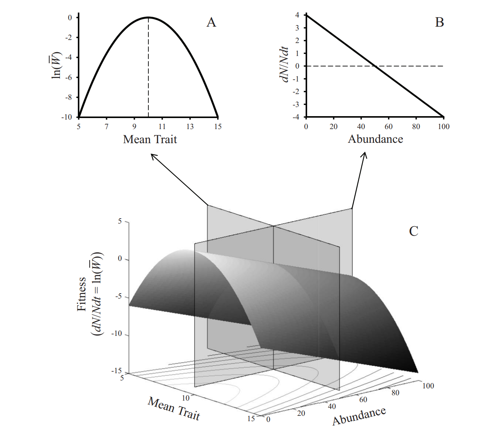

## Scaling from Genes to Ecosystems

Insert figure I've made before, thinking about how genes scale up to affect the structure of species-interaction networks. 

^Note: Blah blah blah


## Slide with Bullets

```{r Slide with Bullets Header}
cat("
<style>
h1 {
   color: red;
}
</style>
")
```

- Bullet 1
- Bullet 2
- Bullet 3

## Slide with R Code and Output

```{r}
summary(cars)
```

## Slide with Plot

```{r, echo=FALSE}
plot(cars)
```

## Fitness Landscape Unifies Ecology & Evolution

```{r McPeek Fig 1, out.width = "400px", echo=FALSE}

```

Discuss why I think is the unifying concept for ecology and evolutionary biology 

## Univariate

```{r Univariate Landscapes, echo=FALSE, message=FALSE}
library(qwraps2)
library(cowplot)

lazyload_cache_dir("elsevier_test/elsevier_test_cache/latex")

# Get legend
RF_uni_legend <- get_legend(RF_uni_size)

# Make plots
RF_uni_plots <- plot_grid(RF_uni_size + theme(legend.position = "none",
                                              axis.text.x = element_text(size=10),
                                              axis.title.x = element_text(size=11)), 
                       RF_uni_clutch + theme(legend.position = "none", 
                                          axis.title.y = element_blank(), axis.text.y = element_blank(),
                                          axis.text.x = element_text(size=10),
                                          axis.title.x = element_text(size=11)),
                       RF_uni_pref + theme(legend.position = "none", 
                                        axis.title.y = element_blank(), axis.text.y = element_blank(),
                                        axis.text.x = element_text(size=10),
                                        axis.title.x = element_text(size=11)),
                       labels = "AUTO", ncol = 3, align='hv') 

RF_gradients <- ggdraw(RF_uni_plots) + draw_grob(RF_uni_legend, x = 0.8, y=0)
RF_gradients
#RF_uni_plots
```

