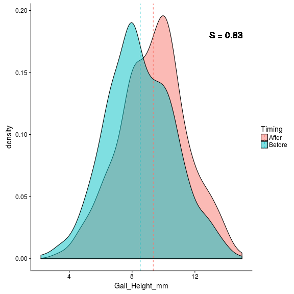
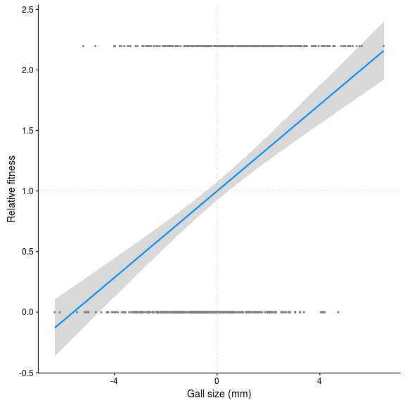
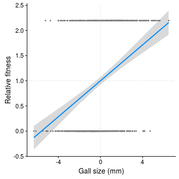
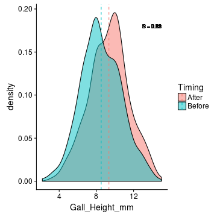
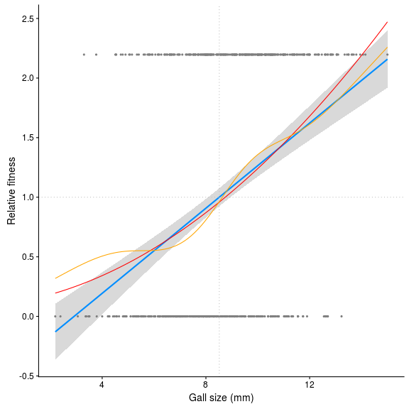
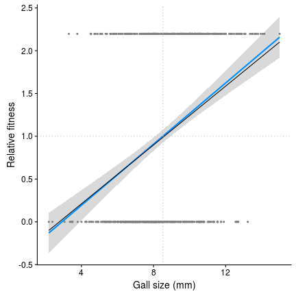
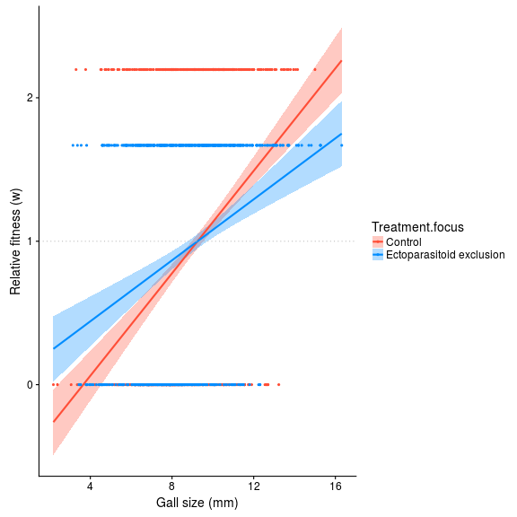
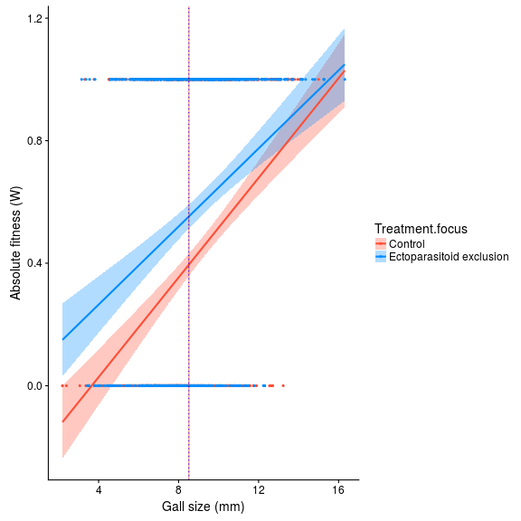

Tutorial: Quantifying Natural Selection
========================================================
author: Matt Barbour
date: April 4, 2018
autosize: true

Evolution by Natural Selection
========================================================

Requires 3 ingredients:

- Variation in phenotypes
- Variation in fitness
- ~~Heritable phenotypic variation~~

Quantifying Natural Selection
========================================================

Let's call the mean phenotype before selection $\bar{z}$ and the mean phenotype after selection $\bar{z}^*$, then

**Directional selection differential**, $S=\bar{z}^*-\bar{z}$

Directional Selection Differential
========================================================

Selection Differentials and Gradients
========================================================

Let's call **absolute fitness** $W$ and **mean fitness** $\bar{W}$, then

**Relative fitness**, $w=\frac{W}{\bar{W}}$

**Selection differential**, $S=\bar{z}^*-\bar{z}=cov(w,z)$

**Selection gradient**, $\beta=\frac{cov(w,z)}{var(z)}$

Selection Gradient
========================================================

Measures of Directional Selection
==============================================

|         | Intercept|    B| B' = B * sd(z) = S'| S = B * var(z)|
|:--------|---------:|----:|-------------------:|--------------:|
|Estimate |         1| 0.18|                0.39|           0.83|

Non-linear Selection
==============================================

Multivariate Selection
========================================================

Selection differentials, $S$ = **direct and indirect** effects.

Selection gradients, $\beta$ = **direct** effects

Comparing Selection Gradients
==============================================

Comparing Selection Gradients
==============================================

Comparing Selection Gradients
==============================================

|        | W_bar|    b| B = b / W_bar| B' = B * sd(z) = S'| S = B * var(z)|
|:-------|-----:|----:|-------------:|-------------------:|--------------:|
|Complex |  0.46| 0.08|          0.18|                0.39|           0.83|
|Simple  |  0.60| 0.06|          0.11|                0.25|           0.58|

