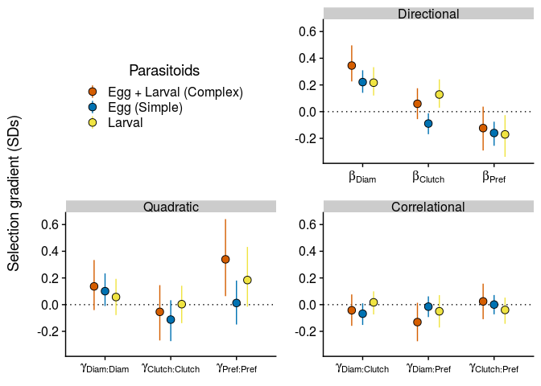

```{r setup tables and figures, include=FALSE}
## Rerun supp mat ----
knitr::knit("analyses/reproduce_analyses.Rmd")
```

\newpage

\begin{table}[h]
\caption{Standardized selection gradients acting on \textit{Iteomyia} in complex vs. simple food webs.}
\label{Table:Gradients}
\centering
\begin{tabular}{lccc}
\\ 
\hline
\textbf{Selection gradient} & \textbf{Complex} & \textbf{Simple} & \textbf{Contrast}  \\ 
\hline
$\beta_{\text{Diam}}$ & 
\textbf{
`r round(filter(tidy_foodweb_grads, type=="Complex", term=="sc.Diam")$mean,2)` [
`r round(filter(tidy_foodweb_grads, type=="Complex", term=="sc.Diam")$conf.low,2)`,
`r round(filter(tidy_foodweb_grads, type=="Complex", term=="sc.Diam")$conf.high,2)`] }& 
\textbf{
`r round(filter(tidy_foodweb_grads, type=="Simple", term=="sc.Diam")$mean,2)` [
`r round(filter(tidy_foodweb_grads, type=="Simple", term=="sc.Diam")$conf.low,2)`,
`r round(filter(tidy_foodweb_grads, type=="Simple", term=="sc.Diam")$conf.high,2)`] }& 
\textbf{
`r round(filter(tidy_foodweb_grads, type=="Diff", term=="sc.Diam")$mean,2)` [
`r round(filter(tidy_foodweb_grads, type=="Diff", term=="sc.Diam")$conf.low,2)`,
`r round(filter(tidy_foodweb_grads, type=="Diff", term=="sc.Diam")$conf.high,2)`] }\\

$\beta_{\text{Clutch}}$ & 
`r round(filter(tidy_foodweb_grads, type=="Complex", term=="sc.log.Clutch")$mean,2)` [
`r round(filter(tidy_foodweb_grads, type=="Complex", term=="sc.log.Clutch")$conf.low,2)`,
`r round(filter(tidy_foodweb_grads, type=="Complex", term=="sc.log.Clutch")$conf.high,2)`] & 
\textbf{
`r round(filter(tidy_foodweb_grads, type=="Simple", term=="sc.log.Clutch")$mean,2)` [
`r round(filter(tidy_foodweb_grads, type=="Simple", term=="sc.log.Clutch")$conf.low,2)`,
`r round(filter(tidy_foodweb_grads, type=="Simple", term=="sc.log.Clutch")$conf.high,2)`] }& 
\textbf{
`r round(filter(tidy_foodweb_grads, type=="Diff", term=="sc.log.Clutch")$mean,2)` [
`r round(filter(tidy_foodweb_grads, type=="Diff", term=="sc.log.Clutch")$conf.low,2)`,
`r round(filter(tidy_foodweb_grads, type=="Diff", term=="sc.log.Clutch")$conf.high,2)`] }\\

$\beta_{\text{Pref}}$ &
\textbf{
`r round(filter(tidy_foodweb_grads, type=="Complex", term=="sc.sqrt.Pref")$mean,2)` [
`r round(filter(tidy_foodweb_grads, type=="Complex", term=="sc.sqrt.Pref")$conf.low,2)`,
`r round(filter(tidy_foodweb_grads, type=="Complex", term=="sc.sqrt.Pref")$conf.high,2)`] }& 
\textbf{
`r round(filter(tidy_foodweb_grads, type=="Simple", term=="sc.sqrt.Pref")$mean,2)` [
`r round(filter(tidy_foodweb_grads, type=="Simple", term=="sc.sqrt.Pref")$conf.low,2)`,
`r round(filter(tidy_foodweb_grads, type=="Simple", term=="sc.sqrt.Pref")$conf.high,2)`] }& 

`r round(filter(tidy_foodweb_grads, type=="Diff", term=="sc.sqrt.Pref")$mean,2)` [
`r round(filter(tidy_foodweb_grads, type=="Diff", term=="sc.sqrt.Pref")$conf.low,2)`,
`r round(filter(tidy_foodweb_grads, type=="Diff", term=="sc.sqrt.Pref")$conf.high,2)`] \\

$\gamma_{\text{Diam,Diam}}$ &
`r round(filter(tidy_foodweb_grads, type=="Complex", term=="I(sc.Diam^2)")$mean,2)` [
`r round(filter(tidy_foodweb_grads, type=="Complex", term=="I(sc.Diam^2)")$conf.low,2)`,
`r round(filter(tidy_foodweb_grads, type=="Complex", term=="I(sc.Diam^2)")$conf.high,2)`] & 

`r round(filter(tidy_foodweb_grads, type=="Simple", term=="I(sc.Diam^2)")$mean,2)` [
`r round(filter(tidy_foodweb_grads, type=="Simple", term=="I(sc.Diam^2)")$conf.low,2)`,
`r round(filter(tidy_foodweb_grads, type=="Simple", term=="I(sc.Diam^2)")$conf.high,2)`] & 

`r round(filter(tidy_foodweb_grads, type=="Diff", term=="I(sc.Diam^2)")$mean,2)` [
`r round(filter(tidy_foodweb_grads, type=="Diff", term=="I(sc.Diam^2)")$conf.low,2)`,
`r round(filter(tidy_foodweb_grads, type=="Diff", term=="I(sc.Diam^2)")$conf.high,2)`] \\

$\gamma_{\text{Clutch,Clutch}}$ & 
`r round(filter(tidy_foodweb_grads, type=="Complex", term=="I(sc.log.Clutch^2)")$mean,2)` [
`r round(filter(tidy_foodweb_grads, type=="Complex", term=="I(sc.log.Clutch^2)")$conf.low,2)`,
`r round(filter(tidy_foodweb_grads, type=="Complex", term=="I(sc.log.Clutch^2)")$conf.high,2)`] & 

`r round(filter(tidy_foodweb_grads, type=="Simple", term=="I(sc.log.Clutch^2)")$mean,2)` [
`r round(filter(tidy_foodweb_grads, type=="Simple", term=="I(sc.log.Clutch^2)")$conf.low,2)`,
`r round(filter(tidy_foodweb_grads, type=="Simple", term=="I(sc.log.Clutch^2)")$conf.high,2)`] & 

`r round(filter(tidy_foodweb_grads, type=="Diff", term=="I(sc.log.Clutch^2)")$mean,2)` [
`r round(filter(tidy_foodweb_grads, type=="Diff", term=="I(sc.log.Clutch^2)")$conf.low,2)`,
`r round(filter(tidy_foodweb_grads, type=="Diff", term=="I(sc.log.Clutch^2)")$conf.high,2)`] \\

$\gamma_{\text{Pref,Pref}}$ & 
\textbf{
`r round(filter(tidy_foodweb_grads, type=="Complex", term=="I(sc.sqrt.Pref^2)")$mean,2)` [
`r round(filter(tidy_foodweb_grads, type=="Complex", term=="I(sc.sqrt.Pref^2)")$conf.low,2)`,
`r round(filter(tidy_foodweb_grads, type=="Complex", term=="I(sc.sqrt.Pref^2)")$conf.high,2)`] }& 

`r round(filter(tidy_foodweb_grads, type=="Simple", term=="I(sc.sqrt.Pref^2)")$mean,2)` [
`r round(filter(tidy_foodweb_grads, type=="Simple", term=="I(sc.sqrt.Pref^2)")$conf.low,2)`,
`r round(filter(tidy_foodweb_grads, type=="Simple", term=="I(sc.sqrt.Pref^2)")$conf.high,2)`] & 
\textbf{
`r round(filter(tidy_foodweb_grads, type=="Diff", term=="I(sc.sqrt.Pref^2)")$mean,2)` [
`r round(filter(tidy_foodweb_grads, type=="Diff", term=="I(sc.sqrt.Pref^2)")$conf.low,2)`,
`r round(filter(tidy_foodweb_grads, type=="Diff", term=="I(sc.sqrt.Pref^2)")$conf.high,2)`] }\\

$\gamma_{\text{Diam,Clutch}}$ & 
`r round(filter(tidy_foodweb_grads, type=="Complex", term=="sc.Diam:sc.log.Clutch")$mean,2)` [
`r round(filter(tidy_foodweb_grads, type=="Complex", term=="sc.Diam:sc.log.Clutch")$conf.low,2)`,
`r round(filter(tidy_foodweb_grads, type=="Complex", term=="sc.Diam:sc.log.Clutch")$conf.high,2)`] & 

`r round(filter(tidy_foodweb_grads, type=="Simple", term=="sc.Diam:sc.log.Clutch")$mean,2)` [
`r round(filter(tidy_foodweb_grads, type=="Simple", term=="sc.Diam:sc.log.Clutch")$conf.low,2)`,
`r round(filter(tidy_foodweb_grads, type=="Simple", term=="sc.Diam:sc.log.Clutch")$conf.high,2)`] & 

`r round(filter(tidy_foodweb_grads, type=="Diff", term=="sc.Diam:sc.log.Clutch")$mean,2)` [
`r round(filter(tidy_foodweb_grads, type=="Diff", term=="sc.Diam:sc.log.Clutch")$conf.low,2)`,
`r round(filter(tidy_foodweb_grads, type=="Diff", term=="sc.Diam:sc.log.Clutch")$conf.high,2)`] \\

$\gamma_{\text{Diam,Pref}}$ & 
\textbf{
`r round(filter(tidy_foodweb_grads, type=="Complex", term=="sc.Diam:sc.sqrt.Pref")$mean,2)` [
`r round(filter(tidy_foodweb_grads, type=="Complex", term=="sc.Diam:sc.sqrt.Pref")$conf.low,2)`,
`r round(filter(tidy_foodweb_grads, type=="Complex", term=="sc.Diam:sc.sqrt.Pref")$conf.high,2)`] }& 

`r round(filter(tidy_foodweb_grads, type=="Simple", term=="sc.Diam:sc.sqrt.Pref")$mean,2)` [
`r round(filter(tidy_foodweb_grads, type=="Simple", term=="sc.Diam:sc.sqrt.Pref")$conf.low,2)`,
`r round(filter(tidy_foodweb_grads, type=="Simple", term=="sc.Diam:sc.sqrt.Pref")$conf.high,2)`] & 

`r round(filter(tidy_foodweb_grads, type=="Diff", term=="sc.Diam:sc.sqrt.Pref")$mean,2)` [
`r round(filter(tidy_foodweb_grads, type=="Diff", term=="sc.Diam:sc.sqrt.Pref")$conf.low,2)`,
`r round(filter(tidy_foodweb_grads, type=="Diff", term=="sc.Diam:sc.sqrt.Pref")$conf.high,2)`] \\

$\gamma_{\text{Clutch,Pref}}$ & 
`r round(filter(tidy_foodweb_grads, type=="Complex", term=="sc.log.Clutch:sc.sqrt.Pref")$mean,2)` [
`r round(filter(tidy_foodweb_grads, type=="Complex", term=="sc.log.Clutch:sc.sqrt.Pref")$conf.low,2)`,
`r round(filter(tidy_foodweb_grads, type=="Complex", term=="sc.log.Clutch:sc.sqrt.Pref")$conf.high,2)`] & 

`r round(filter(tidy_foodweb_grads, type=="Simple", term=="sc.log.Clutch:sc.sqrt.Pref")$mean,2)` [
`r round(filter(tidy_foodweb_grads, type=="Simple", term=="sc.log.Clutch:sc.sqrt.Pref")$conf.low,2)`,
`r round(filter(tidy_foodweb_grads, type=="Simple", term=="sc.log.Clutch:sc.sqrt.Pref")$conf.high,2)`] & 

`r round(filter(tidy_foodweb_grads, type=="Diff", term=="sc.log.Clutch:sc.sqrt.Pref")$mean,2)` [
`r round(filter(tidy_foodweb_grads, type=="Diff", term=="sc.log.Clutch:sc.sqrt.Pref")$conf.low,2)`,
`r round(filter(tidy_foodweb_grads, type=="Diff", term=="sc.log.Clutch:sc.sqrt.Pref")$conf.high,2)`] \\ 
\hline
\end{tabular}
\bigskip{}
\\
{\footnotesize Note: Values in brackets represent 95\% confidence intervals. $\beta_{\text{Diam}}$ has been adjusted for bias.}
\end{table}

\begin{table}[h]
\caption{Relationship between absolute fitness (larva survival) and phenotypic traits of \textit{Iteomyia} in complex vs. simple food webs.}
\label{Table:Coefs}
\centering
\begin{tabular}{lccc}
\\ 
\hline
\textbf{Coefficient} & \textbf{Complex} & \textbf{Simple} & \textbf{Contrast}  \\ 
\hline
$\alpha_{\text{Diam}}$ & 
\textbf{
`r round(filter(tidy_foodweb_alphas, type=="Complex", term=="sc.Diam")$mean,2)` [
`r round(filter(tidy_foodweb_alphas, type=="Complex", term=="sc.Diam")$conf.low,2)`,
`r round(filter(tidy_foodweb_alphas, type=="Complex", term=="sc.Diam")$conf.high,2)`] }& 
\textbf{
`r round(filter(tidy_foodweb_alphas, type=="Simple", term=="sc.Diam")$mean,2)` [
`r round(filter(tidy_foodweb_alphas, type=="Simple", term=="sc.Diam")$conf.low,2)`,
`r round(filter(tidy_foodweb_alphas, type=="Simple", term=="sc.Diam")$conf.high,2)`] }& 

`r round(filter(tidy_foodweb_alphas, type=="Diff", term=="sc.Diam")$mean,2)` [
`r round(filter(tidy_foodweb_alphas, type=="Diff", term=="sc.Diam")$conf.low,2)`,
`r round(filter(tidy_foodweb_alphas, type=="Diff", term=="sc.Diam")$conf.high,2)`] \\

$\alpha_{\text{Clutch}}$ & 
`r round(filter(tidy_foodweb_alphas, type=="Complex", term=="sc.log.Clutch")$mean,2)` [
`r round(filter(tidy_foodweb_alphas, type=="Complex", term=="sc.log.Clutch")$conf.low,2)`,
`r round(filter(tidy_foodweb_alphas, type=="Complex", term=="sc.log.Clutch")$conf.high,2)`] & 
\textbf{
`r round(filter(tidy_foodweb_alphas, type=="Simple", term=="sc.log.Clutch")$mean,2)` [
`r round(filter(tidy_foodweb_alphas, type=="Simple", term=="sc.log.Clutch")$conf.low,2)`,
`r round(filter(tidy_foodweb_alphas, type=="Simple", term=="sc.log.Clutch")$conf.high,2)`] }& 
\textbf{
`r round(filter(tidy_foodweb_alphas, type=="Diff", term=="sc.log.Clutch")$mean,2)` [
`r round(filter(tidy_foodweb_alphas, type=="Diff", term=="sc.log.Clutch")$conf.low,2)`,
`r round(filter(tidy_foodweb_alphas, type=="Diff", term=="sc.log.Clutch")$conf.high,2)`] }\\

$\alpha_{\text{Pref}}$ &
\textbf{
`r round(filter(tidy_foodweb_alphas, type=="Complex", term=="sc.sqrt.Pref")$mean,2)` [
`r round(filter(tidy_foodweb_alphas, type=="Complex", term=="sc.sqrt.Pref")$conf.low,2)`,
`r round(filter(tidy_foodweb_alphas, type=="Complex", term=="sc.sqrt.Pref")$conf.high,2)`] }& 
\textbf{
`r round(filter(tidy_foodweb_alphas, type=="Simple", term=="sc.sqrt.Pref")$mean,2)` [
`r round(filter(tidy_foodweb_alphas, type=="Simple", term=="sc.sqrt.Pref")$conf.low,2)`,
`r round(filter(tidy_foodweb_alphas, type=="Simple", term=="sc.sqrt.Pref")$conf.high,2)`] }& 

`r round(filter(tidy_foodweb_alphas, type=="Diff", term=="sc.sqrt.Pref")$mean,2)` [
`r round(filter(tidy_foodweb_alphas, type=="Diff", term=="sc.sqrt.Pref")$conf.low,2)`,
`r round(filter(tidy_foodweb_alphas, type=="Diff", term=="sc.sqrt.Pref")$conf.high,2)`] \\

$\alpha_{\text{Diam,Diam}}$ &
`r round(filter(tidy_foodweb_alphas, type=="Complex", term=="I(sc.Diam^2)")$mean,2)` [
`r round(filter(tidy_foodweb_alphas, type=="Complex", term=="I(sc.Diam^2)")$conf.low,2)`,
`r round(filter(tidy_foodweb_alphas, type=="Complex", term=="I(sc.Diam^2)")$conf.high,2)`] & 

`r round(filter(tidy_foodweb_alphas, type=="Simple", term=="I(sc.Diam^2)")$mean,2)` [
`r round(filter(tidy_foodweb_alphas, type=="Simple", term=="I(sc.Diam^2)")$conf.low,2)`,
`r round(filter(tidy_foodweb_alphas, type=="Simple", term=="I(sc.Diam^2)")$conf.high,2)`] & 

`r round(filter(tidy_foodweb_alphas, type=="Diff", term=="I(sc.Diam^2)")$mean,2)` [
`r round(filter(tidy_foodweb_alphas, type=="Diff", term=="I(sc.Diam^2)")$conf.low,2)`,
`r round(filter(tidy_foodweb_alphas, type=="Diff", term=="I(sc.Diam^2)")$conf.high,2)`] \\

$\alpha_{\text{Clutch,Clutch}}$ & 
`r round(filter(tidy_foodweb_alphas, type=="Complex", term=="I(sc.log.Clutch^2)")$mean,2)` [
`r round(filter(tidy_foodweb_alphas, type=="Complex", term=="I(sc.log.Clutch^2)")$conf.low,2)`,
`r round(filter(tidy_foodweb_alphas, type=="Complex", term=="I(sc.log.Clutch^2)")$conf.high,2)`] & 

`r round(filter(tidy_foodweb_alphas, type=="Simple", term=="I(sc.log.Clutch^2)")$mean,2)` [
`r round(filter(tidy_foodweb_alphas, type=="Simple", term=="I(sc.log.Clutch^2)")$conf.low,2)`,
`r round(filter(tidy_foodweb_alphas, type=="Simple", term=="I(sc.log.Clutch^2)")$conf.high,2)`] & 

`r round(filter(tidy_foodweb_alphas, type=="Diff", term=="I(sc.log.Clutch^2)")$mean,2)` [
`r round(filter(tidy_foodweb_alphas, type=="Diff", term=="I(sc.log.Clutch^2)")$conf.low,2)`,
`r round(filter(tidy_foodweb_alphas, type=="Diff", term=="I(sc.log.Clutch^2)")$conf.high,2)`] \\

$\alpha_{\text{Pref,Pref}}$ & 
\textbf{
`r round(filter(tidy_foodweb_alphas, type=="Complex", term=="I(sc.sqrt.Pref^2)")$mean,2)` [
`r round(filter(tidy_foodweb_alphas, type=="Complex", term=="I(sc.sqrt.Pref^2)")$conf.low,2)`,
`r round(filter(tidy_foodweb_alphas, type=="Complex", term=="I(sc.sqrt.Pref^2)")$conf.high,2)`] }& 

`r round(filter(tidy_foodweb_alphas, type=="Simple", term=="I(sc.sqrt.Pref^2)")$mean,2)` [
`r round(filter(tidy_foodweb_alphas, type=="Simple", term=="I(sc.sqrt.Pref^2)")$conf.low,2)`,
`r round(filter(tidy_foodweb_alphas, type=="Simple", term=="I(sc.sqrt.Pref^2)")$conf.high,2)`] & 
\textbf{
`r round(filter(tidy_foodweb_alphas, type=="Diff", term=="I(sc.sqrt.Pref^2)")$mean,2)` [
`r round(filter(tidy_foodweb_alphas, type=="Diff", term=="I(sc.sqrt.Pref^2)")$conf.low,2)`,
`r round(filter(tidy_foodweb_alphas, type=="Diff", term=="I(sc.sqrt.Pref^2)")$conf.high,2)`] }\\

$\alpha_{\text{Diam,Clutch}}$ & 
`r round(filter(tidy_foodweb_alphas, type=="Complex", term=="sc.Diam:sc.log.Clutch")$mean,2)` [
`r round(filter(tidy_foodweb_alphas, type=="Complex", term=="sc.Diam:sc.log.Clutch")$conf.low,2)`,
`r round(filter(tidy_foodweb_alphas, type=="Complex", term=="sc.Diam:sc.log.Clutch")$conf.high,2)`] & 

`r round(filter(tidy_foodweb_alphas, type=="Simple", term=="sc.Diam:sc.log.Clutch")$mean,2)` [
`r round(filter(tidy_foodweb_alphas, type=="Simple", term=="sc.Diam:sc.log.Clutch")$conf.low,2)`,
`r round(filter(tidy_foodweb_alphas, type=="Simple", term=="sc.Diam:sc.log.Clutch")$conf.high,2)`] & 

`r round(filter(tidy_foodweb_alphas, type=="Diff", term=="sc.Diam:sc.log.Clutch")$mean,2)` [
`r round(filter(tidy_foodweb_alphas, type=="Diff", term=="sc.Diam:sc.log.Clutch")$conf.low,2)`,
`r round(filter(tidy_foodweb_alphas, type=="Diff", term=="sc.Diam:sc.log.Clutch")$conf.high,2)`] \\

$\alpha_{\text{Diam,Pref}}$ & 
\textbf{
`r round(filter(tidy_foodweb_alphas, type=="Complex", term=="sc.Diam:sc.sqrt.Pref")$mean,2)` [
`r round(filter(tidy_foodweb_alphas, type=="Complex", term=="sc.Diam:sc.sqrt.Pref")$conf.low,2)`,
`r round(filter(tidy_foodweb_alphas, type=="Complex", term=="sc.Diam:sc.sqrt.Pref")$conf.high,2)`] }& 

`r round(filter(tidy_foodweb_alphas, type=="Simple", term=="sc.Diam:sc.sqrt.Pref")$mean,2)` [
`r round(filter(tidy_foodweb_alphas, type=="Simple", term=="sc.Diam:sc.sqrt.Pref")$conf.low,2)`,
`r round(filter(tidy_foodweb_alphas, type=="Simple", term=="sc.Diam:sc.sqrt.Pref")$conf.high,2)`] & 

`r round(filter(tidy_foodweb_alphas, type=="Diff", term=="sc.Diam:sc.sqrt.Pref")$mean,2)` [
`r round(filter(tidy_foodweb_alphas, type=="Diff", term=="sc.Diam:sc.sqrt.Pref")$conf.low,2)`,
`r round(filter(tidy_foodweb_alphas, type=="Diff", term=="sc.Diam:sc.sqrt.Pref")$conf.high,2)`] \\

$\alpha_{\text{Clutch,Pref}}$ & 
`r round(filter(tidy_foodweb_alphas, type=="Complex", term=="sc.log.Clutch:sc.sqrt.Pref")$mean,2)` [
`r round(filter(tidy_foodweb_alphas, type=="Complex", term=="sc.log.Clutch:sc.sqrt.Pref")$conf.low,2)`,
`r round(filter(tidy_foodweb_alphas, type=="Complex", term=="sc.log.Clutch:sc.sqrt.Pref")$conf.high,2)`] & 

`r round(filter(tidy_foodweb_alphas, type=="Simple", term=="sc.log.Clutch:sc.sqrt.Pref")$mean,2)` [
`r round(filter(tidy_foodweb_alphas, type=="Simple", term=="sc.log.Clutch:sc.sqrt.Pref")$conf.low,2)`,
`r round(filter(tidy_foodweb_alphas, type=="Simple", term=="sc.log.Clutch:sc.sqrt.Pref")$conf.high,2)`] & 

`r round(filter(tidy_foodweb_alphas, type=="Diff", term=="sc.log.Clutch:sc.sqrt.Pref")$mean,2)` [
`r round(filter(tidy_foodweb_alphas, type=="Diff", term=="sc.log.Clutch:sc.sqrt.Pref")$conf.low,2)`,
`r round(filter(tidy_foodweb_alphas, type=="Diff", term=="sc.log.Clutch:sc.sqrt.Pref")$conf.high,2)`] \\ 
\hline
\end{tabular}
\bigskip{}
\\
{\footnotesize Note: Values in brackets represent 95\% confidence intervals. $\alpha_{\text{Diam}}$ has been adjusted for bias.}
\end{table}

\newpage

\section*{Figure legends}

<!-- Figures -->

```{r Conceptual, echo=FALSE, fig.cap="\\label{fig:Conceptual}Illustrations of complex (A) and simple (B) food webs associated with the insect herbivore, *Iteomyia salicisverruca*. Black arrows denote the flow of energy in this network of trophic interactions."}
#knitr::include_graphics("analyses/complex_simple_foodwebs.jpeg")
```

```{r Gradients, eval=FALSE, echo=FALSE, fig.cap="\\label{fig:Gradients}Selection gradients acting on *Iteomyia* phenotypes. Points and lines correspond to estimated means and 95% confidence intervals, respectively. Orange and blue colors correspond to estimated gradients in complex and simple food webs, respectively. Yellow colors correspond to selection gradients imposed by larval parasitoids. Note that we only plot selection gradients for larval parasitoids when they differed from egg parasitoids (simple food web)."}

```

```{r UV_Landscape, echo=FALSE, fig.cap="\\label{fig:UV_Landscape}Adaptive landscape of \\textit{Iteomyia} phenotypes in complex vs. simple food webs. Each panel corresponds to a different phenotypic trait: chamber diameter (A); female preference (B); and clutch size (C). Solid lines represent the estimated gradients in complex (orange) and simple (blue) food webs. Transparent lines represent bootstrapped replicates to show the uncertainty in estimated gradients. For clarity, we only display 100 bootstraps even though inferences are based on 1,000 bootstrapped samples. Note the mean larva survival is plotted on a natural log scale to accurately reflect the shape of the adaptive landscape."}
knitr::include_graphics("analyses/UV_landscapes.pdf")
```

```{r MV_Landscape, echo=FALSE, fig.cap="\\label{fig:MV_Landscape}Two dimensional view of adaptive landscapes in complex vs. simple food webs. Each panel corresponds to a different combination of traits: clutch size and chamber diameter (A); clutch size and female preference (B); female preference and chamber diameter (C). Note that mean larva survival is plotted on a natural log scale to accurately reflect the shape of the adaptive landscape."}
knitr::include_graphics("analyses/MV_landscapes.pdf")
```

```{r EggPtoid_Selection, eval=FALSE, echo=FALSE, fig.cap="\\label{fig:EggPtoid_Selection}."}
knitr::include_graphics("analyses/selection_on_Platygaster.pdf")
```

